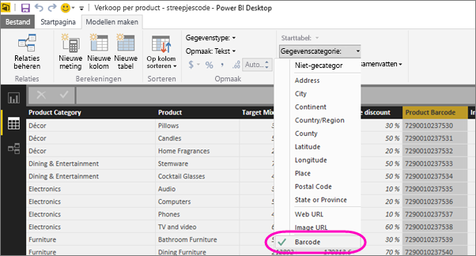

# Label streepjescode velden in Power BI Desktop voor het inschakelen van filtering voor streepjes codes in de mobiele apps

In Power BI Desktop kunt u [gegevens categoriseren](desktop-data-categorization.md) in een kolom, zodat Power BI Desktop weet hoe waarden in visuele elementen moeten worden afgehandeld in een rapport. U kunt een kolom categoriseren als **streepjescode**. Wanneer iemand in uw bedrijf of organisatie [een streepjes code](../consumer/mobile/mobile-apps-scan-barcode-iphone.md) op een product scant met behulp van de mobiele app van Power bi op hun IOS-of Android-telefoon of Tablet, zien ze elk rapport dat die streepjes code bevat. Wanneer het rapport wordt geopend, wordt het automatisch gefilterd op de gegevens die zijn gerelateerd aan die streepjes code.

## Streepjescode gegevens categoriseren

Er wordt ervan uitgegaan dat u een rapport hebt dat streepjes codes bevat: 

1. Ga in Power BI Desktop naar gegevens weergave.
2. Selecteer de kolom die de streepjescode gegevens bevat. Zie de lijst met [ondersteunde streepjescode-indelingen](#supported-barcode-formats) hieronder.
3. Op het tabblad **hulp middelen voor kolommen** selecteert u de streepjes code van de **gegevens categorie**  >  .
   
    

    >[!WARNING]
    >Categoriseer niet meer dan één kolom voor alle gegevens tabellen in een rapport als **streepjes code**. De mobiele apps ondersteunen het filteren van streepjes codes alleen voor rapporten die slechts één streepjescode kolom hebben in alle rapport gegevens tabellen. Als een rapport meer dan één streepjescode kolom heeft, vindt er geen filtering plaats.

4. Voeg in de rapport weergave het streepjescode veld toe aan de visuele elementen die u wilt filteren op basis van de streepjes code.
5. Sla het rapport op en publiceer het naar de Power BI-service.

Wanneer u de scanner nu opent op de Power BI-apps voor iOS-en Android-telefoons en-tablets en een streepjes code scant, ziet u dit rapport in de lijst met rapporten met streepjes codes. Wanneer u het rapport opent, worden de visuele elementen ervan gefilterd op basis van de door u gescande product streepjescode.

## Ondersteunde streepjescode-indelingen
Dit zijn de streepjescode notaties die Power BI herkent als u ze in een Power BI rapport kunt labelen: 

* UPCECode 
* Code39Code  
* A39Mod43Code 
* EAN13Code 
* EAN8Code  
* 93Code  
* 128Code 
* PDF417Code 
* Interleaved2of5Code 
* ITF14Code 

## Volgende stappen
* [Een streepjes code scannen vanuit de Power BI-app op uw iOS-of Android-telefoon of Tablet](../consumer/mobile/mobile-apps-scan-barcode-iphone.md)
* [Problemen met het scannen van streepjes codes](../consumer/mobile/mobile-apps-scan-barcode-iphone.md#issues-with-scanning-a-barcode)
* [Gegevenscategorisatie in Power BI Desktop](desktop-data-categorization.md)  
* Vragen? [Misschien dat de Power BI-community het antwoord weet](https://community.powerbi.com/)
