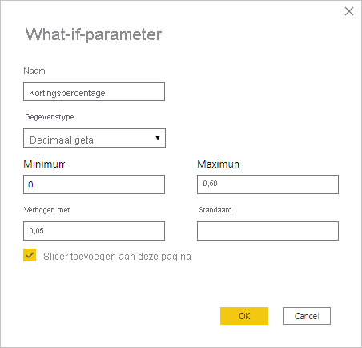
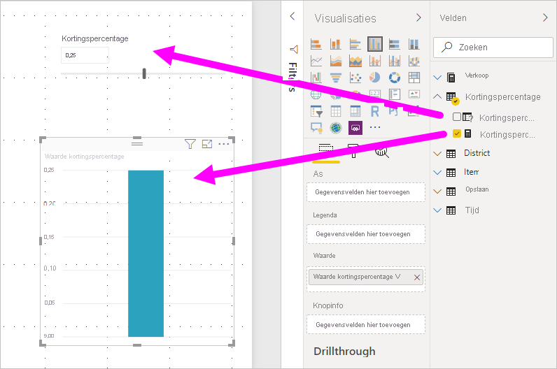
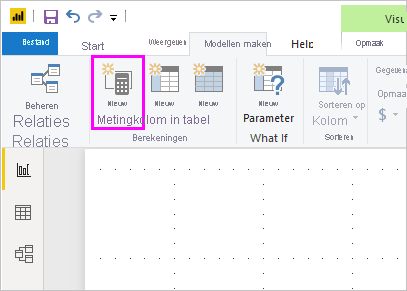

# What if-parameters maken en gebruiken om variabelen in Power BI Desktop te visualiseren

Vanaf de release van augustus 2018 van *Power BI Desktop* kunt u *what-if*-variabelen voor uw rapporten maken, communiceren met de variabele als een slicer en verschillende sleutelwaarden in uw rapporten visualiseren en kwantificeren.

Maak een *what-if*-parameter op het tabblad **Model maken** in Power BI Desktop. Wanneer u deze selecteert, wordt een dialoogvenster weergegeven waarin u de parameter kunt configureren.

## Een what-if-parameter maken

Als u een what-if-parameter wilt maken, selecteert u **Nieuwe parameter** op het tabblad **Model maken** van Power BI Desktop. In de volgende afbeelding hebben we een parameter met de naam *Discount percentage* gemaakt en is het gegevenstype ingesteld op **Decimaal getal**. De **minimumwaarde** is nul. Het **maximum** is 0,50 (50 procent). Bovendien hebben we de **Verhoging** ingesteld op 0,05, ofwel vijf procent. Dat is hoeveel de parameter wordt aangepast bij interactie met een rapport.

> [!NOTE]
> Zorg er bij decimale getallen voor dat u de waarde vooraf laat gaan door een nul, zoals 0,50, en dus niet ,50. Anders wordt het getal niet gevalideerd en kan de knop **OK** niet worden geselecteerd.
> 
> 

Om het u gemakkelijk te maken, wordt door het selectievakje **Slicer toevoegen aan deze pagina** automatisch een slicer bij uw what-if-parameter op de huidige rapportpagina geplaatst.

Door een what-if-parameter te maken wordt ook een meting gemaakt, waarmee u de huidige waarde van de what-if-parameter kunt visualiseren.

Het is belangrijk en handig te weten dat wanneer u een what-if-parameter maakt, zowel de parameter als de meting deel van het model worden. Ze zijn beschikbaar in het hele rapport en kunnen derhalve op andere rapportpagina's worden gebruikt. En omdat ze deel uitmaken van het model, kunt u de slicer verwijderen van de rapportpagina. Als u de slicer terug wilt hebben, sleept u de what-if-parameter van de lijst **Velden** naar het canvas. Vervolgens wijzigt u de visual in een slicer.

## Een what-if-parameter gebruiken

Laten we een eenvoudig voorbeeld van het gebruik van een what-if-parameter maken. In de vorige sectie hebben we de what-if-parameter gemaakt. Nu gaan we deze parameter gebruiken door een nieuwe meting te maken waarvan de waarde wordt aangepast met de schuifregelaar.

De nieuwe meting bestaat alleen maar uit de totale omzet, waarvoor het kortingstarief wordt toegepast. U kunt ook complexe en interessante metingen maken waarmee de gebruikers van uw rapporten de variabele van uw what-if-parameter kunnen visualiseren. U kunt bijvoorbeeld een rapport maken waarmee verkoopmedewerkers hun bonus kunnen bekijken als ze voldoen aan bepaalde verkoopdoelstellingen of -percentages, of het effect kunnen zien van gestegen verkoop en hogere kortingen.

Voer de formule van de meting in de formulebalk in en geef deze de naam *Sales after Discount*.

Vervolgens maken we een kolomvisual met **OrderDate** op de as en zowel **SalesAmount** als de zojuist gemaakte meting **Sales after Discount** als waarden.

Als de slicer wordt verschoven, kunt u zien dat de kolom **Sales after Discount** de gereduceerde verkoopcijfers weerspiegelt.

Zo eenvoudig werkt dat. U kunt what-if-parameters gebruiken in allerlei situaties. Met deze parameters kunnen gebruikers van rapporten werken met verschillende scenario's die u in uw rapporten maakt.
