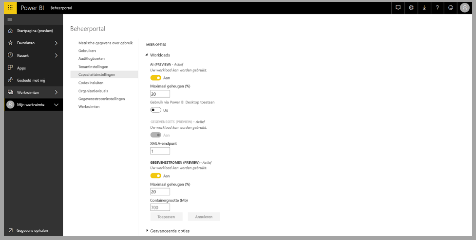
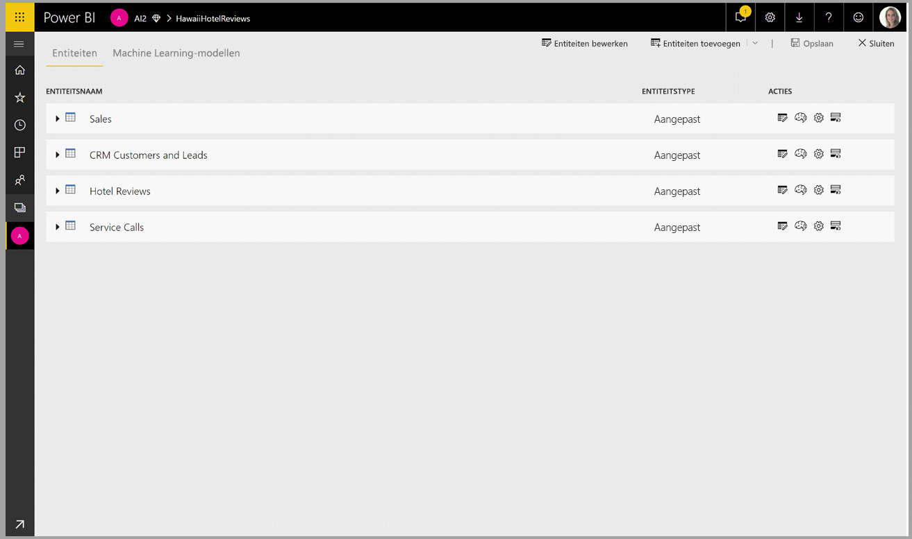
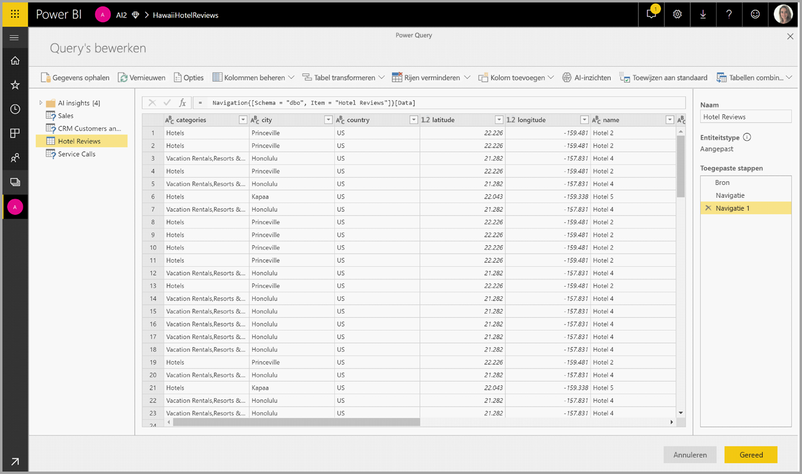
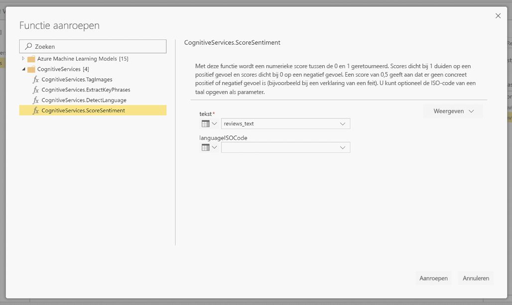
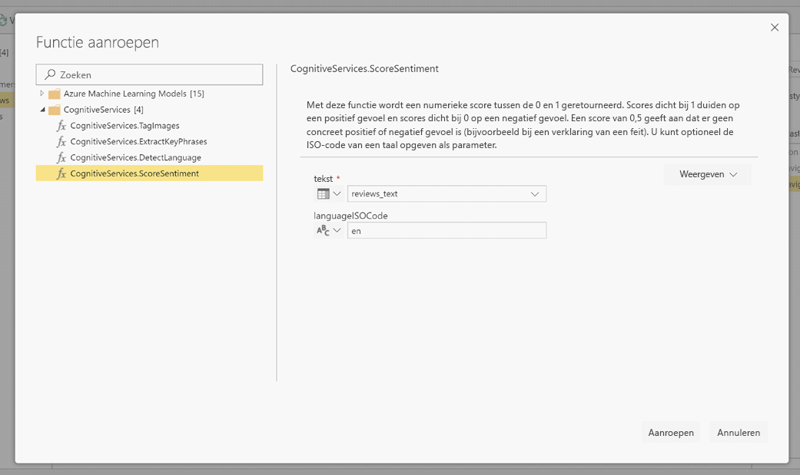
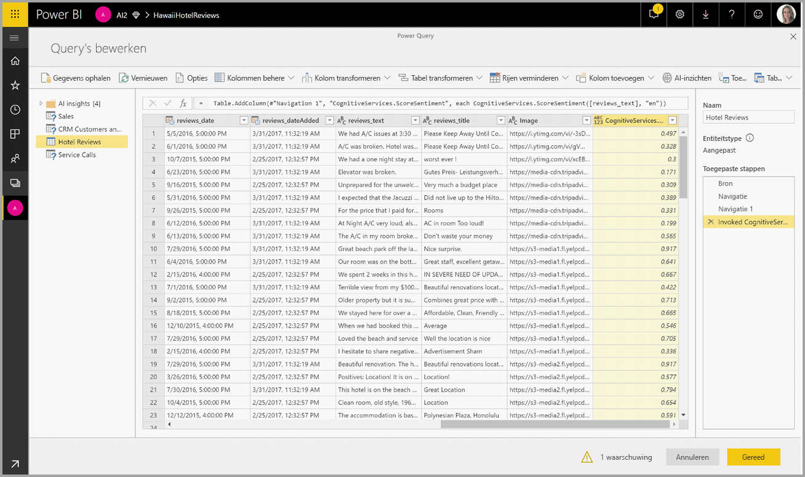
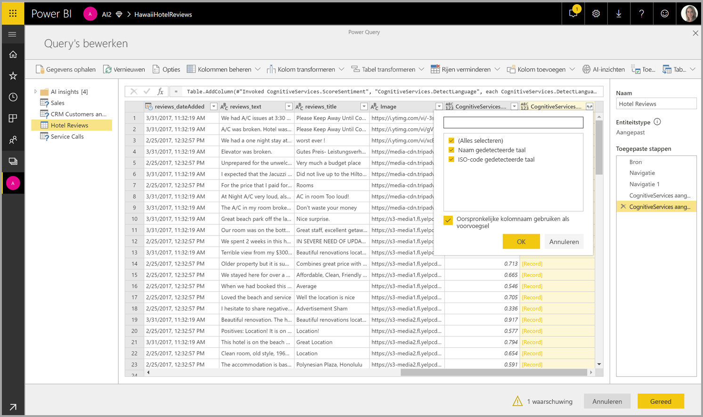

# Cognitive Services in Power BI 

Met de Cognitive Services in Power BI kunt u verschillende algoritmen van [Azure Cognitive Services](https://azure.microsoft.com/services/cognitive-services/) toepassen om uw gegevens in de selfservice voor gegevensvoorbereiding voor gegevensstromen te verrijken.

De services die momenteel worden ondersteund zijn [Sentimentanalyse](https://docs.microsoft.com/azure/cognitive-services/text-analytics/how-tos/text-analytics-how-to-sentiment-analysis), [Sleuteltermextractie](https://docs.microsoft.com/azure/cognitive-services/text-analytics/how-tos/text-analytics-how-to-keyword-extraction), [Taaldetectie](https://docs.microsoft.com/azure/cognitive-services/text-analytics/how-tos/text-analytics-how-to-language-detection) en [Afbeeldingen taggen](https://docs.microsoft.com/azure/cognitive-services/computer-vision/concept-tagging-images). De transformaties worden uitgevoerd in de Power BI-service en vereisen geen Azure Cognitive Services-abonnement. Deze functie vereist Power BI Premium.

## **AI-functies inschakelen**

Cognitive Services worden ondersteund voor de Premium-capaciteitsknooppunten EM2, A2, P1 en hoger. Voor het uitvoeren van Cognitive Services wordt een afzonderlijke AI-werkbelasting op de capaciteit gebruikt. Tijdens de openbare preview (vóór juni 2019) is deze werkbelasting standaard uitgeschakeld. Voordat u Cognitive Services in Power BI gaat gebruiken, moet de AI-werkbelasting worden ingeschakeld in de capaciteitsinstellingen van de beheerportal. U kunt de AI-werkbelasting in de sectie Werkbelastingen inschakelen en de maximale hoeveelheid geheugen definiëren die deze werkbelasting mag gebruiken. De aanbevolen geheugenlimiet is 20%. Door deze limiet te overschrijden, vertraagt de query.

## **Aan de slag met Cognitive Services in Power BI**

Cognitive Services-transformaties maken deel uit van de [selfservice voor gegevensvoorbereiding voor gegevensstromen](https://powerbi.microsoft.com/blog/introducing-power-bi-data-prep-wtih-dataflows/). Begin met het bewerken van een gegevensstroom om uw gegevens met Cognitive Services te verrijken.

Selecteer de knop **AI-inzichten** in het bovenste lint van de Power Query-editor.

Selecteer in het pop-upvenster de functie die u wilt gebruiken en de gegevens die u wilt transformeren. In dit voorbeeld scoor ik het gevoel van een kolom die beoordelingstekst bevat.

**Cultureinfo** is een optionele invoer om de taal van de tekst te bepalen. In dit veld moet een ISO-code worden ingevoerd. Als invoer voor Cultureinfo kunt u een kolom of een statisch veld gebruiken. In dit voorbeeld is de taal voor de hele kolom als Engels (en) opgegeven. Als u dit veld leeg laat, detecteert Power BI automatisch de taal voordat de functie wordt toepast. Selecteer vervolgens **Aanroepen.**

Nadat de functie is aangeroepen, wordt het resultaat als een nieuwe kolom aan de tabel toegevoegd. De transformatie wordt ook als een toegepaste stap aan de query toegevoegd.

Als de functie meerdere uitvoervelden retourneert, wordt er door het aanroepen van de functie een nieuwe kolom met een record van de verschillende uitvoervelden toegevoegd.

Gebruik de uitvouwoptie om een of beide waarden als kolommen aan uw gegevens toe te voegen.

## **Beschikbare functies**

Deze sectie beschrijft de beschikbare functies in Cognitive Services in Power BI.

### **Taal detecteren**

De taaldetectiefunctie evalueert tekstinvoer en retourneert voor elk veld de taal en ISO-id. Deze functie is handig voor gegevenskolommen die willekeurige tekst verzamelen waarvan de taal onbekend is. Als invoer verwacht de functie gegevens in tekstindeling.

Text Analytics herkent maximaal 120 talen. Zie voor meer informatie [Ondersteunde talen](https://docs.microsoft.com/azure/cognitive-services/text-analytics/text-analytics-supported-languages).

### **Sleuteltermen ophalen**

De functie **Sleuteltermextractie** evalueert ongestructureerde tekst en retourneert voor elk tekstveld een lijst met sleuteltermen. De functie vereist als invoer een tekstveld en accepteert een optionele invoer voor **Cultureinfo**. (Zie de sectie **Aan de slag** eerder in dit artikel).

Sleuteltermextractie werkt het beste bij grotere lappen tekst. Dit is het tegenovergestelde van Sentimentanalyse, die beter presteert bij kleinere stukken tekst. Voor de beste resultaten bij beide activiteiten, zou u de invoeren dienovereenkomstig kunnen herstructureren.

### **Gevoel scoren**

De functie **Gevoel scoren** evalueert tekstinvoer en retourneert een gevoelsscore voor elk document, variërend van 0 (negatief) tot 1 (positief). Deze functie is handig voor het detecteren van positieve en negatieve gevoelens op sociale media, klantbeoordelingen en discussiefora.

Text Analytics maakt gebruik van een machine learning-classificatiealgoritme voor het genereren van een gevoelsscore tussen 0 en 1. Scores dichter bij 1 duiden op een positief gevoel, scores dichter bij 0 op een negatief gevoel. Het model is vooraf getraind met een uitgebreide hoeveelheid tekst met gevoelsassociaties. Het is momenteel niet mogelijk om uw eigen trainingsgegevens te gebruiken. Het model maakt tijdens de tekstanalyse gebruik van een combinatie aan technieken, waaronder tekstverwerking, woordsoortanalyse, woordplaatsing en woordassociaties. Zie voor meer informatie over het algoritme [Introducing Text Analytics](https://blogs.technet.microsoft.com/machinelearning/2015/04/08/introducing-text-analytics-in-the-azure-ml-marketplace/) (Maak kennis met Text Analytics).

Sentimentanalyse wordt uitgevoerd op het hele invoerveld en niet op een bepaalde entiteit in de tekst. In de praktijk verbetert het scoren van nauwkeurigheid wanneer documenten een of twee zinnen bevatten in plaats van een grote lap tekst. Tijdens een objectiviteitsevaluatie bepaalt het model of een invoerveld als geheel objectief is of gevoel bevat. Een invoerveld dat voornamelijk objectief is, gaat met een score van .50 niet door naar de gevoelsdetectiefase en wordt ook niet verder verwerkt. Voor invoervelden die doorgaan in de pijplijn, genereert de volgende fase een score die hoger of lager is dan .50, afhankelijk van de gevoelswaarde van het invoerveld.

Op dit moment ondersteunt Sentimentanalyse Engels, Duits, Spaans en Frans. Andere talen zijn beschikbaar als preview. Zie voor meer informatie [Ondersteunde talen](https://docs.microsoft.com/azure/cognitive-services/text-analytics/text-analytics-supported-languages).

### **Afbeeldingen taggen**

De functie **Afbeeldingen taggen** retourneert tags op basis van meer dan 2.000 herkenbare objecten, levende wezens, landschappen en acties. Wanneer tags ambigu of niet algemeen bekend zijn, biedt de uitvoer 'hints' om de betekenis van de tag in de context van een bekende instelling te duiden. Tags worden niet als taxonomie geordend en er bestaan geen overnamehiërarchieën. Een verzameling inhoudstags vormt de basis voor een 'afbeeldingsbeschrijving', die wordt weergegeven als door mensen leesbare taal in volzinnen.

Na het uploaden van een afbeelding of het specificeren van een afbeeldings-URL, leveren de algoritmen van Computer Vision als output tags die zijn gebaseerd op objecten, levende wezens en acties die in de afbeelding zijn herkend. Niet alleen het belangrijkste onderwerp, bijvoorbeeld een persoon op de voorgrond, maar ook de setting (binnen of buiten), meubels, hulpmiddelen, planten, dieren, accessoires, gadgets enz. kunnen worden getagd.

Als invoer vereist deze functie een afbeeldings-URL of een base 64-veld. Momenteel ondersteunt Afbeeldingen taggen Engels, Spaans, Japans, Portugees en vereenvoudigd Chinees. Zie voor meer informatie [Ondersteunde talen](https://docs.microsoft.com/rest/api/cognitiveservices/computervision/tagimage/tagimage#uri-parameters).

## Volgende stappen

Dit artikel ging in op het gebruik van Cognitive Services met Power BI-service. De volgende artikelen zijn voor u wellicht ook interessant en nuttig. 

* [Zelfstudie: Een Machine Learning Studio-model (klassiek) aanroepen in Power BI](../connect-data/service-tutorial-invoke-machine-learning-model.md)
* [Azure Machine Learning-integratie in Power BI](service-machine-learning-integration.md)
* [Zelfstudie: Cognitive Services gebruiken in Power BI](../connect-data/service-tutorial-use-cognitive-services.md)

Raadpleeg de volgende artikelen voor meer informatie over gegevensstromen:
* [Gegevensstromen maken en gebruiken in Power BI](service-dataflows-create-use.md)
* [Berekende entiteiten gebruiken in Power BI Premium](service-dataflows-computed-entities-premium.md)
* [Gegevensstromen gebruiken met on-premises gegevensbronnen](service-dataflows-on-premises-gateways.md)
* [Resources voor ontwikkelaars voor Power BI-gegevensstromen](service-dataflows-developer-resources.md)
* [Integratie van gegevensstromen en Azure Data Lake (preview)](service-dataflows-azure-data-lake-integration.md)