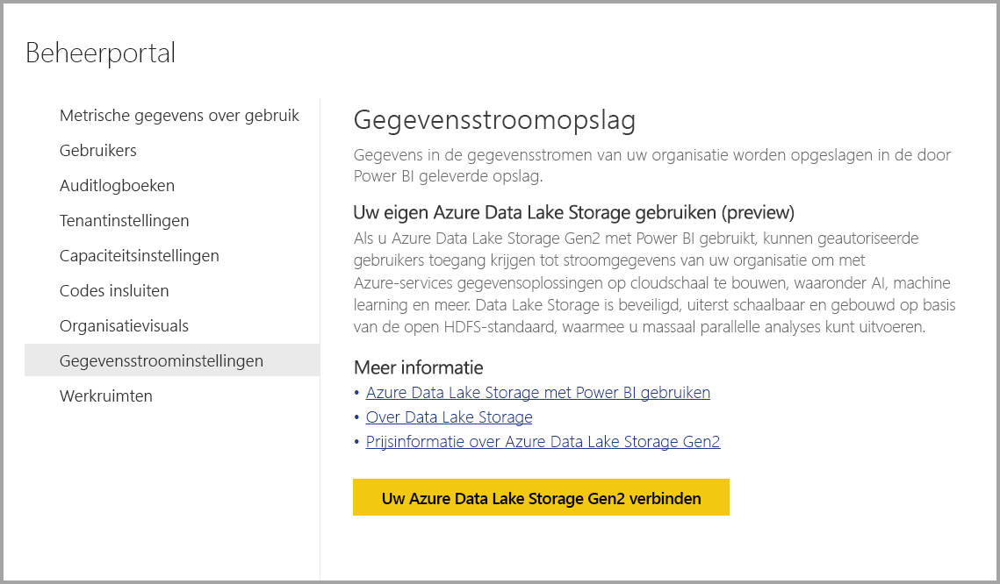
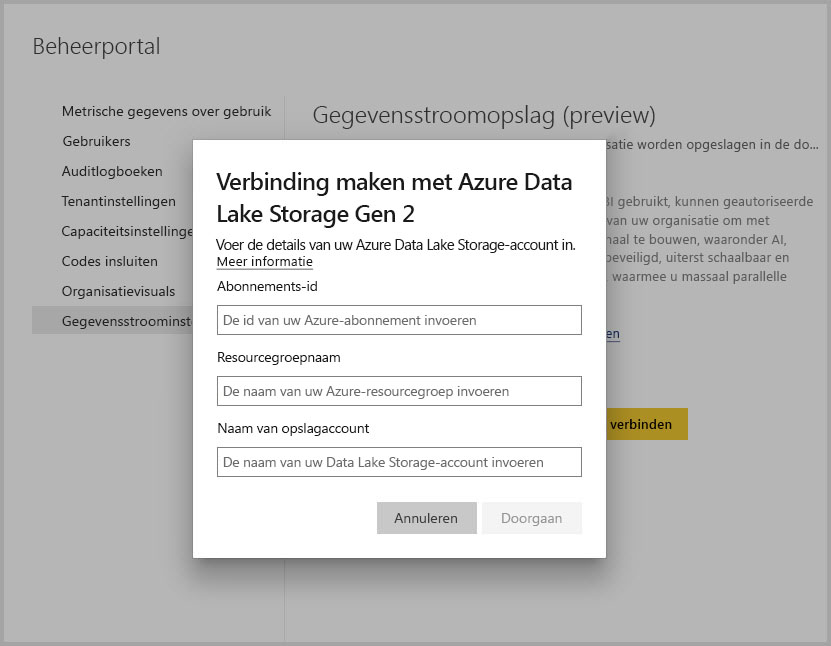
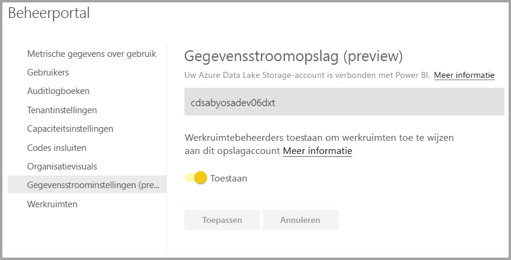

# Verbinding maken met Azure Data Lake Storage Gen2 voor gegevensstroomopslag

U kunt Power BI-werkruimten configureren voor het opslaan van gegevensstromen in het Azure Data Lake Storage Gen2-account van uw organisatie. In dit artikel worden de algemene stappen beschreven die nodig zijn om dit te doen en vindt u richtlijnen en aanbevolen procedures. Het configureren van werkruimten voor het opslaan van definities van de gegevensstroom en gegevensbestanden in uw data lake biedt enkele voordelen, waaronder:

* Azure Data Lake Storage Gen2 biedt een enorm schaalbare opslagfaciliteit voor gegevens
* Gegevensstroomgegevens en definitiebestanden kunnen door ontwikkelaars van uw IT-afdeling worden ingezet om Azure-gegevens en services voor kunstmatige intelligentie te gebruiken zoals geïllustreerd in de [GitHub-voorbeelden van Azure Data Services](https://aka.ms/cdmadstutorial)
* Biedt ontwikkelaars in uw organisatie de mogelijkheid gegevensstroomgegevens te integreren in interne toepassingen en line-of-business-oplossingen, waarbij bronnen voor ontwikkelaars voor gegevensstromen en Azure worden gebruikt

Voor het gebruik van Azure Data Lake Storage Gen2 voor gegevensstromen, hebt u het volgende nodig:

* **Power BI-tenant:** ten minste één account in uw Azure Active Directory-tenant (AAD) moet zijn geregistreerd voor Power BI
* **Een globale beheerdersaccount**: dit account is vereist om verbinding te maken met Power BI en Power BI te configureren voor het opslaan van de gegevensstroomdefinitie en de gegevens in uw Azure Data Lake Storage Gen2-account
* **Een Azure-abonnement**: u hebt een Azure-abonnement nodig om Azure Data Lake Storage Gen2 te gebruiken
* **Resourcegroep:** : gebruik een resourcegroep die u al hebt of maak een nieuwe
* **Een Azure Storage-account, waarbij de Data Lake Storage Gen2-functie is ingeschakeld** 

> [!TIP]
> Als u nog geen abonnement voor Azure hebt, maakt u een [gratis account](https://azure.microsoft.com/free/) voordat u begint.

> [!WARNING]
> Nadat een opslaglocatie voor een gegevensstroom is geconfigureerd, kan deze niet worden gewijzigd. Raadpleeg het gedeelte [Overwegingen en beperkingen](#considerations-and-limitations) aan het einde van dit artikel voor andere belangrijke overwegingen.

## Uw Azure Data Lake Storage Gen2 voorbereiden voor Power BI

Voordat u Power BI met een Azure Data Lake Storage Gen2-account kunt configureren, moet u een opslagaccount maken en configureren. Laten we de vereisten voor Power BI eens bekijken:

1. U moet de eigenaar zijn van het ADLS-opslagaccount. Dit moet op resourceniveau worden toegewezen en niet worden overgenomen op abonnementsniveau.
2. Het opslagaccount moet worden gemaakt in dezelfde AAD-tenant als uw Power BI-tenant.
3. Het opslagaccount moet worden gemaakt in dezelfde regio als uw Power BI-tenant. Zie het artikel [Waar bevindt mijn Power BI-tenant zich?](../admin/service-admin-where-is-my-tenant-located.md) om te bepalen waar uw Power BI-tenant zich bevindt.
4. Voor het opslagaccount moet de functionaliteit *Hiërarchische naamruimte* zijn ingeschakeld.
5. Als het opslagaccount niet door de huidige gebruiker is gemaakt, controleert u of de machtiging [Eigenaar van de opslagblobgegevens](https://docs.microsoft.com/azure/role-based-access-control/built-in-roles#storage-blob-data-owner) en [Eigenaar](https://docs.microsoft.com/azure/role-based-access-control/built-in-roles#owner) aan de huidige gebruiker is toegewezen. (Aangezien de eigenaar niet over een machtiging op gegevensniveau beschikt, is de eigenaar van de blobgegevens vereist.)

In de volgende secties wordt dieper ingegaan op de stappen die nodig zijn voor het configureren van uw account voor Azure Data Lake Storage Gen2.

### Het opslagaccount maken

Volg de stappen in het artikel [Een Azure Data Lake Storage Gen2-opslagaccount maken](https://docs.microsoft.com/azure/storage/blobs/data-lake-storage-quickstart-create-account).

1. Zorg ervoor dat u dezelfde locatie als uw Power BI-tenant selecteert en stel uw opslag in als **StorageV2 (algemeen gebruik v2)**
2. Zorg ervoor dat u de functionaliteit voor hiërarchische naamruimte inschakelt
3. Het verdient aanbeveling om de replicatie-instelling in te stellen op **Geografisch redundante opslag met leestoegang (RA-GRS)**

### Machtigingen verlenen aan Power BI-services

Vervolgens moet u de Power BI-service de rollen Lezer en Gegevenstoegang verlenen in het door u gemaakte opslagaccount. Dit zijn ingebouwde rollen, dus de stappen zijn eenvoudig. 

Volg de stappen in [Assign a built-in RBAC role](https://docs.microsoft.com/azure/storage/common/storage-auth-aad-rbac#assign-a-built-in-rbac-role) (Een ingebouwde RBAC-rol toewijzen).

Selecteer in het venster **Roltoewijzing toevoegen** de rol **Lezer en gegevenstoegang**. Gebruik vervolgens de zoekfunctie om de **Power BI-service** te zoeken.
Herhaal dezelfde stappen voor de rol **Eigenaar van opslagblobgegevens** en wijs de rol toe aan zowel de **Power BI-service** als **Power BI Premium**.

> [!NOTE]
> Wacht ten minste 30 minuten tot de machtiging aan Power BI is doorgegeven via de portal. Wacht na elke wijziging van machtigingen in de portal ten minste 30 minuten totdat die machtigingen in Power BI worden weergegeven. 

## Uw Azure Data Lake Storage Gen2 verbinden met Power BI

Zodra u uw Azure Data Lake Storage Gen2-account in Azure Portal hebt ingesteld, verbindt u het met Power BI in de **Power BI-beheerportal**. U beheert de Power BI-gegevensstroomopslag ook in de instellingssectie **Gegevensstroomopslag** van de Power BI-beheerportal. Zie voor hulp bij het starten en basisgebruik [Toegang krijgen tot de beheerportal](../admin/service-admin-portal.md) voor meer informatie.

U maakt verbinding met uw **Azure Data Lake Storage Gen2**-account via de volgende stappen:

1. Navigeer naar het tabblad **Gegevensstroominstellingen** van de **Power BI-beheerportal**

     

2. Selecteer de knop **Uw Azure Data Lake Storage Gen2 verbinden**. Het volgende venster wordt weergegeven.

     

3. Geef de **Abonnements-id** van het opslagaccount op.
4. Geef de **Resourcegroepnaam** waarin het opslagaccount is gemaakt op.
5. Geef de **Opslagaccountnaam** op.
6. Selecteer **Verbinding maken**.

Zodra deze stappen zijn voltooid, wordt uw Azure Data Lake Storage Gen2-account verbonden met Power BI. 

> [!NOTE]
> Als u in de Power BI-beheerportal een verbinding met Azure Data Lake Storage Gen2 wilt configureren, moet u over de machtigingen van een globale beheerder beschikken. Globale beheerders kunnen echter geen verbinding met externe opslag maken in de beheerportal.  

Vervolgens moet u gebruikers in uw organisatie inschakelen om hun werkruimten te configureren, zodat ze dit opslagaccount kunnen gebruiken voor gegevensstroomdefinitie en gegevensopslag. Dat gaan we in de volgende sectie doen. 

## Beheerders toestaan werkruimten toe te wijzen

Standaard worden gegevensstroomdefinitie- en gegevensbestanden opgeslagen in de opslag die wordt geleverd door Power BI. Voor toegang tot gegevensstroombestanden in uw eigen account, moeten werkruimtebeheerders eerst de werkruimte configureren, zodat toewijzing en opslag van gegevensstromen in het nieuwe opslagaccount mogelijk is. Voordat de werkruimtebeheerder opslaginstellingen voor gegevensstromen kan configureren, moeten aan de beheerder machtigingen voor opslagtoewijzing worden verleend in de **Power BI-beheerportal**.

Voor het verlenen van machtigingen voor opslagtoewijzing gaat u naar het tabblad **Gegevensstroominstellingen** in de **Power BI-beheerportal**. Er is een keuzerondje *Werkruimtebeheerders toestaan om werkruimten toe te wijzen aan dit opslagaccount* dat moet worden ingesteld op **toestaan**. Zodra u deze schuifregelaar hebt ingeschakeld, selecteert u de knop **Toepassen** om de wijziging door te voeren. 

 

Dat is alles. De Power BI-werkruimtebeheerders kunnen nu werkstromen toewijzen aan het bestandssysteem dat u hebt gemaakt.

## Overwegingen en beperkingen

Deze functie is een preview-functie en de eigenschappen ervan kunnen worden gewijzigd als de release nadert. Er zijn enkele overwegingen en beperkingen waar u rekening mee moet houden bij het werken met uw gegevensstroomopslag:

* Nadat een opslaglocatie voor een gegevensstroom is geconfigureerd, kan deze niet worden gewijzigd.
* Alleen de eigenaar van een gegevensstroom die is opgeslagen in Azure Data Lake Storage Gen2 heeft standaard toegang tot de gegevens. Als u meer mensen wilt machtigen voor de gegevensstromen die zijn opgeslagen in Azure, moet u ze toevoegen aan de CDM-map van de gegevensstroom 
* Het maken van gegevensstromen met gekoppelde entiteiten is alleen mogelijk als ze worden opgeslagen in hetzelfde opslagaccount
* On-premises gegevensbronnen, in Power BI gedeelde capaciteiten, worden niet ondersteund voor gegevensstromen die zijn opgeslagen in de data lake van uw organisatie
* Momentopnamen worden niet automatisch verwijderd in ADLS Gen 2. Als u ruimte wilt vrijmaken, kunt u een Azure-functie maken om regelmatig oude momentopnamen op te schonen.

Er zijn ook enkele bekende problemen, zoals beschreven in deze sectie.

Klanten van Power BI Desktop hebben geen toegang tot gegevensstromen die zijn opgeslagen in het **Azure Data Lake Storage-account**, tenzij ze eigenaar zijn van de gegevensstroom of zijn geautoriseerd zijn voor de CDM-map in de lake. Het scenario is als volgt:

1. Anna heeft een nieuwe werkruimte gemaakt en deze zo geconfigureerd dat er gegevensstromen kunnen worden opgeslagen in de data lake van de organisatie. 
2. Ben, die ook lid is van de werkruimte die Anna heeft gemaakt, wil Power BI Desktop en de gegevensstroomconnector gebruiken om gegevens op te halen uit de gegevensstroom die Anna heeft gemaakt.
3. Ben ontvangt een vergelijkbare fout omdat hij geen machtigingen heeft voor de CDM-map van de gegevensstroom in het lake.

Hier volgen enkele veelgestelde vragen en antwoorden:

**Vraag:** Wat gebeurt er als ik eerder gegevensstromen heb gemaakt in een werkruimte en de opslaglocatie wil wijzigen?

**Antwoord**: U kunt de opslaglocatie van een gegevensstroom niet wijzigen nadat deze is gemaakt. 

**Vraag:** Wanneer kan ik de opslaglocatie voor de gegevensstroom van een werkruimte wijzigen?

**Antwoord**: Het wijzigen van de opslaglocatie voor de gegevensstroom van een werkruimte is alleen toegestaan als de werkruimte geen gegevensstromen bevat.

## Volgende stappen

Dit artikel bood richtlijnen over het verbinden van een Azure Data Lake Gen2 voor gegevensstroomopslag. Raadpleeg de volgende artikelen voor meer informatie:

Raadpleeg de volgende artikelen voor meer informatie over gegevensstromen, CDM en Azure Data Lake Storage Gen2:

* [Integratie van gegevensstromen en Azure Data Lake (preview)](service-dataflows-azure-data-lake-integration.md)
* [Gegevensstroominstellingen voor werkruimten configureren (preview)](service-dataflows-configure-workspace-storage-settings.md)
* [Een CDM-map aan Power BI toevoegen als een gegevensstroom (preview)](service-dataflows-add-cdm-folder.md)

Raadpleeg de volgende artikelen voor algemene informatie over gegevensstromen:

* [Gegevensstromen maken en gebruiken in Power BI](service-dataflows-create-use.md)
* [Berekende entiteiten gebruiken in Power BI Premium](service-dataflows-computed-entities-premium.md)
* [Gegevensstromen gebruiken met on-premises gegevensbronnen](service-dataflows-on-premises-gateways.md)
* [Resources voor ontwikkelaars voor Power BI-gegevensstromen](service-dataflows-developer-resources.md)

Raadpleeg de volgende artikelen voor informatie over Azure-opslag:
* [Azure Storage-beveiligingshandleiding](https://docs.microsoft.com/azure/storage/common/storage-security-guide)

U kunt het overzichtsartikel lezen voor meer informatie over Common Data Model:
* [Overzicht van Common Data Model](https://docs.microsoft.com/powerapps/common-data-model/overview)
* [CDM-mappen](https://go.microsoft.com/fwlink/?linkid=2045304)
* [Bestandsdefinitie van CDM-model](https://go.microsoft.com/fwlink/?linkid=2045521)

U kunt altijd [vragen stellen in de Power BI-community](https://community.powerbi.com/).
