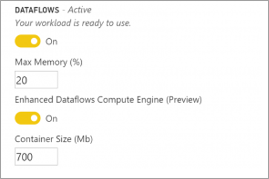

# De verbeterde berekeningsengine

Dankzij de verbeterde berekeningsengine in Power BI kunnen Power BI Premium-abonnees hun capaciteit gebruiken om het gebruik van gegevensstromen te optimaliseren. Het gebruik van de verbeterde berekeningsengine biedt de volgende voordelen:

* De vernieuwingstijd verkorten die nodig is voor langlopende ETL-stappen over berekende entiteiten, zoals *samenvoegen*, *onderscheiden*, *filteren,*  en*groeperen op*
* DirectQuery-query's uitvoeren op entiteiten (in februari 2020)

In de volgende secties wordt beschreven hoe u de verbeterde berekeningsengine inschakelt en veelgestelde vragen beantwoordt.

## De verbeterde berekeningsengine gebruiken

De verbeterde berekeningsengine wordt ingeschakeld op de pagina **capaciteitsinstellingen** in Power BI-service in de sectie **gegevensstromen**. Standaard is de verbeterde berekeningsengine **Uit**. Als u deze functie wilt inschakelen, schakelt u de wisselknop naar **Aan**, zoals weergegeven in de volgende afbeelding, en slaat u de instellingen op. 

> [!IMPORTANT]
> De verbeterde berekeningsengine werkt alleen voor Power BI-capaciteiten van A3 en hoger.

Wanneer u de verbeterde berekeningsengine hebt ingeschakeld, keert u terug naar gegevensstromen en ziet u een prestatieverbetering in een berekende entiteit die complexe bewerkingen uitvoert, zoals *samenvoegen* of *groeperen op* voor gegevensstromen die zijn gemaakt van bestaande gekoppelde entiteiten met dezelfde capaciteit. 

Als u optimaal gebruik wilt maken van de berekeningsengine, moet u de ETL-fase op de volgende manier opsplitsen in twee afzonderlijke gegevensstromen:

* **Gegevensstroom 1**: deze gegevensstroom mag alleen alle vereiste gegevens uit een gegevensbron opnemen en in gegevensstroom 2 plaatsen.
* **Gegevensstroom 2**: voer alle ETL-bewerkingen in deze tweede gegevensstroom uit, maar zorg ervoor dat u verwijst naar gegevensstroom 1, die dezelfde capaciteit moet hebben. Zorg er ook voor dat u bewerkingen uitvoert die eerst kunnen worden gevouwen (filteren, groeperen op, onderscheiden, samenvoegen), voordat u een andere bewerking uitvoert, om ervoor te zorgen dat de berekeningsengine wordt gebruikt.

## Veelgestelde vragen en antwoorden

**Vraag:** Ik heb de verbeterde berekeningsengine ingeschakeld, maar mijn vernieuwingen zijn trager. Hoe kan dat?

**Antwoord**: Als u de verbeterde berekeningsengine inschakelt, zijn er twee mogelijke verklaringen die kunnen leiden tot tragere vernieuwingstijden:

 - Wanneer de verbeterde berekeningsengine is ingeschakeld, is er geheugen vereist om deze goed te laten functioneren. Het geheugen dat beschikbaar is om een vernieuwing uit te voeren, wordt zo gereduceerd, waardoor de kans toeneemt dat de bewerking voor vernieuwen in de wachtrij wordt geplaatst, wat op zijn beurt het aantal gegevensstromen die tegelijkertijd kunnen worden vernieuwd, vermindert. Als u dit wilt verhelpen, vergroot u het geheugen dat is toegewezen voor gegevensstromen om ervoor te zorgen dat het beschikbare geheugen voor gelijktijdige gegevensstroomvernieuwingen hetzelfde blijft.

 - Een andere reden waarom langzamere vernieuwingen kunnen optreden, is dat de berekeningsengine alleen werkt boven op bestaande entiteiten, als uw gegevensstroom verwijst naar een gegevensbron die geen gegevensstroom is, zult u geen verbetering zien. Er zal geen prestatieverhoging zijn, aangezien in sommige big data-scenario's de eerste inlezing van een gegevensbron langzamer zou zijn omdat de gegevens moeten worden doorgegeven aan de verbeterde berekeningsengine.  

**Vraag:** Ik zie de verbeterde berekeningsengine niet schakelen. Hoe kan dat?

**Antwoord**: De verbeterde berekeningsengine wordt in fasen naar regio's over de hele wereld uitgebracht. We verwachten dat tegen het eind van 2020 alle regio's worden ondersteund.

**Vraag:** Wat zijn de ondersteunde gegevenstypen voor de berekeningsengine?

**Antwoord**: De verbeterde berekeningsengine en gegevensstromen ondersteunen momenteel de volgende gegevenstypen. Als u voor uw gegevensstroom niet een van de volgende gegevenstypen gebruikt, treedt er een fout op tijdens het vernieuwen:

* Datum/tijd
* Decimaal getal
* Tekst
* Geheel getal
* Datum/tijd/zone
* Waar/onwaar
* Datum
* Tijd

## Volgende stappen

In dit artikel vindt u informatie over het gebruik van de verbeterde berekeningsengine voor gegevensstromen. De volgende artikelen kunnen hierbij nuttig zijn:

* [Self-service data prep with dataflows](service-dataflows-overview.md) (Selfservice voor gegevensvoorbereiding met gegevensstromen)
* [Gegevensstromen maken en gebruiken in Power BI](service-dataflows-create-use.md)
* [Berekende entiteiten gebruiken in Power BI Premium](service-dataflows-computed-entities-premium.md)
* [Resources voor ontwikkelaars voor Power BI-gegevensstromen](service-dataflows-developer-resources.md)

U kunt de volgende artikelen lezen voor meer informatie over Power Query en geplande vernieuwing:
* [Queryoverzicht in Power BI Desktop](desktop-query-overview.md)
* [Geplande vernieuwing configureren](../connect-data/refresh-scheduled-refresh.md)

U kunt het overzichtsartikel lezen voor meer informatie over Common Data Model:
* [Overzicht van Common Data Model](/powerapps/common-data-model/overview)