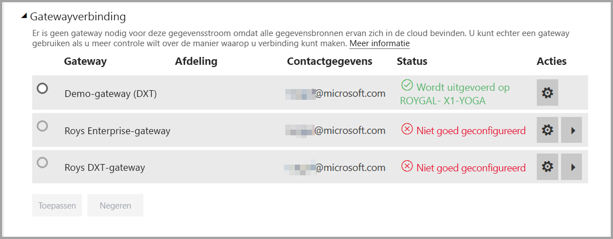
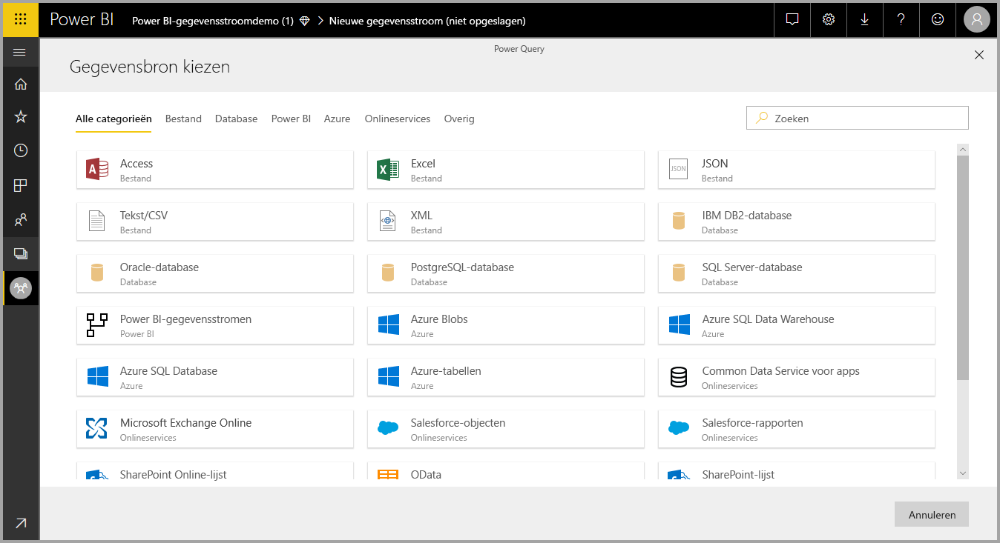
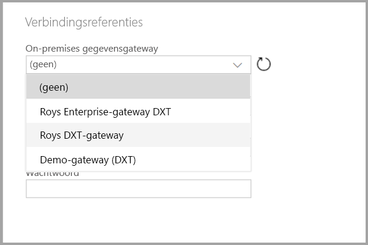

# Gegevensstromen gebruiken met on-premises gegevensbronnen

Met **gegevensstromen** kunt u een verzameling gegevens uit verschillende bronnen maken, de gegevens opschonen, transformeren en in de Power BI-opslag laden. Als u een gegevensstroom maakt, kunt u on-premises gegevensbronnen gebruiken. In dit artikel wordt uitgelegd wat er nodig is bij het maken van gegevensstromen en hoe uw **bedrijfsgateway** moet worden geconfigureerd om deze verbindingen in te schakelen.

## Een bedrijfsgateway configureren voor gebruik met gegevensstromen

Als u een gegevensstroom wilt maken met behulp van een gateway, moet de gebruiker de beheerder van de bedrijfsgateway zijn of moet de beheerder de gegevensbron die voor de gebruiker moet worden gebruikt, hebben gedeeld. 

> [!NOTE]
> Gegevensstromen worden alleen met behulp van bedrijfsgateways ondersteund.

## Een on-premises gegevensbron gebruiken in een gegevensstroom

Als u een gegevensstroom maakt, selecteert u een on-premises gegevensbron in de lijst met gegevensbronnen, zoals weergegeven in de volgende afbeelding.

Als u de selectie hebt gemaakt, wordt u gevraagd de verbindingsgegevens op te geven voor de bedrijfsgateway die wordt gebruikt om toegang te krijgen tot de on-premises gegevens. U dient de gateway zelf te selecteren en de referenties voor de geselecteerde gateway op te geven.

## De gateway bewaken

U kunt de bedrijfsgateway voor een gegevensstroom op dezelfde manier bewaken als een gateway voor een gegevensset.

In het scherm met de instellingen voor de gegevensstroom in Power BI, kunt u de status van de gateway van een gegevensstroom bewaken en een gateway aan de gegevensstroom toewijzen, zoals weergegeven in de volgende afbeelding.

## Gateway wijzigen

U kunt de bedrijfsgateway die voor een bepaalde gegevensstroom is gebruikt, op twee manieren wijzigen:

1. **Met het bewerkingsprogramma**: u kunt de gateway die aan al uw query's is toegewezen, wijzigen met het bewerkingsprogramma voor gegevensstromen.

    > [!NOTE]
    > De gegevensstroom probeert de vereiste gegevensbronnen met behulp van de nieuwe gateway te zoeken of te maken. Als dat niet lukt, kunt u de gateway pas wijzigen als alle benodigde gegevensstromen vanuit de geselecteerde gateway beschikbaar zijn.

2. **Vanuit het instellingenscherm**: u kunt de toegewezen gateway wijzigen via het instellingenscherm voor de gegevensstroom in de Power BI-service.

Zie [On-premises gegevensgateway](../connect-data/service-gateway-onprem.md) voor meer informatie over bedrijfsgateways.

## Overwegingen en beperkingen

Er gelden een aantal beperkingen met betrekking tot het gebruik van bedrijfsgateways en gegevensstromen:

* Elke gegevensstroom mag slechts gebruikmaken van één gateway. Alle query's moeten dus worden geconfigureerd met behulp van dezelfde gateway.
* Een wijziging van de gateway is van invloed op de hele gegevensstroom.
* Als u meerdere gateways nodig hebt, kunt u het beste meerdere gegevensstromen maken (één voor elke gateway) en de gegevens integreren met een rekenprogramma of een programma voor entiteitsverwijzing.
* Gegevensstromen worden alleen met behulp van bedrijfsgateways ondersteund. Persoonlijke gateways kunnen niet in de vervolgkeuzelijsten en instellingsschermen worden geselecteerd.

## Volgende stappen

Dit artikel biedt informatie over het gebruik van on-premises gegevensbronnen voor gegevensstromen en hoe u gateways kunt gebruiken en configureren voor toegang tot die gegevens. De volgende artikelen kunnen hierbij nuttig zijn

* [Self-service data prep with dataflows](service-dataflows-overview.md) (Selfservice voor gegevensvoorbereiding met gegevensstromen)
* [Gegevensstromen maken en gebruiken in Power BI](service-dataflows-create-use.md)
* [Berekende entiteiten gebruiken in Power BI Premium](service-dataflows-computed-entities-premium.md)
* [Resources voor ontwikkelaars voor Power BI-gegevensstromen](service-dataflows-developer-resources.md)

U kunt de volgende artikelen lezen voor meer informatie over Power Query en geplande vernieuwing:
* [Queryoverzicht in Power BI Desktop](desktop-query-overview.md)
* [Geplande vernieuwing configureren](../connect-data/refresh-scheduled-refresh.md)

U kunt het overzichtsartikel lezen voor meer informatie over Common Data Model:
* [Overzicht van Common Data Model](https://docs.microsoft.com/powerapps/common-data-model/overview)
