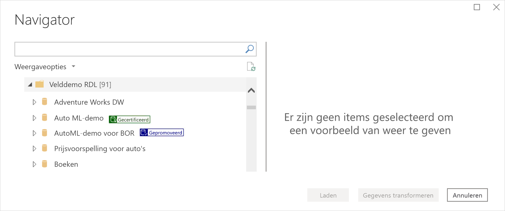
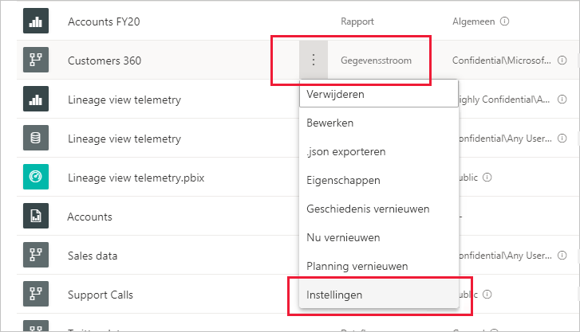
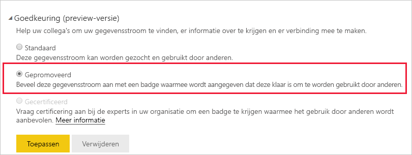
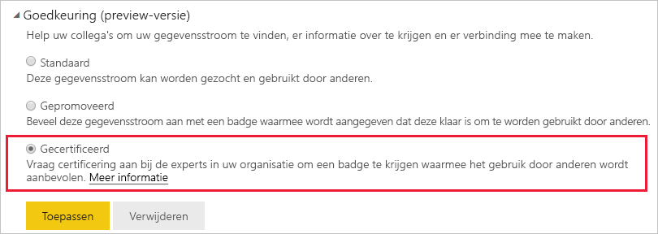

# Niveauverhoging of certificering van gegevensstromen (preview)

Power BI biedt twee manieren om de zichtbaarheid van uw waardevolle gegevensstromen van hoge kwaliteit te vergroten: **niveauverhoging** en **certificering**.

* **Promotie**: Met niveauverhoging kunnen gebruikers gegevensstromen markeren die ze waardevol en de moeite waard achten voor gebruik door anderen. Op deze manier wordt het gezamenlijk verspreiden van gegevensstromen binnen een organisatie gestimuleerd. Een eigenaar van een gegevensstroom, of elk lid met schrijfmachtigingen voor de werkruimte waarin een gegevensstroom zich bevindt, kan het niveau van de gegevensstroom eenvoudig verhogen wanneer deze goed genoeg wordt geacht om te delen.

* **Certificering**: Certificering betekent dat een gegevensstroom is gecontroleerd door een geautoriseerde revisor en dat deze stroom een betrouwbare, gezaghebbende gegevensbron is die gereed is voor gebruik in de hele organisatie. Een geselecteerde groep revisoren die door de Power BI-beheerder is gedefinieerd, bepaalt welke gegevensstromen moeten worden gecertificeerd. Een gebruiker die meent dat een bepaalde gegevensstroom moet worden gecertificeerd, maar niet gemachtigd is om deze te certificeren, kan contact opnemen met de beheerder.

  Certificering van een gegevensstroom is alleen mogelijk als dit is [ingeschakeld door de Power BI-beheerder](../admin/service-admin-setup-certification.md).

Niveauverhoging of certificering van een gegevensstroom wordt *goedkeuring* genoemd. Makers van Power BI-rapporten hebben vaak veel verschillende gegevensstromen waaruit ze kunnen kiezen, en ondersteuning leidt ze naar de gegevensstromen die betrouwbaar en gezaghebbend zijn.

Ondersteunde gegevensstromen zijn duidelijk gelabeld op veel plaatsen in Power BI. Hierdoor zijn ze eenvoudig te vinden door rapportmakers die op zoek zijn naar betrouwbare gegevens, en kunnen beheerders en rapportmakers bijhouden hoe deze stromen in de hele organisatie worden gebruikt.

In de onderstaande afbeelding ziet u hoe gegevensstromen waarvan het niveau is verhoogd en die zijn gecertificeerd, eenvoudig kunnen worden geïdentificeerd in Power Query.

In dit artikel wordt het volgende beschreven
* Het niveau van een gegevensstroom verhogen (door de eigenaar van een gegevensstroom of een gebruiker met lidmachtigingen voor de werkruimte waarin de gegevensstroom zich bevindt)
* Een gegevensstroom certificeren (door een geautoriseerde gegevensstroomcertificeerder, zoals bepaald door de Power BI-beheerder)

Zie [Certificering van gegevensset en gegevensstroom instellen](../admin/service-admin-setup-certification.md) voor informatie over het instellen van gegevensstroomcertificering (door de beheerder)

## Het niveau van een gegevensset verhogen

Als u het niveau van een gegevensstroom wilt verhogen, moet u schrijfmachtigingen hebben voor de werkruimte waarin de gegevensstroom zich bevindt waarvan u het niveau wilt verhogen.

1. Ga naar de lijst met gegevensstromen in de werkruimte.
 
1. Selecteer **Meer opties** (...) voor de gegevensstroom waarvan u het niveau wilt verhogen en selecteer vervolgens **Instellingen**.

    

1. Vouw de sectie Goedkeuring uit en selecteer **Verhoogd niveau**.

    

1. Selecteer **Toepassen**.

## Een gegevensstroom certificeren

Deze sectie is bedoeld voor gebruikers die door hun Power BI-beheerder zijn gemachtigd om gegevensstromen te certificeren. Het certificeren van gegevensstromen is een grote verantwoordelijkheid. In deze sectie wordt het te volgen certificeringsproces uitgelegd.

1. Verkrijg schrijfmachtigingen voor de werkruimte waarin de te certificeren gegevensstroom zich bevindt. Deze zijn te verkrijgen bij de gegevensstroomeigenaar of iemand met beheerdersmachtigingen voor de werkruimte. 

1. Controleer de gegevensstroom zorgvuldig en bepaal of deze certificering verdient.

1. Als u besluit de gegevensstroom te certificeren, gaat u naar de werkruimte waarin deze zich bevindt.
 
1. Zoek de gewenste gegevensstroom, klik op **Meer opties** (...) en selecteer vervolgens **Instellingen**.

    

1. Vouw de sectie Goedkeuring uit en selecteer **Gecertificeerd**. 

    

2. Klik op **Toepassen**.

## Volgende stappen

* [Certificering van gegevenssets en gegevensstromen instellen](../admin/service-admin-setup-certification.md)
* Vragen? [Misschien dat de Power BI-community het antwoord weet](https://community.powerbi.com/)