# Matrixvisualisaties maken in Power BI

[!INCLUDE[consumer-appliesto-nyyn](../includes/consumer-appliesto-nyyn.md)]

[!INCLUDE [power-bi-visuals-desktop-banner](../includes/power-bi-visuals-desktop-banner.md)]

De matrixvisualisatie is vergelijkbaar met een tabel.  Een tabel ondersteunt twee dimensies en de gegevens zijn eendimensionaal, wat inhoudt dat dubbele waarden worden weergegeven en niet worden samengevoegd. Een matrix maakt het gemakkelijker om gegevens in verschillende dimensies weer te geven omdat deze een indeling met interval ondersteunt. In de matrix worden de gegevens automatisch samengevoegd en kunt u inzoomen op gegevens. 

U kunt matrixvisualisaties maken in rapporten van **Power BI Desktop** en elementen in de matrix kruislings markeren met andere visualisaties op die rapportpagina. U kunt bijvoorbeeld rijen, kolommen en zelfs afzonderlijke cellen selecteren en vervolgens kruislings markeren. Bovendien kunnen afzonderlijke cellen en selecties van meerdere cellen worden gekopieerd en geplakt in andere toepassingen. 

Er zijn veel functies gekoppeld aan de matrix, en in de volgende secties van dit artikel gaan we die behandelen.

> [!NOTE]
> Voor het delen van uw rapport met een Power BI-collega moeten u beiden beschikken over een afzonderlijke Power BI Pro-licentie of moet het rapport zijn opgeslagen in Premium-capaciteit.

## Begrijpen hoe Power BI totalen berekent

Voordat u leert hoe u de matrixvisualisatie gebruikt, is het belangrijk om te begrijpen hoe in Power BI totalen en subtotalen worden berekend in tabellen en matrices. In het geval van rijen met totalen en subtotalen evalueert Power BI de meting over alle rijen in de onderliggende gegevens. Het is dus niet een eenvoudige optelsom van de waarden in de zichtbare of weergegeven rijen. Dit betekent dat u in de totaalrij andere waarden kunt krijgen dan u had verwacht.

Kijk eens naar de volgende matrixvisualisaties. 

In dit voorbeeld geven alle rijen uiterst rechts in de matrixvisualisatie het bedrag (*Amount*) weer voor elke combinatie van verkoper en datum. Maar omdat een verkoper in meerdere datums verschijnt kunnen de getallen vaker dan één keer worden weergegeven. Het accurate totaal van de onderliggende gegevens en de eenvoudige optelsom van de zichtbare waarden komen daarom niet overeen. Dit is een algemeen patroon wanneer de waarde die u optelt de één is in een één-op-veelrelatie.

Wanneer u totalen en subtotalen bekijkt, houd er dan rekening mee dat deze waarden zijn gebaseerd op de onderliggende gegevens en niet uitsluitend op basis van de zichtbare waarden.

## Rijkoppen uitvouwen en samenvouwen
Er zijn twee manieren om rijkoppen uit te vouwen. De eerste is via het menu dat verschijnt als u met de rechtermuisknop klikt. U ziet dan opties voor het uitvouwen van de specifieke rijkop die u hebt geselecteerd, het volledige niveau of alles tot en met het laatste niveau van de hiërarchie. Er zijn vergelijkbare opties voor het samenvouwen van rijkoppen.

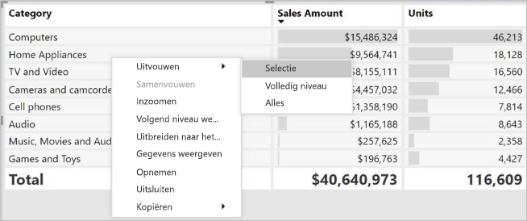

U kunt ook plus- en minknoppen toevoegen aan de rijkoppen via het opmaakvenster onder de kaart **Rijkoppen**. De pictogrammen hebben standaard de opmaak van de rijkop, maar u kunt de kleuren en grootte van de pictogrammen afzonderlijk aanpassen als u dat wilt.

Zodra de pictogrammen zijn ingeschakeld, werken ze vergelijkbaar met draaitabelpictogrammen in Excel.

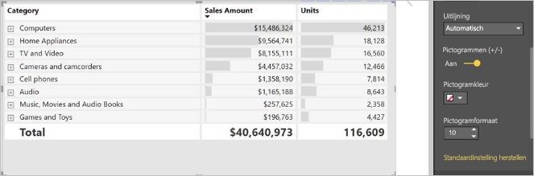

De uitvouwstatus van de matrix wordt samen met uw rapport opgeslagen. Een matrix kan uitgevouwen of samengevouwen worden vastgemaakt aan een dashboard. Als die dashboardtegel wordt geselecteerd en het rapport wordt geopend, kan de uitvouwstatus nog steeds worden gewijzigd in het rapport. 

> [!NOTE]
> Als u een rapport bouwt op basis van een multidimensionaal Analysis Services-model, zijn er een aantal speciale zaken waarmee u rekening moet houden voor uitvouwen/samenvouwen als voor het model de standaardledenfunctie wordt gebruikt. Zie [Werken met multidimensionale modellen in Power BI](../connect-data/desktop-default-member-multidimensional-models.md) voor meer informatie

## Inzoomen op de matrixvisualisatie
Met de matrixvisualisatie kunt u op allerlei interessante manieren inzoomen die eerder niet beschikbaar waren. Eén hiervan is de mogelijkheid om in te zoomen met behulp van rijen, kolommen en zelfs op afzonderlijke secties en cellen. Laten we eens kijken hoe dat werkt.

### Inzoomen op rijkoppen

Wanneer u in het deelvenster Visualisaties meerdere velden toevoegt aan de sectie **Rijen** van het vak **Velden**, kan er worden ingezoomd op de rijen van de matrixvisualisatie. Dit is vergelijkbaar met het maken van een hiërarchie, die het vervolgens mogelijk maakt in te zoomen op die hiërarchie (en weer terug te gaan) en de gegevens op elk niveau te analyseren.

In de volgende afbeelding bevat de sectie **Rijen** *Sales Stage* en *Opportunity Size*, waardoor er een groepering (of hiërarchie) van de rijen wordt gemaakt waarop we kunnen inzoomen.

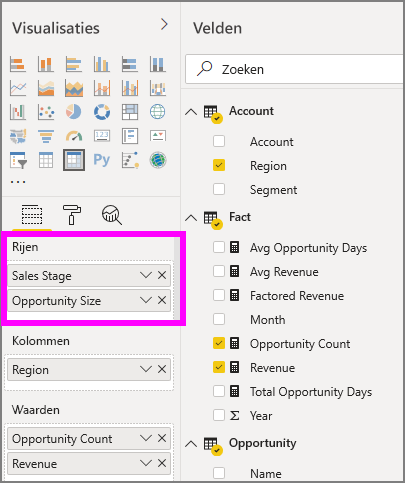

Wanneer in de visualisatie een groepering is gemaakt in de sectie **Rijen**, worden in de linkerbovenhoek van de visualisatie zelf de pictogrammen *Inzoomen* en *Uitvouwen* weergegeven.

Net als bij het zoom- en uitvouwgedrag in andere visualisaties, kunnen we met die knoppen inzoomen op (of teruggaan door) de hiërarchie. In dit geval kunnen we vanuit *Sales Stage* inzoomen op *Opportunity Size*, zoals u kunt zien in de volgende afbeelding, waar het pictogram voor inzoomen op één niveau (de stemvork) is geselecteerd.

U kunt niet alleen die pictogrammen gebruiken, maar ook een van de rijkoppen selecteren en inzoomen door een keuze te maken in het menu dat verschijnt.

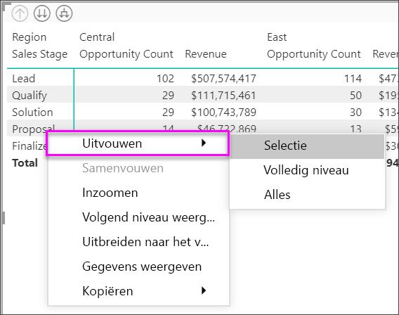

Er zijn enkele opties in het menu dat verschijnt die verschillende resultaten genereren:

Door **Inzoomen** te selecteren wordt de matrix voor *dat* rijniveau uitgevouwen; alle andere rijkoppen worden *uitgesloten*, behalve de rijkop die u hebt geselecteerd. In de volgende afbeelding is **Proposal** > **Inzoomen** geselecteerd. U ziet dat andere rijen op het hoogste niveau niet meer in de matrix worden weergegeven. Deze manier van inzoomen is handig, zoals u met name zult zien in de sectie over kruislings markeren.

Selecteer het pictogram **Uitzoomen** om terug te gaan naar de vorige weergave op het hoogste niveau. Als u vervolgens**Proposal** > **Volgende niveau weergeven** selecteert, krijgt u een oplopende lijst met alle items op het volgende niveau (in dit geval het veld *Opportunity Size*), zonder de hiërarchiecategorisatie op het hogere niveau.

Selecteer het pictogram **Uitzoomen** in de linkerbovenhoek om in de matrix alle categorieën op het hoogste niveau weer te geven. Selecteer vervolgens **Proposal** > **Uitbreiden naar het volgende niveau** om alle waarden voor beide niveaus van de hiërarchie te zien: *Sales Stage* en *Opportunity Size*.

U kunt ook de menu-optie **Uitbreiden** gebruiken om de weergave verder te beheren.  Selecteer bijvoorbeeld **Proposal** > **Uitbreiden** > **Selectie**. Power BI geeft één totaalrij weer voor elke verkoopfase (*Sales Stage*) en alle opties van *Opportunity Size* voor *Proposal*.

### Inzoomen op kolomkoppen
Net als u de mogelijkheid hebt om in te zoomen op rijen, kunt u ook inzoomen op kolommen. In de volgende afbeelding ziet u dat er twee velden in het vak **Kolommen** staan, waardoor er een hiërarchie ontstaat die vergelijkbaar is met de hiërarchie die we eerder in dit artikel hebben gebruikt voor de rijen. In het vak **Kolommen** staan *Region* en *Segment*. Op het moment dat het tweede veld werd toegevoegd aan **Kolommen**, werd er een nieuw vervolgkeuzemenu weergegeven in de visualisatie, hier met **Rijen** geselecteerd.

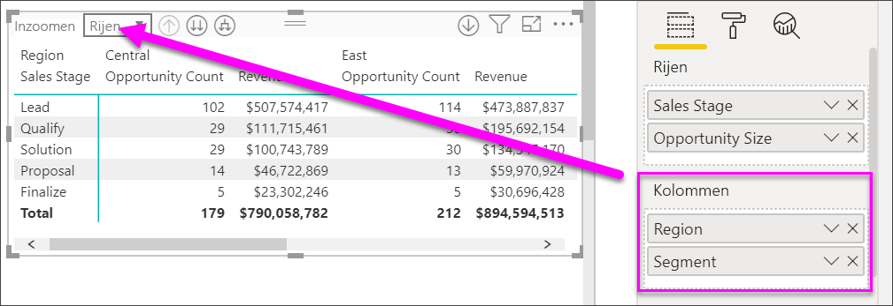

Als u wilt inzoomen op kolommen, selecteert u **Kolommen** in het menu *Inzoomen*. Dit menu staat in de linkerbovenhoek van de matrix. Selecteer de regio *East* en kies **Inzoomen**.

Wanneer u **Inzoomen**  selecteert, wordt het volgende niveau van de kolomhiërarchie voor *Region > East* weergegeven, in dit geval *Opportunity Count*. De andere regio is verborgen.

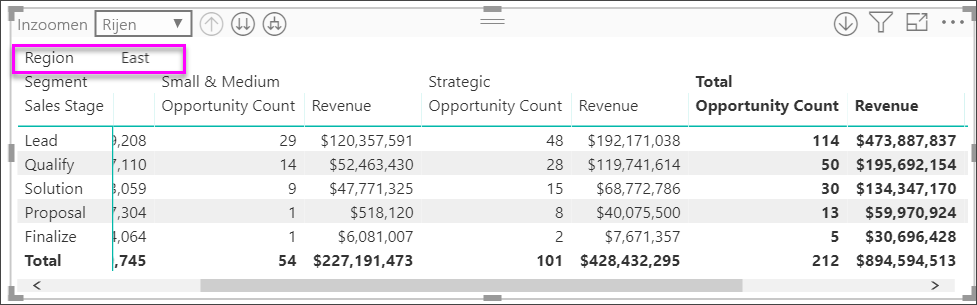

De rest van de menu-items werken voor kolommen op dezelfde manier als voor rijen (zie de vorige sectie **Inzoomen op rijkoppen**). U kunt **Volgende niveau weergeven** en **Uitbreiden naar het volgende niveau** ook gebruiken met kolommen, net als met rijen.

> [!NOTE]
> De pictogrammen voor in- en uitzoomen linksboven in de matrixvisual zijn alleen van toepassing op rijen. Als u wilt inzoomen op kolommen, moet u het contextmenu gebruiken.

## Getrapte indeling met matrixvisualisatie

In de matrixvisualisatie worden subcategorieën in een hiërarchie automatisch ingesprongen onder elk bovenliggend item. Dit wordt een indeling met interval genoemd.

In de oorspronkelijke versie van de matrixvisualisatie werden subcategorieën weergegeven in een geheel andere kolom, wat veel meer ruimte kostte in de visualisatie. In de volgende afbeelding wordt de tabel in de oorspronkelijke matrixvisualisatie weergegeven. U ziet dat de subcategorieën in een afzonderlijke kolom staan.

In de volgende afbeelding ziet u de matrixvisualisatie met een indeling met interval in actie. U ziet dat de categorie *Computers* subcategorieën heeft (Computeraccessoires, Desktops, Laptops, Monitors, enzovoort) die enigszins zijn ingesprongen, waardoor de visualisatie er netter en veel compacter uitziet.

U kunt de instellingen van de indeling met interval gemakkelijk aanpassen. Selecteer de matrixvisualisatie en vouw in de sectie **Opmaak** (het verfrollerpictogram) van het deelvenster **Visualisaties** de sectie Rijkoppen uit. U hebt twee opties: de wisselknop Indeling met interval (waarmee u dit in- of uitschakelt) en de Inspringing voor indeling met interval (hiermee geeft u het aantal ingesprongen pixels op).

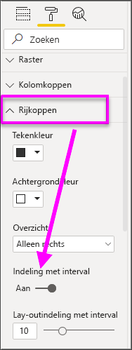

Als u Indeling met interval uitschakelt, worden in Power BI de subcategorieën weergegeven in een aparte kolom in plaats van ingesprongen onder de bovenliggende categorie.

## Subtotalen en eindtotalen met matrixvisualisaties

U kunt subtotalen in- of uitschakelen in matrixvisualisaties, zowel voor rijen als kolommen. In de volgende afbeelding ziet u dat de rijsubtotalen zijn ingesteld op **Aan** en aan de onderkant worden weergegeven.

Wanneer u **Subtotalen** inschakelt en een label toevoegt, voegt Power BI ook een rij en hetzelfde label toe voor de eindtotaalwaarde. Als u het eindtotaal wilt opmaken, selecteert u de indelingsoptie voor **Eindtotaal**. 

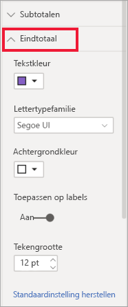

Als u subtotalen en eindtotalen wilt uitschakelen, vouwt u in de sectie Opmaak van het deelvenster Visualisaties de kaart **Subtotalen** uit. Zet de schuifknop Rijsubtotalen op **Uit**. Wanneer u dit doet, worden de subtotalen niet weergegeven.

Hetzelfde geldt voor de kolomsubtotalen.

## Voorwaardelijke pictogrammen toevoegen
Voeg visuele aanwijzingen toe aan uw tabel of matrix met *voorwaardelijke pictogrammen*. 

Vouw in de sectie Indeling van het deelvenster Visualisaties de kaart **Voorwaardelijke opmaak** uit. Zet de schuifknop **Pictogrammen** op **Aan** en selecteer **Geavanceerde besturingselementen**.

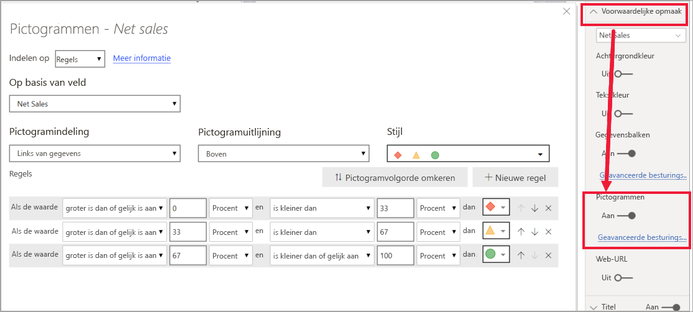

Pas de voorwaarden, pictogrammen en kleuren voor uw matrix aan en selecteer **OK**. In dit voorbeeld hebben we een rode vlag gebruikt voor lage waarden, een paarse cirkel voor hoge waarden en een gele driehoek voor alles ertussenin. 

## Kruislings markeren met matrixvisualisaties

Met de matrixvisualisatie kan elk element in de matrix worden geselecteerd als de basis voor kruislings markeren. Selecteer een kolom in een matrix. Deze kolom wordt vervolgens gemarkeerd in Power BI, net als bij andere visualisaties op de rapportpagina. Dit type kruislings markeren was al een algemene functie van andere visualisaties en gegevenspuntselecties, en nu biedt de matrixvisualisatie dezelfde functionaliteit.

Bovendien werkt Ctrl+klikken ook voor kruislings markeren. In de volgende afbeelding is bijvoorbeeld een verzameling subcategorieën geselecteerd in de matrixvisualisatie. U ziet dat items die niet zijn geselecteerd in de visualisatie, lichter zijn gekleurd, en dat de in de matrixvisualisatie gemaakte selecties worden weerspiegeld in de andere visualisaties op de pagina.

## Waarden kopiëren uit Power BI voor gebruik in andere toepassingen

Uw matrix of tabel bevat mogelijk inhoud die u in andere toepassingen wilt gebruiken: Dynamics CRM, Excel en andere Power BI-rapporten. Met een rechtermuisklik in Power BI kopieert en plakt u een afzonderlijke cel of een selectie cellen naar uw klembord. Vervolgens kunt u de gegevens in de andere toepassing plakken.

* Kopieer de waarde van een enkele cel, selecteer de cel, klik er met de rechtermuisknop op en kies **Waarde kopiëren**. Als u de onopgemaakte celwaarde naar uw klembord hebt gekopieerd, kunt u deze nu kopiëren in een andere toepassing.

    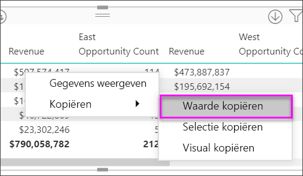

* Als u meer dan een enkele cel wilt kopiëren, selecteert u een reeks cellen, of gebruikt u CTRL om één of meer cellen te selecteren. 

    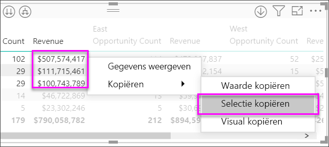

* De kolomkoppen en rijkoppen zijn opgenomen in de kopie.

    

* Als u een kopie van de visualisatie zelf wilt maken met alleen de geselecteerde cellen, selecteert u een of meer cellen met behulp van Ctrl, klikt u met de rechtermuisknop en kiest u **Visualisatie kopiëren**

    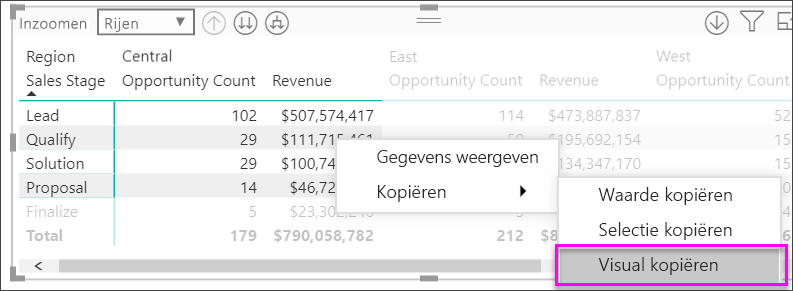

* De kopie is een andere matrixvisualisatie, maar bevat alleen de gekopieerde gegevens.

    

## Een matrixwaarde instellen als een aangepaste URL

Als u een kolom of meting hebt die website-URL's bevat, kunt u voorwaardelijke opmaak gebruiken om deze URL's toe te passen op velden als actieve koppelingen. U vindt deze optie onder de kaart **Voorwaardelijke opmaak** in het opmaakvenster.

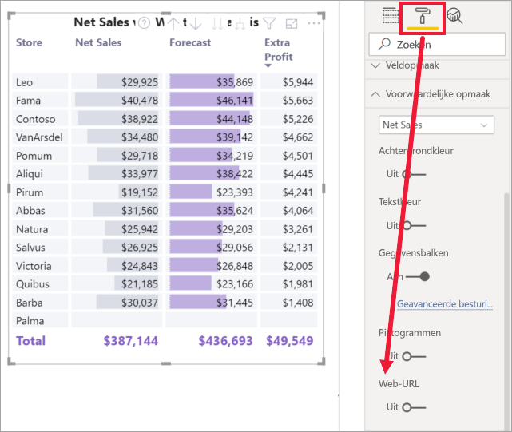

Zet **Web-URL** op Aan en selecteer een veld dat u wilt gebruiken als de URL voor de kolom. Eenmaal toegepast, worden de waarden in dat veld (kolom) actieve koppelingen. Beweeg de muisaanwijzer om de koppeling te zien en selecteer de koppeling om naar die pagina te gaan. 

Zie [Voorwaardelijke tabelopmaak](../create-reports/desktop-conditional-table-formatting.md) voor meer informatie.

## Arcering en tekstkleuren met matrixvisualisaties
Met de matrixvisualisatie kunt u voorwaardelijke opmaak (kleuren en arcering en gegevensbalken) toepassen op de achtergrond van cellen in de matrix en op de tekst en waarden zelf.

Als u voorwaardelijke opmaak wilt toepassen, selecteert u de matrixvisualisatie en opent u het deelvenster **Indeling**. Vouw de kaart **Voorwaardelijke opmaak** uit en zet de schuifregelaar voor **Achtergrondkleur**, **Tekstkleur** of **Gegevensbalken** op **Aan**. Door een van deze opties in te schakelen wordt er een koppeling weergegeven naar *Geavanceerde besturingselementen*, waarmee u de kleuren en waarden voor de kleurenopmaak kunt aanpassen.
  
  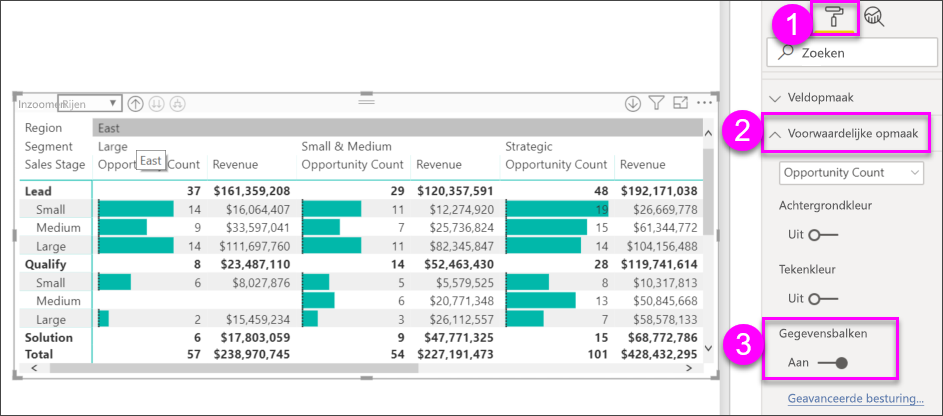

Selecteer *Geavanceerde besturingselementen* om een dialoogvenster weer te geven waarin u aanpassingen kunt doen. In dit voorbeeld ziet u het dialoogvenster voor **gegevensbalken**.

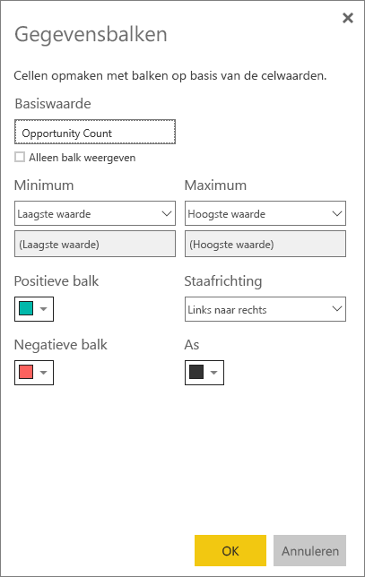

## Aandachtspunten en probleemoplossing

* Als de tekstgegevens in de cellen of kopteksten in uw matrix nieuwe regeltekens bevatten, worden deze tekens genegeerd, tenzij u de optie Tekstterugloop inschakelt in de gekoppelde kaart Opmaakvenster. 

## Volgende stappen

[Power Apps-visual voor Power BI](power-bi-visualization-powerapp.md)

[Visualization types in Power BI](power-bi-visualization-types-for-reports-and-q-and-a.md) (Typen visualisaties in Power BI)

