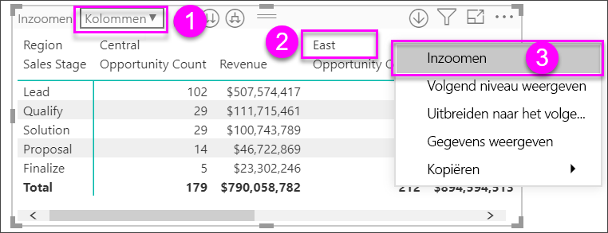

# Matrixvisualisatie in Power BI gebruiken
De **matrixvisualisatie** is vergelijkbaar met een **tabel**.  Een tabel ondersteunt twee dimensies en de gegevens zijn eendimensionaal, wat inhoudt dat dubbele waarden worden weergegeven en niet worden samengevoegd. Een matrix maakt het gemakkelijker om gegevens in verschillende dimensies weer te geven omdat deze een indeling met interval ondersteunt. In de matrix worden de gegevens automatisch samengevoegd en kunt u inzoomen op gegevens. 

U kunt matrixvisualisaties maken in rapporten van **Power BI Desktop** en **Power BI-service** en elementen in de matrix kruislings markeren met andere visualisaties op die rapportpagina. U kunt bijvoorbeeld rijen, kolommen en zelfs afzonderlijke cellen selecteren en vervolgens kruislings markeren. Bovendien kunnen afzonderlijke cellen en selecties van meerdere cellen worden gekopieerd en geplakt in andere toepassingen. 

Er zijn veel functies gekoppeld aan de matrix, en in de volgende secties van dit artikel gaan we die behandelen.

## Begrijpen hoe Power BI totalen berekent

Voordat u leert hoe u de **matrixvisualisatie** gebruikt, is het belangrijk om te begrijpen hoe Power BI totalen en subtotalen berekent in tabellen en matrices. In het geval van rijen met totalen en subtotalen evalueert Power BI de meting over alle rijen in de onderliggende gegevens. Het is dus niet een eenvoudige optelsom van de waarden in de zichtbare of weergegeven rijen. Dit betekent dat u in de totaalrij andere waarden kunt krijgen dan u had verwacht.

Kijk eens naar de volgende matrixvisualisaties. 

In dit voorbeeld geven alle rijen uiterst rechts in de matrixvisualisatie het bedrag (*Amount*) weer voor elke combinatie van verkoper en datum. Maar omdat een verkoper in meerdere datums verschijnt kunnen de getallen vaker dan één keer worden weergegeven. Het accurate totaal van de onderliggende gegevens en de eenvoudige optelsom van de zichtbare waarden komen daarom niet overeen. Dit is een algemeen patroon wanneer de waarde die u optelt de één is in een één-op-veelrelatie.

Wanneer u totalen en subtotalen bekijkt, houd er dan rekening mee dat deze waarden zijn gebaseerd op de onderliggende gegevens en niet uitsluitend op basis van de zichtbare waarden.

<!-- use Nov blog post video

## Expanding and collapsing row headers
There are two ways you can expand row headers. The first is through the right-click menu. You’ll see options to expand the specific row header you clicked on, the entire level or everything down to the very last level of the hierarchy. You have similar options for collapsing row headers as well.

You can also add +/- buttons to the row headers through the formatting pane under the row headers card. By default, the icons will match the formatting of the row header, but you can customize the icons’ color and size separately if you want. 
Once the icons are turned on, they work similarly to the icons from PivotTables in Excel.

The expansion state of the matrix will save with your report. It can be pinned to dashboards as well, but consumers will need to open up the report to change the state. Conditional formatting will only apply to the inner most visible level of the hierarchy. Note that this expand/collapse experience is not currently supported when connecting to AS servers older than 2016 or MD servers.

Watch the following video to learn more about expand/collapse in the matrix:

-->
## Inzoomen op de matrixvisualisatie
Met de matrixvisualisatie kunt u op allerlei interessante manieren inzoomen die eerder niet beschikbaar waren. Eén hiervan is de mogelijkheid om in te zoomen met behulp van rijen, kolommen en zelfs op afzonderlijke secties en cellen. Laten we eens kijken hoe dat werkt.

### Inzoomen op rijkoppen

Wanneer u in het deelvenster Visualisaties meerdere velden toevoegt aan de sectie **Rijen** van het vak **Velden**, kan er worden ingezoomd op de rijen van de matrixvisualisatie. Dit is vergelijkbaar met het maken van een hiërarchie, die het vervolgens mogelijk maakt in te zoomen op die hiërarchie (en weer terug te gaan) en de gegevens op elk niveau te analyseren.

In de volgende afbeelding bevat de sectie **Rijen** *Sales Stage* en *Opportunity Size*, waardoor er een groepering (of hiërarchie) van de rijen wordt gemaakt waarop we kunnen inzoomen.

Wanneer in de visualisatie een groepering is gemaakt in de sectie **Rijen**, worden in de linkerbovenhoek van de visualisatie zelf de pictogrammen *Inzoomen* en *Uitvouwen* weergegeven.

Net als bij het zoom- en uitvouwgedrag in andere visualisaties, kunnen we met die knoppen inzoomen op (of teruggaan door) de hiërarchie. In dit geval kunnen we vanuit *Sales Stage* inzoomen op *Opportunity Size*, zoals u kunt zien in de volgende afbeelding, waar het pictogram voor inzoomen op één niveau (de stemvork) is geselecteerd.

U kunt niet alleen die pictogrammen gebruiken, maar ook een van de rijkoppen selecteren en inzoomen door een keuze te maken in het menu dat verschijnt.

Er zijn enkele opties in het menu dat verschijnt die verschillende resultaten genereren:

Door **Inzoomen** te selecteren wordt de matrix voor *dat* rijniveau uitgevouwen; alle andere rijkoppen worden *uitgesloten*, behalve de rijkop die u hebt geselecteerd. In de volgende afbeelding is **Proposal** > **Inzoomen** geselecteerd. U ziet dat andere rijen op het hoogste niveau niet meer in de matrix worden weergegeven. Deze manier van inzoomen is handig, zoals u met name zult zien in de sectie over **kruislings markeren**.

Selecteer het pictogram **Uitzoomen** om terug te gaan naar de vorige weergave op het hoogste niveau. Als u vervolgens**Proposal** > **Volgende niveau weergeven** selecteert, krijgt u een oplopende lijst met alle items op het volgende niveau (in dit geval het veld *Opportunity Size*), zonder de hiërarchiecategorisatie op het hogere niveau.

Selecteer het pictogram **Uitzoomen** in de linkerbovenhoek om in de matrix alle categorieën op het hoogste niveau weer te geven. Selecteer vervolgens **Proposal** > **Uitbreiden naar het volgende niveau** om alle waarden voor beide niveaus van de hiërarchie te zien: *Sales Stage* en *Opportunity Size*.

U kunt ook de menu-optie **Uitbreiden** gebruiken om de weergave verder te beheren.  Selecteer bijvoorbeeld **Proposal** > **Uitbreiden** > **Selectie**. Power BI geeft één totaalrij weer voor elke verkoopfase (*Sales Stage*) en alle opties van *Opportunity Size* voor *Proposal*.

### Inzoomen op kolomkoppen
Net als u de mogelijkheid hebt om in te zoomen op rijen, kunt u ook inzoomen op **kolommen**. In de volgende afbeelding ziet u dat er twee velden in het vak **Kolommen** staan, waardoor er een hiërarchie ontstaat die vergelijkbaar is met de hiërarchie die we eerder in dit artikel hebben gebruikt voor de rijen. In het vak **Kolommen** staan *Region* en *Segment*. Op het moment dat het tweede veld werd toegevoegd aan **Kolommen**, werd er een nieuw vervolgkeuzemenu weergegeven in de visualisatie, hier met **Rijen** geselecteerd.

Als u wilt inzoomen op kolommen, selecteert u **Kolommen** in het menu *Inzoomen*. Dit menu staat in de linkerbovenhoek van de matrix. Selecteer de regio *East* en kies **Inzoomen**.

Wanneer u **Inzoomen**  selecteert, wordt het volgende niveau van de kolomhiërarchie voor *Region > East* weergegeven, in dit geval *Opportunity Count*. De andere regio wordt weergegeven, maar is lichter gekleurd.

De rest van de menu-items werken voor kolommen op dezelfde manier als voor rijen (zie de vorige sectie **Inzoomen op rijkoppen**). U kunt **Volgende niveau weergeven** en **Uitbreiden naar het volgende niveau** ook gebruiken met kolommen, net als met rijen.

> [!NOTE]
> De pictogrammen voor in- en uitzoomen linksboven in de matrixvisual zijn alleen van toepassing op rijen. Als u wilt inzoomen op kolommen, moet u het contextmenu gebruiken.

## Getrapte indeling met matrixvisualisatie

In de **matrixvisualisatie** worden subcategorieën in een hiërarchie automatisch ingesprongen onder elk bovenliggend item. Dit wordt een **indeling met interval** genoemd.

In de oorspronkelijke versie van de matrixvisualisatie werden subcategorieën weergegeven in een geheel andere kolom, wat veel meer ruimte kostte in de visualisatie. In de volgende afbeelding wordt de tabel in de oorspronkelijke visual **Matrix** weergegeven; u ziet dat de subcategorieën in een afzonderlijke kolom staan.

In de volgende afbeelding ziet u de visual **Matrix** met een **indeling met interval** in actie. U ziet dat de categorie *Computers* subcategorieën heeft (Computeraccessoires, Desktops, Laptops, Monitors, enzovoort) die enigszins zijn ingesprongen, waardoor de visualisatie er netter en veel compacter uitziet.

U kunt de instellingen van de indeling met interval gemakkelijk aanpassen. Selecteer de **Matrix**-visualisatie en vouw in de sectie **Opmaak** (verfrollerpictogram) van het deelvenster **Visualisaties** de sectie **Rijkoppen** uit. U hebt twee opties: de wisselknop **Getrapte lay-out** (waarmee u dit in- of uitschakelt) en de **Inspringing voor getrapte lay-out** (hiermee geeft u het aantal ingesprongen pixels op).

Als u **Indeling met interval** uitschakelt, toont Power BI de subcategorieën in een aparte kolom in plaats van ingesprongen onder de bovenliggende categorie.

## Subtotalen met matrixvisualisaties

U kunt subtotalen in- of uitschakelen in matrixvisualisaties, zowel voor rijen als kolommen. In de volgende afbeelding ziet u dat de rijsubtotalen zijn ingesteld op **Aan**.

Vouw in de sectie **Opmaak** van het deelvenster **Visualisaties** de kaart **Subtotalen** uit en zet de schuifknop **Rijsubtotalen** op **Uit**. Wanneer u dit doet, worden de subtotalen niet weergegeven.

Hetzelfde geldt voor de kolomsubtotalen.

## Kruislings markeren met matrixvisualisaties

Met de visual **Matrix** kan elk element in de matrix worden geselecteerd als de basis voor kruislings markeren. Selecteer een kolom in een **matrix** en die kolom wordt gemarkeerd door Power BI, net als bij andere visualisaties op de rapportpagina. Dit type kruislings markeren was al een algemene functie van andere visualisaties en gegevenspuntselecties, en nu biedt de **matrix**visualisatie dezelfde functionaliteit.

Bovendien werkt Ctrl+klikken ook voor kruislings markeren. In de volgende afbeelding is bijvoorbeeld een verzameling subcategorieën geselecteerd in de **Matrix**visualisatie. U ziet dat items die niet in de visualisatie zijn geselecteerd, lichter zijn gekleurd, en dat de in de **Matrix**-visualisatie gemaakte selecties worden weerspiegeld in de andere visualisaties op de pagina.

## Waarden kopiëren uit Power BI voor gebruik in andere toepassingen

Uw matrix of tabel bevat mogelijk inhoud die u in andere toepassingen wilt gebruiken: Dynamics CRM, Excel en andere Power BI-rapporten. Met een rechtermuisklik in Power BI kopieert en plakt u een afzonderlijke cel of een selectie cellen naar uw klembord. Vervolgens kunt u de gegevens in de andere toepassing plakken.

* Kopieer de waarde van een enkele cel, selecteer de cel, klik er met de rechtermuisknop op en kies **Waarde kopiëren**. Als u de onopgemaakte celwaarde naar uw klembord hebt gekopieerd, kunt u deze nu kopiëren in een andere toepassing.

    

* Als u meer dan een enkele cel wilt kopiëren, selecteert u een reeks cellen, of gebruikt u CTRL om één of meer cellen te selecteren. 

    

* De kolomkoppen en rijkoppen zijn opgenomen in de kopie.

    

## Arcering en tekstkleuren met matrixvisualisaties
Met de matrixvisualisatie kunt u **voorwaardelijke opmaak** (kleuren en arcering en gegevensbalken) toepassen op de achtergrond van cellen in de matrix, en op de tekst en waarden zelf.

Als u voorwaardelijke opmaak wilt toepassen, selecteert u de matrixvisualisatie en opent u het deelvenster **Indeling**. Vouw de kaart **Voorwaardelijke opmaak** uit en zet de schuifregelaar voor **Achtergrondkleur**, **Tekstkleur** of **Gegevensbalken** op **Aan**. Door een van deze opties in te schakelen wordt er een koppeling weergegeven naar *Geavanceerde besturingselementen*, waarmee u de kleuren en waarden voor de kleurenopmaak kunt aanpassen.
  
  

Selecteer *Geavanceerde besturingselementen* om een dialoogvenster weer te geven waarin u aanpassingen kunt doen. In dit voorbeeld ziet u het dialoogvenster voor **gegevensbalken**.

## Volgende stappen

[Spreidingsdiagrammen en bellendiagrammen in Power BI](power-bi-visualization-scatter.md)

[Visualization types in Power BI](power-bi-visualization-types-for-reports-and-q-and-a.md) (Typen visualisaties in Power BI)