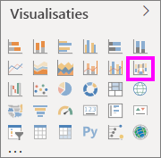
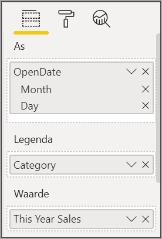
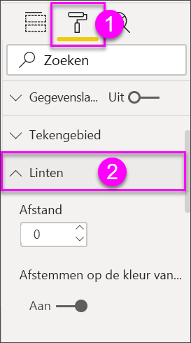
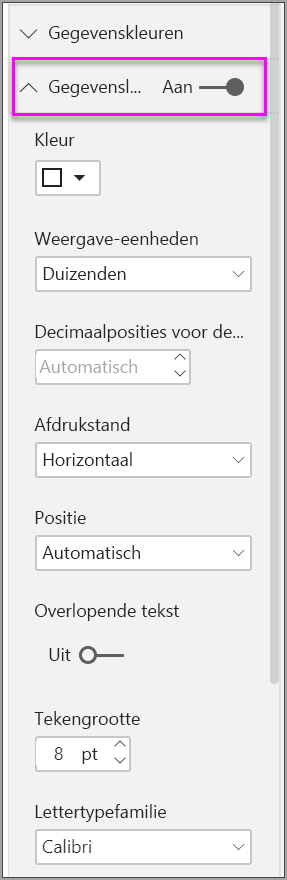

# Lintgrafieken maken in Power BI

[!INCLUDE[consumer-appliesto-nyyn](../includes/consumer-appliesto-nyyn.md)]    

[!INCLUDE [power-bi-visuals-desktop-banner](../includes/power-bi-visuals-desktop-banner.md)]

U kunt lintgrafieken maken om gegevens te visualiseren en snel te ontdekken welke gegevenscategorie de hoogste rang heeft (hoogste waarde). In lintgrafieken kunnen wijzigingen in de rang goed worden weergegeven, waarbij voor elke periode de hoogste rang (waarde) altijd bovenaan wordt weergegeven. 

> [!NOTE]
> Voor het delen van uw rapport met een Power BI-collega moet u beiden beschikken over een afzonderlijke Power BI Pro-licentie of moet het rapport zijn opgeslagen in Premium-capaciteit. Zie [Rapporten delen](../collaborate-share/service-share-reports.md) voor meer informatie.

## Vereisten

In deze zelfstudie wordt gebruikgemaakt van het [PBIX-bestand met het voorbeeld van een retailanalyse](https://download.microsoft.com/download/9/6/D/96DDC2FF-2568-491D-AAFA-AFDD6F763AE3/Retail%20Analysis%20Sample%20PBIX.pbix).

1. Selecteer linksboven in de menubalk **Bestand** > **Openen**
   
2. Ga naar uw kopie van het **PBIX-bestand met het voorbeeld van een retailanalyse**

1. Open het **PBIX-bestand met het voorbeeld van een retailanalyse** in de rapportweergave 

1. Selecteren  om een nieuwe pagina toe te voegen.

## Een lintgrafiek maken

1. Selecteer **Lintgrafiek** in het deelvenster **Visualisaties** als u een lintgrafiek wilt maken.

    

    Lintgrafieken verbinden met behulp van linten een gegevenscategorie met het gevisualiseerde tijdcontinuüm, zodat u kunt zien hoe de rang van een bepaalde categorie langs de X-as (meestal de tijd) verandert.

2. Selecteer velden voor **As**, **Legenda** en **Waarde**.  In dit voorbeeld zijn de volgende velden geselecteerd: **Microsoft Azure Store** > **OpenDate**, **Item** > **Categorie** en **Verkoop** > **Verkoop van dit jaar** > **Waarde**.  

    

    Omdat de gegevensset gegevens voor slechts één jaar bevat, hebben we het veld **Jaar** en het veld **Kwartaal** van de **As** verwijderd.

3. Het lintdiagram toont de positie van elke maand. U ziet hoe de positie in de tijd verandert. De categorie Start gaat bijvoorbeeld van tweede naar vijfde van februari naar maart.

    

## Een lintgrafiek opmaken
Als u een lintgrafiek maakt, hebt u de beschikking over opmaakopties in de sectie **Opmaken** van het deelvenster **Visualisaties**. De opmaakopties voor lintgrafieken zijn soortgelijk als die voor een gestapelde kolomdiagram. Voor linten zijn er daarnaast aanvullende opmaakopties beschikbaar.

Met deze opmaakopties voor lintgrafieken kunt u de volgende aanpassingen maken.

* **Afstand**: hiermee kunt u aanpassen hoeveel afstand u tussen de linten wilt hebben. Het getal is een percentage van de maximale kolomhoogte.
* **Afstemmen op de kleur van de reeks**: hiermee kunt u de kleur van de linten afstemmen op de kleur van de reeks. Indien dit is ingesteld op **uit**, zijn alle linten grijs.
* **Doorzichtigheid**: hiermee kunt u aangeven hoe doorzichtig de linten moeten zijn. De standaardwaarde is 30.
* **Rand**: hiermee kunt u een donkere rand boven en onder aan de linten plaatsen. Standaard zijn de randen afwezig.

Omdat het lintdiagram geen Y-as-labels bevat, kunt u eventueel gegevenslabels toevoegen. Selecteer in het deelvenster Opmaak de optie **Gegevenslabels**. 

opmaakopties instellen voor uw gegevenslabels. In dit voorbeeld hebben we de tekstkleur op wit en de weergave-eenheden op duizenden ingesteld.

## Volgende stappen

[Spreidingsdiagrammen en bellendiagrammen in Power BI](power-bi-visualization-scatter.md)

[Visualization types in Power BI](power-bi-visualization-types-for-reports-and-q-and-a.md) (Typen visualisaties in Power BI)
