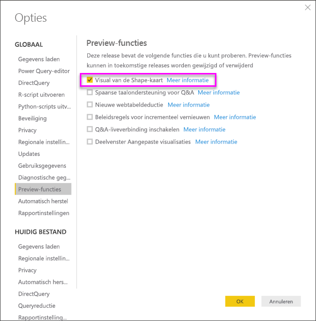
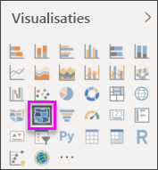
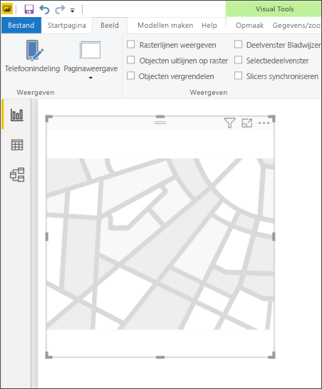
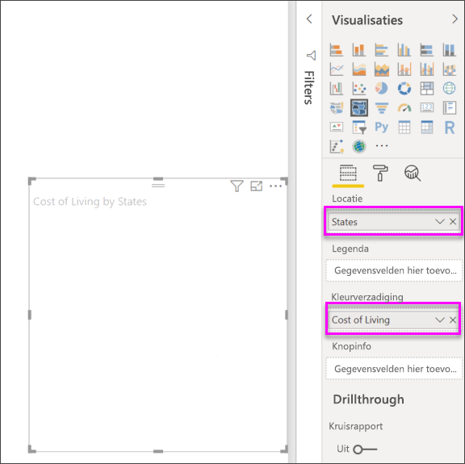
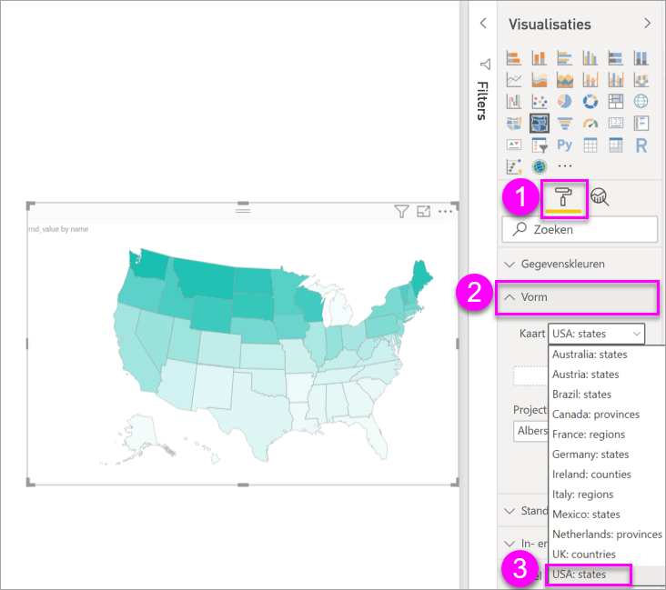
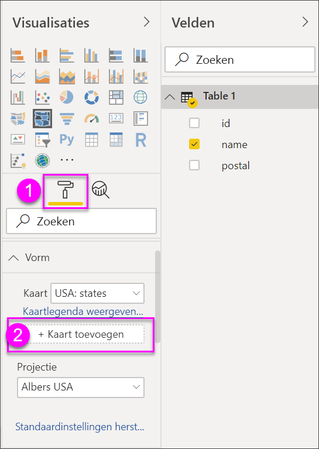
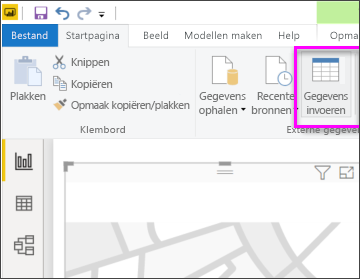
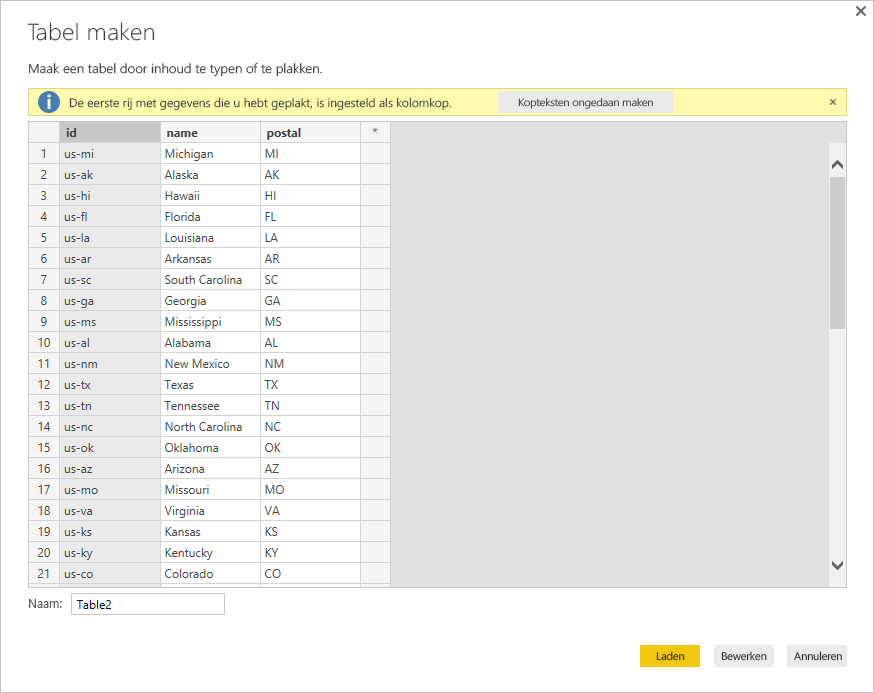

# Shape-kaartvisualisaties maken in Power BI Desktop (preview)

[!INCLUDE[consumer-appliesto-nyyn](../includes/consumer-appliesto-nyyn.md)]

[!INCLUDE [power-bi-visuals-desktop-banner](../includes/power-bi-visuals-desktop-banner.md)]

Maak een **Shape Map**-visual om regio's op een kaart te vergelijken met kleur. In tegenstelling tot de visual **Map** kan **Shape Map** geen nauwkeurige geografische locaties van gegevenspunten weergeven op een kaart. Het belangrijkste doel van Map is om relatieve vergelijkingen van regio's aan te geven op een kaart door verschillende kleuren te gebruiken.

Visuals van **Shape Map** zijn gebaseerd op TopoJSON-kaarten die de mogelijkheid bieden om gebruik te maken van aangepaste kaarten die u kunt maken. Voorbeelden van aangepaste kaarten zijn: geografische kaarten, overzichten van zitplaatsen, verdiepingsplattegronden, enzovoort. De mogelijkheid om aangepaste toewijzigen te gebruiken is niet beschikbaar in deze voorbeeldrelease van **Shape Map**.

> [!NOTE]
> Voor het delen van uw rapport met een Power BI-collega moeten u beiden beschikken over een afzonderlijke Power BI Pro-licentie of moet het rapport zijn opgeslagen in Premium-capaciteit.

## Shape-kaarten maken
U kunt het **Shape Map**-besturingselement testen met de kaarten die bij deze Preview-versie worden geleverd of u kunt uw eigen aangepaste kaart gebruiken, zolang deze voldoet aan de vereisten die worden beschreven in de volgende sectie, **Aangepaste kaarten gebruiken**.

De **Shape Map**-visual is in Preview en moet worden ingeschakeld in Power BI Desktop. U kunt **Shape-kaart** inschakelen door **Bestand > Opties en instellingen > Opties > Voorbeeldfuncties** te selecteren en het selectievakje **Visual van de Shape-kaart** in te schakelen. Power BI Desktop moet opnieuw worden opgestart nadat u de selectie hebt gemaakt.

Zodra **Shape-kaart** is ingeschakeld, selecteert u het pictogram **Shape-kaart** vanuit het deelvenster **Visualisaties**.

Power BI Desktop maakt een leeg ontwerpcanvas voor de **Shape Map**-visual.

Voer de volgende stappen uit om een **Shape Map** te maken:

1. Sleep in het deelvenster **Velden** een veld met de regionamen (of afkortingen) naar de bucket **Locatie** en een veld met meetgegevens naar de bucket **Kleurverzadiging** (er wordt nog geen kaart weergegeven).

   > [!NOTE]
   > Zie de sectie **Kaartgegevens ophalen** hieronder voor informatie over het snel ophalen van kaartgegevens om **Shape Map** te testen.
   > 
   > 

   
2. In het instellingenvenster **Indeling** vouwt u **Vorm** uit en maakt u een selectie in de vervolgkeuzelijst **Standaardkaarten** om uw gegevens weer te geven. Op dat punt wordt de kaart weergegeven, zoals is te zien in de volgende afbeelding.

   

   > [!NOTE]
   > In de sectie **Regiosleutels** aan het eind van dit artikel ziet u een verzameling tabellen met sleutels voor kaartregio's waarmee u de **Shape Map**-visual kunt testen.
   > 
   > 
3. U kunt vervolgens de kaart aanpassen met behulp van opmaakfuncties zoals **Standaardkleur**, **Zoomen** en meer. U kunt ook een kolom met categoriegegevens aan de **Legenda**-bucket toevoegen en de kaartregio's classificeren op basis van categorieën.

## Aangepaste kaarten gebruiken
U kunt aangepaste kaarten met **Shape Map** gebruiken zolang ze de **TopoJSON**-indeling hebben. Als de kaart een andere indeling heeft, kunt u onlineprogramma's zoals [**Map Shaper**](https://mapshaper.org/) gebruiken om uw *vormbestanden* of *GeoJSON*-kaarten te converteren naar de **TopoJSON**-indeling.

Als u uw **TopoJSON**-kaartbestand wilt gebruiken, voegt u een visual van de Shape-kaart toe aan uw rapport en enkele gegevens aan de buckets *Locatie* en *Kleurverzadiging*. In het deelvenster **Visualisaties**, met de sectie **Indeling** geselecteerd (weergegeven als (1) in de volgende afbeelding), vouwt u de sectie **Vorm** uit en selecteert u **+ Kaart toevoegen**.

## Voorbeeld van een aangepaste kaart
De *Offices of the United States Attorneys* publiceert jaarlijks een fiscaal verslag van hun gerechtelijke procedures en geschillen.  U kunt al deze rapporten vinden via de onderstaande koppeling,

https://www.justice.gov/usao/resources/annual-statistical-reports

Omdat staten in verschillende districten kunnen worden onderverdeeld, moeten we een aangepaste Shape-kaart gebruiken.  Door de **TopoJSON**-kaart van Amerikaanse juridische districten te importeren in **Power BI Desktop** kunnen we vervolgens de jaarlijkse fiscale gegevens voor officieren van justitie in beeld brengen.  In de onderstaande afbeelding ziet u een voorbeeld van deze kaart.

U kunt interessante dingen doen met de kaarten van de afzonderlijke staten en meer details weergeven op basis van de districten die onderdeel uitmaken van een staat. 

Als u wilt experimenteren met deze gegevensset en de weergave ervan, kunt u het oorspronkelijke PBIX-bestand dat is gebruikt voor het genereren van dit rapport met de volgende koppeling downloaden.

* [PBIX-bestand voor demo van aangepaste Shape-kaart. ](https://download.microsoft.com/download/1/2/8/128943FB-9231-42BD-8A5D-5E2362C9D589/DistrictAttorneyFiscalReport.pbix)

## Kaartgegevens ophalen
Om snel gegevens op te nemen in een model zodat u **Shape Map** kunt testen, kunt u een van de tabellen aan het eind van dit artikel kopiëren en **Gegevens invoeren** op het **Start**-lint selecteren.

Als uw gegevens meerdere kolommen hebben, moet u een editor zoals Excel gebruiken om de gegevens te plakken en vervolgens elke gegevenskolom afzonderlijk kopiëren. U kunt de tabel vervolgens in Power BI Desktop plakken. De bovenste rij wordt automatisch geïdentificeerd als koptekst.

U kunt een nieuwe kolom invoeren door een nieuwe kolomnaam te typen (in de lege kolom rechts) en waarden in elke cel toe te voegen, net zoals u dat in Excel zou doen. Wanneer u klaar bent, selecteert u **Laden** en wordt de tabel toegevoegd aan het gegevensmodel voor Power BI Desktop.

> [!NOTE]
> Als u werkt met landen of regio's, gebruikt u de afkorting van drie letters om ervoor te zorgen dat geocodering goed werkt in kaartvisualisaties. Gebruik *geen* afkortingen van twee letters, aangezien bepaalde landen of regio's mogelijk niet goed worden herkend.
> 
> Als u alleen afkortingen van twee letters hebt, bekijkt u [dit externe blogbericht](https://blog.ailon.org/how-to-display-2-letter-country-data-on-a-power-bi-map-85fc738497d6#.yudauacxp) voor stapsgewijze instructies om de tweeletterige afkortingen voor landen/regio's aan de drieletterige afkortingen voor landen/regio's te koppelen.
> 
> 

## Preview-gedrag en -vereisten
Er zijn enkele overwegingen en vereisten voor deze Preview-versie van **Shape Map**:

* De **Shape Map**-visual is in Preview en moet worden ingeschakeld in Power BI Desktop. U kunt **Shape-kaart** inschakelen door **Bestand > Opties en instellingen > Opties > Voorbeeldfuncties** te selecteren en het selectievakje **Visual van de Shape-kaart** in te schakelen.
* Ook de bucket **Waarden** moet nu zijn ingesteld, zodat de **Legenda**-classificatie goed werkt.
* De definitieve versie van **Shape-kaart** heeft een gebruikersinterface die de kaartsleutels van de geselecteerde kaart toont (we hebben nog geen datum voor de definitieve versie en **Shape-kaart** is nog steeds in Preview-versie). In deze Preview-versie kunt u verwijzen naar de kaart regiosleutels in de tabellen die zijn te vinden in de volgende **Regiosleutels**-sectie van dit artikel.
* De visual **Shape Map** brengt maximaal 1500 gegevenspunten aan in de tekening.

## Regiosleutels

Gebruik de volgende **regiosleutels** in deze Preview-versie om **Shape kaart** te testen.

### Australië: Staten

| Id | afk | iso | name | postcode |
| --- | --- | --- | --- | --- |
| au-wa |WA |AU-WA |West-Australië |WA |
| au-vic |Vic |AU-VIC |Victoria |VIC |
| au-tas |Tas |AU-TAS |Tasmanië |TAS |
| au-sa |SA |AU-SA |Zuid-Australië |SA |
| au-qld |Qld |AU-QLD |Queensland |QLD |
| au-nt |NT |AU-NT |Northern Territory |NT |
| au-nsw |NSW |AU-NSW |New South Wales |NSW |
| au-act |ACT |AU-ACT |Australian Capital Territory |ACT |

### Oostenrijk: Staten

| Id | iso | name | naam-nl | postcode |
| --- | --- | --- | --- | --- |
| at-wi |AT-9 |Wien |Wenen |WI |
| at-vo |AT-8 |Vorarlberg |Vorarlberg |VO |
| at-tr |AT-7 |Tirol |Tirol |TR |
| at-st |AT-6 |Steiermark |Stiermarken |ST |
| at-sz |AT-5 |Salzburg |Salzburg |SZ |
| at-oo |AT-4 |Oberösterreich |Opper-Oostenrijk |OO |
| at-no |AT-3 |Niederösterreich |Neder-Oostenrijk |NO |
| at-ka |AT-2 |Kärnten |Karinthië |KA |
| at-bu |AT-1 |Burgenland |Burgenland |BU |

### Brazilië: Staten

| Id |
| --- |
| Tocantins |
| Pernambuco |
| Goias |
| Sergipe |
| Sao Paulo |
| Santa Catarina |
| Roraima |
| Rondonia |
| Rio groot Sul |
| Rio groot Sul |
| Rio de Janeiro, Brazilië |
| Piaui |
| Parana |
| Parana |
| Para |
| Minas Gerais |
| Mato Grosso |
| Maranhao |
| Mato Grosso Sul |
| Distrito Federal |
| Ceara |
| Espirito Santo |
| Bahia |
| Amazonas |
| Amapa |
| Alagoas |
| Acre |
| Litigated Zone 1 |
| Litigated Zone 2 |
| Litigated Zone 3 |
| Litigated Zone 4 |

### Canada: Provincies

| Id | iso | name | postcode |
| --- | --- | --- | --- |
| ca-nu |CA-NU |Nunavut |NU |
| ca-nt |CA-NT |Northwest Territories |NT |
| ca-yt |CA-YT |Yukon |YT |
| ca-sk |CA-SK |Saskatchewan |SK |
| ca-qc |CA-QC |Quebec |QC |
| ca-pe |CA-PE |Prince Edward Island |PE |
| ca-on |CA-ON |Ontario |ON |
| ca-ns |CA-NS |Nova Scotia |NS |
| ca-nl |CA-NL |Newfoundland en Labrador |NL |
| ca-nb |CA-NB |New Brunswick |NB |
| ca-mb |CA-MB |Manitoba |MB |
| ca-bc |CA-BC |Brits-Columbia |BC |
| ca-ab |CA-AB |Alberta |AB |

### Frankrijk: Regio's

| Id | name | naam-nl |
| --- | --- | --- |
| Auvergne-Rhône-Alpes |  |  |
| Bourgogne-Franche-Comté |  |  |
| Bretagne |Bretagne |Bretagne |
| Centre-Val de Loire |Centre-Val de Loire |Centre-Val de Loire |
| Corse |Corse |Corsica |
| Grand Est |  |  |
| Guadeloupe | |   |
| Hauts-de-France |  |  |
| Île-de-France |Île-de-France |Île-de-France |
| La Réunion |  |  |
| Mayotte  |  |  |
| Normandië |Normandië |  |
| Nouvelle-Aquitaine |  |  |
| Occitanië  |  |  |
| Pays de la Loire |Pays de la Loire |Pays de la Loire |
| Provence-Alpes-Côte d'Azur |Provence-Alpes-Côte d'Azur |Provence-Alpes-Côte d'Azur |
|  |  |  |

### Duitsland: Staten

| Id | iso | name | naam-nl | postcode |
| --- | --- | --- | --- | --- |
| de-be |DE-BE |Berlin |Berlijn |BE |
| de-th |DE-TH |Thüringen |Thüringen |TH |
| de-st |DE-ST |Sachsen-Anhalt |Saksen-Anhalt |ST |
| de-sn |DE-SN |Sachsen |Saksen |SN |
| de-mv |DE-MV |Mecklenburg-Vorpommern |Mecklenburg-Vorpommern |MV |
| de-bb |DE-BB |Brandenburg |Brandenburg |BB |
| de-sh |DE-SH |Schleswig-Holstein |Sleeswijk-Holstein |SH |
| de-sl |DE-SL |Saarland |Saarland |SL |
| de-rp |DE-RP |Rheinland-Pfalz |Rijnland-Palts |RP |
| de-nw |DE-NW |Nordrhein-Westfalen |Noordrijn-Westfalen |NW |
| de-ni |DE-NI |Niedersachsen |Nedersaksen |NI |
| de-he |DE-HE |Hessen |Hessen |HE |
| de-hh |DE-HH |Hamburg |Hamburg |HH |
| de-hb |DE-HB |Bremen |Bremen |HB |
| de-by |DE-BY |Bayern |Beieren |BY |
| de-bw |DE-BW |Baden-Württemberg |Baden-Württemberg |BW |

### Ierland: Graafschappen

| Id |
| --- |
| Wicklow |
| Wexford |
| Westmeath |
| Waterford |
| Sligo |
| Tipperary |
| Roscommon |
| Offaly |
| Monaghan |
| Meath |
| Mayo |
| Louth |
| Longford |
| Limerick |
| Leitrim |
| Laoighis |
| Kilkenny |
| Kildare |
| Kerry |
| Galway |
| Dublin |
| Donegal |
| Kurk |
| Clare |
| Cavan |
| Carlow |

### Italië: Regio's

| Id | iso | name | naam-nl | postcode |
| --- | --- | --- | --- | --- |
| it-vn |IT-34 |Veneto |Veneto |VN |
| it-vd |IT-23 |Valle d'Aosta |Aostavallei |VD |
| it-um |IT-55 |Umbria |Umbrië |UM |
| it-tt |IT-32 |Trentino-Alto-Adige |Trentino-Zuid-Tirol |TT |
| it-tc |IT-52 |Toscana |Toscane |TC |
| it-sc |IT-82 |Sicilia |Sicilië |SC |
| it-sd |IT-88 |Sardegna |Sardinië |SD |
| it-pm |IT-21 |Piemonte |Piëmont |PM |
| it-ml |IT-67 |Molise |Molise |ML |
| it-mh |IT-57 |Marche |Marche |MH |
| it-lm |IT-25 |Lombardia |Lombardije |LM |
| it-lg |IT-42 |Liguria |Ligurië |LG |
| it-lz |IT-62 |Lazio |Lazio |LZ |
| it-fv |IT-36 |Friuli-Venezia Giulia |Friuli-Julisch Venetië |FV |
| it-er |IT-45 |Emilia-Romagna |Emilia-Romagna |ER |
| it-cm |IT-72 |Campania |Campanië |CM |
| it-lb |IT-78 |Calabria |Calabrië |LB |
| it-bc |IT-77 |Basilicata |Basilicata |BC |
| it-pu |IT-75 |Apulia |Apulië |PU |
| it-ab |IT-65 |Abruzzo |Abruzzen |AB |

### Mexico: Staten

| Id | abreviatura | iso | name | naam-nl | postcode |
| --- | --- | --- | --- | --- | --- |
| mx-zac |Zac. |MX-ZAC |Zacatecas |Zacatecas |ZA |
| mx-yuc |Yuc. |MX-YUC |Yucatán |Yucatan |YU |
| mx-ver |Ver. |MX-VER |Veracruz |Veracruz |VE |
| mx-tla |Tlax. |MX-TLA |Tlaxcala |Tlaxcala |TL |
| mx-tam |Tamps. |MX-TAM |Tamaulipas |Tamaulipas |TM |
| mx-tab |Tab. |MX-TAB |Tabasco |Tabasco |TB |
| mx-son |Son. |MX-SON |Sonora |Sonora |SO |
| mx-sin |Sin. |MX-SIN |Sinaloa |Sinaloa |SI |
| mx-slp |S.L.P. |MX-SLP |San Luis Potosí |San Luis Potosí |SL |
| mx-roo |Q.R. |MX-ROO |Quintana Roo |Quintana Roo |QR |
| mx-que |Qro. |MX-QUE |Querétaro |Querétaro |QE |
| mx-pue |Pue. |MX-PUE |Puebla |Puebla |PU |
| mx-oax |Oax. |MX-OAX |Oaxaca |Oaxaca |OA |
| mx-nle |N.L. |MX-NLE |Nuevo León |Nuevo León |NL |
| mx-nay |Nay. |MX-NAY |Nayarit |Nayarit |NA |
| mx-mor |Mor. |MX-MOR |Morelos |Morelos |MR |
| mx-mic |Mich. |MX-MIC |Michoacán |Michoacán |MC |
| mx-mex |Méx. |MX-MEX |Estado de México |Mexico |MX |
| mx-jal |Jal. |MX-JAL |Jalisco |Jalisco |JA |
| mx-hid |Hgo. |MX-HID |Hidalgo |Hidalgo |HI |
| mx-gro |Gro. |MX-GRO |Guerrero |Guerrero |GR |
| mx-gua |Gto. |MX-GUA |Guanajuato |Guanajuato |GT |
| mx-dur |Dgo. |MX-DUR |Durango |Durango |DU |
| mx-dif |CDMX. |MX-DIF |Ciudad de México |Mexico-Stad |DF |
| mx-col |Col. |MX-COL |Colima |Colima |CL |
| mx-coa |Coah. |MX-COA |Coahuila |Coahuila |CA |
| mx-chh |Chih. |MX-CHH |Chihuahua |Chihuahua |CH |
| mx-chp |Chis. |MX-CHP |Chiapas |Chiapas |CP |
| mx-cam |Camp. |MX-CAM |Campeche |Campeche |CM |
| mx-bcs |B.C.S. |MX-BCS |Baja California Sur |Baja California Sur |BS |
| mx-bcn |B.C. |MX-BCN |Baja California |Baja California |BN |
| mx-agu |Ags. |MX-AGU |Aguascalientes |Aguascalientes |AG |

### Nederland: Provincies

| Id | iso | name | naam-nl |
| --- | --- | --- | --- |
| nl-zh |NL-ZH |Zuid-Holland |South Holland |
| nl-ze |NL-ZE |Zeeland |Zeeland |
| nl-ut |NL-UT |Utrecht |Utrecht |
| nl-ov |NL-OV |Overijssel |Overijssel |
| nl-nh |NL-NH |Noord-Holland |North Holland |
| nl-nb |NL-NB |Noord-Brabant |North Brabant |
| nl-li |NL-LI |Limburg |Limburg |
| nl-gr |NL-GR |Groningen |Groningen |
| nl-ge |NL-GE |Gelderland |Gelderland |
| nl-fr |NL-FR |Fryslân |Friesland |
| nl-fl |NL-FL |Flevoland |Flevoland |
| nl-dr |NL-DR |Drenthe |Drenthe |

### VK: Landen

| Id | iso | name |
| --- | --- | --- |
| gb-wls |GB-WLS |Wales |
| gb-sct |GB-SCT |Schotland |
| gb-nir |GB-NIR |Noord-Ierland |
| gb-eng |GB-ENG |Engeland |

### VS: Staten

| Id | name | postcode |
| --- | --- | --- |
| us-mi |Michigan |MI |
| us-ak |Alaska |AK |
| us-hi |Hawaii |HI |
| us-fl |Florida |FL |
| us-la |Louisiana |LA |
| us-ar |Arkansas |AR |
| us-sc |South Carolina |SC |
| us-ga |Georgia |GA |
| us-ms |Mississippi |MS |
| us-al |Alabama |AL |
| us-nm |New Mexico |NM |
| us-tx |Texas |TX |
| us-tn |Tennessee |TN |
| us-nc |North Carolina |NC |
| us-ok |Oklahoma |OK |
| us-az |Arizona |AZ |
| us-mo |Missouri |MO |
| us-va |Virginia |VA |
| us-ks |Kansas |KS |
| us-ky |Kentucky |KY |
| us-co |Colorado |CO |
| us-md |Maryland |MD |
| us-wv |West Virginia |WV |
| us-de |Delaware |DE |
| us-dc |District of Columbia |DC |
| us-il |Illinois |IL |
| us-oh |Ohio |OH |
| us-ca |Californië |CA |
| ons-ut |Utah |UT |
| ons-nv |Nevada |NV |
| us-in |Indiana |IN |
| us-nj |New Jersey |NJ |
| us-ri |Rhode Island |RI |
| us-ct |Connecticut |CT |
| us-pa |Pennsylvania |PA |
| us-ny |New York |NY |
| us-ne |Nebraska |NE |
| us-ma |Massachusetts |MA |
| us-ia |Iowa |IA |
| us-nh |New Hampshire |NH |
| us-or |Oregon |OR |
| us-mn |Minnesota |MN |
| us-vt |Vermont |VT |
| us-id |Idaho |Id |
| us-wi |Wisconsin |WI |
| us-wy |Wyoming |WY |
| us-sd |South Dakota |SD |
| us-nd |Dakota |ND |
| us-me |Maine |ME |
| us-mt |Montana |MT |
| us-wa |Washington |WA |

## Volgende stappen

* [Matrixvisualisatie in Power BI](desktop-matrix-visual.md)

* [Visualization types in Power BI](power-bi-visualization-types-for-reports-and-q-and-a.md) (Typen visualisaties in Power BI)
