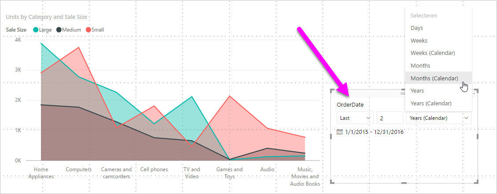
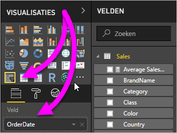
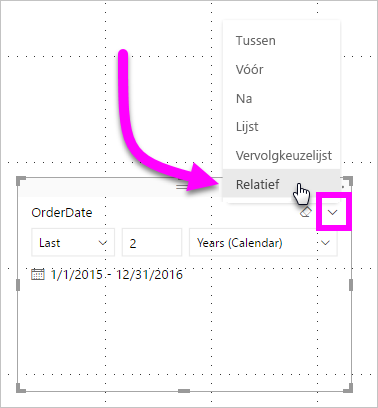
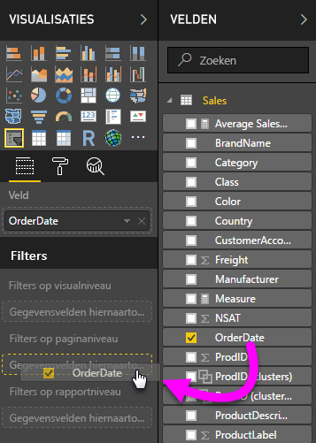
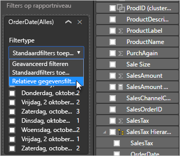
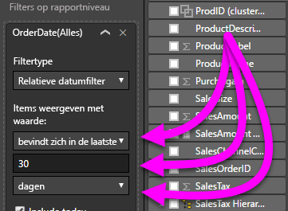

# Een relatieve datumslicer en -filter in Power BI gebruiken

[!INCLUDE [applies-to](../includes/applies-to.md)] [!INCLUDE [yes-desktop](../includes/yes-desktop.md)] [!INCLUDE [yes-service](../includes/yes-service.md)]

Met de **relatieve datumslicer** of het **relatieve datumfilter** kunt u tijdgebaseerde filters toepassen op een datumkolom in het gegevensmodel. U kunt bijvoorbeeld de **relatieve datumslicer** gebruiken om alleen gegevens weer te geven over verkopen die hebben plaatsgevonden in de afgelopen 30 dagen (of maand, kalendermaanden enzovoort). Als u de gegevens vernieuwt, wordt de juiste relatieve datumbeperking automatisch toegepast door de relatieve periode.

## De slicer voor het relatieve datumbereik gebruiken

U kunt de relatieve datumslicer net als elke andere slicer gebruiken. Maak een **slicer**-visual voor uw rapport en selecteer vervolgens een datumwaarde voor de waarde **Veld**. In de volgende afbeelding selecteerden we het veld *OrderDate*.

Selecteer de slicer op uw canvas en vervolgens het dakje in de rechterbovenhoek van de visual van de slicer. Als de visual de datumgegevens bevat, zal het menu de optie voor **Relatief** weergeven.

Selecteer *Relatief* voor de relatieve datumslicer.

Vervolgens kunt u de instellingen selecteren.

Voor de eerste instelling in de *relatieve datumslicer* hebt u de volgende opties:

* Laatste

* Volgende

* Deze

Voor de tweede (middelste) instelling in de *relatieve datumslicer* kunt u een getal invoeren om het relatieve datumbereik te definiëren.

Met de derde instelling kunt u de datummeting kiezen. U hebt de volgende opties:

* Dagen

* Weken

* Weken (kalender)

* Maanden

* Maanden (kalender)

* Jaren

* Jaren (kalender)

Als u **Maanden** in die lijst selecteert en voor de middelste instelling *2* invoert, gebeurt het volgende:

* als het vandaag 20 juli is

* zullen de gegevens die zijn opgenomen in de visuals die door de slicer zijn beperkt de gegevens weergeven voor de vorige twee maanden

* vanaf 21 mei tot 20 juli (de datum van vandaag)

Ter vergelijking: als u *Maanden (kalender)* hebt geselecteerd, geven de visuele elementen die worden beperkt gegevens weer van 1 mei tot en met 30 juni (de laatste twee volledige kalendermaanden).

## Het relatieve datumbereikfilter gebruiken

U kunt ook een relatief datumbereikfilter voor uw rapportpagina of het hele rapport maken. Sleep daarvoor een datumveld naar het gebied **Filters op paginaniveau** of **Filters op rapportniveau** in het deelvenster **Veld**:

U kunt daar het relatieve datumbereik wijzigen. Dit is vergelijkbaar met de manier waarop u de **relatieve datumslicer** kunt aanpassen. Selecteer **Relatieve datumfilter** in de vervolgkeuzelijst **Filtertype**.

Als u **Relatieve datumfilter** hebt geselecteerd, ziet u drie secties die u kunt wijzigen, inclusief een numeriek middelste vak, net als bij de slicer.

## Beperkingen en overwegingen

De volgende beperkingen en overwegingen zijn momenteel van toepassing op de **relatieve datumbereikslicer** en het relatieve datumbereikfilter.

* Gegevensmodellen in **Power BI** bevatten geen informatie over de tijdzone. De modellen kunnen tijden opslaan, maar er is geen indicatie van de tijdzone waarin ze zich bevinden.

* De slicer en het filter zijn altijd gebaseerd op de tijd in UTC. Als u een filter in een rapport instelt en het rapport naar een collega in een andere tijdzone stuurt, ziet u beide dezelfde gegevens. Tenzij u zich in de UTC-tijdzone bevindt, moeten u en uw collega rekening houden met de verschillen in tijd.

* U kunt gegevens die in een lokale tijdzone zijn vastgelegd, omzetten naar UTC met behulp van de **Query-editor**.

## Volgende stappen

Kom meer te weten over [Groeperen en binning in Power BI Desktop gebruiken](../desktop-grouping-and-binning.md).
