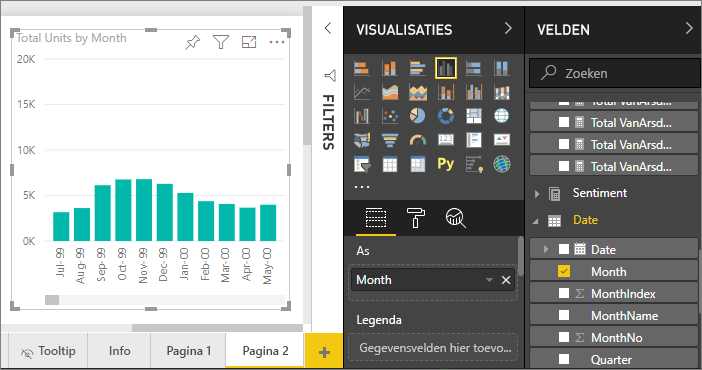
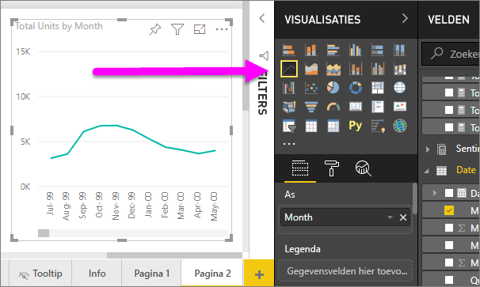
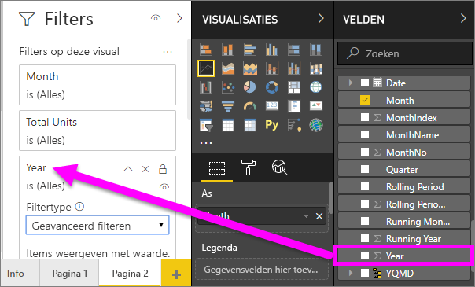
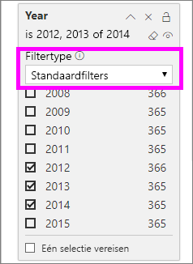
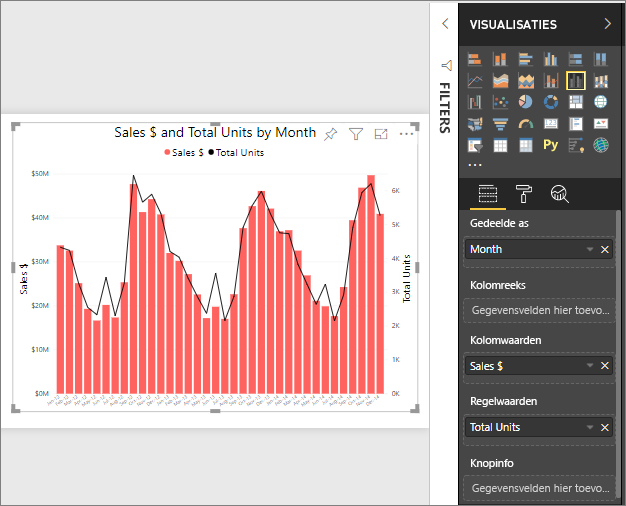
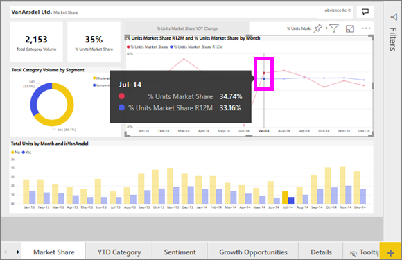

# Lijndiagrammen in Power BI

[!INCLUDE[consumer-appliesto-nyyn](../includes/consumer-appliesto-nyyn.md)]

Een lijndiagram is een reeks gegevenspunten die door punten weergegeven en door rechte lijnen verbonden worden. Een lijndiagram kan één of meerdere lijnen hebben. Lijndiagrammen hebben een X- en een Y-as. 

## Een lijndiagram maken
Deze instructies gebruiken de app 'Voorbeeld van verkoop en marketing' om een lijndiagram te maken dat de verkopen van dit jaar per categorie weergeeft. Als u mee wilt doen, kunt u de voorbeeld-app downloaden vanaf appsource.com.

> [!NOTE]
> Voor het delen van uw rapport met een Power BI-collega moeten u beiden beschikken over een afzonderlijke Power BI Pro-licentie of moet het rapport zijn opgeslagen in Premium-capaciteit.

1. Begin op een nieuwe, lege rapportpagina. Als u de Power BI-service gebruikt, moet u het rapport openen in de [Bewerkingsweergave](../service-interact-with-a-report-in-editing-view.md).

2. Selecteer in het deelvenster Velden de opties **Verkoopgegevens** \> **Totaal aantal eenheden**, en selecteer **Datum** > **Maand**.  Power BI maakt een kolomdiagram op uw rapportcanvas.

    

4. Converteer het kolomdiagram naar een lijndiagram door het lijndiagramsjabloon te selecteren uit het deelvenster Visualisaties. 

    
   

4. Filter uw lijndiagram om gegevens weer te geven voor de jaren 2012-2014. Als uw filterdeelvenster is samengevouwen, vouw het dan nu uit. Selecteer in het deelvenster Velden **Datum** \> **Jaar**, en sleep dit naar het deelvenster Filters. Zet het neer onder het kopje **Filters op dit visuele element**. 
     
    

    Wijzig **Geavanceerd filters** naar **Basisfilters** en selecteer **2012**, **2013** en **2014**.

    

6. U kunt desgewenst [de grootte en de kleur van de tekst van de grafiek aanpassen](power-bi-visualization-customize-title-background-and-legend.md). 

    

## Extra lijnen aan het diagram toevoegen
Lijndiagrammen kunnen veel verschillende lijnen bevatten. En in sommige gevallen zijn de waarden op de lijnen zo uiteenlopend dat ze samen niet overzichtelijk kunnen worden weergegeven. Laten we eens kijken naar het toevoegen van extra lijnen aan ons huidige diagram. We kunnen leren hoe we ons diagram moeten opmaken wanneer de waarden in de lijnen zeer verschillend zijn. 

### Extra lijnen toevoegen
Het totaalaantal eenheden voor alle regio’s staat nu in één enkele lijn in het de diagram, maar in plaats daarvan kunnen we dit totaalaantal ook per regio uitsplitsen. Voeg extra lijnen toe door **Geo** > **Regio** ook naar de legenda te slepen.

   

### Twee Y-assen gebruiken
Wat als u de totale verkoop en het totaalaantal eenheden in één diagram wilt bekijken? De verkoopcijfers zijn veel hoger dan de eenheidsnummers, waardoor het lijndiagram eigenlijk onbruikbaar wordt. De rode lijn voor het totaalaantal eenheden lijkt de hele tijd rond nul te liggen.

   

Om sterk uiteenlopende waarden in één diagram weer te geven, gebruikt u een combinatiegrafiek. Meer informatie over combinatiegrafieken vindt u in [Combinatiegrafieken in Power BI](power-bi-visualization-combo-chart.md). In het onderstaande voorbeeld kunnen we de verkoop en het totaalaantal eenheden samen in één diagram weergeven door een tweede Y-as toe te voegen. 

   

## Markeren en kruislings filteren
Zie [Een filter aan een rapport toevoegen](../power-bi-report-add-filter.md) voor meer informatie over het gebruik van het deelvenster Filters.

Selectie van een gegevenspunt in een lijndiagram leidt tot een kruislingse markering en filtering van de andere visualisaties op de rapportpagina, en vice versa. Als u mee wilt doen, opent u het tabblad **Marktaandeel**.  

Op een lijndiagram is elk afzonderlijk gegevenspunt het snijpunt van een punt op de X-as en de Y-as. Wanneer u een gegevenspunt selecteert, voegt Power BI markeringen toe die aangeven welk punt (voor een enkele lijn) of welke punten (als er twee of meer lijnen zijn) de bron zijn voor het kruislings markeren en filteren van de andere visuele elementen op de rapportagepagina. Als uw visuele element zeer compact en vol is, zal Power BI het dichtstbijzijnde punt selecteren waar u op het visuele element klikt.

In dit voorbeeld hebben we een gegevenspunt geselecteerd dat het volgende omvat: juli 2014, %eenheden marktaandeel R12 van 33,16 en %eenheden marktaandeel van 34,74.

Merk op hoe het kolomdiagram kruislings wordt gemarkeerd en hoe de meter kruislings wordt gefilterd.

Zie [Visualisatie-interacties in een Power BI-rapport](../service-reports-visual-interactions.md) als u wilt beheren hoe grafieken elkaar kruislings markeren en filteren.

## Aandachtspunten en probleemoplossing
* Eén lijndiagram kan geen dubbele Y-as hebben.  In plaats daarvan moet u een combinatiegrafiek gebruiken.
* In de bovenstaande voorbeelden zijn de diagrammen als volgt opgemaakt: grotere tekengrootte, andere tekstkleur, astitels toegevoegd, diagramtitel en -legenda gecentreerd, beide assen op nul beginnen, en nog meer. Het deelvenster Opmaak (pictogram met verfroller) bevat een vrijwel eindeloze reeks opties om uw diagrammen eruit te laten zien zoals u dat wilt. De beste manier om hiermee te leren omgaan, is het deelvenster Opmaak openen en dit verder te verkennen.

## Volgende stappen

[Visualization types in Power BI](power-bi-visualization-types-for-reports-and-q-and-a.md) (Typen visualisaties in Power BI)

