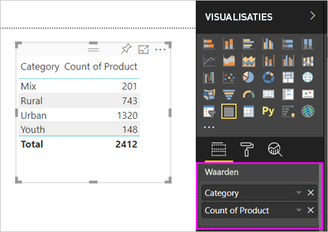
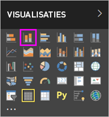
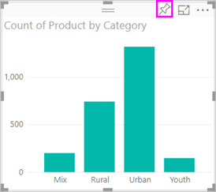

# Deel 1: Visualisaties toevoegen aan een Power BI-rapport

Dit artikel bevat een korte inleiding over het maken van een visualisatie in een rapport. Deze pagina is van toepassing op zowel de Power BI-service als Power BI Desktop. [Zie deel 2](power-bi-report-add-visualizations-ii.md) van deze serie voor meer geavanceerde inhoud. Kijk mee met Amanda, die een aantal verschillende manieren om visuele elementen in het rapportcanvas te maken, bewerken en op te maken laat zien. Probeer deze vervolgens zelf met behulp van het [Voorbeeld van verkoop en marketing](../sample-datasets.md) om uw eigen rapport te maken.

<iframe width="560" height="315" src="https://www.youtube.com/embed/IkJda4O7oGs" frameborder="0" allowfullscreen></iframe>

## Een rapport openen en een nieuwe pagina toevoegen

1. Open een [rapport in de Bewerkweergave](../service-interact-with-a-report-in-editing-view.md).

    In deze zelfstudie wordt het [Voorbeeld van verkoop en marketing](../sample-datasets.md) gebruikt.

1. Als het deelvenster **Velden** niet zichtbaar is, selecteert u het pijlpictogram om het te openen.

   

1. Voeg een lege pagina toe aan het rapport.

## Visualisaties toevoegen aan het rapport

1. Maak een visualisatie door een veld te selecteren in het deelvenster **Velden**.

    Begin met een numeriek veld zoals **SalesFact** > **Sales $** . Power BI maakt een kolomdiagram met één kolom.

    

    Of begin met een categorieveld, zoals **Name** of **Product**. Power BI maakt een tabel en voegt dat veld toe aan het vak **Waarden**.

    

    Of begin met een geografisch veld, zoals **Geo** > **City**. Power BI en Bing Maps maken dan een kaartvisualisatie.

    

1. Maak een visualisatie en wijzig vervolgens het type. Selecteer **Product** > **Category** en vervolgens **Product** > **Count of Product** om beide toe te voegen aan het vak **Waarden**.

   

1. Wijzig de visualisatie in een kolomdiagram door het pictogram **Gestapeld kolomdiagram** te selecteren.

   

1. Als u visualisaties in uw rapport maakt, kunt u ze [vastmaken aan uw dashboard](../service-dashboard-pin-tile-from-report.md). Als u de visualisatie wilt vastmaken, selecteert u het speldpictogram .

   
  
## Volgende stappen

 Ga verder naar:

* [Deel 2: Visuals toevoegen aan een Power BI-rapport](power-bi-report-add-visualizations-ii.md)

* [Communiceren met de visualisaties](../consumer/end-user-reading-view.md) in het rapport.

* [Nog meer doen met visualisaties](power-bi-report-visualizations.md).

* [Uw rapport opslaan](../service-report-save.md).
