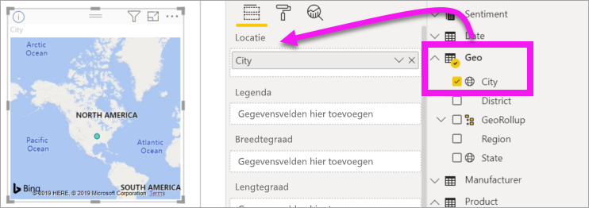

# Deel 1: Visualisaties toevoegen aan een Power BI-rapport

[!INCLUDE [power-bi-visuals-desktop-banner](../includes/power-bi-visuals-desktop-banner.md)]

Dit artikel bevat een korte inleiding over het maken van een visualisatie in een rapport. Deze pagina is van toepassing op zowel de Power BI-service als Power BI Desktop. [Zie deel 2](power-bi-report-add-visualizations-ii.md) van deze serie voor meer geavanceerde inhoud. Kijk mee met Amanda, die een aantal verschillende manieren om visuele elementen in het rapportcanvas te maken, bewerken en op te maken laat zien. Probeer deze vervolgens zelf met behulp van het [Voorbeeld van verkoop en marketing](../sample-datasets.md) om uw eigen rapport te maken.

<iframe width="560" height="315" src="https://www.youtube.com/embed/IkJda4O7oGs" frameborder="0" allowfullscreen></iframe>

## Vereisten

In deze zelfstudie wordt het [PBIX-bestand met een voorbeeld van verkoop en marketing](https://download.microsoft.com/download/9/7/6/9767913A-29DB-40CF-8944-9AC2BC940C53/Sales%20and%20Marketing%20Sample%20PBIX.pbix) gebruikt.

1. Selecteer linksboven in de Power BI Desktop-menubalk **Bestand** > **Openen**
   
2. Zoek uw kopie van het **PBIX-bestand met een voorbeeld van verkoop en marketing**

1. Open het **PBIX-bestand met het voorbeeld van verkoop en marketing** in de rapportweergave 

1. Selecteren  om een nieuwe pagina toe te voegen.

## Visualisaties toevoegen aan het rapport

1. Maak een visualisatie door een veld te selecteren in het deelvenster **Velden**.

    Begin met een numeriek veld zoals **Sales** > **TotalSales**. Power BI maakt een kolomdiagram met één kolom.

    

    Of begin met een categorieveld, zoals **Name** of **Product**. Power BI maakt een tabel en voegt dat veld toe aan het vak **Waarden**.

    

    Of begin met een geografisch veld, zoals **Geo** > **City**. Power BI en Bing Maps maken dan een kaartvisualisatie.

    

## Het gebruikte type visualisatie wijzigen

 Maak een visualisatie en wijzig vervolgens het type. 
 
 1. Selecteer **Product** > **Category** en vervolgens **Product** > **Count of Product** om beide toe te voegen aan het vak **Waarden**.

    

1. Wijzig de visualisatie in een kolomdiagram door het pictogram **Gestapeld kolomdiagram** te selecteren.

   

1. Selecteer **Meer acties** (...) om de manier te wijzigen waarop de visual is gesorteerd.  Gebruik de sorteeropties om de sorteervolgorde (oplopend of aflopend) en de kolom die wordt gebruikt om te sorteren (**Sorteren op**) te wijzigen.

   
  
## Volgende stappen

 Ga verder naar:

* [Deel 2: Visuals toevoegen aan een Power BI-rapport](power-bi-report-add-visualizations-ii.md)

* [Communiceren met de visualisaties](../consumer/end-user-reading-view.md) in het rapport.

