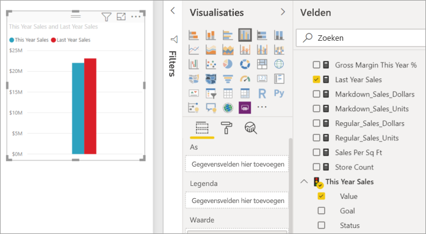
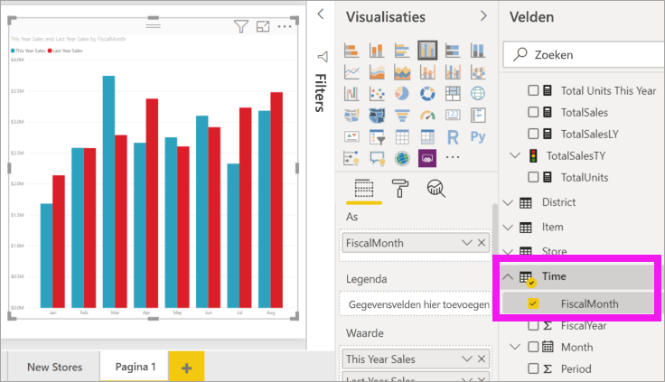
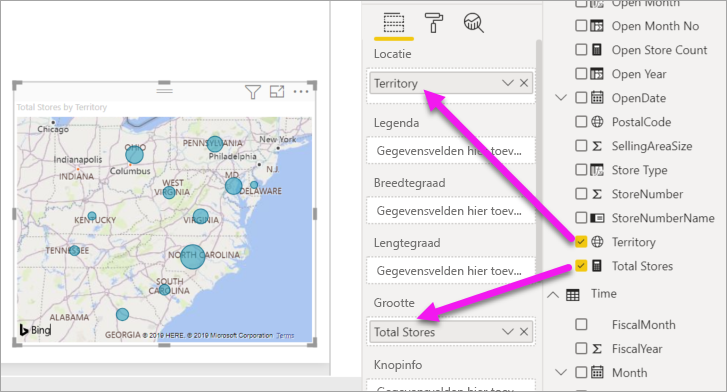
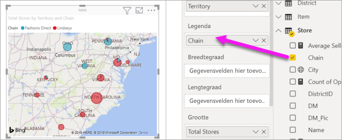

# Visualisaties toevoegen aan een Power BI-rapport (deel 2)

[!INCLUDE[consumer-appliesto-nyyn](../includes/consumer-appliesto-nyyn.md)]    

[!INCLUDE [power-bi-visuals-desktop-banner](../includes/power-bi-visuals-desktop-banner.md)]

In [Deel 1](power-bi-report-add-visualizations-i.md) hebt u een eenvoudige visualisatie gemaakt door selectievakjes naast de veldnamen te selecteren.  In deel 2 leert u hoe u slepen-en-neerzetten kunt gebruiken, en hoe u gebruik kunt maken van de volledige functionaliteit van de deelvensters **Velden** en **Visualisaties** om visualisaties te maken en te wijzigen.

## Een nieuwe visualisatie maken
In deze zelfstudie verdiepen we ons in de gegevensset voor retailanalyse en maken we een aantal belangrijke visualisaties.

## Vereisten

In deze zelfstudie wordt gebruikgemaakt van het [PBIX-bestand met het voorbeeld van een retailanalyse](https://download.microsoft.com/download/9/6/D/96DDC2FF-2568-491D-AAFA-AFDD6F763AE3/Retail%20Analysis%20Sample%20PBIX.pbix).

1. Selecteer linksboven in de Power BI Desktop-menubalk **Bestand** > **Openen**
   
2. Ga naar uw kopie van het **PBIX-bestand met het voorbeeld van een retailanalyse**

1. Open het **PBIX-bestand met het voorbeeld van een retailanalyse** in de rapportweergave 

1. Selecteren  om een nieuwe pagina toe te voegen.

## Visualisaties toevoegen aan het rapport

Maak een visualisatie door een veld te selecteren in het deelvenster **Velden**. Het type visualisatie dat wordt gemaakt, is afhankelijk van het geselecteerde type veld. Power BI gebruikt het gegevenstype om te bepalen welke visualisatie moet worden gebruikt om de resultaten weer te geven. We kunnen de gebruikte visualisatie wijzigen door een ander pictogram te selecteren in het deelvenster Visualisaties. Denk eraan dat niet alle visualisaties uw gegevens kunnen weergeven. Geografische gegevens worden bijvoorbeeld niet goed weergegeven met een trechterdiagram of lijndiagram. 

### Een vlakdiagram toevoegen dat een beeld geeft van de jaaromzet ten opzichte van vorig jaar

1. Selecteer in de tabel **Sales** (Omzet): **This Year Sales** (Omzet dit jaar)  > **Value** (Waarde) en **Last Year Sales** (Omzet vorig jaar). In Power BI wordt een kolomdiagram gemaakt.  Dit diagram is interessant en u wilt graag meer details weten. Hoe ziet de omzet eruit per maand?  
   
   

2. Sleep **FiscalMonth** uit de tijdstabel naar het **Axis**-gebied.  
   

3. [Wijzig de visualisatie](power-bi-report-change-visualization-type.md) in een vlakdiagram.  Er zijn veel visualisatietypen waaruit u kunt kiezen. Bekijk [de beschrijvingen van de typen, tips voor aanbevolen procedures en zelfstudies](power-bi-visualization-types-for-reports-and-q-and-a.md) voor hulp bij het bepalen welk type u het beste kunt gebruiken. Selecteer in het deelvenster Visualisaties het pictogram Vlakdiagram .

4. Sorteer de visualisatie door **Meer acties** (...) te selecteren en **Sorteren op** >  **FiscalMonth** te kiezen.

5. [Wijzig het formaat van de visualisatie](power-bi-visualization-move-and-resize.md) door de visualisatie te selecteren, en een van de cirkelomtrekken te pakken en te slepen. Maak deze groot genoeg om de schuifbalk te laten verdwijnen en klein genoeg zodat er voldoende ruimte is om nog een visualisatie toe te voegen.
   
   
6. [Sla het rapport op](../create-reports/service-report-save.md).

### Een kaartvisualisatie toevoegen die de omzet per locatie weergeeft

1. Selecteer **Territory** (Territorium) in de tabel **Store** (Winkel). Sleep **Total Stores** (Total aantal winkels) naar het gebied Size (Grootte). In Power BI wordt herkend dat Territory (Territorium) een locatie is en wordt een kaartvisualisatie gemaakt.  
   

2. Voeg een legenda toe.  Sleep **Store** > **Chain** naar het gebied Legenda om de gegevens te bekijken per winkelnaam.  
   

> [!NOTE]
> Voor het delen van uw rapport met een Power BI-collega moet u beiden beschikken over een afzonderlijke Power BI Pro-licentie of moet het rapport zijn opgeslagen in Premium-capaciteit. Zie [Rapporten delen](../collaborate-share/service-share-reports.md) voor meer informatie.

## Volgende stappen
* Meer informatie over [Visualisaties in Power BI-rapporten](power-bi-report-visualizations.md).  
* Hebt u nog vragen? [Misschien dat de Power BI-community het antwoord weet](https://community.powerbi.com/)

