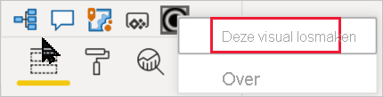

# Visualisaties in Power BI-rapporten

[!INCLUDE[consumer-appliesto-yyyn](../includes/consumer-appliesto-yyyn.md)]    

Visualisaties (kortweg visuals genoemd) geven inzichten weer die zijn gedetecteerd in de gegevens. Een Power BI-rapport beschikt mogelijk over één pagina met één visual of over pagina’s vol met visuals. In de Power BI-service kunnen visuals [vanuit rapporten aan dashboards worden vastgemaakt](../create-reports/service-dashboard-pin-tile-from-report.md).

Het is belangrijk om onderscheid te maken tussen rapport*ontwerpers* en rapport*verbruikers*.  Als u een persoon bent die het rapport maakt of wijzigt, bent u een ontwerper.  Ontwerpers hebben bewerkmachtigingen voor het rapport en de onderliggende gegevensset. In Power BI Desktop betekent dit dat u de gegevensset kunt openen in de gegevensweergave en visuals in de rapportweergave kunt maken. In de Power BI-service betekent dit dat u de gegevensset of het rapport kunt openen in de [bewerkweergave](../consumer/end-user-reading-view.md) in de rapporteditor. Wanneer een rapport of dashboard met u [gedeeld is ](../consumer/end-user-shared-with-me.md), bent u een *rapportgebruiker*. U kunt het rapport en de visuals weergeven en ermee communiceren, maar u kunt geen wijzigingen doorvoeren zoals een *ontwerper* dat kan.

Er zijn veel verschillende typen visuals rechtstreeks beschikbaar vanuit het deelvenster Visualisaties in Power BI.

Er zijn meer Power BI-visuals beschikbaar via de site van de [Microsoft AppSource-community](https://appsource.microsoft.com). In AppSource kunt u [Power BI-visuals](../developer/visuals/custom-visual-develop-tutorial.md) bekijken en [downloaden](https://appsource.microsoft.com/marketplace/apps?page=1&product=power-bi-visuals) die zijn gemaakt door Microsoft en de community.

Als u geen ervaring hebt met Power BI, of een opfriscursus nodig hebt, volgt u de onderstaande koppelingen voor meer informatie over de basisprincipes van Power BI-visualisaties.  U kunt ook de inhoudsopgave (aan de linkerkant van dit artikel) gebruiken om nog meer nuttige informatie te vinden.

## Een visualisatie toevoegen in Power BI

U [maakt visualisaties](power-bi-report-add-visualizations-i.md) op de pagina's van uw rapporten. Blader door de [lijst met beschikbare visualisaties en de beschikbare zelfstudies voor visualisaties.](power-bi-visualization-types-for-reports-and-q-and-a.md) 

## Een visualisatie uploaden vanuit een bestand of vanuit AppSource

U kunt zelfgemaakte visualisaties toevoegen of visualisaties die u hebt gevonden op de [communitysite van Microsoft AppSource](https://appsource.microsoft.com/marketplace/apps?product=power-bi-visuals). Bent u in een creatieve bui? Bestudeer onze broncode en gebruik onze [hulpprogramma's voor ontwikkelaars](../developer/visuals/custom-visual-develop-tutorial.md) om een nieuw type visualisatie te maken en dit vervolgens te [delen met de community](../developer/visuals/office-store.md). Raadpleeg [Een Power BI-visual ontwikkelen](../developer/visuals/custom-visual-develop-tutorial.md) voor meer informatie over het ontwikkelen van een Power BI-visual.

## Uw visualisatiedeelvenster personaliseren

U kunt het deelvenster Visualisaties aanpassen door Power BI-visuals toe te voegen of te verwijderen. Als u standaardvisualisaties uit het deelvenster Visualisaties hebt verwijderd, kunt u het deelvenster terugzetten naar de standaardwaarden en alle standaardvisualisaties herstellen.

### Een visual toevoegen aan het deelvenster Visualisaties

Als u merkt dat u in verschillende rapporten dezelfde visual gebruikt, kunt u deze visual toevoegen aan het deelvenster Visualisaties. U kunt visuals van AppSource toevoegen, visuals van de organisatie en visuals uit bestanden. Als u een visual wilt toevoegen, klikt u met de rechtermuisknop op de visual.

Nadat een visual is vastgemaakt, wordt deze omhoog geplaatst en bij de andere ingebouwde visuals weergegeven. Deze visual is nu gekoppeld aan uw aangemelde account, waardoor de visual automatisch wordt opgenomen in alle nieuwe rapporten die u samenstelt, mits u bent aangemeld. U hoeft een specifieke visual die u regelmatig gebruikt niet meer aan elk afzonderlijk rapport toe te voegen.

### Een visual verwijderen uit het deelvenster Visualisaties

Als u een visual niet meer regelmatig gebruikt, kun u deze verwijderen uit het deelvenster Visualisaties door er met de rechtermuisknop op te klikken en Verwijderen te kiezen. U kunt elk type visual verwijderen uit het deelvenster Visualisaties, met inbegrip van standaard-, bestands-, organisatie-en AppSource-visuals.

### Het deelvenster Visualisaties herstellen

Het herstellen van het deelvenster Visualisaties geldt alleen voor standaardvisuals. Visuals die zijn toegevoegd aan het deelvenster Visualisaties blijven beschikbaar vanuit het deelvenster. Aks u visuals van AppSource of uit een bestand wilt verwijderen uit het deelvenster Visualisaties, moet u dat handmatig doen.

Als u de standaardinstellingen van het deelvenster Visualisaties wilt herstellen, klikt u op Meer opties en selecteert u **Standaardvisuals herstellen**.

## Het type visualisatie wijzigen

Probeer [het type visualisatie te wijzigen](power-bi-report-change-visualization-type.md) om te kijken of dat misschien beter geschikt is voor uw gegevens.

## Visualisatie vastmaken

Als de visualisatie helemaal aan uw wensen voldoet, kunt u deze in Power BI-service als een tegel [aan een dashboard vastmaken](../create-reports/service-dashboard-pin-tile-from-report.md). Als u de visualisatie die in het rapport wordt gebruikt, wijzigt nadat u deze hebt vastgemaakt, blijft de tegel in het dashboard ongewijzigd. Als het een lijndiagram was, blijft het een lijndiagram, zelfs als u het in het rapport hebt gewijzigd in een ringdiagram.

## Beperkingen en overwegingen
- Een visual kan, afhankelijk van de gegevensbron en het aantal velden (metingen of kolommen), mogelijk langzaam geladen.  We adviseren visuals te beperken tot maximaal 10-20 velden vanwege de leesbaarheid en prestaties. 

- De bovengrens voor visuals is 100 velden (metingen of kolommen). Verminder het aantal veld als uw visual niet kan worden geladen.

## Volgende stappen

* [Visualization types in Power BI](power-bi-visualization-types-for-reports-and-q-and-a.md) (Typen visualisaties in Power BI)
* [Power BI-visuals](../developer/visuals/power-bi-custom-visuals.md)
