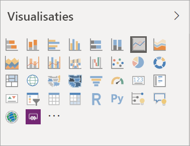
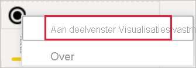
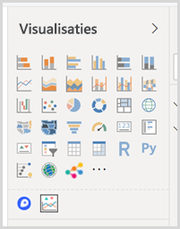

# Visualisaties in Power BI-rapporten

Visualisaties (kortweg visuals genoemd) geven inzichten weer die zijn gedetecteerd in de gegevens. Een Power BI-rapport beschikt mogelijk over één pagina met één visual of over pagina’s vol met visuals. In de Power BI-service kunnen visuals [vanuit rapporten aan dashboards worden vastgemaakt](../service-dashboard-pin-tile-from-report.md).

Het is belangrijk om onderscheid te maken tussen rapport*ontwerpers* en rapport*verbruikers*.  Als u een persoon bent die het rapport maakt of wijzigt, bent u een ontwerper.  Ontwerpers hebben bewerkmachtigingen voor het rapport en de onderliggende gegevensset. In Power BI Desktop betekent dit dat u de gegevensset kunt openen in de gegevensweergave en visuals in de rapportweergave kunt maken. In de Power BI-service betekent dit dat u de gegevensset of het rapport kunt openen in de [bewerkweergave](../consumer/end-user-reading-view.md) in de rapporteditor. Wanneer een rapport of dashboard met u [gedeeld is ](../consumer/end-user-shared-with-me.md), bent u een *rapportgebruiker*. U kunt het rapport en de visuals weergeven en ermee communiceren, maar u kunt geen wijzigingen doorvoeren zoals een *ontwerper* dat kan.

Er zijn veel verschillende typen visuals rechtstreeks beschikbaar vanuit het deelvenster Visualisaties in Power BI.

Ga voor nog meer opties naar de [communitysite van Microsoft AppSource](https://appsource.microsoft.com) waar u [aangepaste visuals](../developer/visuals/custom-visual-develop-tutorial.md) van Microsoft en de community kunt vinden en [downloaden](https://appsource.microsoft.com/marketplace/apps?page=1&product=power-bi-visuals).

<iframe width="560" height="315" src="https://www.youtube.com/embed/SYk_gWrtKvM?list=PL1N57mwBHtN0JFoKSR0n-tBkUJHeMP2cP" frameborder="0" allowfullscreen></iframe>

Als u geen ervaring hebt met Power BI, of een opfriscursus nodig hebt, volgt u de onderstaande koppelingen voor meer informatie over de basisprincipes van Power BI-visualisaties.  U kunt ook de inhoudsopgave (aan de linkerkant van dit artikel) gebruiken om nog meer nuttige informatie te vinden.

## Een visualisatie toevoegen in Power BI

U [maakt visualisaties](power-bi-report-add-visualizations-i.md) op de pagina's van uw rapporten. Blader door de [lijst met beschikbare visualisaties en de beschikbare zelfstudies voor visualisaties.](power-bi-visualization-types-for-reports-and-q-and-a.md) 

## Een aangepaste visualisatie uploaden en deze gebruiken in Power BI

U kunt zelfgemaakte, aangepaste visualisaties toevoegen of visualisaties die u hebt gevonden op de [communitysite van Microsoft AppSource](https://appsource.microsoft.com/marketplace/apps?product=power-bi-visuals). Bent u in een creatieve bui? Bestudeer onze broncode en gebruik onze [hulpprogramma's voor ontwikkelaars](../developer/visuals/custom-visual-develop-tutorial.md) om een nieuw type visualisatie te maken en dit vervolgens te [delen met de community](../developer/office-store.md). Raadpleeg [Een aangepaste Power BI-visual ontwikkelen](../developer/visuals/custom-visual-develop-tutorial.md) voor meer informatie over een aangepaste visual ontwikkelen.

## Uw visualisatiedeelvenster personaliseren (voorbeeld)

Als u ondervindt dat u veel dezelfde aangepaste visuals in veel verschillende rapporten gebruikt, kunt u deze aangepaste visualisatie vastmaken aan uw visualisatiedeelvenster. Klik met de rechtermuisknop op de visual om deze aan het deelvenster vast te maken.

Nadat een visual is vastgemaakt, wordt deze omhoog geplaatst en toegevoegd aan de andere ingebouwde visuals. Deze visual is nu gekoppeld aan uw aangemelde account, waardoor de visual automatisch wordt opgenomen in alle nieuwe rapporten die u samenstelt, mits u bent aangemeld. Hierdoor kunt u heel eenvoudig een specifieke visual standaardiseren zonder deze aan elk rapport te hoeven toevoegen.

Deze functie is nog beschikbaar als preview. Daarom ziet u alleen uw vastgemaakte visuals in Power BI Desktop. Ook moet u zijn aangemeld om deze functie te kunnen gebruiken.

## Het type visualisatie wijzigen

Probeer [het type visualisatie te wijzigen](power-bi-report-change-visualization-type.md) om te kijken of dat misschien beter geschikt is voor uw gegevens.

## Visualisatie vastmaken

Als de visualisatie helemaal aan uw wensen voldoet, kunt u deze in Power BI-service als een tegel [aan een dashboard vastmaken](../service-dashboard-pin-tile-from-report.md). Als u de visualisatie die wordt gebruikt in het rapport wijzigt nadat u deze hebt vastgemaakt, verandert de tegel op het dashboard niet; als het een lijndiagram was, blijft het een lijndiagram, zelfs wanneer u het hebt gewijzigd in een ringdiagram in het rapport.

## Beperkingen en overwegingen
- Een visual kan, afhankelijk van de gegevensbron en het aantal velden (metingen of kolommen), mogelijk langzaam geladen.  We adviseren visuals te beperken tot maximaal 10-20 velden vanwege de leesbaarheid en prestaties. 

- De bovengrens voor visuals is 100 velden (metingen of kolommen). Verminder het aantal veld als uw visual niet kan worden geladen.   

## Volgende stappen

* [Visualization types in Power BI](power-bi-visualization-types-for-reports-and-q-and-a.md) (Typen visualisaties in Power BI)
* [Aangepaste visuals](../power-bi-custom-visuals.md)
