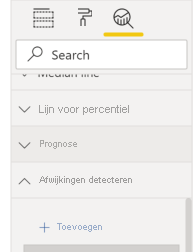
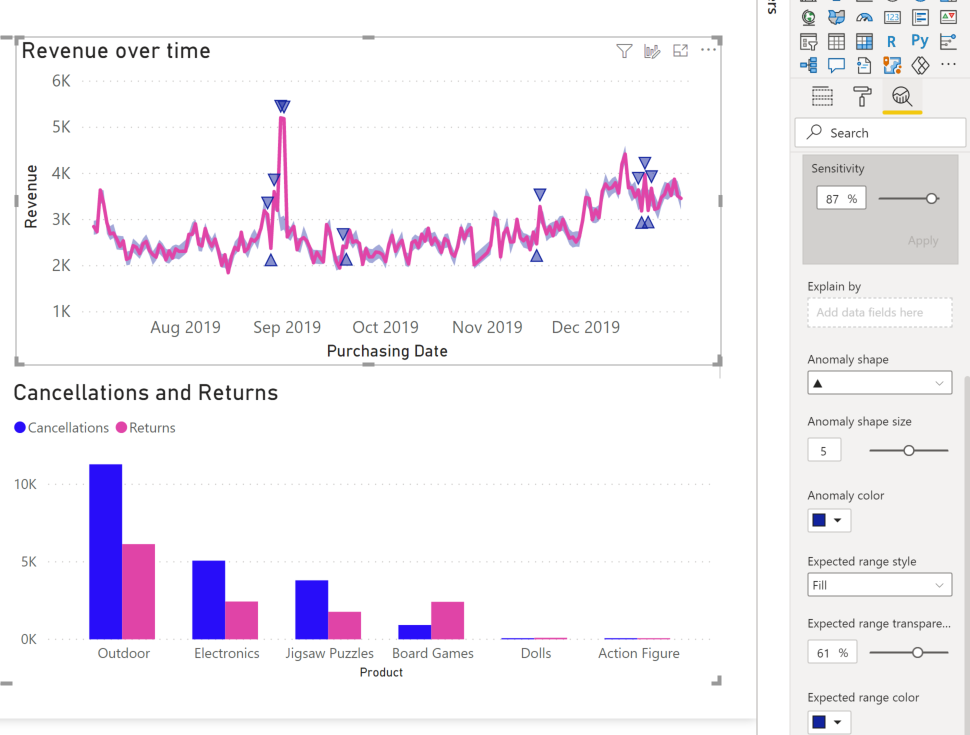

# Anomaliedetectie (preview-versie)

[!INCLUDE[consumer-appliesto-nyyn](../includes/consumer-appliesto-nyyn.md)]    

Anomaliedetectie helpt u bij het verbeteren van uw lijndiagrammen door automatisch anomalieën in uw tijdreeksgegevens te detecteren. Hier vindt u ook uitleg over de anomalieën die u kan helpen de hoofdoorzaak te achterhalen.  Met slechts een paar klikken kunt u eenvoudig inzichten vinden zonder de gegevens te hoeven segmenteren. U kunt anomalieën in zowel Power BI Desktop als de Power BI-service maken en weergeven. De stappen en afbeeldingen uit dit artikel zijn gebaseerd op Power BI Desktop.

Aangezien deze functie in preview is, moet u eerst de functieswitch inschakelen. Ga naar **Bestand** > **Opties en instellingen** > **Opties** > **Preview-functies** en zorg ervoor dat **Anomaliedetectie** is ingeschakeld:

:::image type="content" source="media/power-bi-visualization-anomaly-detection//preview-feature-switch.png" alt-text="Schermopname waarop u ziet hoe u de functieswitch voor de preview-functie van de anomaliedetectie kunt inschakelen.":::
 
## Aan de slag
Deze zelfstudie maakt gebruik van onlineverkoopgegevens voor verschillende producten. Als u deze zelfstudie wilt volgen, downloadt u het [voorbeeldbestand](https://github.com/microsoft/powerbi-desktop-samples/blob/main/Monthly%20Desktop%20Blog%20Samples/2020/2020SU09%20Blog%20Demo%20-%20September.pbix) van een scenario met onlineverkopen.

U kunt Anomaliedetectie inschakelen door het diagram te selecteren en de optie Anomalieën zoeken toe te voegen in het deelvenster Analyse. 

 

 Dit diagram toont bijvoorbeeld de omzet in de loop van de tijd. Het toevoegen van anomaliedetectie verrijkt het diagram automatisch met anomalieën en het verwachte bereik van de waarden. Wanneer een waarde buiten deze verwachte grens valt, wordt deze gemarkeerd als een anomalie. Bekijk deze [technische blog](https://techcommunity.microsoft.com/t5/ai-customer-engineering-team/overview-of-sr-cnn-algorithm-in-azure-anomaly-detector/ba-p/982798) voor meer informatie over het Anomaly Detector-algoritme.

 
 
## Anomalieën indelen

Deze ervaring kan gemakkelijk worden aangepast. U kunt de vorm, grootte en kleur van de anomalie en de kleur, stijl en transparantie van het verwachte bereik indelen. U kunt ook de parameter van het algoritme configureren.  Als u de gevoeligheid verhoogt, is het algoritme gevoeliger voor veranderingen in uw gegevens. In dat geval wordt zelfs een kleine afwijking als een anomalie gemarkeerd. Bij een verlaagde gevoeligheid is het algoritme selectiever op wat als een anomalie wordt beschouwd.

 
 
## Uitleg
Naast het detecteren van anomalieën, kunt u ook automatisch de anomaliegegevens uitleggen. Wanneer u de anomalie selecteert, voert Power BI een analyse uit op velden in uw gegevensmodel om een mogelijke uitleg te achterhalen. U krijgt zo een uitleg in natuurlijke taal van de anomalie en factoren die verband houden met die anomalie, gesorteerd op de meest duidelijke uitleg. Hier zie ik dat op 30 augustus de omzet USD 5187 was, wat hoger is dan het verwachte bereik van USD 2447 tot USD 3423. Ik kan de kaarten in dit deelvenster openen om meer details van de uitleg weer te geven.

 
### Uitleg configureren
U kunt ook bepalen welke velden worden gebruikt voor analyse. Als u Verkoper en Stad naar het veld **Uitleggen door** sleept, beperkt Power BI de analyse tot alleen die velden. In dit geval lijkt de anomalie op 31 augustus verband te houden met een bepaalde verkoper en bepaalde steden. Hier heeft de verkoper Fabrikam een sterkte van 99%. Power BI berekent *sterkte* als de verhouding van de afwijking van de verwachte waarde, wanneer deze wordt gefilterd door de afmeting tot de afwijking in de totale waarde. Het is bijvoorbeeld de verhouding van de werkelijke minus de verwachte waarde tussen de component tijdreeks *Fabrikam* en de totale tijdreeks *Totale omzet* voor het anomaliepunt. Als u de kaart opent, ziet u de visual met een omzetpiek voor deze verkoper op 31 augustus. Gebruik de optie **Toevoegen aan rapport** om deze visual aan de pagina toe te voegen.

## Beperkingen
- Anomaliedetectie wordt alleen ondersteund voor lijndiagram-visuals met tijdreeksgegevens in het veld As.
- Anomaliedetectie wordt niet ondersteund met legenda's, meerdere waarden of secundaire waarden in de lijndiagram-visual.
- Voor anomaliedetectie zijn ten minste 12 gegevenspunten vereist.
- De regels Prognose/Min/Max/Gemiddelde/Mediaan/Percentiel werken niet met anomaliedetectie.
- Directe query voor SAP-gegevensbron, Power BI Report Server, live-verbinding met Azure Analysis Services en SQL Server Analysis Services worden niet ondersteund.
- Verklaringen voor anomalie werken niet met opties voor Waarde weergeven als.
- Inzoomen om naar het volgende niveau in de hiërarchie te gaan, wordt niet ondersteund.
