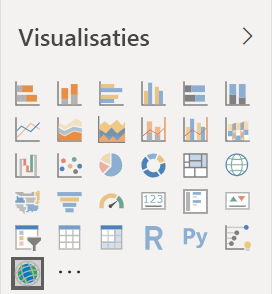
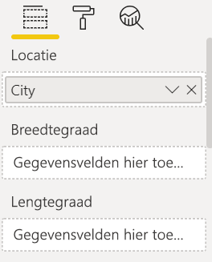
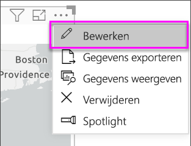
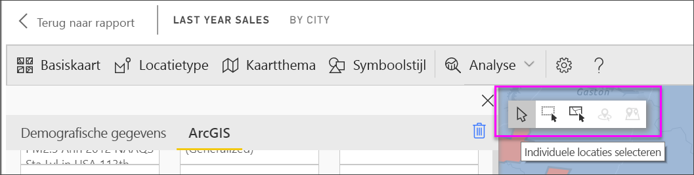
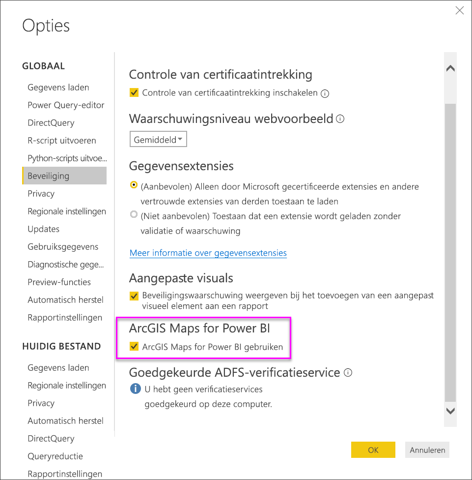
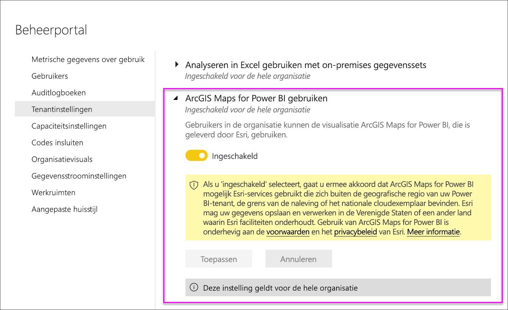

# ArcGIS-kaarten van Esri in Power BI Desktop

[!INCLUDE [power-bi-visuals-desktop-banner](../includes/power-bi-visuals-desktop-banner.md)]

Deze zelfstudie is geschreven vanuit het oogpunt van iemand die een ArcGIS-kaart maakt. Zodra een maker een ArcGIS-kaart met een collega deelt, kan deze collega de kaart bekijken en acties uitvoeren voor de kaart, maar geen wijzigingen opslaan. Zie [Interacting with ArcGIS maps](power-bi-visualizations-arcgis.md) (Interactie met ArcGIS-kaarten) voor meer informatie over het weergeven van een ArcGIS-kaart.

De combinatie van ArcGIS-kaarten en Power BI tilt kaarten naar een volledig nieuw niveau, verder dan de presentatie van punten op een kaart. Kies uit basiskaarten, locatietypen, thema's, symboolstijlen en referentielagen om informatieve kaartvisualisaties te maken. De combinatie van bindende gegevenslagen op een kaart met ruimtelijke analyse geeft een beter inzicht in de gegevens in uw visualisatie.

 U kunt niet een ArcGIS-kaart op een mobiel apparaat maken, maar u kunt deze wel bekijken en er acties mee uitvoeren op een mobiel apparaat. Zie [Interacting with ArcGIS maps](power-bi-visualizations-arcgis.md) (Interactie met ArcGIS-kaarten).

> [!TIP]
> GIS staat voor Geographic Information System (geografisch informatiesysteem).

In het volgende voorbeeld wordt een donkergrijs canvas gebruikt om regionale verkopen als een heatmap weer te geven tegen een demografische laag van de mediaan voor besteedbaar inkomen in 2016. Zoals verderop duidelijk wordt, bieden ArcGIS-kaarten vrijwel onbeperkte mogelijkheden voor verbeterde toewijzing, demografische gegevens, en nog indrukwekkendere kaartvisualisaties, zodat u uw verhaal op de beste manier kunt vertellen.

> [!TIP]
> Ga naar [esri's page on Power BI](https://www.esri.com/powerbi) (Esri-pagina in Power BI) om veel voorbeelden en aanbevelingen te bekijken. Ga vervolgens naar [ArcGIS Maps for Power BI Getting Started page](https://doc.arcgis.com/en/maps-for-powerbi/get-started/about-maps-for-power-bi.htm) (Pagina Aan de slag voor ArcGIS Maps for Power BI).

## Toestemming van de gebruiker
ArcGIS Maps for Power BI wordt geleverd door Esri (www.esri.com). Uw gebruik van ArcGIS Maps for Power BI is onderhevig aan de voorwaarden en het privacybeleid van Esri. Power BI-gebruikers die de visuals van ArcGIS Maps for Power BI willen gebruiken, moeten hiermee akkoord gaan in het toestemmingsdialoogvenster.

**Bronnen**

[Voorwaarden](https://go.microsoft.com/fwlink/?LinkID=826322)

[Privacybeleid](https://go.microsoft.com/fwlink/?LinkID=826323)

[Productpagina van ArcGIS Maps for Power BI](https://www.esri.com/powerbi)

 

### De ArcGIS-kaart inschakelen ***in Power BI Desktop (app.powerbi.com)***
In deze zelfstudie wordt gebruikgemaakt van het [PBIX-bestand met het voorbeeld van een retailanalyse](http://download.microsoft.com/download/9/6/D/96DDC2FF-2568-491D-AAFA-AFDD6F763AE3/Retail%20Analysis%20Sample%20PBIX.pbix
). **ArcGIS Maps for Power BI** inschakelen:

1. Selecteer linksboven in de menubalk **Bestand** \> **Openen**
   
2. Zoek het **PBIX-bestand met het voorbeeld van een retailanalyse** dat is opgeslagen op de lokale computer.

1. Open het bestand **Voorbeeld van een retailanalyse** in de rapportweergave .

1. Selecteren  om een nieuwe pagina toe te voegen.

   
3. Selecteer in het deelvenster Visualisaties het pictogram voor ArcGIS Maps for Power BI.
   
    
4. Power BI voegt een lege ArcGIS-kaartsjabloon toe aan het rapportcanvas.
   
   

 

## Een visual van een ArcGIS-kaart maken
Bekijk hoe Will enkele ArcGIS-kaartvisualisaties maakt en voer vervolgens de stappen hieronder uit om het zelf te proberen met behulp van het [PBIX-bestand met het voorbeeld van een retailanalyse](../sample-datasets.md).
   > [!NOTE]
   > Deze video maakt gebruik van een oudere versie van Power BI Desktop.
   > 
   > 
<iframe width="560" height="315" src="https://www.youtube.com/embed/EKVvOZmxg9s" frameborder="0" allowfullscreen></iframe>

1. Sleep vanuit het deelvenster **Velden** een gegevensveld naar de buckets **Locatie** of **Breedtegraad** en/of **Lengtegraad**. In dit voorbeeld gebruiken we **Winkel > Plaats**.
   
   > [!NOTE]
   > ArcGIS Maps for Power BI detecteert automatisch of de velden die u hebt geselecteerd het beste als vorm of punt op de kaart kunnen worden weergegeven. U kunt de standaardinstelling aanpassen in de instellingen (zie hieronder).
   > 
   > 
   
    

3. Sleep vanuit het deelvenster **Velden** een meting naar de bucket **Grootte** om aan te passen hoe de gegevens worden weergegeven. In dit voorbeeld gebruiken we **Verkoop > Omzet van afgelopen jaar**.
   
    

## Instellingen en opmaak voor ArcGIS-kaarten
Opmaakfuncties van **ArcGIS Maps for Power BI** openen:

1. Open extra functies door in de rechterbovenhoek van de visualisatie het beletselteken te selecteren en **Bewerken** te kiezen.
   
   
   
   De beschikbare functies worden aan de bovenkant van de visualisatie weergegeven. Wanneer u een functie selecteert, wordt er een taakvenster weergegeven met gedetailleerde opties. 
   
   
   
   > [!NOTE]
   > Zie **Gedetailleerde documentatie** hieronder voor meer informatie over de instellingen en functies.
   > 
   > 

 

## Gedetailleerde documentatie
**Esri** biedt [uitgebreide documentatie](https://go.microsoft.com/fwlink/?LinkID=828772) voor de functies van **ArcGIS Maps for Power BI**.

## Overzicht van functies
### Basiskaarten
Er worden vier basiskaarten aangeboden: Dark Gray Canvas (Donkergrijs canvas), Light Gray Canvas (Lichtgrijs canvas), OpenStreetMap en Streets (Straten).  Streets (Straten) is de standaard basiskaart van ArcGIS.

Als u een basiskaart wilt toepassen, selecteert u deze in het taakvenster.

### Locatietype
ArgGIS Maps for Power BI detecteert automatisch de beste manier om gegevens op de kaart weer te geven. Het programma selecteert Points (Punten) of Boundaries (Grenzen). Met de opties voor het type locatie kunt u deze selecties nauwkeurig afstemmen.

**Boundaries** (Grenzen) werkt alleen als de gegevens standaard geografische waarden bevatten. Esri bepaalt automatisch welke vorm op de kaart moet worden weergegeven. Standaard geografische waarden zijn landen, provincies, postcodes enzovoort. Maar net als bij geocodering kan Power BI mogelijk niet detecteren dat het veld standaard een grens moet hebben, of het heeft geen grens voor uw gegevens.  

### Kaartthema
Er worden vier kaartthema's aangeboden. Thema's voor alleen locatie en grootte worden automatisch gekozen op basis van de velden die u aan de locatie koppelt en toegevoegd aan de bucket **Grootte** in het deelvenster Velden van Power BI. We gebruiken momenteel **Size** (Grootte), dus we gaan overstappen naar **Heatmap**. Vergeet niet om **Heatmap** weer uit te schakelen voordat u doorgaat met de volgende stap.  

<table>
<tr><th>Thema</th><th>Beschrijving</th>
<tr>
<td>Location Only (Alleen locatie)</td>
<td>Gegevenspunten of gevulde grenzen worden op de kaart uitgezet op basis van de instellingen in Location Type (Locatietype).</td>
</tr>
<tr>
<td>Heat Map (Heatmap)</td>
<td>Hiermee wordt een intensiteitsweergave van gegevens op de kaart uitgezet.</td>
</tr>
<tr>
<td>Size (Grootte)</td>
<td>Hiermee worden gegevenspunten op de kaart uitgezet op basis van grootte, gebaseerd op de bucket Grootte in het deelvenster Velden.</td>
</tr>
<tr>
<td>Clustering</td>
<td>Hiermee worden gegevenspunten in regio's op de kaart uitgezet. </td>
</tr>
</table>

### Symbol style (Symboolstijl)
Met Symbol style (Symboolstijl) kunt u nauwkeurig afstemmen hoe gegevens op de kaart worden weergegeven. Symboolstijlen zijn contextafhankelijk op basis van het geselecteerde locatietype en kaartthema. In het onderstaande voorbeeld is het kaarttype ingesteld op **Size** (Grootte) en zijn er verschillende aanpassingen voor transparantie, stijl en grootte gemaakt. 

### Spelden
Vestig de aandacht op bepaalde punten op de kaart door spelden toe te voegen.  

1. Selecteer het tabblad **Pins** (Spelden).
2. Typ trefwoorden (zoals adressen, plaatsen en bezienswaardigheden) in het zoekvak en selecteer een optie in de vervolgkeuzelijst. Er wordt een symbool op de kaart weergegeven en de kaart zoomt automatisch in op de locatie. Zoekresultaten worden opgeslagen als locatiekaarten in het deelvenster Spelden. U kunt maximaal 10 locatiekaarten opslaan.
   
   
3. Power BI voegt een speld toe aan die locatie en u kunt de kleur van de speld wijzigen.
   
   
4. Toevoegen en verwijderen van spelden.
   
   

### Rijtijd
In het deelvenster Drive time (Rijtijd) kunt u een locatie selecteren en vervolgens bepalen welke andere functies van de kaart zich binnen een opgegeven radius of rijtijd bevinden.  
    

1. Selecteer het tabblad **Drive time** (Rijtijd) en kies de functie voor het selecteren van één of meerdere items. Gebruik de enkelvoudige selectie om de speld voor Washington D.C. te selecteren.

   
   
   > [!TIP]
   > Het is gemakkelijker een locatie te selecteren als u op de kaart inzoomt (met behulp van het pictogram +).
   > 
   > 
2. Stel dat u voor een paar dagen naar Washington D.C. gaat en wilt achterhalen welke winkels zich binnen een redelijke rijafstand bevinden. Wijzigen het zoekgebied naar **Radius** en de afstand naar **50** mijl en klik op OK.    
   
    

3. De radius wordt paars weergegeven. Selecteer een locatie om de details ervan weer te geven. U kunt eventueel de kleur en omtrek van de radius wijzigen.
   
    

### Reference Layer (Referentielaag)
#### Referentielaag - demografische gegevens
ArcGIS Maps for Power BI biedt een selectie van demografische lagen waarmee gegevens van Power BI in een context kunnen worden geplaatst.

1. Selecteer het tabblad **Reference layer** (Referentielaag) en kies **Demographics** (Demografische gegevens).
2. Elke vermelde laag heeft een selectievakje. Schakel het selectievakje in om een laag toe te voegen aan de kaart.  In dit voorbeeld hebben we het gemiddelde inkomen per huishouden toegevoegd. 
   
    
3. Elke laag is ook interactief. Net zoals u de muisaanwijzer op een bel kunt plaatsen om de details te bekijken, kunt u op een gearceerd gedeelte op de kaart klikken om de details te bekijken. 
   
    

#### Referentielaag - ArcGIS
ArcGIS Online biedt organisaties de mogelijkheid om openbare webkaarten te publiceren. Daarnaast biedt Esri een verzameling webkaarten via Living Atlas. Op het tabblad ArcGIS kunt u alle openbare webkaarten of Living Atlas-kaarten doorzoeken en ze toevoegen aan de kaart als referentielagen.

1. Selecteer het tabblad **Reference layer** (Referentielaag) en kies **ArcGIS**.
2. Voer zoektermen in en selecteer vervolgens een kaartlaag. In dit voorbeeld hebben we voor de congresdistricten van de Verenigde Staten gekozen.
   
    
3. Als u de details wilt bekijken, selecteert u een gearceerd gedeelte om de *laag Selecteren uit referentie* te openen: Gebruik het selectiehulpmiddel voor referentielagen om grenzen of objecten in de referentielaag te selecteren.

 

## Gegevenspunten selecteren
Met ArcGIS Maps for Power BI kunt u vijf selectiemodi gebruiken om nauwkeurig en snel gegevens te selecteren.

U kunt de gebruikte selectiemodus wijzigen door de muisaanwijzer op het pictogram van het selectiehulpmiddel te plaatsen zoals wordt weergegeven in de onderstaande afbeelding. Hiermee wordt ook de verborgen balk uitgebreid om extra hulpmiddelen weer te geven:

Elk hulpprogramma heeft een unieke rol bij het selecteren van gegevens: 

 Hiermee worden afzonderlijke gegevenspunten geselecteerd.

 Hiermee wordt een rechthoek op de kaart getekend en worden de opgenomen gegevenspunten geselecteerd.

 Hiermee wordt toegestaan dat grenzen of polygonen binnen referentielagen worden gebruikt voor het selecteren van opgenomen gegevenspunten.

 Hiermee kunt u gegevens selecteren met behulp van een bufferlaag.

 Hiermee kunt u gegevenspunten selecteren die vergelijkbaar zijn met elkaar.

> [!NOTE]
> Er kunnen maximaal 250 gegevenspunten tegelijk worden geselecteerd.
> 
> 

 

## Hulp krijgen
**Esri** biedt [uitgebreide documentatie](https://go.microsoft.com/fwlink/?LinkID=828772) voor de functies van **ArcGIS Maps for Power BI**.

U kunt vragen stellen, de meest recente informatie vinden, problemen melden en antwoorden vinden in de Power BI-[communitythread met betrekking tot **ArcGIS Maps for Power BI**](https://go.microsoft.com/fwlink/?LinkID=828771).

Als u een suggestie voor een verbetering hebt, kunt u deze indienen bij [de ideeënlijst van Power BI](https://ideas.powerbi.com).

 

## Gebruik van ArcGIS Maps for Power BI binnen uw organisatie beheren
Power BI biedt gebruikers, tenantbeheerders en IT-beheerders de mogelijkheid om te beheren of ze ArcGIS Maps for Power BI willen gebruiken. Hieronder vindt u de stappen die elke rol kan uitvoeren om het gebruik van ArcGIS-kaarten te beheren. 

### Gebruikersopties
In Power BI Desktop kunnen gebruikers stoppen met het gebruik van ArcGIS Maps for Power BI door het uit te schakelen op het tabblad Beveiliging in **Bestand** > **Opties en instellingen** en vervolgens **Opties** > **Beveiliging** te selecteren. Wanneer ArcGIS Maps is uitgeschakeld, wordt het niet standaard geladen.

### Opties voor tenantbeheer
Op PowerBI.com kunnen tenantbeheerders voorkomen dat alle tenantgebruikers ArcGIS Maps for Power BI kunnen gebruiken door de optie uit te schakelen. Dit kan via **Instellingen** > **Beheerportal** > **Tenantinstellingen**. Als dit gebeurt, wordt in Power BI niet meer het pictogram van ArcGIS Maps for Power BI weergegeven in het deelvenster Visualisaties.

### Opties voor IT-beheerders
Power BI Desktop ondersteunt het gebruik van **groepsbeleid** om ArcGIS Maps for Power BI uit te schakelen op alle computers van een organisatie.

<table>
<tr><th>Kenmerk</th><th>Waarde</th>
</tr>
<tr>
<td>sleutel</td>
<td>Software\Policies\Microsoft\Power BI Desktop&lt;/td&gt;
</tr>
<tr>
<td>valueName</td>
<td>EnableArcGISMaps</td>
</tr>
</table>

Een waarde van 1 (decimaal) schakelt ArcGIS Maps for Power BI in.

Een waarde van 0 (decimaal) schakelt ArcGIS Maps for Power BI uit.

## Overwegingen en beperkingen
ArcGIS Maps for Power BI is beschikbaar in de volgende services en toepassingen:

<table>
<tr><th>Service/app</th><th>Beschikbaarheid</th></tr>
<tr>
<td>Power BI Desktop</td>
<td>Ja</td>
</tr>
<tr>
<td>Power BI-service (PowerBI.com)</td>
<td>Ja</td>
</tr>
<tr>
<td>Mobiele Power BI-toepassingen</td>
<td>Ja</td>
</tr>
<tr>
<td>Power BI publiceren op internet</td>
<td>Nee</td>
</tr>
<tr>
<td>Power BI Embedded</td>
<td>Nee</td>
</tr>
<tr>
<td>Power BI-service insluiten (PowerBI.com)</td>
<td>Nee</td>
</tr>
</table>

In services of apps waarin ArcGIS Maps for Power BI niet beschikbaar is, wordt de visualisatie weergegeven als een lege visual met het logo van Power BI.

Bij het geocoderen van straatadressen worden alleen de eerste 1500 adressen gegeocodeerd. Het geocoderen van plaatsnamen en landen is niet onderhevig aan de adreslimiet van 1500.

 

**Hoe werken ArcGIS Maps en Power BI samen?**
ArcGIS Maps for Power BI wordt geleverd door Esri (www.esri.com). Uw gebruik van ArcGIS Maps for Power BI is onderhevig aan de [voorwaarden](https://go.microsoft.com/fwlink/?LinkID=8263222) en het [privacybeleid](https://go.microsoft.com/fwlink/?LinkID=826323) van Esri. Power BI-gebruikers die de visuals van ArcGIS Maps for Power BI willen gebruiken, moeten hiermee akkoord gaan in het toestemmingsdialoogvenster (raadpleeg Toestemming van gebruiker voor meer informatie).  Het gebruik van ArcGIS Maps for Power BI van Esri is onderhevig aan de voorwaarden en het privacybeleid van Esri. Een koppeling naar de voorwaarden en het privacybeleid vindt u in het toestemmingsdialoogvenster. Elke gebruiker moet toestemming geven voor het eerste gebruik van ArcGIS Maps for Power BI. Zodra de gebruiker toestemming heeft gegeven, worden de aan de visual gekoppelde gegevens naar de services van Esri verzonden voor (ten minste) geocodering, wat betekent dat de locatiegegevens worden getransformeerd in breedtegraad- en lengtegraadgegevens die in een kaart kunnen worden weergegeven. U moet ervan uitgaan dat alle gegevens die aan de gegevensvisualisatie zijn gekoppeld, naar de services van Esri kunnen worden verzonden. Esri biedt services zoals basiskaarten, analyses van ruimtelijke gegevens, geocodering, enzovoort. Voor de samenwerking tussen de visuals van ArcGIS Maps for Power BI en deze services wordt gebruikgemaakt van een SSL-verbinding. Deze verbinding wordt beveiligd met een certificaat dat door Esri wordt verstrekt en onderhouden. Meer informatie over ArcGIS Maps for Power BI vindt u op de [productpagina voor ArcGIS Maps for Power BI](https://www.esri.com/powerbi) van Esri.

Wanneer een gebruiker zich via ArcGIS Maps for Power BI voor een Plus-abonnement van Esri registreert, gaat de gebruiker een directe relatie met Esri aan. Power BI verzendt geen persoonlijke gegevens over de gebruiker naar Esri. De gebruiker meldt zich aan bij en vertrouwt een door Esri verstrekte AAD-toepassing waarbij gebruik wordt gemaakt van de eigen AAD-identiteit van de gebruiker. Op deze manier deelt de gebruiker zijn of haar persoonlijke gegevens rechtstreeks met Esri. Zodra de gebruiker Plus-inhoud aan een visual van ArcGIS Maps for Power BI toevoegt, hebben andere Power BI-gebruikers ook een Plus-abonnement van Esri nodig als zij die inhoud willen weergeven of bewerken. 

Voor gedetailleerde technische vragen over de werking van ArcGIS Maps for Power BI van Esri kunt u contact opnemen met Esri via hun ondersteuningssite.

**Zijn er kosten verbonden aan het gebruik van ArcGIS Maps for Power BI?**

ArcGIS Maps for Power BI is beschikbaar voor alle Power BI-gebruikers zonder extra kosten. Het is een onderdeel dat wordt geleverd door **Esri**, en uw gebruik is onderhevig aan de voorwaarden en het privacybeleid van **Esri**, zoals eerder in dit artikel is aangegeven.

**Ik krijg een foutbericht in Power BI Desktop dat mijn cache vol is**

Dit is een bekende bug. Er wordt aan een oplossing gewerkt.  In de tussentijd kunt u uw cache wissen door bestanden op deze locatie te verwijderen: C:\Users\\AppData\Local\Microsoft\Power BI Desktop\CEF. Start Power BI vervolgens opnieuw op.

**Biedt ArcGIS Maps for Power BI ondersteuning voor Esri Shapefiles?**

ArcGIS Maps for Power BI detecteert automatisch standaardgrenzen zoals landen/regio's, staten/provincies en postcodes. Als u uw eigen vormen wilt leveren, kunt u dit doen met behulp van [Shape Maps for Power BI Desktop (preview)](desktop-shape-map.md).

**Kan ik mijn ArcGIS-kaarten offline bekijken?**

Nee, Power BI moet verbinding met het netwerk hebben om kaarten weer te geven.

**Kan ik verbinding met mijn ArcGIS Online-account maken vanuit Power BI?**

Nog niet. [Stem voor dit idee](https://ideas.powerbi.com/forums/265200-power-bi-ideas/suggestions/9154765-arcgis-geodatabases) en we sturen u een e-mail wanneer we aan deze functie beginnen te werken.  

## Volgende stappen
[Interactie met een ArcGIS-kaart die met u is gedeeld](power-bi-visualizations-arcgis.md)

[Blogpost waarin de beschikbaarheid van ArcGIS Maps for Power BI wordt aangekondigd](https://powerbi.microsoft.com/blog/announcing-arcgis-maps-for-power-bi-by-esri-preview/)

Nog vragen? [Misschien dat de Power BI-community het antwoord weet](http://community.powerbi.com/)

