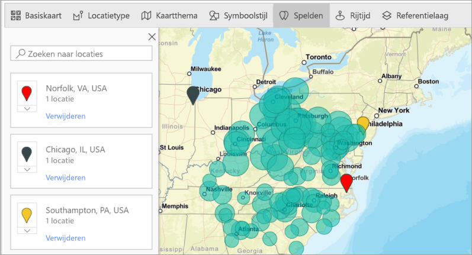

# ArcGIS Maps in Power BI Desktop maken

[!INCLUDE [power-bi-visuals-desktop-banner](../includes/power-bi-visuals-desktop-banner.md)]

Deze zelfstudie is geschreven vanuit het oogpunt van iemand die een ArcGIS-kaart voor Power BI maakt. Zodra een *ontwerper* een ArcGIS-kaart voor Power BI met een collega deelt, kan deze collega de kaart bekijken en acties uitvoeren voor de kaart, maar geen wijzigingen opslaan. Zie [Interactie met ArcGIS Maps for Power BI](power-bi-visualizations-arcgis.md) voor meer informatie over het weergeven van een ArcGIS-kaart.

De combinatie van ArcGIS-kaarten en Power BI tilt kaarten naar een volledig nieuw niveau, verder dan de presentatie van punten op een kaart. Kies uit basiskaarten, locatietypen, thema's, symboolstijlen en referentielagen om informatieve kaartvisualisaties te maken. De combinatie van bindende gegevenslagen op een kaart met ruimtelijke analyse geeft een beter inzicht in de gegevens in uw visualisatie.

 Op een mobiel apparaat kunt u geen ArcGIS Maps for Power BI-kaart maken, maar u kunt deze wel weergeven en ermee werken. Zie [Interacting with ArcGIS maps](power-bi-visualizations-arcgis.md) (Interactie met ArcGIS-kaarten).

> [!TIP]
> GIS staat voor Geographic Information System (geografisch informatiesysteem).

In het volgende voorbeeld wordt een donkergrijs canvas gebruikt om regionale verkopen als een heatmap weer te geven tegen een demografische laag van de mediaan voor besteedbaar inkomen in 2016. Zoals verderop duidelijk wordt, biedt ArcGIS Maps for Power BI vrijwel onbeperkte mogelijkheden voor verbeterde toewijzing, demografische gegevens en nog indrukwekkendere kaartvisualisaties, zodat u uw verhaal op de beste manier kunt vertellen.

> [!TIP]
> Ga naar de [pagina van Esri over ArcGIS Maps for Power BI](https://www.esri.com/powerbi) om veel voorbeelden en aanbevelingen te bekijken. Ga vervolgens naar [Pagina Aan de slag voor ArcGIS Maps for Power BI](https://doc.arcgis.com/en/maps-for-powerbi/get-started/about-maps-for-power-bi.htm) van Esri.

## Toestemming van de gebruiker
ArcGIS Maps for Power BI wordt geleverd door Esri (https://www.esri.com). Uw gebruik van ArcGIS Maps for Power BI is onderhevig aan de voorwaarden en het privacybeleid van Esri. Power BI-gebruikers die de visuals van ArcGIS Maps for Power BI willen gebruiken, moeten hiermee akkoord gaan in het toestemmingsdialoogvenster.

**Bronnen**

[Voorwaarden](https://go.microsoft.com/fwlink/?LinkID=826322)

[Privacybeleid](https://go.microsoft.com/fwlink/?LinkID=826323)

[Productpagina van ArcGIS Maps for Power BI](https://www.esri.com/powerbi)

## Vereisten

In deze zelfstudie wordt gebruikgemaakt van Power BI Desktop en het PBIX-voorbeeldbestand [Retailanalyse](https://download.microsoft.com/download/9/6/D/96DDC2FF-2568-491D-AAFA-AFDD6F763AE3/Retail%20Analysis%20Sample%20PBIX.pbix). ArcGIS-kaarten for Power BI kunnen ook worden gemaakt met behulp van de Power BI-service. 

1. Selecteer linksboven in de menubalk **Bestand** \> **Openen**
   
2. Zoek het **PBIX-bestand met het voorbeeld van een retailanalyse** dat is opgeslagen op de lokale computer.

1. Open het bestand **Voorbeeld van een retailanalyse** in de rapportweergave .

1. Selecteren  om een nieuwe pagina toe te voegen.

   
## Een visualisatie van een kaart in ArcGIS Maps for Power BI maken

Bekijk hoe Will enkele visualisaties maakt en voer vervolgens de stappen hieronder uit om het zelf te proberen met het [PBIX-bestand met het voorbeeld van een retailanalyse](../sample-datasets.md).
    

   > [!NOTE]
   > Deze video maakt gebruik van een oudere versie van Power BI Desktop.
   > 

> [!VIDEO https://www.youtube.com/embed/EKVvOZmxg9s]

1. Selecteer in het deelvenster Visualisaties het pictogram voor ArcGIS Maps for Power BI.
   
        

2. Power BI voegt een lege sjabloon toe aan het rapportcanvas. Voor deze zelfstudie gebruiken we de gratis versie.
   
   

3. Sleep vanuit het deelvenster **Velden** een gegevensveld naar de buckets **Locatie** of **Breedtegraad** en/of **Lengtegraad**. In dit voorbeeld gebruiken we **Winkel > Plaats**.
   
   > [!NOTE]
   > ArcGIS Maps for Power BI detecteert automatisch of de velden die u hebt geselecteerd het beste als vorm of punt op de kaart kunnen worden weergegeven. U kunt de standaardinstelling aanpassen in de instellingen (zie hieronder).
   > 
   > 
   
    

4. Sleep vanuit het deelvenster **Velden** een meting naar de bucket **Grootte** om aan te passen hoe de gegevens worden weergegeven. In dit voorbeeld gebruiken we **Verkoop > Omzet van afgelopen jaar**.
   
    

U hebt uw eerste ArcGIS Maps for Power BI-kaart gemaakt. Nu gaan we onze kaart verfijnen en opmaken met basiskaarten, locatietypen, thema's en nog veel meer.

## Instellingen en opmaak voor ArcGIS Maps for Power BI
Opmaakfuncties van **ArcGIS Maps for Power BI** openen:

1. Open extra functies door in de rechterbovenhoek van de visualisatie **Meer acties** (...) te selecteren en **Bewerken** te kiezen.
   
   
   
   De visualisatie wordt uitgevouwen en de beschikbare functies worden bovenaan weergegeven. Wanneer u een functie selecteert, wordt er een taakvenster weergegeven met gedetailleerde opties. 
   
   
   

> [!TIP]
> **Esri** biedt [uitgebreide documentatie](https://go.microsoft.com/fwlink/?LinkID=828772) voor de functies van **ArcGIS Maps for Power BI**.

### Basiskaarten
Er worden vier basiskaarten aangeboden: Dark Gray Canvas (Donkergrijs canvas), Light Gray Canvas (Lichtgrijs canvas), OpenStreetMap en Streets (Straten).  *Straten* is de standaard basiskaart van ArcGIS.

Als u een basiskaart wilt toepassen, selecteert u deze in het taakvenster.

### Locatietype
ArcGIS Maps for Power BI detecteert automatisch de beste manier om gegevens op de kaart weer te geven. Het programma selecteert punten of grenzen. Met de opties voor het type locatie kunt u deze selecties nauwkeurig afstemmen.

**Boundaries** (Grenzen) werkt alleen als de gegevens standaard geografische waarden bevatten. ArcGIS Maps for Power BI bepaalt automatisch welke vorm op de kaart moet worden weergegeven. Standaard geografische waarden zijn landen, provincies, postcodes enzovoort. Maar net als bij geocodering kan Power BI mogelijk niet detecteren dat het veld standaard een grens moet hebben, of het vindt geen grens voor uw gegevens.  

### Kaartthema
Er worden vier kaartthema's aangeboden. Power BI selecteert de thema's **Alleen locatie** of **Grootte** op basis van de velden die u hebt toegevoegd aan de buckets **Locatie** en **Grootte**. De kaart is standaard ingesteld op **Grootte**, omdat we velden aan beide buckets hebben toegevoegd. Probeer de andere thema's en ga terug naar **Grootte** voordat u verdergaat met de volgende stap.  

<table>
<tr><th>Thema</th><th>Beschrijving</th>
<tr>
<td>Alleen locatie</td>
<td>Gegevenspunten of gevulde grenzen worden op de kaart uitgezet op basis van het veld dat u hebt toegevoegd aan de bucket Locatie.</td>
</tr>
<tr>
<td>Heatmap</td>
<td>Hiermee wordt de intensiteit van de gegevens op de kaart uitgezet. Gebieden met een hogere activiteit of waarde worden weergegeven door fellere en oplichtende kleuren. </td>
</tr>
<tr>
<td>Grootte</td>
<td>Gegevenspunten worden op de kaart uitgezet op basis van het veld dat u hebt toegevoegd aan de bucket Grootte.</td>
</tr>
<tr>
<td>Clustering</td>
<td>Punten binnen de opgegeven clusterradius worden gegroepeerd in één symbool dat het aantal punten in dat gebied van de kaart vertegenwoordigt. </td>
</tr>
</table>

### Symboolstijl
Met Symboolstijl kunt u nauwkeurig afstemmen hoe gegevens op de kaart worden weergegeven. Symboolstijlen zijn contextafhankelijk op basis van het geselecteerde locatietype en kaartthema. In het onderstaande voorbeeld is het kaartthema ingesteld op **Grootte** en zijn er verschillende aanpassingen aan de symboolstijl met betrekking tot transparantie, stijl en grootte gemaakt. 

### Spelden
Vestig de aandacht op bepaalde punten op de kaart door spelden toe te voegen.  

1. Selecteer het tabblad **Pins** (Spelden).
2. Typ trefwoorden (zoals adressen, plaatsen en bezienswaardigheden) in het zoekvak en selecteer een optie in de vervolgkeuzelijst. Er wordt een symbool op de kaart weergegeven en de kaart zoomt automatisch in op de locatie. Zoekresultaten worden opgeslagen als locatiekaarten in het deelvenster Spelden. U kunt maximaal 10 locatiekaarten opslaan.
   
   
3. Power BI voegt een speld toe aan die locatie en u kunt de kleur van de speld wijzigen.
   
   
4. Toevoegen en verwijderen van spelden.
   
   

### Rijtijd
In het deelvenster Drive time (Rijtijd) kunt u een locatie selecteren en vervolgens bepalen welke andere functies van de kaart zich binnen een opgegeven radius of rijtijd bevinden. In het onderstaande voorbeeld ziet u een straal van 50 mijl vanaf Washington D.C.  Volg de onderstaande stappen om uw eigen laag met de rijtijd te maken. 
    

1. Selecteer het enkelvoudige selectiehulpmiddel en kies een speld of bel. In dit voorbeeld hebben we een speld geselecteerd voor de luchthaven Charlotte Douglas

   
   
   > [!TIP]
   > Het is gemakkelijker om een locatie te selecteren als u op de kaart inzoomt. U kunt inzoomen met behulp van het +-pictogram of de schuifknop van de muis.
   > 
   > 
2. Stel dat u naar de luchthaven Charlotte Douglas vliegt en wilt weten welke winkelketens zich binnen een redelijke rijafstand bevinden. Wijzig Zoekgebied in **Rijtijd** en Afstand in **25** minuten. Selecteer OK.    
   
    

    

3. Er zijn twee winkels op 25 minuten afstand. De radius wordt paars weergegeven. Selecteer een locatie om de details ervan weer te geven. U kunt eventueel de kleur en omtrek van de radius wijzigen.
   
    

### Reference Layer (Referentielaag)
#### Referentielaag - demografische gegevens
ArcGIS Maps for Power BI biedt een selectie van demografische lagen waarmee gegevens van Power BI in een context kunnen worden geplaatst.

1. Selecteer het tabblad **Reference layer** (Referentielaag) en kies **Demographics** (Demografische gegevens).
2. Elke vermelde laag heeft een selectievakje. Schakel het selectievakje in om een laag toe te voegen aan de kaart.  In dit voorbeeld hebben we het gemiddelde inkomen per huishouden toegevoegd. 
   
    
3. Elke laag is ook interactief. Beweeg de muisaanwijzer over een bel om de details weer te geven. Klik op een gearceerd gedeelte om details in de vorm van grafieken weer te geven. Hier hebben we de postcode 28227 geselecteerd. Er zijn twee grafieken die we kunnen bekijken.
   
    

#### Referentielaag - ArcGIS
ArcGIS Online biedt organisaties de mogelijkheid om openbare webkaarten te publiceren. Daarnaast biedt Esri een verzameling webkaarten via Living Atlas. Op het tabblad ArcGIS kunt u alle openbare webkaarten of Living Atlas-kaarten doorzoeken en ze toevoegen aan de kaart als referentielagen.

1. Selecteer het tabblad **Reference layer** (Referentielaag) en kies **ArcGIS**.
2. Voer zoektermen in en selecteer vervolgens een kaartlaag. In dit voorbeeld hebben we voor de congresdistricten van de Verenigde Staten gekozen.
   
    
3. Als u de details wilt bekijken, selecteert u een gearceerd gedeelte om de *laag Selecteren uit referentie* te openen: Gebruik het selectiehulpmiddel voor referentielagen om grenzen of objecten in de referentielaag te selecteren.

 

## Gegevenspunten selecteren
Met ArcGIS Maps for Power BI kunt u vijf selectiemodi gebruiken om nauwkeurig en snel gegevens te selecteren.

U kunt de gebruikte selectiemodus wijzigen door de muisaanwijzer op het pictogram van het selectiehulpmiddel te plaatsen zoals wordt weergegeven in de onderstaande afbeelding. Hiermee wordt de verborgen balk uitgebreid om extra hulpmiddelen weer te geven:

Elk hulpprogramma heeft een unieke rol bij het selecteren van gegevens: 

 Hiermee worden afzonderlijke gegevenspunten geselecteerd.

 Hiermee wordt een rechthoek op de kaart getekend en worden de opgenomen gegevenspunten geselecteerd.

 Hiermee wordt toegestaan dat grenzen of polygonen binnen referentielagen worden gebruikt voor het selecteren van opgenomen gegevenspunten.

 Hiermee kunt u gegevens selecteren met behulp van een bufferlaag.

 Hiermee kunt u gegevenspunten selecteren die vergelijkbaar zijn met elkaar.

> [!NOTE]
> Er kunnen maximaal 250 gegevenspunten tegelijk worden geselecteerd.
> 
> 

 

## Hulp krijgen
**Esri** biedt [uitgebreide documentatie](https://go.microsoft.com/fwlink/?LinkID=828772) voor de functies van **ArcGIS Maps for Power BI**.

U kunt vragen stellen, de meest recente informatie vinden, problemen melden en antwoorden vinden in de Power BI-[communitythread met betrekking tot **ArcGIS Maps for Power BI**](https://go.microsoft.com/fwlink/?LinkID=828771).

Als u een suggestie voor een verbetering hebt, kunt u deze indienen bij [de ideeënlijst van Power BI](https://ideas.powerbi.com).

 

## Gebruik van ArcGIS Maps for Power BI binnen uw organisatie beheren
Power BI biedt ontwerpers, tenantbeheerders en IT-beheerders de mogelijkheid om het gebruik van ArcGIS Maps for Power BI te beheren. Hieronder vindt u de stappen die elke rol kan uitvoeren. 

### Opties voor ontwerpers
In Power BI Desktop kunnen ontwerpers ArcGIS Maps for Power BI uitschakelen op het tabblad Beveiliging. Selecteer **Bestand** > **Opties en instellingen** en selecteer vervolgens **Opties** > **Beveiliging**. Wanneer ArcGIS Maps is uitgeschakeld, wordt het niet standaard geladen.

### Opties voor tenantbeheer
In PowerBI.com kunnen tenantbeheerders ArcGIS Maps for Power BI uitschakelen voor alle gebruikers. Selecteer **Instellingen** > **Beheerportal** > **Tenantinstellingen**. Indien uitgeschakeld, wordt in Power BI het pictogram van ArcGIS Maps for Power BI niet meer weergegeven in het deelvenster Visualisaties.

### Opties voor IT-beheerders
Power BI Desktop ondersteunt het gebruik van **groepsbeleid** om ArcGIS Maps for Power BI uit te schakelen op alle computers van een organisatie.

<table>
<tr><th>Kenmerk</th><th>Waarde</th>
</tr>
<tr>
<td>sleutel</td>
<td>Software\Policies\Microsoft\Power BI Desktop&lt;/td&gt;
</tr>
<tr>
<td>valueName</td>
<td>EnableArcGISMaps</td>
</tr>
</table>

Een waarde van 1 (decimaal) schakelt ArcGIS Maps for Power BI in.

Een waarde van 0 (decimaal) schakelt ArcGIS Maps for Power BI uit.

## Overwegingen en beperkingen
ArcGIS Maps for Power BI is beschikbaar in de volgende services en toepassingen:

<table>
<tr><th>Service/app</th><th>Beschikbaarheid</th></tr>
<tr>
<td>Power BI Desktop</td>
<td>Ja</td>
</tr>
<tr>
<td>Power BI-service (app.powerbi.com)</td>
<td>Ja</td>
</tr>
<tr>
<td>Mobiele Power BI-toepassingen</td>
<td>Ja</td>
</tr>
<tr>
<td>Power BI publiceren op internet</td>
<td>Nee</td>
</tr>
<tr>
<td>Power BI Embedded</td>
<td>Nee</td>
</tr>
<tr>
<td>Power BI-service insluiten (PowerBI.com)</td>
<td>Nee</td>
</tr>
</table>

In services of apps waarin ArcGIS Maps for Power BI niet beschikbaar is, wordt de visualisatie weergegeven als een lege visual met het logo van Power BI.

Bij het geocoderen van adressen worden alleen de eerste 1500 adressen gegeocodeerd. Het geocoderen van plaatsnamen en landen is niet onderhevig aan de adreslimiet van 1500.

 

**Hoe werken ArcGIS Maps en Power BI samen?**
ArcGIS Maps for Power BI wordt geleverd door Esri (https://www.esri.com). Uw gebruik van ArcGIS Maps for Power BI is onderhevig aan de [voorwaarden](https://go.microsoft.com/fwlink/?LinkID=8263222) en het [privacybeleid](https://go.microsoft.com/fwlink/?LinkID=826323) van Esri. Power BI-gebruikers die de visuals van ArcGIS Maps for Power BI willen gebruiken, moeten hiermee akkoord gaan in het toestemmingsdialoogvenster (raadpleeg Toestemming van gebruiker voor meer informatie).  Het gebruik van ArcGIS Maps for Power BI van Esri is onderhevig aan de voorwaarden en het privacybeleid van Esri. Een koppeling naar de voorwaarden en het privacybeleid vindt u in het toestemmingsdialoogvenster. Elke gebruiker moet toestemming geven voor het eerste gebruik van ArcGIS Maps for Power BI. Zodra de gebruiker toestemming heeft gegeven, worden de aan de visual gekoppelde gegevens naar de services van Esri verzonden voor (ten minste) geocodering, wat betekent dat de locatiegegevens worden getransformeerd in breedtegraad- en lengtegraadgegevens die in een kaart kunnen worden weergegeven. U moet ervan uitgaan dat alle gegevens die aan de gegevensvisualisatie zijn gekoppeld, naar de services van Esri kunnen worden verzonden. Esri biedt services zoals basiskaarten, analyses van ruimtelijke gegevens, geocodering, enzovoort. Voor de samenwerking tussen de visuals van ArcGIS Maps for Power BI en deze services wordt gebruikgemaakt van een SSL-verbinding. Deze verbinding wordt beveiligd met een certificaat dat door Esri wordt verstrekt en onderhouden. Meer informatie over ArcGIS Maps for Power BI vindt u op de [productpagina voor ArcGIS Maps for Power BI](https://www.esri.com/powerbi) van Esri.

Wanneer een gebruiker zich via ArcGIS Maps for Power BI voor een Plus-abonnement van Esri registreert, gaat de gebruiker een directe relatie met Esri aan. Power BI verzendt geen persoonlijke gegevens over de gebruiker naar Esri. De gebruiker meldt zich aan bij en vertrouwt een door Esri verstrekte AAD-toepassing waarbij gebruik wordt gemaakt van de eigen AAD-identiteit van de gebruiker. Op deze manier deelt de gebruiker zijn of haar persoonlijke gegevens rechtstreeks met Esri. Zodra de gebruiker Plus-inhoud aan een visual van ArcGIS Maps for Power BI toevoegt, hebben andere Power BI-gebruikers ook een Plus-abonnement van Esri nodig als zij die inhoud willen weergeven of bewerken. 

Voor gedetailleerde technische vragen over de werking van ArcGIS Maps for Power BI van Esri kunt u contact opnemen met Esri via hun ondersteuningssite.

**Welke gegevens worden verzonden naar ESRI?**
Op de [documentatiesite](https://doc.arcgis.com/en/maps-for-powerbi/get-started/data-transfer.htm) leest u meer over de typen gegevens die worden overgebracht naar Esri.

**Zijn er kosten verbonden aan het gebruik van ArcGIS Maps for Power BI?**

De ArcGIS Maps for Power BI-kaart wordt zonder extra kosten geleverd door **Esri**. U moet akkoord gaan met de gebruikersovereenkomst.  

**Ik krijg een foutbericht in Power BI Desktop dat mijn cache vol is**

Dit is een bekende bug. Er wordt aan een oplossing gewerkt.  In de tussentijd kunt u uw cache wissen door bestanden op deze locatie te verwijderen: C:\Users\\AppData\Local\Microsoft\Power BI Desktop\CEF. Start Power BI vervolgens opnieuw op.

**Biedt ArcGIS Maps for Power BI ondersteuning voor Esri Shapefiles?**

ArcGIS Maps for Power BI detecteert automatisch standaardgrenzen zoals landen/regio's, staten/provincies en postcodes. Als u uw eigen vormen wilt leveren, kunt u dit doen met behulp van de [Shape-kaarten voor Power BI Desktop](desktop-shape-map.md).

**Kan ik mijn ArcGIS-kaarten offline bekijken?**

Nee, Power BI moet verbinding met het netwerk hebben om kaarten weer te geven.

**Kan ik verbinding met mijn ArcGIS Online-account maken vanuit Power BI?**

Nog niet. [Stem voor dit idee](https://ideas.powerbi.com/forums/265200-power-bi-ideas/suggestions/9154765-arcgis-geodatabases) en we sturen u een e-mail wanneer we aan deze functie beginnen te werken.  

## Volgende stappen
[Interactie met een ArcGIS-kaart die met u is gedeeld](power-bi-visualizations-arcgis.md)

[Blogpost waarin de beschikbaarheid van ArcGIS Maps for Power BI wordt aangekondigd](https://powerbi.microsoft.com/blog/announcing-arcgis-maps-for-power-bi-by-esri-preview/)

Hebt u nog vragen? [Misschien dat de Power BI-community het antwoord weet](https://community.powerbi.com/)

