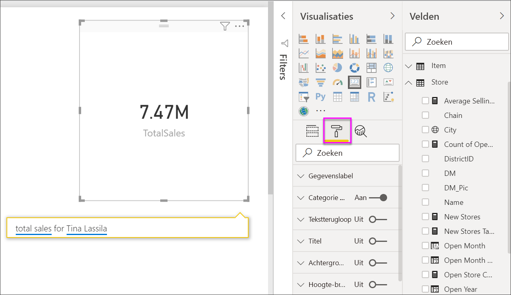

# Kaartvisualisaties maken

[!INCLUDE [power-bi-visuals-desktop-banner](../includes/power-bi-visuals-desktop-banner.md)]

Soms is één getal het belangrijkste dat u wilt bijhouden op uw Power BI-dashboard of -rapport, zoals de totale omzet, het marktaandeel jaar na jaar of het totale aantal verkoopkansen. Dit type visualisatie wordt een *kaart* genoemd. Net als bij bijna alle systeemeigen Power BI-visualisaties kunnen kaarten worden gemaakt met behulp van de rapporteditor of Q&A.

## Vereiste

In deze zelfstudie wordt gebruikgemaakt van het [PBIX-bestand met een voorbeeld van een retailanalyse](https://download.microsoft.com/download/9/6/D/96DDC2FF-2568-491D-AAFA-AFDD6F763AE3/Retail%20Analysis%20Sample%20PBIX.pbix)

1. Selecteer linksboven in de menubalk **Bestand** \> **Openen**
   
2. Ga naar uw kopie van het **PBIX-bestand met het voorbeeld van een retailanalyse**

1. Open het **PBIX-bestand met het voorbeeld van een retailanalyse** in de rapportweergave 

1. Selecteren  om een nieuwe pagina toe te voegen.

## Optie 1: Een kaart maken met behulp van de rapporteditor

De eerste manier waarop u een kaart kunt maken, is door de rapporteditor in Power BI Desktop te gebruiken.

1. Start op een lege rapportpagina en selecteer het veld **Winkel** \> **Aantal open winkels**.

    Power BI maakt een kolomdiagram met één getal.

   

2. Selecteer het kaartpictogram in het deelvenster Visualisaties.

   

U hebt nu een kaart gemaakt met de rapporteditor. Hieronder ziet u de tweede optie voor het maken van een kaart met behulp van het Q&A-vragenvak.

## Optie 2: Een kaart maken via het vak Q&A
Het Q&A-vragenvak is een tweede manier waarop u een kaart kunt maken. Het Q&A-vragenvak is beschikbaar in de Power BI Desktop-rapportweergave.

1. Begin op een nieuwe, lege rapportpagina

1. Selecteer bovenin het venster het pictogram **Stel een vraag**. 

    Power BI maakt een kaart en een vak voor uw vraag. 

   

2. Typ bijvoorbeeld 'totale omzet voor Tina' in het vragenvak.

    In het vraagvak vindt u suggesties en verklaringen en ten slotte het totale aantal.  

   

   

U hebt nu een kaart gemaakt met het Q&A-vragenvak. Hieronder vindt u de stappen voor het opmaken van uw kaart volgens uw specifieke wensen.

## Een kaart opmaken
U hebt vele opties om de labels, tekst, kleur en meer te wijzigen. De beste manier om dit te leren is door een kaart te maken en naar het opmaakvenster te gaan. Hieronder volgt een aantal beschikbare indelingsopties. 

Het deelvenster Opmaak is beschikbaar wanneer u interactief met de kaart in een rapport werkt. 

1. Open het opmaakvenster door de verfroller te selecteren. 

    

2. Selecteer de kaart, vouw **Gegevenslabel** uit en wijzig de kleur, grootte en de lettertypefamilie. Stel, u hebt duizenden winkels. Dan kunt u **Eenheden weergeven** gebruiken om het aantal winkels per duizendtallen weer te geven en de decimaalposities in te stellen. U kunt bijvoorbeeld 125,8K weergeven in plaats van 125.832,00.

    

3.  Vouw **Gegevenslabel** uit en wijzig de kleur en grootte.

    

4. Vouw **Achtergrond** uit en verplaats de schuifregelaar naar Aan.  U kunt vervolgens de achtergrondkleur en de transparantie instellen.

    

5. Probeer de andere opmaakopties om uw kaart geheel naar wens te maken. 

## Aandachtspunten en probleemoplossing
Als u het vak Vraag niet wordt weergegeven, neemt u contact op met de beheerder van uw systeem of tenant.    

## Volgende stappen
[Combinatiegrafieken in Power BI](power-bi-visualization-combo-chart.md)

[Visualization types in Power BI](power-bi-visualization-types-for-reports-and-q-and-a.md) (Typen visualisaties in Power BI)
