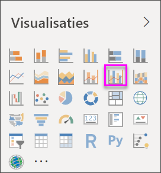
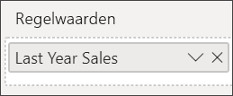
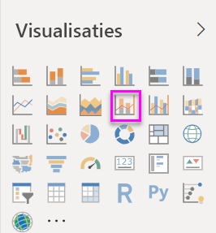
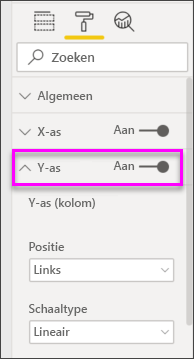
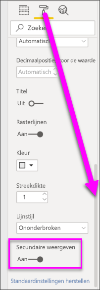

# Combinatiegrafieken maken en gebruiken in Power BI

[!INCLUDE [power-bi-visuals-desktop-banner](../includes/power-bi-visuals-desktop-banner.md)]

Een combinatiegrafiek in Power BI is een visualisatie waarin een lijndiagram wordt gecombineerd met een kolomdiagram. Als u deze twee diagrammen combineert, kunt u de gegevens sneller vergelijken.

Combinatiegrafieken kunnen één of twee Y-assen bevatten.

## Wanneer gebruikt u een combinatiegrafiek?
In de volgende gevallen komen combinatiegrafieken goed van pas:

* Als u hebt een lijndiagram en een kolomdiagram met dezelfde X-as hebt.
* Als u meerdere metingen met verschillende waardebereiken wilt vergelijken.
* Als u het verband tussen twee metingen wilt illustreren in één visualisatie.
* Als u wilt controleren of één meting voldoet aan het doel dat is gedefinieerd door een andere meting.
* Als u ruimte op het canvas wilt besparen.

### Vereisten
In deze zelfstudie wordt gebruikgemaakt van het [PBIX-bestand met het voorbeeld van een retailanalyse](https://download.microsoft.com/download/9/6/D/96DDC2FF-2568-491D-AAFA-AFDD6F763AE3/Retail%20Analysis%20Sample%20PBIX.pbix).

1. Selecteer linksboven in de menubalk **Bestand** > **Openen**
   
2. Ga naar uw kopie van het **PBIX-bestand met het voorbeeld van een retailanalyse**

1. Open het **PBIX-bestand met het voorbeeld van een retailanalyse** in de rapportweergave 

1. Selecteren  om een nieuwe pagina toe te voegen.

## Een eenvoudige combinatiegrafiek met één as maken
Kijk hoe Will een combinatiegrafiek maakt op basis van het voorbeeld van verkoop en marketing.
   > [!NOTE]
   > Deze video maakt gebruik van een oudere versie van Power BI Desktop.
   > 
   > 
<iframe width="560" height="315" src="https://www.youtube.com/embed/lnv66cTZ5ho?list=PL1N57mwBHtN0JFoKSR0n-tBkUJHeMP2cP" frameborder="0" allowfullscreen></iframe>  

1. Begin op een lege rapportpagina en maak een kolomdiagram waarin de omzet voor dit jaar en de brutomarge per maand wordt weergegeven.

    a.  Selecteer in het deelvenster Velden achtereenvolgens **Verkoop** \> **Omzet dit jaar** > **Waarde**.

    b.  Sleep **Verkoop** \> **Brutomarge dit jaar** naar de bron **Waarde**.

    c. Selecteer **Tijd** \> **FiscalMonth** om deze waarde toe te voegen aan de bron **As**.

    
5. Selecteer **Meer opties** (...) in de rechterbovenhoek van de visualisatie en selecteer **Sorteren op > FiscalMonth**. Als u de sorteervolgorde wilt wijzigen, selecteert u het beletselteken opnieuw en kiest u **Oplopend sorteren** of **Aflopend sorteren**. Voor dit voorbeeld gebruiken we **Oplopend sorteren**.

6. Converteer de kolomdiagram naar een combinatiegrafiek. Er zijn twee combinatiegrafieken beschikbaar: **Lijndiagram en gestapelde kolomdiagram** en **Lijndiagram en gegroepeerde kolomdiagram**. Selecteer de kolomdiagram en selecteer vervolgens in het deelvenster **Visualisaties** de optie **Lijndiagram en gegroepeerd kolomdiagram**.

    
7. Ga naar het deelvenster **Velden** en sleep **Verkoop** \> **Omzet van afgelopen jaar** naar de bucket **Regelwaarden**.

   

   Uw combinatiegrafiek moet er ongeveer als volgt uitzien:

   

## Een combinatiegrafiek met twee assen maken
In deze taak vergelijken we de brutomarge en de omzet.

1. Maak een nieuw lijndiagram waarin de **procentuele brutomarge van het voorgaande jaar** per **boekmaand** wordt bijgehouden. Selecteer het beletselteken om te sorteren per **Maand** en **Oplopend**.  
In januari was de brutomarge 35%, in april nemen we een piek (45%) waar, in juli daalde het brutomargepercentage en in augustus was er opnieuw een daling. Krijgen we een soortgelijk patroon voor afgelopen jaar en dit jaar te zien?

   
2. Voeg **Omzet van dit jaar > Waarde** en **Omzet van afgelopen jaar** aan het lijndiagram toe. De schaal van de **procentuele brutomarge vorig jaar** is veel kleiner is dan de schaal van **Verkoop**, waardoor het lastig is om de waarden te vergelijken.      

   
3. Converteer het lijndiagram naar een Lijndiagram en gestapeld kolomdiagram, zodat de visualisatie eenvoudiger te lezen en te interpreteren is.

   

4. Sleep **Brutomarge% vorig jaar** van **Kolomwaarden** naar **Lijnwaarden**. In Power BI worden twee assen gemaakt, zodat de gegevenssets verschillend kunnen worden geschaald. Aan de linkerkant verkopen in dollars en aan de rechterkant in percentages. En we zien het antwoord op onze vraag: ja, het patroon is vergelijkbaar.

       

## Titels toevoegen aan de assen
1. Selecteer het pictogram met verfroller 
1.  om het Opmaakvenster te openen.
1. Selecteer de pijl-omlaag om de **Y-as** uit te breiden.
1. Stel voor de **Y-as (kolom)** de **Positie** in op **Links**, stel **Titel** in op **Aan**, stel **Stijl** in op **Alleen titel weergeven** en stel voor **Eenheden weergeven** de optie **Miljoenen** in.

   
4. Schuif onder **Y-as (kolom)** omlaag totdat u **Secundaire as weergeven** ziet. Omdat er zoveel opties voor de Y-assen zijn, moet u mogelijk beide schuifbalken gebruiken. In het gedeelte Secundaire as weergeven worden opties weergegeven voor het opmaken van het deel met het lijndiagram van de combinatiegrafiek.

   
5. Voor **Y-as (regel)** laat u **Positie** ingesteld staan op **Rechts**, stelt u **Titel** in op **Aan** en stelt u voor **Stijl** de optie **Alleen titel weergeven** in.

   Uw combinatiegrafiek bevat nu twee assen, beide met titels.

   

6. Wijzig desgewenst het lettertype, grootte en kleur en stel de overige opmaakopties zo in dat de weergave en leesbaarheid van de grafiek wordt verbeterd.

U kunt nu het volgende doen:

* [De combinatiegrafiek toevoegen als dashboardtegel](../service-dashboard-tiles.md).
* [Sla het rapport op](../service-report-save.md).
* [Het rapport toegankelijker maken voor mensen met beperkingen](../desktop-accessibility.md).

## Kruislings markeren en kruislings filteren

Wanneer u een kolom of regel in een combinatiegrafiek markeert, worden de andere visualisaties op de rapportpagina kruislings gemarkeerd en gefilterd, en omgekeerd. U kunt deze standaardwerking wijzigen met behulp van het besturingselement [Visuele interactie](../service-reports-visual-interactions.md).

## Volgende stappen

[Ringdiagrammen in Power BI](power-bi-visualization-doughnut-charts.md)

[Visualization types in Power BI](power-bi-visualization-types-for-reports-and-q-and-a.md) (Typen visualisaties in Power BI)
