# Een rapportvisualisatie kopiëren en plakken

[!INCLUDE[consumer-appliesto-yyyn](../includes/consumer-appliesto-yyyn.md)]

In dit artikel worden twee verschillende manieren besproken om een visual te kopiëren en plakken. 
* een visual in een rapport kopiëren en deze op een andere rapportpagina plakken (hiervoor moeten machtigingen voor het rapport worden bewerkt)

* een afbeelding uit een visual in Power BI kopiëren naar het klembord en in andere toepassingen plakken

## Kopiëren en plakken binnen hetzelfde rapport
Visuals in Power BI-rapporten kunnen worden gekopieerd van de ene pagina in het rapport naar dezelfde pagina of naar een andere pagina in hetzelfde rapport. 

Voor het kopiëren en plakken van een visualisatie hebt u bewerkmachtigingen voor het rapport nodig. In de Power BI-service betekent dit het openen van het rapport in de [bewerkweergave](../consumer/end-user-reading-view.md). 

Visualisaties in *dashboards* kunnen niet worden gekopieerd en in Power BI-rapporten of in andere dashboards worden geplakt.

1. Open een rapport dat ten minste één visualisatie heeft.  

2. Selecteer de visualisatie en gebruik **Ctrl + C** om te kopiëren en **Ctrl + V** om te plakken.      

   

## Een visual als afbeelding naar uw klembord kopiëren

Hebt u ooit een afbeelding uit een Power BI-rapport of dashboard willen delen? Nu kunt u de visual kopiëren en plakken in een willekeurige andere toepassing die plakken ondersteunt. 

Wanneer u een statische afbeelding van een visual kopieert, krijgt u een kopie van de visual, voorzien van de metagegevens. Dit omvat:
* terugkoppeling naar het Power BI-rapport of dashboard
* titel van het rapport of dashboard
* kennisgeving of de afbeelding vertrouwelijke informatie bevat
* tijdstempel van moment waarop het laatst is bijgewerkt
* filters die op de visual zijn toegepast

### Kopiëren vanaf een dashboardtegel

1. Navigeer naar het dashboard vanaf waar u inhoud wilt kopiëren.

2. In de rechterbovenhoek van de visual selecteert u **Meer opties(...)** en kiest u **Visual als afbeelding kopiëren**. 

    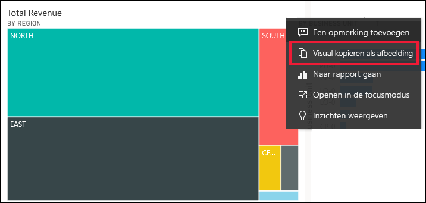

3. Wanneer het dialoogvenster **De visual is gereed om te kopiëren** wordt weergegeven, selecteert u **Naar het klembord kopiëren**.

    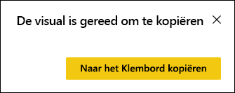

4. Wanneer uw visual gereed is, plakt u deze in een andere toepassing met **Ctrl + V** of door met de rechtermuisknop op Plakken te klikken. In de onderstaande schermopname is de visual in Microsoft Word geplakt. 

    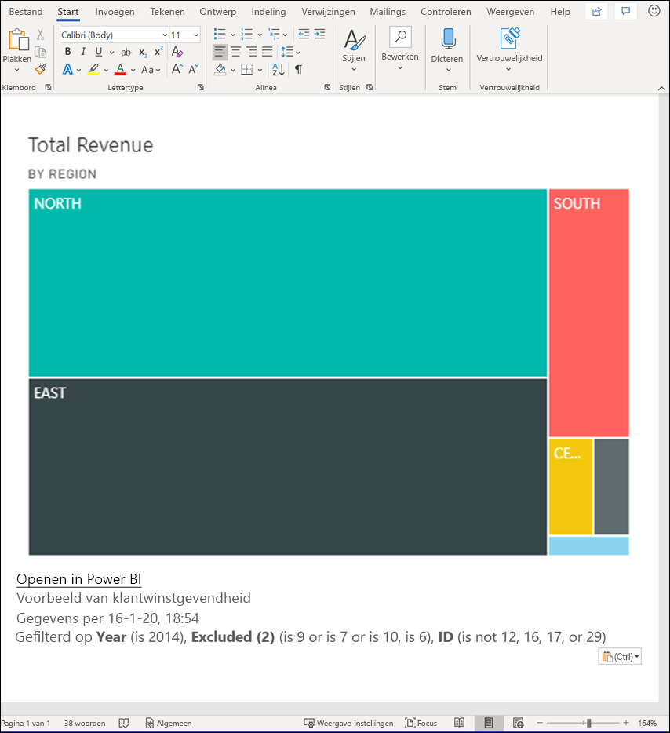

### Kopiëren vanuit een rapportvisual 

1. Navigeer naar het rapport van waaruit u inhoud wilt kopiëren.

2. In de rechterbovenhoek van de visual selecteert u het pictogram voor **Visual als afbeelding kopiëren**. 

    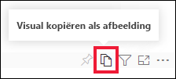

3. Wanneer het dialoogvenster **De visual is gereed om te kopiëren** wordt weergegeven, selecteert u **Naar het klembord kopiëren**.

    

4. Wanneer uw visual gereed is, plakt u deze in een andere toepassing met **Ctrl + V** of door met de rechtermuisknop op Plakken te klikken. In de onderstaande schermopname is de visual in een e-mailbericht geplakt.

    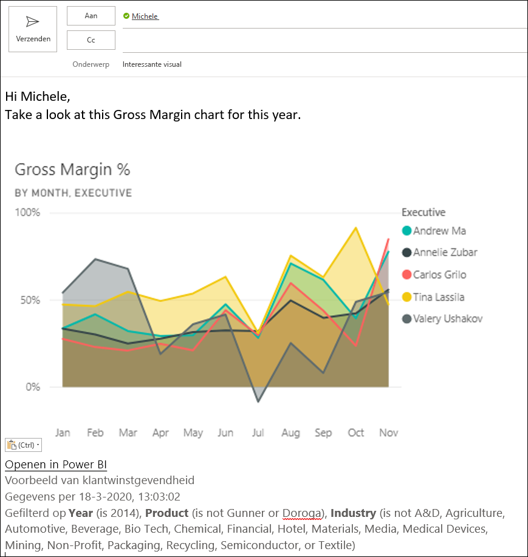

5. Als er een label over gevoeligheid van gegevens is toegepast op het rapport, wordt een waarschuwing weergegeven wanneer u het kopieerpictogram selecteert.  

    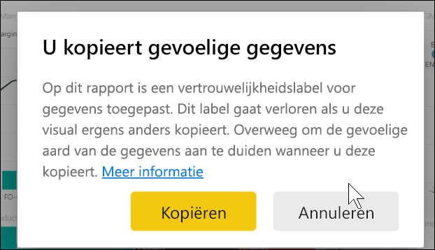

    Bovendien wordt een gevoeligheidslabel toegevoegd aan de metagegevens onder de geplakte visual. 

    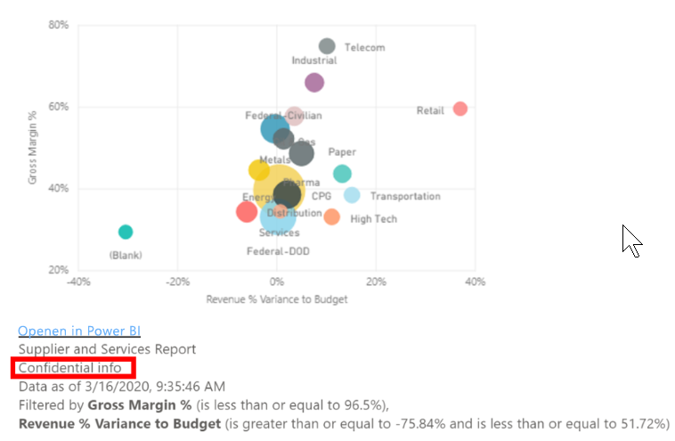

### Het kopiëren van een visual als een afbeelding beheren
Als u de eigenaar bent van de inhoud of een beheerder van de tenant bent, kunt u zelf bepalen of een visual als een afbeelding kan worden gekopieerd vanuit een rapport of dashboard.

#### Het kopiëren van een afbeelding voor een specifieke visual uitschakelen
Als u niet wilt dat gebruikers een specifieke visual kunnen kopiëren, kunt u het kopieerpictogram bij die visual verwijderen.
1. Selecteer het pictogram met de verfroller om het opmaakvenster te openen. 

1. Open de kaart **Opmaak van de visual**.
1. Blader omlaag naar **Visualheader**, vouw de kaart uit en schakel het **kopieerpictogram** uit.

    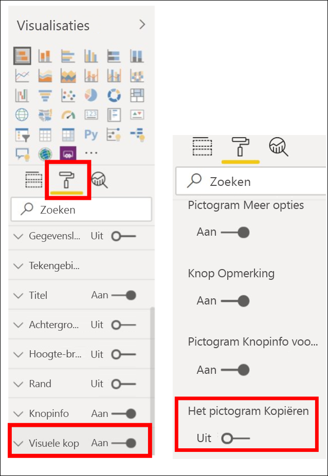

1. Als u de instelling **Visualheader** niet kunt vinden, schakelt u de optie voor een moderne visualheader onder **Rapportinstellingen** in. 

    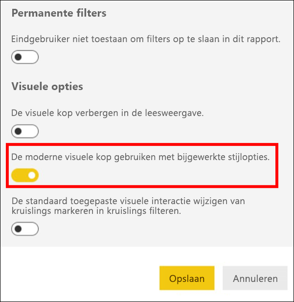

1. Sla wijzigingen op. Deel en publiceer de inhoud opnieuw als dat nodig is.

#### Het kopiëren van een afbeelding voor een groep gebruikers uitschakelen

Als u de eigenaar bent van de inhoud of een beheerder van de tenant bent, kunt u zelf regelen wie visuals kan kopiëren. Met deze instelling wordt *het kopiëren van een visual als afbeelding* uitgeschakeld voor alle inhoud waartoe de gebruiker toegang heeft in de Power BI-tenant.
  
1. Navigeer naar de beheerportal.

1. Onder **Tenantinstellingen** selecteert u **Instellingen exporteren en delen**. 

    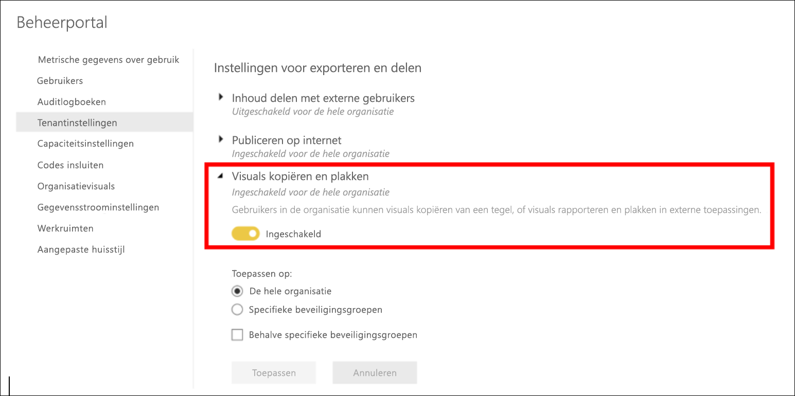

1. Schakel **Visuals kopiëren en plakken** voor uw geselecteerde gebruikersgroepen uit. 

1. Sla de wijzigingen op. De opgegeven groepen kunnen geen gebruik meer maken van **Visual als afbeelding kopiëren** in Power BI. 
  

## Aandachtspunten en probleemoplossing

   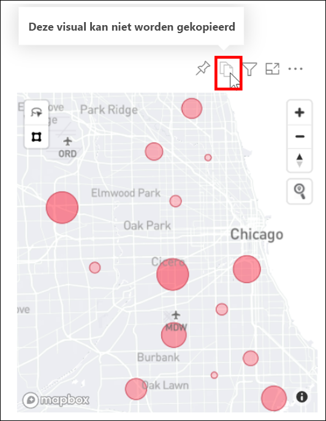

V: Waarom is het kopieerpictogram uitgeschakeld bij een visual?    
A: Momenteel worden systeemeigen Power BI-visuals en gecertificeerde visuals ondersteund. Er is beperkte ondersteuning voor bepaalde visuals, inclusief: 
- ESRI en andere kaartvisuals 
- Python-visuals 
- R-visuals 
- PowerApps 
- Niet-gecertificeerde aangepaste visuals Krijg meer informatie over het [certificeren van uw aangepaste visual](../developer/visuals/power-bi-custom-visuals-certified.md) zodat u ondersteuning krijgt voor uw aangepaste visual. 

V: Waarom wordt mijn visual niet goed geplakt?    
A: Er gelden beperkingen voor het kopiëren van een visual als een afbeelding, inclusief: 
- Voor aangepaste visuals 
    - Visuals met toegepaste thema's en kleuren 
    - Schaalaanpassing van tegels wanneer inhoud wordt geplakt 
    - Aangepaste visuals met animaties 
- Kopieerbeperkingen 
    - Een pas recent vastgemaakte dashboardtegel kan niet worden gekopieerd 
    - Kan gebruikers niet doorsturen naar inhoud met Odata-filters en plakstatussen zoals persoonlijke bladwijzers 
- In toepassingen met beperkte ondersteuning voor het plakken van als HTML opgemaakte inhoud van het klembord wordt mogelijk niet alle uit de visual gekopieerde inhoud weergegeven 

## Volgende stappen
Meer informatie over [visualisaties in Power BI-rapporten](power-bi-report-visualizations.md)

Hebt u nog vragen? [Misschien dat de Power BI-community het antwoord weet](https://community.powerbi.com/)

