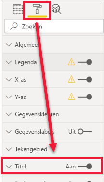
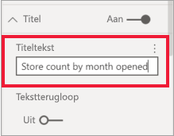
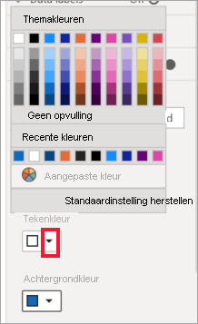
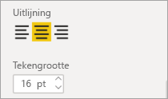
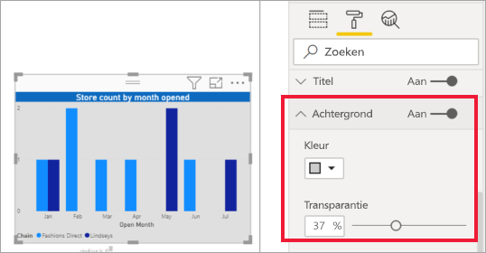
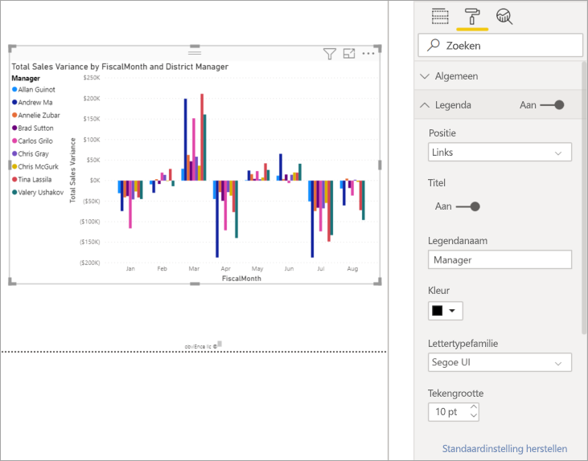

# Titels, legenda's en achtergronden van visualisaties aanpassen

[!INCLUDE[consumer-appliesto-nyyn](../includes/consumer-appliesto-nyyn.md)]    

In deze zelfstudie leert u een aantal verschillende manieren om uw visualisaties aan te passen. Er zijn heel veel mogelijkheden voor het aanpassen van uw visualisaties. De beste manier om ze allemaal te leren is door het deelvenster **Indeling** te verkennen (selecteer het pictogram van een verfroller). Dit artikel helpt u op weg door te laten zien hoe u de titel, legenda en achtergrond van een visualisatie kunt aanpassen en een thema kunt toevoegen.

U kunt niet alle visualisaties aanpassen. Zie de [volledige lijst](#visualization-types-that-you-can-customize) met visualisaties voor meer informatie.

## Vereisten

- De Power BI-service of Power BI Desktop

- Het rapport Voorbeeld van een retailanalyse

> [!NOTE]
> Voor het delen van uw rapport met een Power BI-collega moet u beiden beschikken over een afzonderlijke Power BI Pro-licentie of moet het rapport zijn opgeslagen in Premium-capaciteit. Zie [Rapporten delen](../collaborate-share/service-share-reports.md) voor meer informatie.

## Visualisatietitels in rapporten aanpassen

Als u mee wilt doen, meld u dan aan bij Power BI Desktop en open het rapport [Voorbeeld van een retailanalyse](../create-reports/sample-datasets.md).

> [!NOTE]
> Wanneer u een visualisatie aan een dashboard vastmaakt, wordt deze dashboardtegel. U kunt ook de tegels zelf aanpassen met [nieuwe titels, ondertitels en hyperlinks, en het formaat ervan kan worden gewijzigd](../create-reports/service-dashboard-edit-tile.md).

1. Ga naar de pagina **New Stores** van het rapport **Voorbeeld van een retailanalyse**.

1. Selecteer het gegroepeerde kolomdiagram **Open Store Count by Open Month and Chain**.

1. Selecteer in het deelvenster **Visualisaties** het verfrollerpictogram om de opmaakopties weer te geven.

1. Selecteer **Titel** om die sectie uit te vouwen.

   

1. Zet de schuifregelaar **Titel** op **Aan**.

1. Als u de titel wilt wijzigen, typt u *Store count by month opened* in het veld **Titeltekst**.

    

1. Wijzig **Tekenkleur** in wit en **Achtergrondkleur** in blauw.    

    a. Selecteer de vervolgkeuzelijst en kies een kleur bij **Themakleuren**, **Recente kleuren** en **Aangepaste kleur**.
    
    

    b. Selecteer de vervolgkeuzelijst om het kleurvenster te sluiten.

1. Vergroot de tekengrootte naar **16 pt**.

1. De laatste aanpassing van de grafiektitel die we doen is het uitlijnen ervan op het midden van de visualisatie.

    

    Op dit punt in de zelfstudie ziet de titel van uw gegroepeerde kolomdiagram er ongeveer als volgt uit:

    

Sla de wijzigingen op die u hebt aangebracht en ga naar de volgende sectie.

Als u om wat voor reden dan ook alle wijzigingen omgedaan wilt maken, selecteert u **Standaardinstelling herstellen** onderaan het aanpassingsvenster **Titel**.

## Visualisatieachtergrond aanpassen

Vouw met hetzelfde gegroepeerde kolomdiagram geselecteerd de opties voor  **Achtergrond** uit.

1. Zet de schuifregelaar **Achtergrond** op **Aan**.

1. Selecteer de vervolgkeuzelijst en kies een grijze kleur.

1. Wijzig de waarde voor **Doorzichtigheid** in **74%** .

Op dit punt in de zelfstudie ziet de achtergrond van uw gegroepeerde kolomdiagram er ongeveer als volgt uit:

Sla de wijzigingen op die u hebt aangebracht en ga naar de volgende sectie.

Als u om wat voor reden dan ook alle wijzigingen omgedaan wilt maken, selecteert u **Standaardinstelling herstellen** onderaan het aanpassingsvenster **Achtergrond**.

## Visualisatielegenda aanpassen

1. Open de rapportpagina **Overview** en selecteer de grafiek **Total Sales Variance by FiscalMonth and District Manager**.

1. Selecteer op het tabblad **Visualisaties** het pictogram met de verfroller om het deelvenster Indeling te openen.

1. Vouw de opties bij **Legenda** uit:

    

1. Zet de schuifregelaar **Legenda** op **Aan**.

1. Verplaats de legenda naar de linkerkant van de visualisatie.

1. Voeg een legendatitel in door **Titel** op **Aan** te zetten.

1. Typ *Manager* in het veld **Legendanaam**.

1. Wijzig **Kleur** in zwart.

Sla de wijzigingen op die u hebt aangebracht en ga naar de volgende sectie.

Als u om wat voor reden dan ook alle wijzigingen omgedaan wilt maken, selecteert u **Standaardinstelling herstellen** onderaan het aanpassingsvenster **Legenda**.

## Kleuren aanpassen met behulp van een thema

Met rapportthema's past u ontwerpwijzigingen toe op uw hele rapport. U kunt bijvoorbeeld uw bedrijfskleuren gebruiken, pictogrammen veranderen of een nieuwe indeling van visuals toepassen. Wanneer u een rapportthema toepast, worden voor alle visuals in het rapport de kleuren en indeling van het geselecteerde thema gebruikt.

Als u een thema wilt toepassen op uw rapport, selecteert u **Thema wisselen** in de menubalk. Kies een thema.  In het onderstaande rapport wordt gebruikgemaakt van het thema **Zon**.

 

## Visualisatietypen die kunnen worden aangepast

Hier ziet u een lijst van de visualisaties en de aanpassingsopties die per visualisatie beschikbaar zijn:

| Visualisatie | Titel | Achtergrond | Legenda |
|:--- |:--- |:--- |:--- |
| Gebied | ja | ja |ja |
| Staafdiagram | ja | ja |ja |
| Kaart | ja | ja |n.v.t. |
| Kaart met meerdere rijen | ja | ja | n.v.t. |
| Kolom | ja | ja | ja |
| Keuzelijst met invoervak | ja | ja | ja |
| Ringdiagram | ja | ja | ja |
| Choropletenkaart | ja | ja | ja |
| Trechterdiagram | ja | ja | n.v.t. |
| Meter | ja | ja | n.v.t. |
| Belangrijkste beïnvloeder | ja | ja | n.v.t. |
| KPI | ja | ja | n.v.t. |
| Lijn | ja | ja | ja |
| Kaart | ja | ja | ja |
| Matrix | ja | ja | n.v.t. |
| Cirkeldiagram | ja | ja | ja |
| Q&A | ja | ja | n.v.t. |
| Spreidingsdiagram | ja | ja | ja |
| Vorm | ja | ja | ja |
| Slicer | ja | ja | n.v.t. |
| Tabel | ja | ja | n.v.t. |
| Tekstvak | nee | ja | n.v.t. |
| Treemap | ja | ja | ja |
| Waterval | ja | ja | ja |

## Volgende stappen

- [Eigenschappen van X-as en Y-as aanpassen](power-bi-visualization-customize-x-axis-and-y-axis.md)

- [Aan de slag met de kleuropmaak en de eigenschappen van assen](service-getting-started-with-color-formatting-and-axis-properties.md)

Hebt u nog vragen? [Misschien dat de Power BI-community het antwoord weet](https://community.powerbi.com/)

