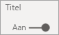

# Eigenschappen van x-as en y-as aanpassen

[!INCLUDE[consumer-appliesto-nyyn](../includes/consumer-appliesto-nyyn.md)]    

[!INCLUDE [power-bi-visuals-desktop-banner](../includes/power-bi-visuals-desktop-banner.md)]

In deze zelfstudie leert u veel verschillende manieren om de X-as en Y-as van uw visualisaties aan te passen. Niet alle visualisaties hebben assen. Cirkeldiagrammen hebben bijvoorbeeld geen assen. Daarnaast verschillen de aanpassingsopties per visualisatie. Aangezien de mogelijkheden te groot zijn om in één artikel te behandelen, bekijken we een aantal van de meestgebruikte aanpassingen en maken we u vertrouwd met het tabblad **Indeling** voor de opmaak van visualisaties in het rapportcanvas van Power BI.  

Kijk hoe Amanda de X- en Y-assen aanpast. Ze laat ook zien hoe u op verschillende manieren de samenvoeging kunt regelen wanneer u gaat inzoomen of uitzoomen.

> [!NOTE]
> Deze video maakt gebruik van een oudere versie van Power BI.

<iframe width="560" height="315" src="https://www.youtube.com/embed/9DeAKM4SNJM" frameborder="0" allowfullscreen></iframe>

## Vereisten

- Power BI Desktop

- [Voorbeeld van een retailanalyse ](https://download.microsoft.com/download/9/6/D/96DDC2FF-2568-491D-AAFA-AFDD6F763AE3/Retail%20Analysis%20Sample%20PBIX.pbix)

## Een nieuwe visualisatie toevoegen

Voordat u een visualisatie kunt aanpassen, zult u deze moeten bouwen.

1. Open het voorbeeld van een retailanalyse in Power BI Desktop.  

2. Selecteer onderaan het gele pictogram met het plusteken om een nieuwe pagina toe te voegen. 

    

1. Selecteer in het deelvenster **Visualisaties** het pictogram Gestapeld kolomdiagram. Hiermee voegt u een lege sjabloon aan uw rapportcanvas toe.

    

1. Als u de waarden voor de x-as wilt instellen, selecteert u **Tijd** > **Boekmaand** in het deelvenster **Velden**.

1. Als u de waarden voor de y-as wilt instellen, selecteert u **Verkoop** > **Verkoop vorig jaar** en **Verkoop** > **Verkoop dit jaar** > **Waarde** in het deelvenster **Velden**.

    

    Nu kunt u de x-as gaan aanpassen. Power BI biedt bijna onbeperkte mogelijkheden voor het opmaken van uw visualisatie. 

## De x-as aanpassen
Er zijn veel functies die kunnen worden aangepast voor de x-as. U kunt de gegevenslabels en de titel van de x-as toevoegen en wijzigen. Voor categorieën kunt u de breedte, grootte en opvulling van balken, kolommen, lijnen en gebieden aanpassen. En voor waarden kunt u de weergave-eenheden, het aantal decimalen en de rasterlijnen wijzigen. In het volgende voorbeeld wordt de aanpassing voor een kolomdiagram weergegeven. Laten we een paar aanpassingen toevoegen zodat u vertrouwd raakt met de mogelijkheden en vervolgens de rest zelf kunt gaan verkennen.

### De labels voor de x-as aanpassen
De labels van de x-as worden onder de kolommen in het diagram weergegeven. Ze zijn nu lichtgrijs, klein en moeilijk te lezen. We gaan dit wijzigen.

1. Selecteer in het deelvenster **Visualisaties** het pictogram **Indeling** (het pictogram van een verfroller  ) om de aanpassingsopties weer te geven.

2. Vouw de opties voor de x-as uit.

   

3. Verplaats de schuifregelaar **X-as** naar **Aan**.

    

    Een aantal redenen waarom u de x-as wilt instellen op **Uit**, is als de visualisatie zelf geen labels bevat of als u een rapportpagina hebt en ruimte moet maken om meer gegevens weer te geven.

4. Maak de kleur, de grootte en het lettertype van de tekst op:

    - **Kleur**: selecteer zwart

    - **Tekengrootte**: voer *14* in

    - **Lettertypefamilie**: selecteer **Arial Black**

    - **Binnenste opvulling**: voer *40%* in

        
    
5. Misschien bent u niet tevreden over de manier waarop de tekst van de x-as wordt weergegeven op een diagonaal. U beschikt over verschillende opties. 
    - Wijzig de tekengrootte in een waarde die kleiner is dan 14.
    - Maak de visualisatie groter. 
    - Geef minder kolommen weer en voeg een schuifbalk toe door **Minimum categoriebreedte** te verhogen. 
    
    Hier hebben we de tweede optie geselecteerd en gebruiken we een van de formaatbalken om de visualisatie breder te maken. Deze is nu geschikt voor de 14-punts tekst zonder dat de tekst in een hoek of met een schuifbalk hoeft te worden weergegeven. 

   

### De titel van de x-as aanpassen
Wanneer de titel van de x-as **Aan** is, wordt de titel van de x-as weergegeven onder de labels van de x-as. 

1. Zet de titel van de x-as eerst op **Aan**.  

    

    Het eerste wat u ziet, is dat uw visualisatie nu een standaardtitel voor de x-as heeft.  In dit geval is dat **FiscalMonth**.

   

1. Maak de kleur, de grootte en het lettertype van de titeltekst op:

    - **Titelkleur**: selecteer oranje

    - **Astitel**: typ *Boekmaand*

    - **Tekengrootte titel**: voer *18 in*

    Als u klaar bent met de aanpassingen, ziet het gestapelde kolomdiagram er ongeveer als volgt uit:

    

1. Sla de wijzigingen op die u hebt aangebracht en ga naar de volgende sectie. Als u om wat voor reden dan ook alle wijzigingen omgedaan wilt maken, selecteert u **Standaardinstelling herstellen** onderaan het aanpassingsvenster **X-as**. Vervolgens gaat u de Y-as aanpassen.

## De y-as aanpassen
Er zijn veel functies die kunnen worden aangepast voor de y-as. U kunt de gegevenslabels, de titel van de y-as en rasterlijnen toevoegen en wijzigen. Voor waarden kunt u de weergave-eenheden, het aantal decimalen, het beginpunt en het eindpunt wijzigen. En voor categorieën kunt u de breedte, grootte en opvulling van balken, kolommen, lijnen en gebieden aanpassen. 

In het volgende voorbeeld gaan we verder met het aanpassen van een kolomdiagram. We gaan een paar wijzigingen aanbrengen, zodat u vertrouwd raakt met de mogelijkheden en vervolgens de rest zelf kunt gaan verkennen.

### De labels voor de y-as aanpassen
De labels van de y-as worden standaard aan de linkerkant weergegeven. Ze zijn nu lichtgrijs, klein en moeilijk te lezen. We gaan dit wijzigen.

1. Vouw de Y-as-opties uit.

   

1. Zet de schuifregelaar **Y-as** op **Aan**.  

    

    Een reden waarom u mogelijk de y-as zou willen uitschakelen, is om ruimte te maken voor meer gegevens.

1. Maak de kleur, de grootte en het lettertype van de tekst op:

    - **Kleur**: selecteer zwart

    - **Tekengrootte**: voer *10 in*

    - **Weergave-eenheden**: selecteer **Miljoenen**

    

### De titel van de y-as aanpassen
Wanneer de titel van de y-as **Aan** is, wordt de titel van de y-as weergegeven onder de labels van de y-as. Deze visualisatie wordt er niet beter op als we een titel gebruiken voor de Y-as, dus laten we **Titel** op **Uit** staan. Verderop in deze zelfstudie voegen we titels van de y-as toe aan een visual met dubbele assen. 

### De rasterlijnen aanpassen
We laten de rasterlijnen opvallen door de kleur te wijzigen en de streek dikker te maken:

- **Kleur**: selecteer oranje

- **Streekdikte**: voer *2* in

Na al deze aanpassingen zou uw kolomdiagram er ongeveer als volgt moeten uitzien:

## Visualisaties met twee y-assen aanpassen

Sommige visualisaties kunnen twee y-assen hebben. Combinatiegrafieken zijn hiervan een goed voorbeeld. Voordat we twee y-assen kunnen opmaken, maken we een combinatiegrafiek waarin trends voor verkoop en brutomarge worden vergeleken.  

### Een grafiek met twee Y-assen maken

1. Selecteer het kolomdiagram en wijzig dit in een *lijndiagram met een gestapeld kolomdiagram*. Dit type visual ondersteunt één lijndiagramwaarde en meerdere stapelbare kolomwaarden. 

    
   

2. Sleep **Verkoop** > **Brutomarge% vorig jaar** vanuit het deelvenster Velden naar de bucket **Lijnwaarden**.

    

    
3. Maak de visualisatie zo op dat de labels van de x-as met een hoek worden verwijderd. 

   

   Power BI maakt twee y-assen, waardoor de schaal van de waarden afzonderlijk van elkaar kunnen worden ingesteld. Op de linkeras wordt de verkoop aangegeven in dollars en op de rechteras het brutomargepercentage.

### De tweede y-as opmaken
Omdat we met een visualisatie met één opgemaakte y-as zijn begonnen, heeft Power BI de tweede y-as met dezelfde instellingen gemaakt. Maar we kunnen dit wijzigen. 

1. Selecteer het verfrollerpictogram in het deelvenster **Visualisaties** om de opmaakopties weer te geven.

1. Vouw de Y-as-opties uit.

1. Scrol omlaag totdat u de optie **Secundaire weergeven** ziet. Controleer of deze op **Aan** staat. De secundaire y-as vertegenwoordigt het lijndiagram.

   

1. (Optioneel) Pas de tekstkleur, de grootte en de weergave-eenheden voor de twee assen aan. Als u de **Positie** voor de kolomas of de lijnas verwisselt, wisselen de twee assen van kant.

### Voeg titels toe aan beide assen

In het geval van een visualisatie die ingewikkeld is, kan het zinvol zijn om astitels toe te voegen.  Titels helpen uw collega's het verhaal te begrijpen dat u met uw visualisatie wilt overbrengen.

1. Zet de **Titel** op **Aan** voor **Y-as (kolom)** en de **Y-as (rij)** .

1. Stel **Stijl** in op **Alleen titel weergeven** voor beide assen.

   

1. In uw combinatiegrafiek worden nu twee assen weergegeven, beide met titels.

   

1. De titels opmaken. In dit voorbeeld hebben we een van de titels ingekort en is de tekengrootte voor beide gereduceerd. 
    - Tekengrootte: **9**
    - De **Astitel** voor de eerste y-as (het kolomdiagram) is ingekort: Verkoop vorig jaar en dit jaar. 
    
     

    Zie [Tips en trucs voor kleuropmaak in Power BI](service-tips-and-tricks-for-color-formatting.md) en [Titels, legenda's en achtergronden van visualisaties aanpassen](power-bi-visualization-customize-title-background-and-legend.md) voor meer informatie. 
    

## Volgende stappen

- [Visualisaties in Power BI-rapporten](power-bi-report-visualizations.md)

Hebt u nog vragen? [Misschien dat de Power BI-community het antwoord weet](https://community.powerbi.com/)
