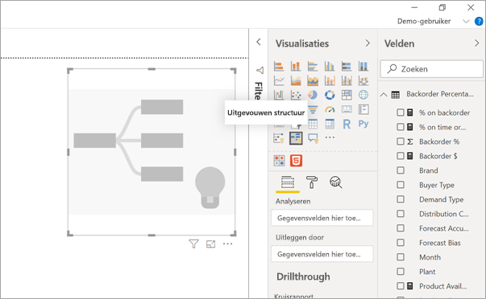
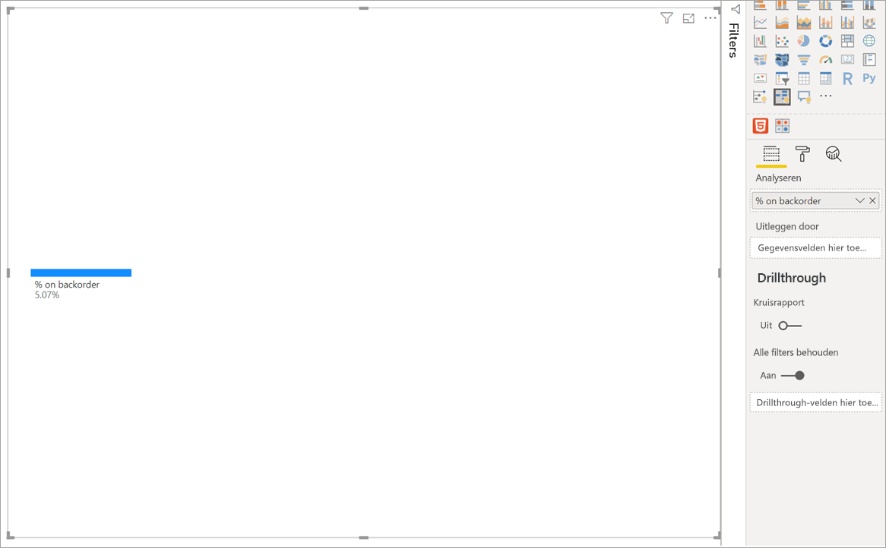
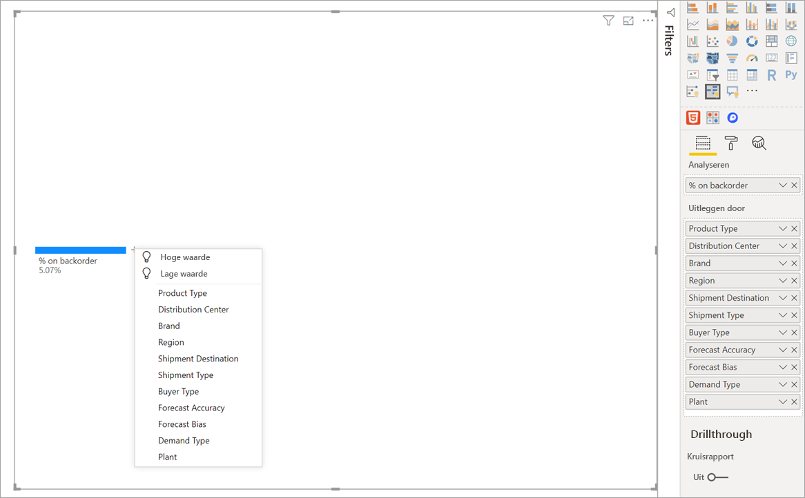
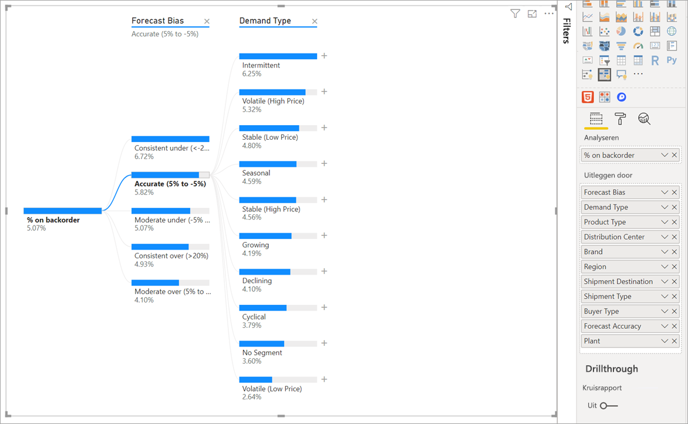
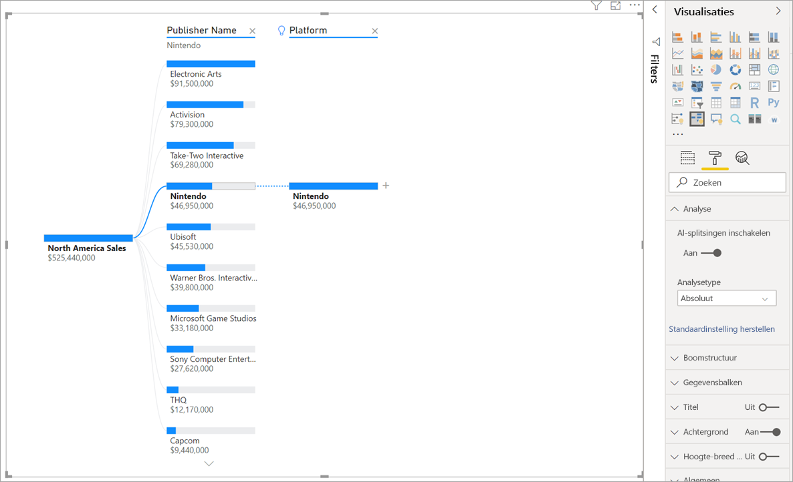
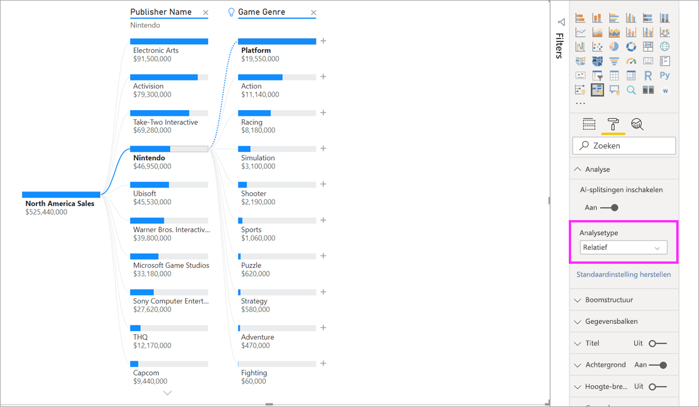
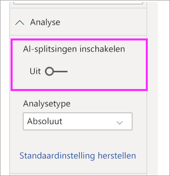

# Visuals van een uitgevouwen structuur in Power BI maken en weergeven

[!INCLUDE[consumer-appliesto-nyyn](../includes/consumer-appliesto-nyyn.md)]

[!INCLUDE [power-bi-visuals-desktop-banner](../includes/power-bi-visuals-desktop-banner.md)]

Met de visual van een uitgevouwen structuur in Power BI kunt u gegevens in meerdere dimensies visualiseren. Gegevens worden automatisch samengevoegd, en u kunt in elke gewenste volgorde inzoomen op uw dimensies. Het is ook een AI-visualisatie (kunstmatige intelligentie). U kunt dus ook vragen om de volgende dimensie te zoeken waarop moet worden ingezoomd, op basis van bepaalde criteria. Dit maakt het een waardevol hulpprogramma voor ad-hocverkenning en het uitvoeren van hoofdoorzaakanalyse.

In deze zelfstudie worden twee voorbeelden gebruikt:

- Een scenario voor toelevering waarin het percentage producten wordt geanalyseerd dat een bedrijf moet naleveren (omdat ze niet op voorraad zijn).  
- Een verkoopscenario waarin de verkoop van videogames wordt opgesplitst in verschillende factoren, zoals genre en uitgever.

U kunt hier de pbix vinden die wordt gebruikt in het toeleveringsketenscenario: [Toeleveringsketen Sample.pbix](
https://github.com/microsoft/powerbi-desktop-samples/blob/master/Sample%20Reports/Supply%20Chain%20Sample.pbix).

> [!NOTE]
> Voor het delen van uw rapport met een Power BI-collega moet u beiden beschikken over een afzonderlijke Power BI Pro-licentie of moet het rapport zijn opgeslagen in Premium-capaciteit.    

## Aan de slag
Selecteer in het deelvenster Visualisaties het pictogram voor de uitgevouwen structuur.

Voor de visualisatie zijn twee typen invoer vereist:

 - **Analyseren** : de metrische gegevens die u wilt analyseren. Dit moet een meting of aggregatie zijn.  
 - **Uitleg door** : een of meer dimensies waarop u wilt inzoomen.

Wanneer u de meting naar het veldbereik hebt gesleept, wordt de visual bijgewerkt met de cumulatieve meting. In het onderstaande voorbeeld wordt het gemiddelde percentage producten voor de nalevering gevisualiseerd (5,07%).

De volgende stap is het inbrengen van een of meer dimensies waarop u wilt inzoomen. Voeg deze velden toe aan de bucket **Uitleg door**. U ziet dat er een plusteken naast het hoofdknooppunt wordt weergegeven. Als u de + selecteert, kunt u kiezen op welk veld u wilt inzoomen (u kunt in een willekeurige volgorde inzoomen op de velden).

Als u **Afwijking van prognose** selecteert, heeft dit tot gevolg dat de structuur wordt uitgevouwen en dat de meting wordt opgesplitst in de waarden van de kolom. Dit proces kan worden herhaald door een ander knooppunt te kiezen om op in te zoomen.

Als u een knooppunt uit het laatste niveau selecteert, worden de gegevens kruislings gefilterd. Als u een knooppunt van een eerder niveau selecteert, wordt het pad gewijzigd.

Door interactie met andere visuals wordt de uitgevouwen structuur kruislings gefilterd. De volgorde van de knooppunten binnen niveaus wordt hierdoor mogelijk gewijzigd.
In het onderstaande voorbeeld is de structuur kruislings gefilterd met Ubisoft. Het pad wordt bijgewerkt en de verkoop van Xbox verplaatst van de eerste naar de tweede plek, omdat deze is ingehaald door PlayStation. 

Als de we structuur vervolgens kruislings filteren met Nintendo, is het verkoopveld van Xbox leeg, omdat er geen Nintendo-games worden ontwikkeld voor Xbox. Xbox wordt, samen met het volgende pad, uit de weergave gefilterd.

Ondanks dat het pad verdwijnt, blijven de bestaande niveaus (in dit geval Gamegenre) vastgemaakt in de structuur. Door het knooppunt Nintendo te selecteren, wordt de structuur daarom automatisch uitgebreid naar Gamegenre.

## AI-splitsingen

U kunt AI-splitsingen gebruiken om uit te zoeken waar in de gegevens u hierna moet zoeken. Deze splitsingen worden boven aan de lijst weergegeven en zijn gemarkeerd met een gloeilamp. De splitsingen zijn bedoeld om u te helpen (automatisch) hoge en lage waarden in de gegevens te vinden.

De analyse kan op twee manieren worden uitgevoerd, afhankelijk van uw voorkeuren. Het standaardgedrag is als volgt:

 - **Hoge waarde** : Kijkt naar alle beschikbare velden en bepaalt op welke wordt ingezoomd, om de hoogste waarde te krijgen voor de meting die wordt geanalyseerd.  
 - **Lage waarde** : Kijkt naar alle beschikbare velden en bepaalt op welke wordt ingezoomd, om de laagste waarde te krijgen voor de meting die wordt geanalyseerd.  

Als u in het voorbeeld over naleveringen de optie **Hoge waarde** selecteert, resulteert dit in het volgende:

Er wordt een gloeilamp weergegeven naast **Producttype** om aan te geven dat dit een AI-splitsing is. De structuur biedt ook een stippellijn die het knooppunt **Patiëntencontrole** aanbeveelt, aangezien dit resulteert in de hoogste waarde voor naleveringen (9,2%). 

Beweeg de muisaanwijzer over de gloeilamp om knopinfo weer te geven. In dit voorbeeld is de knopinfo: ‘% nalevering is het hoogste wanneer Producttype is Patiëntencontrole’.

U kunt de visual configureren om **relatieve** AI-splitsingen te vinden, in plaats van **absolute** AI-splitsingen. 

In de relatieve modus wordt gezocht naar hoge waarden die opvallen (vergeleken met de rest van de gegevens in de kolom). Hier is een voorbeeld ter illustratie:

In de bovenstaande schermafbeelding ziet u de verkoop van videogames in Noord-Amerika. Eerst splitsen we de structuur op in **Naam van uitgever** , en vervolgens zoomen we in op Nintendo. Het selecteren van **Hoge waarde** resulteert in de uitbreiding van **Platform is Nintendo**. Omdat Nintendo (de uitgever) alleen Nintendo-consoles ontwikkelt, is er slechts één waarde aanwezig, wat dus (volgens verwachting) de hoogste waarde is.

Het zou echter interessanter zijn om te kijken welke hoge waarde opvalt ten opzichte van andere waarden in dezelfde kolom. Als we het analysetype wijzigen van **Absoluut** in **Relatief** , krijgen we het volgende resultaat voor Nintendo: 

Deze keer is **Platform binnen Gamegenre** de aanbevolen waarde.  Platform levert geen hogere absolute waarde op dan Nintendo ($ 19.950.000 versus $ 46.950.000). Het is desalniettemin een waarde die opvalt.

Om preciezer te zijn: aangezien er 10 waarden zijn voor Gamegenre, zou de waarde voor Platform $ 4,67 miljoen zijn, als deze waarden gelijkmatig werden opgesplitst. Platform heeft een waarde van bijna $ 20 miljoen, wat een interessant resultaat is, omdat dit vier keer zo hoog is dan verwacht.

De berekening is als volgt:

Verkoop voor Platform in Noord-Amerika/ABS (Gem (verkoop in Noord-Amerika voor Gamegenre))  
versus  
Verkoop voor Nintendo in Noord-Amerika/ABS (Gem (verkoop in Noord-Amerika voor Platform))  

Die laat zich als volgt vertalen:

19.550.000 / (19.550.000 + 11.140.000 + ... + 470.000 + 60.000 /10) = 4,25x  
versus  
46.950.000/ (46.950.000/1) = 1x  

Als u liever geen AI-splitsingen in de structuur gebruikt, kunt u deze ook uitschakelen onder de opties voor **Analyseopmaak** :  

## Structuurinteracties met AI-splitsingen

U kunt meerdere volgende AI-niveaus hebben. U kunt ook verschillende soorten AI-niveaus combineren (ga van Hoge waarde naar Lage waarde, en weer terug naar Hoge waarde):

Als u een ander knooppunt in de structuur selecteert, wordt de AI-splitsing helemaal opnieuw berekend. In het onderstaande voorbeeld is het geselecteerde knooppunt gewijzigd in het niveau **Afwijking van prognose**. De volgende niveaus worden ook gewijzigd om de juiste hoge en lage waarden te tonen.

AI-niveaus worden ook opnieuw berekend wanneer u de uitgevouwen structuur kruislings filtert met een andere visual. In het onderstaande voorbeeld ziet u dat het percentage naleveringen het hoogste is voor Plant #0477.

Maar als we in het staafdiagram de optie **april** selecteren, wordt de hoogste waarde gewijzigd in **Producttype is Geavanceerd chirurgisch**. In dit geval zijn niet alleen de knooppunten opnieuw gerangschikt, maar is een compleet andere kolom gekozen. 

Als u wilt dat AI-niveaus zich gedragen als niet-AI-niveaus, selecteert u de gloeilamp om het gedrag te herstellen naar het standaardgedrag. 

Meerdere AI-niveaus kunnen aan elkaar worden gekoppeld, maar een niet-AI-niveau kan niet volgen op een AI-niveau. Als we handmatig splitsen volgend op een AI-splitsing, verdwijnt de gloeilamp uit het AI-niveau en wordt het niveau getransformeerd naar een normaal niveau. 

## Vergrendelen

Een maker van inhoud kan niveaus vergrendelen voor rapportgebruikers. Wanneer een niveau is vergrendeld, kan het niet worden verwijderd of gewijzigd. Een consument kan verschillende paden binnen het vergrendelde niveau verkennen, maar kan het niveau zelf niet wijzigen. Als maker kunt u de muisaanwijzer over de bestaande niveaus bewegen om het vergrendelingspictogram weer te geven. U kunt zoveel niveaus vergrendelen als u wilt, maar niet-vergrendelde niveaus kunnen niet voorafgaan aan vergrendelde niveaus.

In het onderstaande voorbeeld zijn de eerste twee niveaus vergrendeld. Dit betekent dat gebruikers van het rapport niveau 3 en 4 kunnen wijzigen, en zelfs later nieuwe niveaus kunnen toevoegen. De eerste twee niveaus kunnen echter niet worden gewijzigd:

## Bekende beperkingen

Het maximumaantal niveaus voor de structuur is 50. Het maximumaantal gegevenspunten dat in één keer in de structuur kan worden gevisualiseerd, is 5000. Er worden niveaus afgekapt om de bovenste n weer te geven. Momenteel is de bovenste n per niveau ingesteld op 10. 

De uitgevouwen structuur wordt niet ondersteund in de volgende scenario's:  
-   On-premises Analysis Services

AI-splitsingen worden niet ondersteund in de volgende scenario's:  
-   Azure Analysis Services
-   Power BI Report Server
-   Publiceren op internet
-   Complexe metingen en metingen vanuit uitbreidingsschema's in Analyseren

Andere beperkingen:
- Ondersteuning binnen Q&A

## Volgende stappen

[Power BI-ringdiagram maken](power-bi-visualization-doughnut-charts.md)

[Power BI-visualisaties](power-bi-report-visualizations.md)

