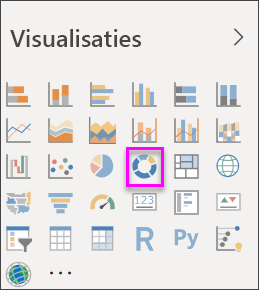

# Ringdiagrammen maken en gebruiken in Power BI

[!INCLUDE[consumer-appliesto-nyyn](../includes/consumer-appliesto-nyyn.md)]

[!INCLUDE [power-bi-visuals-desktop-banner](../includes/power-bi-visuals-desktop-banner.md)]

Een ringdiagram lijkt sterk op een cirkeldiagram omdat ook hierin de relatie van de delen ten opzichte van het geheel wordt getoond. Het enige verschil is dat het midden leeg is, waardoor er ruimte is voor een label of pictogram.

## Vereiste

In deze zelfstudie wordt gebruikgemaakt van het [PBIX-bestand met het voorbeeld van een retailanalyse](https://download.microsoft.com/download/9/6/D/96DDC2FF-2568-491D-AAFA-AFDD6F763AE3/Retail%20Analysis%20Sample%20PBIX.pbix).

1. Selecteer linksboven in de menubalk **Bestand** > **Openen**
   
2. Ga naar uw kopie van het **PBIX-bestand met het voorbeeld van een retailanalyse**

1. Open het **PBIX-bestand met het voorbeeld van een retailanalyse** in de rapportweergave 

1. Selecteren  om een nieuwe pagina toe te voegen.

> [!NOTE]
> Voor het delen van uw rapport met een Power BI-collega moeten u beiden beschikken over een afzonderlijke Power BI Pro-licentie of moet het rapport zijn opgeslagen in Premium-capaciteit.    

## Een ringdiagram maken

1. Begin op een lege rapportpagina en selecteer in het deelvenster Velden **Omzet** \> **Omzet van afgelopen jaar**.  
   
3. Selecteer in het deelvenster Visualisaties het pictogram voor het ringdiagram  om uw staafdiagram te converteren naar een ringdiagram. Als **Omzet van afgelopen jaar** niet voorkomt in het gebied **Waarden**, sleept u het erheen.
     
   

4. Selecteer **Artikel** \> **Categorie** om deze toe te voegen aan het gebied **Legenda**. 
     
    

5. U kunt desgewenst [de grootte en de kleur van de tekst van de grafiek aanpassen](power-bi-visualization-customize-title-background-and-legend.md). 

## Aandachtspunten en probleemoplossing
* De som van de waarden in het ringdiagram moet 100% zijn.
* Te veel categorieën zorgen er voor dat het diagram moeilijk te interpreteren is.
* Ringdiagrammen kunnen het best worden gebruikt om een bepaalde sectie met het totaal te vergelijken en niet om de afzonderlijke secties onderling te vergelijken. 

## Volgende stappen
[Trechterdiagrammen in Power BI](power-bi-visualization-funnel-charts.md)

[Visualization types in Power BI](power-bi-visualization-types-for-reports-and-q-and-a.md) (Typen visualisaties in Power BI)

