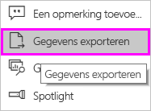
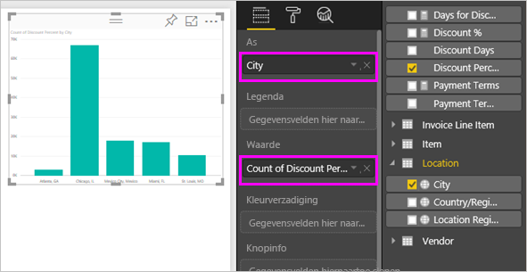
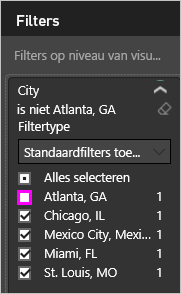
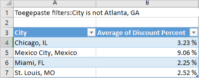
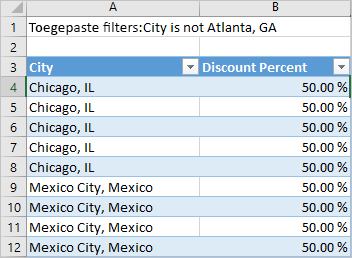

# Gegevens uit visualisaties exporteren

Als u de gegevens wilt zien die in Power BI worden gebruikt om een visualisatie te maken, [kunt u deze gegevens weergeven in Power BI](service-reports-show-data.md). U kunt deze gegevens ook exporteren naar Excel als een *.xlsx*- of *.csv*-bestand. Als u de optie voor het exporteren van de gegevens wilt gebruiken, hebt u een Pro- of Premium-licentie en machtigingen voor het bewerken van de gegevensset en het rapport nodig.

Kijk hoe Will de gegevens van een van de visualisaties in zijn rapport exporteert, opslaat als *.xlsx*-bestand en opent in Excel. Gebruik vervolgens de stapsgewijze instructies onder de video om het zelf te proberen.

<iframe width="560" height="315" src="https://www.youtube.com/embed/KjheMTGjDXw" frameborder="0" allowfullscreen></iframe>

## Gegevens van een Power BI-dashboard exporteren

1. Selecteer het beletselteken in de rechterbovenhoek van de visualisatie.

    

1. Kies het pictogram **Gegevens exporteren**.

    

1. De gegevens worden uit Power BI geëxporteerd naar een *.csv*-bestand. Als u de visualisatie hebt gefilterd, worden de gedownloade gegevens gefilterd via de app.

1. U wordt gevraagd het bestand op te slaan.  Nadat het is opgeslagen, opent u het *.csv*-bestand in Excel.

    

## Gegevens uit een rapport exporteren

Als u wilt meedoen, opent u het rapport [Procurement analysis sample](../sample-procurement.md) (Voorbeeld van een inkoopanalyse) in de bewerkingsweergave. Voeg een nieuwe, lege rapportpagina toe. Volg vervolgens onderstaande stappen om een aggregatie en een filter op visualisatieniveau toe te voegen.

1. Maak een nieuw **Gestapeld kolomdiagram**.

1. Selecteer in het deelvenster **Velden** de opties **Locatie > Plaats** en **Factuur > Kortingspercentage**.  Mogelijk moet u **Kortingspercentage** verplaatsen naar de brons **Waarde**.

    

1. Wijzig de aggregatie voor **Kortingspercentage** van **Aantal** in **Gemiddelde**. Selecteer in de bron **Waarde** de pijl aan de rechterkant van **Kortingspercentage** (er staat mogelijk **Aantal kortingspercentage**) en kies **Gemiddelde**.

    

1. Voeg een filter toe aan **Plaats**, selecteer alle plaatsen en verwijder vervolgens **Atlanta**.

    

   Nu zijn we klaar om beide opties voor het exporteren van gegevens uit te proberen.

1. Selecteer het beletselteken in de rechterbovenhoek van de visualisatie. Selecteer **Gegevens exporteren**.

    

    Als uw visualisatie in Power BI Online een statistische functie heeft (bijvoorbeeld als u **Aantal** wijzigt in *Gemiddelde*, *Som* of *Minimum*), hebt u twee opties:

    - **Samengevatte gegevens**

    - **Onderliggende gegevens**

    In Power BI Desktop hebt u alleen de optie voor **Samengevatte gegevens**. Zie voor hulp bij statistische functies [Statistische functies in Power BI](../service-aggregates.md).

1. Selecteer in **Gegevens exporteren** de optie **Samengevatte gegevens**, en kies *.xlsx* of *.csv*. Selecteer vervolgens **Exporteren**. Power BI exporteert de gegevens.

    

    Als u filters op de visualisatie hebt toegepast, worden de geëxporteerde gegevens geëxporteerd als gefilterd. Wanneer u **Exporteren** selecteert, wordt u gevraagd het bestand op te slaan. Nadat het is opgeslagen, opent u het bestand in Excel.
    
    Alle gegevens die worden gebruikt door de hiërarchie, worden geëxporteerd, niet alleen de gegevens die voor het huidige detailniveau voor de visual worden gebruikt. Als er bijvoorbeeld nog nooit van het hoogste niveau op de visualisatie is ingezoomd, bevatten de geëxporteerde gegevens alle gegevens in de hiërarchie, niet alleen de gegevens die zijn gebruikt om de visual met het huidige detailniveau te maken.

    **Samengevatte gegevens**: Selecteer deze optie als u gegevens wilt exporteren voor wat u ziet in de visual.  Bij dit type uitvoer ziet u alleen de gegevens (kolommen en metingen) die u hebt gekozen om de visual te maken.  Als de visual een statistische functie bevat, exporteert u hiermee statistische gegevens. Als u bijvoorbeeld een staafdiagram met vier balken hebt, krijgt u vier rijen met gegevens. Samengevatte gegevens is beschikbaar als *.xlsx* en *.csv*.

    In dit voorbeeld bevat onze Excel-export één totaal voor elke plaats. Omdat we Atlanta hebben uitgefilterd, is deze plaats niet opgenomen in de resultaten. In de eerste rij van de spreadsheet ziet u de filters die zijn gebruikt in Power BI bij het extraheren van de gegevens.

    

1. Selecteer nu **Onderliggende gegevens**, *.xlsx* en vervolgens **Exporteren**. Power BI exporteert de gegevens. 

    > [!NOTE]
    > Afhankelijk van de rapportinstellingen hebt u wel of niet de optie om onderliggende gegevens te exporteren.

    Als u filters op de visualisatie hebt toegepast, worden de geëxporteerde gegevens geëxporteerd als gefilterd. Wanneer u **Exporteren** selecteert, wordt u gevraagd het bestand op te slaan. Nadat het is opgeslagen, opent u het bestand in Excel.
    
    Alle gegevens die worden gebruikt door de hiërarchie, worden geëxporteerd, niet alleen de gegevens die voor het huidige detailniveau voor de visual worden gebruikt. Als er bijvoorbeeld nog nooit van het hoogste niveau op de visualisatie is ingezoomd, bevatten de geëxporteerde gegevens alle gegevens in de hiërarchie, niet alleen de gegevens die zijn gebruikt om de visual met het huidige detailniveau te maken.

    >[!WARNING]
    >Door onderliggende gegevens te exporteren kunnen gebruikers alle gedetailleerde gegevens zien: elke kolom in de gegevens. Beheerders van de Power BI-service kunnen dit uitschakelen voor hun organisatie. Als u de eigenaar van een gegevensset bent, kunt u eigen kolommen instellen als **verborgen**, zodat ze niet worden weergegeven in de lijst **Velden** in Desktop of in de Power BI-service.

    **Onderliggende gegevens**: Selecteer deze optie als u de gegevens in de visual ***en*** aanvullende gegevens uit het model wilt weergeven (bekijk de onderstaande grafiek voor meer informatie). Als uw visualisatie een statistische functie bevat, wordt de statistische functie verwijderd als u *Onderliggende gegevens* selecteert. Wanneer u **Exporteren** selecteert, worden de gegevens in Power BI geëxporteerd naar een *.xlsx*-bestand en wordt u gevraagd het bestand op te slaan. Nadat het is opgeslagen, opent u het bestand in Excel.

    In dit voorbeeld wordt in de Excel-export één rij weergegeven voor elke Plaats-rij in onze gegevensset, en het kortingspercentage voor deze ene vermelding. De gegevens worden vereenvoudigd in Power BI. Ze worden niet samengevoegd. In de eerste rij van de spreadsheet ziet u de filters die zijn gebruikt in Power BI bij het extraheren van de gegevens.  

    

## Details van de onderliggende gegevens exporteren

Wat u ziet wanneer u **Onderliggende gegevens** selecteert, varieert. Vraag de beheerder of IT-afdeling om meer informatie over deze details. In Power BI Desktop of de Power BI-service wordt in de rapportweergave een *meting* weergegeven in de lijst **Velden** met een rekenmachinepictogram . In Power BI Desktop worden metingen gemaakt. Met de Power BI-service gebeurt dit niet.

| De visual bevat | Wat u ziet in het exportbestand  |
|---------------- | ---------------------------|
| Statistische functies | de *eerste* statistische functie en niet-verborgen gegevens uit de hele tabel voor die combinatie |
| Statistische functies | gerelateerde gegevens - als er voor de visuals gegevens worden gebruikt uit andere gegevenstabellen die *gerelateerd* zijn aan de gegevenstabel met de statistische functie (zolang deze relatie \*:1 of 1:1 is) |
| Metingen | alle metingen in de visual *en* alle metingen uit gegevenstabellen die een meting bevatten die in de visual wordt gebruikt |
| Metingen | alle niet-verborgen gegevens uit tabellen die deze meting bevatten, (zolang deze relatie \*:1 of 1:1 is) |
| Metingen | alle gegevens van alle tabellen die zijn gerelateerd aan tabellen die de metingen bevatten, via een keten van \*:1 van 1:1) |
| Alleen metingen | alle niet-verborgen kolommen van alle gerelateerde tabellen (om de meting te kunnen uitbreiden) |
| Alleen metingen | Samengevatte gegevens voor alle dubbele rijen voor modelmetingen |

### De opties voor exporteren instellen

Power BI-rapportontwikkelaars beheren welke opties voor het exporteren van gegevens beschikbaar zijn voor gebruikers. De opties zijn:

- Toestaan dat eindgebruikers samengevatte gegevens exporteren uit de Power BI-service of Power BI Report Server

- Toestaan dat eindgebruikers samengevatte en onderliggende gegevens kunnen exporteren uit de service of de rapportserver

- Niet toestaan dat eindgebruikers gegevens kunnen exporteren uit de service of rapportserver

    > [!IMPORTANT]
    > We adviseren rapportontwerpers om de exportoptie voor oude rapporten indien nodig handmatig opnieuw in te stellen.

Deze opties instellen:

1. Begin in Power BI Desktop.

1. Selecteer in de linkerbovenhoek **Bestand** > **Opties en instellingen** > **Opties**.

1. Selecteer onder **HUIDIG BESTAND** de optie **Rapportinstellingen**.

    

1. Maak uw keuze uit de sectie **Gegevens exporteren**.

U kunt deze instelling ook bijwerken in de Power BI-service.

Let op: als de instellingen van de Power BI-beheerportal conflicteren met de rapportinstellingen voor het exporteren van gegevens, worden deze laatste instellingen overschreven door de portalinstellingen.

## Beperkingen en overwegingen
De beperkingen en overwegingen zijn van toepassing op Power BI Desktop en de Power BI-service, met inbegrip van Power BI Pro en Premium.

- Als u gegevens wilt exporteren uit een visual, moet u beschikken over een [machtiging voor bouwen voor de onderliggende gegevensset](https://docs.microsoft.com/power-bi/service-datasets-build-permissions#build-permissions-for-shared-datasets).

-  Het maximum aantal rijen dat in **Power BI Desktop** en de **Power BI-service** kan worden geëxporteerd van een **rapport in de importmodus** naar een *.csv*-bestand is 30.000.

- Het maximum aantal rijen dat met de toepassingen kan worden geëxporteerd van een **rapport in de importmodus** naar een *.xlsx*-bestand is 150.000.

- Exporteren met behulp van *Onderliggende gegevens* werkt niet, als:

  - De gegevensbron een Analysis Services-liveverbinding is.

  - De versie ouder is dan 2016.

  - De tabellen in het model geen unieke sleutel hebben.
    
  -  Als een beheerder of rapportontwerper deze functie heeft uitgeschakeld.

- Exporteren met behulp van *Onderliggende gegevens* werkt niet als u optie *Items zonder gegevens weergeven* hebt ingeschakeld voor de visualisatie die wordt geëxporteerd in Power BI.

- Bij gebruik van DirectQuery is 16 MB aan gedecomprimeerde gegevens de maximale hoeveelheid gegevens die kan worden geëxporteerd met Power BI. Een onbedoeld resultaat kan zijn dat u minder exporteert dan het maximum aantal rijen. Dit gebeurt waarschijnlijk, als:

    - Er te veel kolommen zijn.

    - Er gegevens zijn die moeilijk te comprimeren zijn.

    - Er spelen nog andere factoren een rol die ervoor zorgen dat de bestandsgrootte toeneemt en het aantal rijen dat kan worden geëxporteerd in Power BI, afneemt.

- Als de visualisatie gebruikmaakt van gegevens uit meer dan één gegevenstabel, en er geen relatie bestaat voor deze tabellen in het gegevensmodel, worden met Power BI alleen gegevens voor de eerste tabel geëxporteerd.

- Aangepaste visuals en R-visuals worden momenteel niet ondersteund.

- In Power BI kunt u de naam van een veld (kolom) wijzigen door te dubbelklikken op het veld en een nieuwe naam in te voeren. Power BI verwijst naar de nieuwe naam als een *alias*. Het is mogelijk dat een Power BI-rapport hierdoor dubbele veldnamen bevat, maar duplicaten zijn niet toegestaan in Excel. Wanneer de gegevens met Power BI worden geëxporteerd naar Excel, worden daarom voor de veldaliassen weer de oorspronkelijke veld-/kolomnamen gebruikt.  

- Als er Unicode-tekens in het *.csv*-bestand voorkomen, wordt de tekst in Excel mogelijk niet juist weergegeven. Voorbeelden van Unicode-tekens zijn valutasymbolen en woorden in vreemde talen. U kunt het bestand openen in Kladblok. De Unicode-tekens worden dan juist weergegeven. Als u het bestand wilt openen in Excel, is de tijdelijke oplossing om het *.csv*-bestand te importeren. Het bestand importeren in Excel:

  1. Open Excel.

  1. Ga naar het tabblad **Gegevens**.
  
  1. Selecteer **Externe gegevens ophalen** > **Uit tekst**.
  
  1. Ga naar de lokale map waar het bestand is opgeslagen, en selecteer het *.csv*-bestand.

- Power BI-beheerders kunnen het exporteren van gegevens uitschakelen.

Hebt u nog vragen? [Misschien dat de Power BI-community het antwoord weet](http://community.powerbi.com/)
