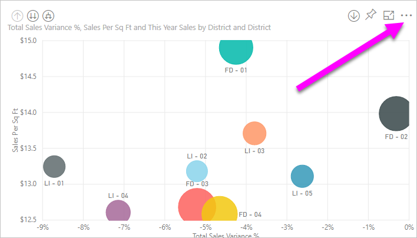
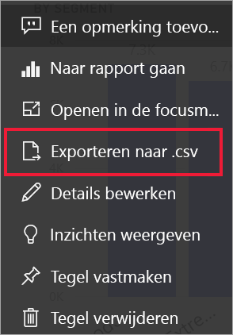
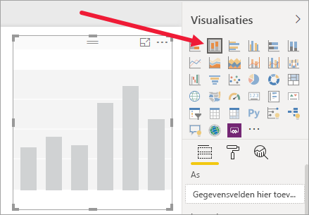
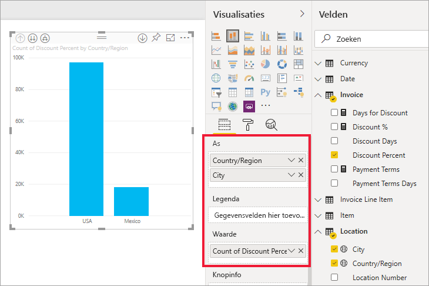
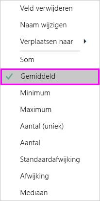
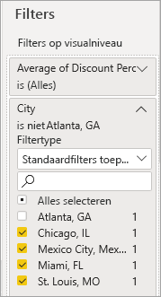
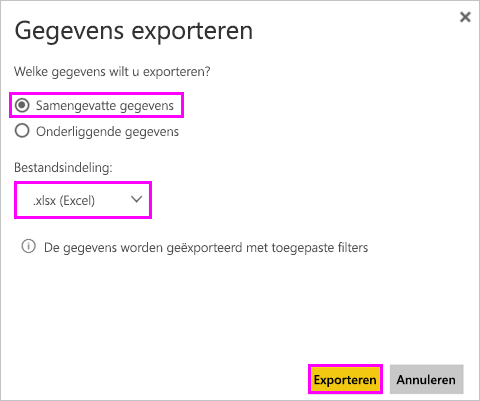
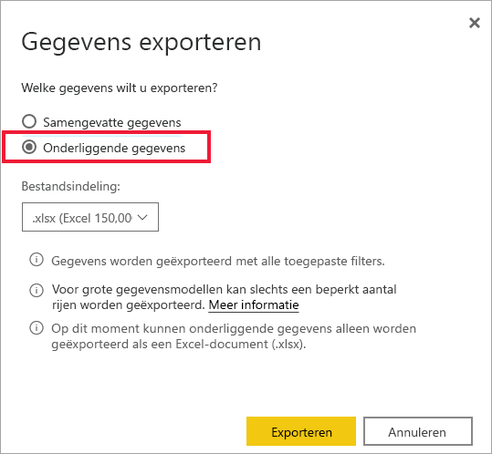
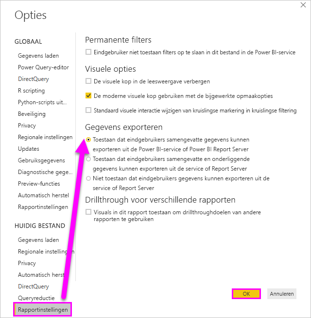

# De gegevens exporteren die zijn gebruikt voor het maken van een visualisatie

> [!IMPORTANT]
> Niet alle gegevens kunnen door alle gebruikers worden weergegeven of geëxporteerd. Er zijn veiligheidsmaatregelen die rapportontwerpers en -beheerders gebruiken bij het maken van dashboards en rapporten. Sommige gegevens zijn beperkt, verborgen of vertrouwelijk en kunnen niet worden weergegeven of geëxporteerd zonder speciale machtigingen. 

## Wie kan gegevens exporteren

Als u machtigingen voor de gegevens hebt, kunt u de gegevens die Power BI gebruikt, bekijken en exporteren om een visualisatie te maken. Gegevens zijn vaak vertrouwelijk of beperkt tot specifieke gebruikers. In dergelijke gevallen kunt u die gegevens niet zien of exporteren. Raadpleeg de sectie **Beperkingen en overwegingen** aan het einde van dit document voor meer informatie. 

## Gegevens weergeven en exporteren

Als u de gegevens wilt zien die in Power BI worden gebruikt om een visualisatie te maken, [kunt u deze gegevens weergeven in Power BI](service-reports-show-data.md). U kunt deze gegevens ook exporteren naar Excel als een *.xlsx*- of *.csv*-bestand. Als u de optie voor het exporteren van de gegevens wilt gebruiken, hebt u een Pro- of Premium-licentie en machtigingen voor het bewerken van de gegevensset en het rapport nodig. Als u toegang hebt tot het dashboard of rapport, maar de gegevens zijn geclassificeerd als *zeer vertrouwelijk*, staat Power BI niet toe dat u de gegevens exporteert.

Kijk hoe Will de gegevens van een van de visualisaties in zijn rapport exporteert, opslaat als *.xlsx*-bestand en opent in Excel. Gebruik vervolgens de stapsgewijze instructies onder de video om het zelf te proberen. Houd er rekening mee dat deze video gebruikmaakt van een oudere versie van Power BI.

<iframe width="560" height="315" src="https://www.youtube.com/embed/KjheMTGjDXw" frameborder="0" allowfullscreen></iframe>

## Gegevens van een Power BI-dashboard exporteren

1. Selecteer Meer opties (...) in de rechterbovenhoek van de visualisatie.

    

1. Kies de optie **Exporteren naar .csv**.

    

1. De gegevens worden uit Power BI geëxporteerd naar een *.csv*-bestand. Als u de visualisatie hebt gefilterd, wordt ook het geëxporteerde .csv-bestand gefilterd. 

1. U wordt gevraagd het bestand op te slaan.  Nadat het is opgeslagen, opent u het *.csv*-bestand in Excel.

    

## Gegevens uit een rapport exporteren

Als u wilt meedoen, opent u het rapport [Procurement analysis sample](../create-reports/sample-procurement.md) (Voorbeeld van een inkoopanalyse) in de bewerkingsweergave in de Power BI-service. Voeg een nieuwe, lege rapportpagina toe. Volg vervolgens onderstaande stappen om een aggregatie, hiërarchie en een filter op visualisatieniveau toe te voegen.

### Een nieuw gestapeld kolomdiagram maken

1. Maak een nieuw **Gestapeld kolomdiagram**.

    

1. Selecteer in het deelvenster **Velden** de optie **Locatie > Plaats**, **Locatie > Land/regio** en **Factuur > Kortingspercentage**.  Mogelijk moet u **Kortingspercentage** verplaatsen naar de brons **Waarde**.

    

1. Wijzig de aggregatie voor **Kortingspercentage** van **Aantal** in **Gemiddelde**. Selecteer in de bron **Waarde** de pijl aan de rechterkant van **Kortingspercentage** (er staat mogelijk **Aantal kortingspercentage**) en kies **Gemiddelde**.

    

1. Voeg een filter toe aan **Plaats**, selecteer alle plaatsen en verwijder vervolgens **Atlanta**.

    

   
1. Zoom één niveau in op de hiërarchie. Schakel inzoomen in en zoom in op het niveau **Plaats**. 

    

Nu zijn we klaar om beide opties voor het exporteren van gegevens uit te proberen.

### **_Samengevatte_* _ gegevens exporteren
Selecteer de optie _ *Samengevatte gegevens** als u gegevens wilt exporteren voor wat u ziet in de visual.  Bij dit type uitvoer ziet u alleen de gegevens (kolommen en metingen) die worden gebruikt om de visual te maken.  Als de visual een statistische functie bevat, exporteert u hiermee statistische gegevens. Als u bijvoorbeeld een staafdiagram met vier balken hebt, krijgt u vier rijen met Excel-gegevens. Samengevatte gegevens zijn beschikbaar in de Power BI-service als *.xlsx*- en *.csv*-bestand en in Power BI Desktop als .csv-bestand.

1. Selecteer het beletselteken in de rechterbovenhoek van de visualisatie. Selecteer **Gegevens exporteren**.

    

    Omdat uw visualisatie een statistische functie heeft (u hebt **Aantal** gewijzigd in *Gemiddelde*), hebt u in de Power BI-service twee opties:

    - **Samengevatte gegevens**

    - **Onderliggende gegevens**

    Zie voor hulp bij statistische functies [Statistische functies in Power BI](../create-reports/service-aggregates.md).

    > [!NOTE]
    > In Power BI Desktop hebt u alleen de optie om samengevatte gegevens te exporteren als .csv-bestand. 
    
    
1. Selecteer in **Gegevens exporteren** de optie **Samengevatte gegevens**, en kies *.xlsx* of *.csv*. Selecteer vervolgens **Exporteren**. Power BI exporteert de gegevens.

    

1. Wanneer u **Exporteren** selecteert, wordt u gevraagd het bestand op te slaan. Nadat het is opgeslagen, opent u het bestand in Excel. Als u de Power BI-app gebruikt in Microsoft Teams, ontvangt u mogelijk niet dezelfde prompts. Het geëxporteerde bestand wordt opgeslagen in de lokale map Downloads. 

    

    In dit voorbeeld bevat onze Excel-export één totaal voor elke plaats. Omdat we Atlanta hebben uitgefilterd, is deze plaats niet opgenomen in de resultaten. In de eerste rij van de spreadsheet ziet u de filters die zijn gebruikt in Power BI bij het extraheren van de gegevens.
    
    - Alle gegevens die worden gebruikt door de hiërarchie, worden geëxporteerd, niet alleen de gegevens die voor het huidige detailniveau voor de visual worden gebruikt. We hebben bijvoorbeeld ingezoomd op plaatsniveau, maar de export bevat ook landgegevens.  

    - De geëxporteerde gegevens zijn samengevoegd. Er wordt voor elke plaats een totaal, één rij, weergegeven.

    - Omdat we filters op de visualisatie hebt toegepast, worden de geëxporteerde gegevens gefilterd geëxporteerd. U ziet in de eerste rij: **Toegepaste filters: City is niet Atlanta, GA**. 

### **_Onderliggende_* _ gegevens exporteren

Selecteer deze optie als u de gegevens in de visual _*_en_*_ aanvullende gegevens uit de gegevensset wilt weergeven (bekijk de onderstaande grafiek voor meer informatie). Als uw visualisatie een statistische functie bevat, wordt de statistische functie verwijderd als u _ *Onderliggende gegevens** selecteert. In dit voorbeeld wordt in de Excel-export één rij weergegeven voor elke Plaats-rij in onze gegevensset, en het kortingspercentage voor deze ene vermelding. Power BI vlakt de gegevens af en voegt deze niet samen.  

Wanneer u **Exporteren** selecteert, worden de gegevens in Power BI geëxporteerd naar een *.xlsx*-bestand en wordt u gevraagd het bestand op te slaan. Nadat het is opgeslagen, opent u het bestand in Excel.

1. Selecteer het beletselteken in de rechterbovenhoek van de visualisatie. Selecteer **Gegevens exporteren**.

    

    Omdat uw visualisatie een statistische functie heeft (u hebt **Aantal** gewijzigd in **Gemiddelde**), hebt u in de Power BI-service twee opties:

    - **Samengevatte gegevens**

    - **Onderliggende gegevens**

    Zie voor hulp bij statistische functies [Statistische functies in Power BI](../create-reports/service-aggregates.md).

    > [!NOTE]
    > In Power BI Desktop hebt u alleen de optie om samengevatte gegevens te exporteren. 
    
    
1. Selecteer onder **Gegevens exporteren** de optie **Onderliggende gegevens** en selecteer vervolgens **Exporteren**. Power BI exporteert de gegevens.

    

1. Wanneer u **Exporteren** selecteert, wordt u gevraagd het bestand op te slaan. Nadat het is opgeslagen, opent u het bestand in Excel.  Als u de Power BI-app gebruikt in Microsoft Teams, ontvangt u mogelijk niet dezelfde prompts. Het geëxporteerde bestand wordt opgeslagen in de lokale map Downloads. 

    
    
    - In deze schermafbeelding ziet u slechts een klein deel van het Excel-bestand; het bestand bevat meer dan 100.000 rijen.  
    
    - Alle gegevens die worden gebruikt door de hiërarchie, worden geëxporteerd, niet alleen de gegevens die voor het huidige detailniveau voor de visual worden gebruikt. We hebben bijvoorbeeld ingezoomd op plaatsniveau, maar de export bevat ook landgegevens.  

    - Omdat we filters op de visualisatie hebt toegepast, worden de geëxporteerde gegevens gefilterd geëxporteerd. U ziet in de eerste rij: **Toegepaste filters: City is niet Atlanta, GA**. 

## De gebruikerservaring voor het exporteren van gegevens aanpassen

Gebruikers aan wie toegangsrechten voor een rapport worden verleend, krijgen **toegang tot de hele onderliggende gegevensset**, tenzij de toegang wordt beperkt door [beveiliging op rijniveau](../admin/service-admin-rls.md). Rapportauteurs en Power BI-beheerders kunnen de gebruikerservaring aanpassen met behulp van de hieronder beschreven mogelijkheden.

- Rapportauteurs [bepalen welke *exportopties*](#set-the-export-options) beschikbaar zijn voor gebruikers.  

- Power BI-beheerders kunnen sommige of alle opties voor het exporteren van gegevens uitschakelen voor hun organisatie.  

- Eigenaren van gegevenssets kunnen beveiliging op rijniveau (RLS) instellen. Met beveiliging op rijniveau wordt de toegang beperkt tot alleen-lezengebruikers. Maar als u een app-werkruimte hebt geconfigureerd en de leden bewerkingsmachtigingen hebt gegeven, worden de rollen van beveiliging op rijniveau niet op deze leden toegepast. Zie [Beveiliging op rijniveau](../admin/service-admin-rls.md) voor meer informatie.

- Rapportauteurs kunnen kolommen verbergen zodat deze niet in de lijst **Velden** worden weergegeven. Zie [Eigenschappen van gegevensset](../developer/automation/api-dataset-properties.md) voor meer informatie

**Deze aangepaste gebruikerservaring is niet van invloed op de gegevens waartoe gebruikers toegang hebben in de gegevensset. Gebruik [beveiliging op rijniveau](../admin/service-admin-rls.md) in de gegevensset zodat de referenties van elke persoon bepalen tot welke gegevens ze toegang hebben.**

## Gegevens beveiligen wanneer deze worden geëxporteerd uit Power BI

- Ontwerpers van rapporten kunnen rapporten classificeren en labelen met behulp van [vertrouwelijkheidslabels](../admin/service-security-data-protection-overview.md) van Microsoft Information Protection. Als het vertrouwelijkheidslabel beveiligingsinstellingen heeft, worden deze beveiligingsinstellingen door Power BI toegepast bij het exporteren van rapportgegevens naar Excel-, PowerPoint- of PDF-bestanden. Alleen geautoriseerde gebruikers kunnen beveiligde bestanden openen.

- Beveiligings- en Power BI-beheerders kunnen [Microsoft Cloud App Security](../admin/service-security-data-protection-overview.md) gebruiken om gebruikerstoegang en -activiteit bij te houden, realtime risicoanalyse uit te voeren en labelspecifieke besturingselementen in te stellen. Organisaties kunnen bijvoorbeeld Microsoft Cloud App Security gebruiken om een beleid in te stellen dat voorkomt dat gebruikers gevoelige gegevens vanuit Power BI kunnen downloaden naar onbeheerde apparaten.

## Details van de onderliggende gegevens exporteren

Wat u ziet wanneer u **Onderliggende gegevens** selecteert, varieert. Vraag de beheerder of IT-afdeling om meer informatie over deze details. 

>

| De visual bevat | Wat u ziet in het exportbestand  |
|---------------- | ---------------------------|
| Statistische functies | de *eerste* statistische functie en niet-verborgen gegevens uit de hele tabel voor die combinatie |
| Statistische functies | gerelateerde gegevens - als er voor de visuals gegevens worden gebruikt uit andere gegevenstabellen die *gerelateerd* zijn aan de gegevenstabel met de statistische functie (zolang deze relatie \*:1 of 1:1 is) |
| Metingen* | alle metingen in de visual *en* alle metingen uit gegevenstabellen die een meting bevatten die in de visual wordt gebruikt |
| Metingen* | alle niet-verborgen gegevens uit tabellen die deze meting bevatten, (zolang deze relatie \*:1 of 1:1 is) |
| Metingen* | alle gegevens van alle tabellen die zijn gerelateerd aan tabellen die de metingen bevatten, via een keten van \*:1 van 1:1) |
| Alleen metingen | alle niet-verborgen kolommen van alle gerelateerde tabellen (om de meting te kunnen uitbreiden) |
| Alleen metingen | Samengevatte gegevens voor alle dubbele rijen voor modelmetingen |

\* In Power BI Desktop of de Power BI-service wordt een *meting* in de rapportweergave weergegeven in de lijst **Velden** met een rekenmachinepictogram . Metingen kunnen in Power BI Desktop worden gemaakt.

### De opties voor exporteren instellen

Power BI-rapportontwikkelaars beheren welke opties voor het exporteren van gegevens beschikbaar zijn voor gebruikers. De opties zijn:

- Toestaan dat eindgebruikers samengevatte gegevens exporteren uit de Power BI-service of Power BI Report Server

- Toestaan dat eindgebruikers samengevatte en onderliggende gegevens kunnen exporteren uit de service of de rapportserver

- Niet toestaan dat eindgebruikers gegevens kunnen exporteren uit de service of rapportserver

    > [!IMPORTANT]
    > We adviseren rapportontwerpers om de exportoptie voor oude rapporten indien nodig handmatig opnieuw in te stellen.

Deze opties instellen:

1. Begin in Power BI Desktop.

1. Selecteer in de linkerbovenhoek **Bestand** > **Opties en instellingen** > **Opties**.

1. Selecteer onder **HUIDIG BESTAND** de optie **Rapportinstellingen**.

    

1. Maak uw keuze uit de sectie **Gegevens exporteren**.

U kunt deze instelling ook bijwerken in de Power BI-service.

Let op: als de instellingen van de Power BI-beheerportal conflicteren met de rapportinstellingen voor het exporteren van gegevens, worden deze laatste instellingen overschreven door de portalinstellingen.

## Beperkingen en overwegingen
De beperkingen en overwegingen zijn van toepassing op Power BI Desktop en de Power BI-service, met inbegrip van Power BI Pro en Premium.

- Als u gegevens wilt exporteren uit een visual, moet u beschikken over een [machtiging voor bouwen voor de onderliggende gegevensset](../connect-data/service-datasets-build-permissions.md).

-  Het maximum aantal rijen dat in **Power BI Desktop** en de **Power BI-service** kan worden geëxporteerd van een **rapport in de importmodus** naar een *.csv*-bestand is 30.000.

- Het maximum aantal rijen dat met de toepassingen kan worden geëxporteerd van een **rapport in de importmodus** naar een *.xlsx*-bestand is 150.000.

- Exporteren met behulp van *Onderliggende gegevens* werkt niet, als:

  - de versie ouder is dan 2016.

  - de tabellen in het model geen unieke sleutel hebben.
    
  -  een beheerder of rapportontwerper deze functie heeft uitgeschakeld.

- Exporteren met behulp van *Onderliggende gegevens* werkt niet als u optie *Items zonder gegevens weergeven* hebt ingeschakeld voor de visualisatie die wordt geëxporteerd in Power BI.

- Bij gebruik van DirectQuery is 16 MB aan gedecomprimeerde gegevens de maximale hoeveelheid gegevens die kan worden geëxporteerd met Power BI. Een onbedoeld resultaat kan zijn dat u minder exporteert dan het maximum aantal rijen van 150.000. Dit gebeurt waarschijnlijk, als:

    - Er te veel kolommen zijn. Probeer het aantal kolommen te verminderen en exporteer dan opnieuw.

    - Er gegevens zijn die moeilijk te comprimeren zijn.

    - Er spelen nog andere factoren een rol die ervoor zorgen dat de bestandsgrootte toeneemt en het aantal rijen dat kan worden geëxporteerd in Power BI, afneemt.

- Als de visualisatie gebruikmaakt van gegevens uit meer dan één gegevenstabel, en er geen relatie bestaat voor deze tabellen in het gegevensmodel, worden met Power BI alleen gegevens voor de eerste tabel geëxporteerd.

- Power BI-visuals en R-visuals worden momenteel niet ondersteund.

- In Power BI kunt u de naam van een veld (kolom) wijzigen door te dubbelklikken op het veld en een nieuwe naam in te voeren. Power BI verwijst naar de nieuwe naam als een *alias*. Het is mogelijk dat een Power BI-rapport hierdoor dubbele veldnamen bevat, maar duplicaten zijn niet toegestaan in Excel. Wanneer de gegevens met Power BI worden geëxporteerd naar Excel, worden daarom voor de veldaliassen weer de oorspronkelijke veld-/kolomnamen gebruikt.  

- Als er Unicode-tekens in het *.csv*-bestand voorkomen, wordt de tekst in Excel mogelijk niet juist weergegeven. Voorbeelden van Unicode-tekens zijn valutasymbolen en woorden in vreemde talen. U kunt het bestand openen in Kladblok. De Unicode-tekens worden dan juist weergegeven. Als u het bestand wilt openen in Excel, is de tijdelijke oplossing om het *.csv*-bestand te importeren. Het bestand importeren in Excel:

  1. Open Excel.

  1. Ga naar het tabblad **Gegevens**.
  
  1. Selecteer **Externe gegevens ophalen** > **Uit tekst**.
  
  1. Ga naar de lokale map waar het bestand is opgeslagen, en selecteer het *.csv*-bestand.

- Bij het exporteren naar een *CSV-bestand* worden bepaalde tekens voorafgegaan door een **'** om uitvoering van het script te voorkomen dit in Excel wordt geopend. Dat gebeurt in de volgende situaties:
  - De kolom in het gegevensmodel als type Tekst is gedefinieerd **_en_**
  - Het eerste teken van de tekst is een van de volgende tekens: **=, @, +,-**

- Power BI-beheerders kunnen het exporteren van gegevens uitschakelen.

Hebt u nog vragen? [Misschien dat de Power BI-community het antwoord weet](https://community.powerbi.com/)