# Choropletenkaarten in Power BI

[!INCLUDE [power-bi-visuals-desktop-banner](../includes/power-bi-visuals-desktop-banner.md)]

In een choropletenkaart worden arcering, tinten of patronen gebruikt om aan te geven hoe een waarde in verhouding verschilt voor een geografisch gebied of regio.  U kunt zo snel deze relatieve verschillen laten zien met behulp van arcering die varieert van licht (minder frequent/lager) tot donker (meer-frequent/hoger).    

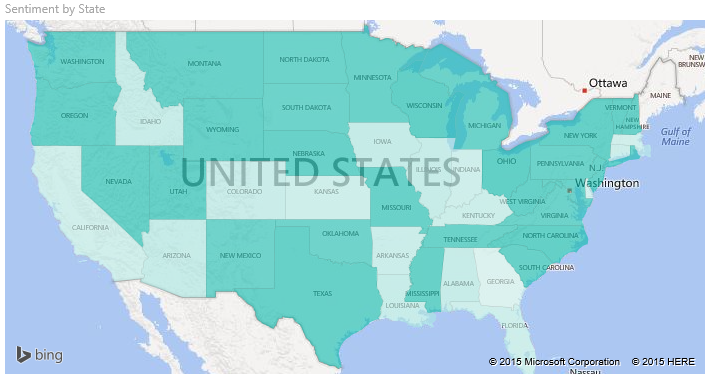

## Welke gegevens worden naar Bing verzonden?
Power BI is geïntegreerd met Bing om standaardkaartcoördinaten te bieden (een proces dat geocodering wordt genoemd). Wanneer u een visualisatie van een kaart maakt in de Power BI-service of Power BI Desktop, worden de gegevens in de buckets **Locatie**, **Breedtegraad** en **Lengtegraad** naar Bing verzonden. Deze buckets worden trouwens gebruikt om de visualisatie te maken.

U of uw beheerder moet mogelijk uw firewall bijwerken om toegang te krijgen tot de URL’s die Bing gebruikt voor geocodering.  Deze URL's zijn:
- https://dev.virtualearth.net/REST/V1/Locations    
- https://platform.bing.com/geo/spatial/v1/public/Geodata    
- https://www.bing.com/api/maps/mapcontrol

Meer informatie over de gegevens die naar Bing worden verzonden en tips voor het verbeteren van de geocodering leest u in [Tips and tricks for map visualizations](power-bi-map-tips-and-tricks.md) (Tips en trucs voor kaartvisualisaties).

## Wanneer gebruikt u een choropletenkaart
In de volgende gevallen zijn choropletenkaarten een goede keuze:

* om kwantitatieve gegevens op een kaart weer te geven.
* om ruimtelijke patronen en relaties weer te geven.
* wanneer uw gegevens zijn gestandaardiseerd.
* als u werkt met sociaaleconomische gegevens.
* als gedefinieerde regio's belangrijk zijn.
* om een overzicht te krijgen van de verdeling over verschillende geografische locaties.

### Vereisten
In deze zelfstudie wordt gebruikgemaakt van het [PBIX-bestand met het voorbeeld van een retailanalyse](https://download.microsoft.com/download/9/7/6/9767913A-29DB-40CF-8944-9AC2BC940C53/Sales%20and%20Marketing%20Sample%20PBIX.pbix).
1. Selecteer linksboven in de menubalk **Bestand** > **Openen**.
   
2. Ga naar uw kopie van het **PBIX-bestand met het voorbeeld van een retailanalyse**

1. Open het **PBIX-bestand met het voorbeeld van een retailanalyse** in de rapportweergave 

1. Selecteren  om een nieuwe pagina toe te voegen.

## Een eenvoudige choropletenkaart maken
In deze video maakt Kim een eenvoudige kaart en zet deze om in een choropletenkaart.
   > [!NOTE]
   > In deze video wordt gebruikgemaakt van een eerdere versie van Power BI Desktop.
   > 
   > 

<iframe width="560" height="315" src="https://www.youtube.com/embed/ajTPGNpthcg" frameborder="0" allowfullscreen></iframe>

### Een gevulde kaart maken
1. Selecteer in het deelvenster Velden het veld **Geo** \> **State**.    

   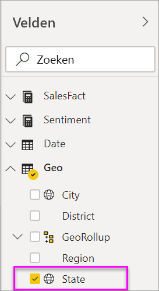
2. [Converteer de kaart](power-bi-report-change-visualization-type.md) naar een choropletenkaart. U ziet dat **State** nu ook wordt vermeld onder **Locatie**. Bing Kaarten gebruikt het veld onder **Locatie** om de kaart te maken.  Het deelvenster Locatie kan een aantal geldige locaties bevatten: landen, staten, provincies, steden, postcodes, enzovoort. Bing Kaarten kan choropletenkaarten maken voor locaties over de hele wereld. Hiervoor is wel een geldige vermelding in het deelvenster Locatie vereist.  

   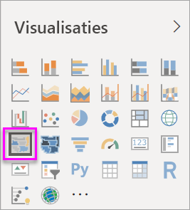
3. Filter de kaart om alleen het vasteland van de Verenigde Staten weer te geven.

   a.  Zoek links van het deelvenster Visualisaties naar het deelvenster **Filters**. Vouw het uit als het is geminimaliseerd.

   b.  Beweeg de muisaanwijzer over **State** en selecteer de dubbele punthaak om uit te vouwen.  
   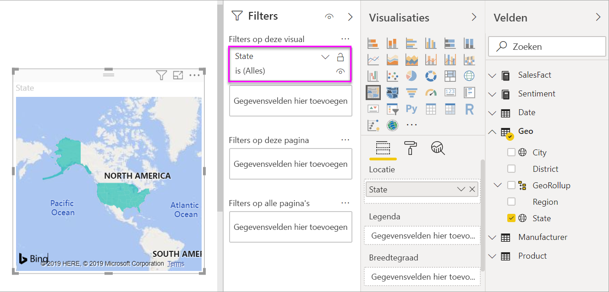

   c.  Zet een vinkje naast **Alles selecteren** en verwijder het vinkje bij **AK**.

   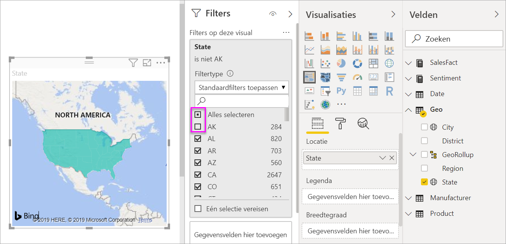
4. Selecteer het pictogram met de verfroller om het opmaakvenster te openen en kies **Gegevenskleuren**.

    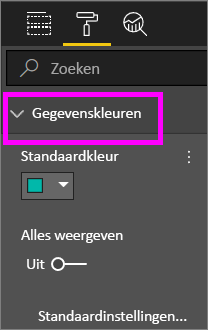

5. Selecteer de drie verticale puntjes en kies **Voorwaardelijke opmaak**.

    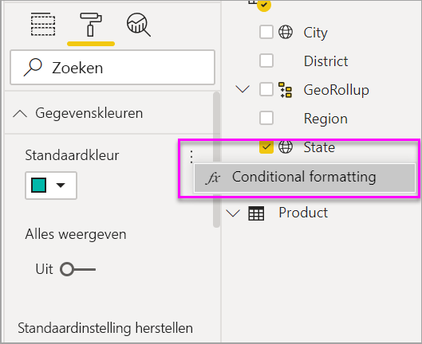

6. Gebruik het venster **Standaardkleur - Gegevenskleuren** om te bepalen op welke manier uw choropletenkaart wordt gearceerd. U hebt onder andere de optie om te bepalen op welk veld de arcering moet worden gebaseerd en hoe de arcering moet worden toegepast. In dit voorbeeld wordt het veld **SalesFact** > **Sentiment** gebruikt en wordt de laagste waarde voor gevoel ingesteld in het rood en de hoogste waarde in het groen. Waarden die tussen het maximum en het minimum vallen, zijn tinten rood en groen. In de afbeelding onderaan het venster ziet u het kleurenbereik dat wordt gebruikt. 

    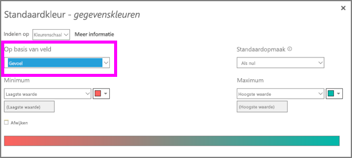

7. De choropletenkaart is groen en rood gearceerd, met rood voor lagere gevoelscijfers en groen voor een hoger, positiever gevoel.  Als u meer details wilt weergeven, sleept u een veld naar de knopinfobron.  In dit voorbeeld is **Gevoelshiaat** toegevoegd en is de staat Idaho (ID) gemarkeerd. U ziet dat de gevoelshiaat laag is, namelijk 6.
   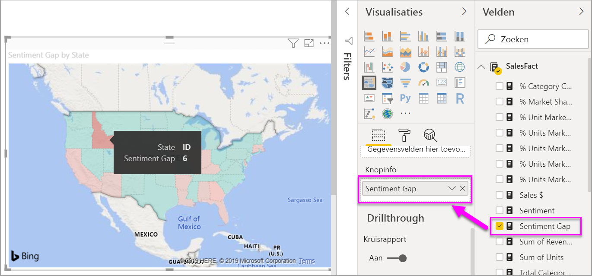

10. [Sla het rapport op](../service-report-save.md).

In Power BI hebt u meer dan voldoende controle over de weergave van uw choropletenkaart. Experimenteer gerust met deze besturingselementen voor gegevenskleuren totdat u de gewenste opmaak hebt gevonden. 

## Markeren en kruislings filteren
Zie [Een filter aan een rapport toevoegen](../power-bi-report-add-filter.md) voor meer informatie over het gebruik van het deelvenster Filters.

Als u een locatie op een choropletenkaart markeert, worden de andere visualisaties op de rapportpagina ook gefilterd en omgekeerd.

1. Als u wilt meelezen, slaat u dit rapport eerst op door **Bestand > Opslaan** te selecteren. 

2. Kopieer de choropletenkaart met behulp van Ctrl-C.

3. Selecteer onderaan het rapportcanvas het tabblad **Gevoel** om de rapportpagina Gevoel te openen.

    

4. Verplaats en wijzig de grootte van de visualisaties op de pagina om ruimte maken, en druk op Ctrl+V om de choropletenkaart uit het vorige rapport te plakken. (Zie de volgende afbeeldingen.)

   

5. Selecteer een staat op de choropletenkaart.  Hiermee worden de andere visualisaties op de pagina kruislings gemarkeerd en kruislings gefilterd. Als u bijvoorbeeld **Texas** selecteert, ziet u dat de gevoelswaarde 75 is en dat Texas zich in het Central District #23 bevindt.   
   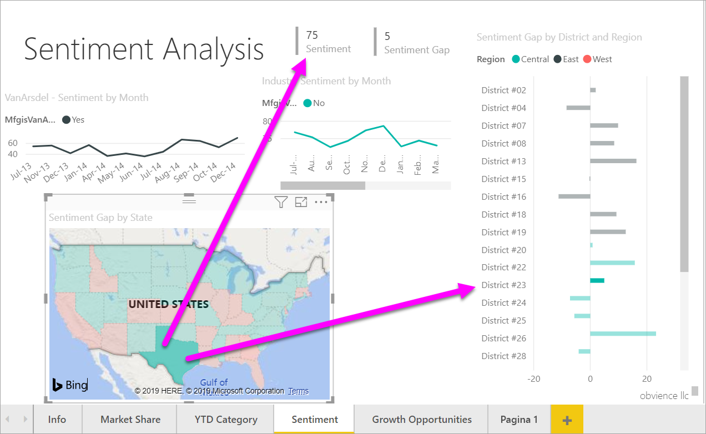
2. Selecteer een gegevenspunt in het lijndiagram VanArsdel - Gevoel per maand. Hierdoor wordt de choropletenkaart gefilterd op gevoel voor VanArsdel en niet hun concurrentie.  
   

## Aandachtspunten en probleemoplossing
Kaartgegevens kunnen dubbelzinnig zijn.  Er is bijvoorbeeld een Parijs in Frankrijk, maar ook in Texas. Uw geografische gegevens worden waarschijnlijk opgeslagen in afzonderlijke kolommen (een kolom voor plaatsnamen, een kolom voor namen van staten of provincies, enzovoort), zodat Bing onmogelijk kan vaststellen of het om de Franse versie of Texaanse versie van Parijs gaat. Als uw gegevensset al de breedtegraad- en lengtegraadgegevens bevat, zijn er in Power BI speciale velden beschikbaar om de kaartgegevens uniek te maken. Sleep hiervoor het veld met de breedtegraadgegevens naar het gebied Visualisaties \> Breedtegraad.  Doe hetzelfde voor de lengtegraadgegevens.    

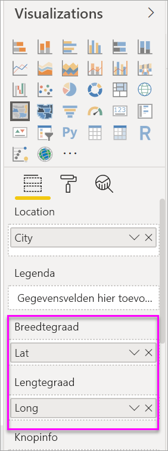

Als u gemachtigd bent om de gegevensset te bewerken in Power BI Desktop, bekijkt u deze video voor het oplossen van problemen met dubbelzinnigheid in kaarten.

<iframe width="560" height="315" src="https://www.youtube.com/embed/Co2z9b-s_yM" frameborder="0" allowfullscreen></iframe>

Als u geen toegang hebt tot gegevens voor breedtegraad en lengtegraad maar wel bewerkingstoegang tot de gegevensset hebt, [volgt u deze instructies voor het bijwerken van uw gegevensset](https://support.office.com/article/Maps-in-Power-View-8A9B2AF3-A055-4131-A327-85CC835271F7).

Zie [Tips and tricks for map visualizations](../power-bi-map-tips-and-tricks.md) (Tips en trucs voor kaartvisualisaties) voor meer hulp bij kaartvisualisaties.

## Volgende stappen

[Shape-kaart](desktop-shape-map.md)

[Visualization types in Power BI](power-bi-visualization-types-for-reports-and-q-and-a.md) (Typen visualisaties in Power BI)