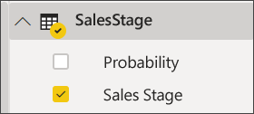
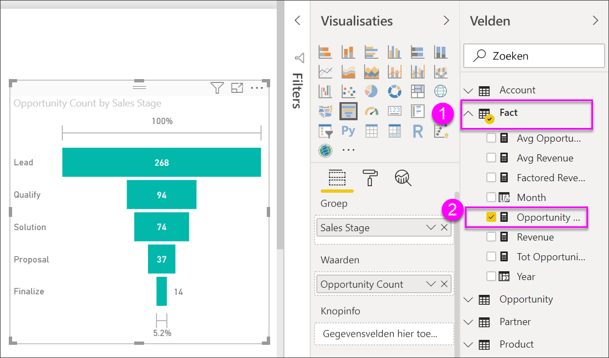

# Trechterdiagrammen maken en gebruiken

[!INCLUDE[consumer-appliesto-nyyn](../includes/consumer-appliesto-nyyn.md)]

[!INCLUDE [power-bi-visuals-desktop-banner](../includes/power-bi-visuals-desktop-banner.md)]

Een trechterdiagram helpt u om een lineaire proces dat bestaat uit opeenvolgende verbonden fasen te visualiseren. Bijvoorbeeld verkoopactiviteiten waarbij de klanten in bepaalde fasen worden bijgehouden: Lead \> Qualified Lead \> Prospect \> Contract \> Close.  De vorm van de trechter brengt de status van het proces dat u bijhoudt in één oogopslag over.

Elke fase van de trechter vertegenwoordigt een percentage van het totaal. In de meeste gevallen heeft een trechterdiagram dus de vorm een trechter. De eerste fase is het grootst en elke latere fase is kleiner dan de vorige.  Een trechter in de vorm van een peer is ook nuttig. Hiermee kunt u een probleem in het proces identificeren.  Maar normaal gesproken is de eerste fase (de startfase) het grootst.

> [!NOTE]
> Voor het delen van uw rapport met een Power BI-collega moeten u beiden beschikken over een afzonderlijke Power BI Pro-licentie of moet het rapport zijn opgeslagen in Premium-capaciteit.    

## Wanneer u een trechterdiagram gebruikt
In de volgende gevallen komen trechterdiagrammen goed van pas:

* wanneer de gegevens sequentieel zijn en ten minste 4 fasen doorlopen.
* wanneer het aantal 'items' in de eerste fase naar verwachting groter is dan het aantal in de laatste fase.
* om potentieel (inkomsten/verkoop/deals/enz) te berekenen fasen.
* om conversie- en retentiepercentages te berekenen en bij te houden.
* om knelpunten in een lineair proces te identificeren.
* om de werkstroom van een winkelwagen bij te houden.
* om de voortgang en het succes van reclame-/marketingcampagnes met doorklikken bij te houden.

## Werken met trechterdiagrammen
Trechterdiagrammen:

* Kunnen worden gesorteerd.
* Bieden ondersteuning voor veelvouden.
* Kunnen worden gemarkeerd en gefilterd door andere visualisaties op dezelfde rapportpagina.
* Kunnen worden gebruikt om andere visualisaties op dezelfde rapportpagina te markeren en filteren.
   > [!NOTE]
   > Bekijk deze video om te zien hoe Will een trechterdiagram maakt op basis van het voorbeeld van verkoop en marketing. Probeer het vervolgens zelf uit door de stappen onder de video uit te voeren met behulp van het PBIX-voorbeeldbestand voor een verkoopkansanalyse
   > 
   > 
## Vereiste

In deze zelfstudie wordt gebruikgemaakt van het [PBIX-bestand met het voorbeeld van een verkoopkansanalyse](https://download.microsoft.com/download/9/1/5/915ABCFA-7125-4D85-A7BD-05645BD95BD8/Opportunity%20Analysis%20Sample%20PBIX.pbix
).

1. Selecteer linksboven in de menubalk **Bestand** > **Openen**
   
2. Ga naar uw kopie van het **PBIX-bestand met het voorbeeld van een verkoopkansanalyse**

1. Open het **PBIX-bestand met het voorbeeld van een verkoopkansanalyse** in de rapportweergave .

1. Selecteren  om een nieuwe pagina toe te voegen.

## Een basistrechterdiagram maken
Bekijk deze video om te zien hoe Will een trechterdiagram maakt op basis van het voorbeeld van verkoop en marketing.

<iframe width="560" height="315" src="https://www.youtube.com/embed/qKRZPBnaUXM" frameborder="0" allow="autoplay; encrypted-media" allowfullscreen></iframe>

Maak nu uw eigen trechterdiagram dat het aantal mogelijkheden weergeeft dat we hebben in elk van onze verkoopfasen.

1. Start op een lege rapportpagina en selecteer het veld **Verkoopfase** \> **Verkoopfase**.
   
    

1. Selecteer het trechterpictogram  om het kolomdiagram om te zetten in een trechterdiagram.

2. Selecteer vanuit het deelvenster **Velden** de optie **Feit** \> **Aantal kansen**.
   
    
4. Als u de muisaanwijzer boven een balk houdt, wordt een schat aan informatie weergegeven.
   
   * De naam van de fase
   * Aantal verkoopkansen in deze fase
   * Algemene conversieverhouding (% van Lead) 
   * Fase-naar-fase (ook wel Drop Rate genoemd) is het percentage van de vorige fase (in dit geval Voorstelfase/oplossingsfase)
     
     

6. [Sla het rapport op](../create-reports/service-report-save.md).

## Markeren en kruislings filteren
Zie [Een filter aan een rapport toevoegen](../create-reports/power-bi-report-add-filter.md) voor meer informatie over het gebruik van het deelvenster Filters.

Als u een balk in een trechter markeert, worden de andere visualisaties op de rapportpagina ook gefilterd en omgekeerd. Als u op de voet wilt volgen, voegt u nog enkele visuele elementen toe op de rapportpagina met de trechtergrafiek.

1. Selecteer op de trechter de balk **Voorstel**. Hiermee worden de andere visualisaties op de pagina kruislings gemarkeerd. Gebruik CTRL voor meervoudige selectie.
   
   
2. Zie [Interacties tussen visuele elementen in Power BI](../create-reports/service-reports-visual-interactions.md) als u voorkeuren wilt instellen voor hoe visuele elementen elkaar kruislings markeren en filteren

## Volgende stappen

[Meters in Power BI](power-bi-visualization-radial-gauge-charts.md)

[Visualization types in Power BI](power-bi-visualization-types-for-reports-and-q-and-a.md) (Typen visualisaties in Power BI)

