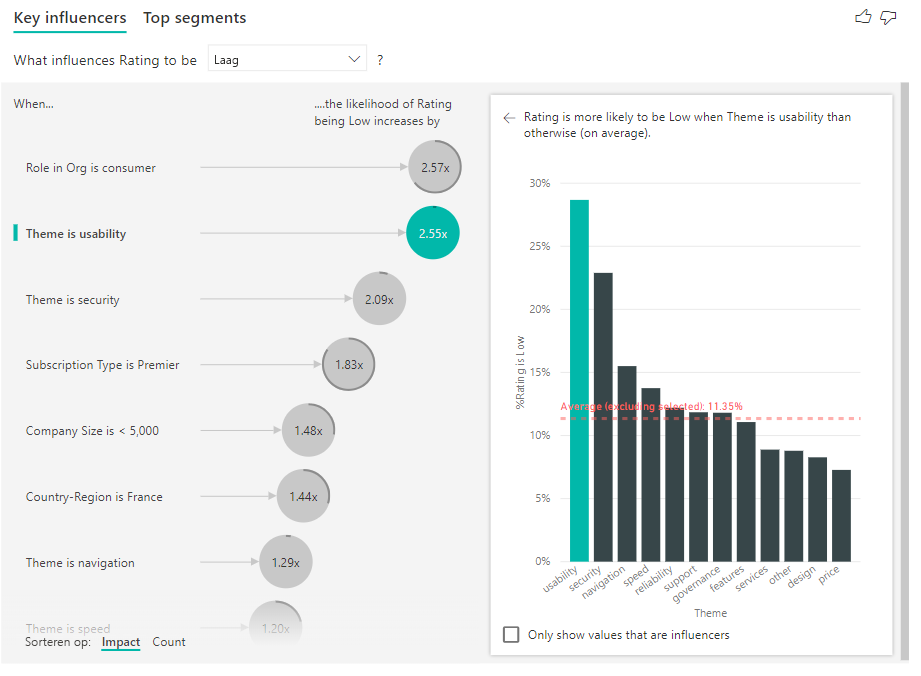

# Visualisaties Belangrijkste beïnvloeders gebruiken

[!INCLUDE[consumer-appliesto-nyyn](../includes/consumer-appliesto-nyyn.md)]    

[!INCLUDE [power-bi-visuals-desktop-banner](../includes/power-bi-visuals-desktop-banner.md)]

Met de visual Belangrijkste beïnvloeders krijgt u meer inzicht in de beïnvloedingsfactoren van een metrisch gegeven waarin u geïnteresseerd bent. Uw gegevens worden geanalyseerd en de factoren die van belang zijn worden gerangschikt en als belangrijkste beïnvloeders weergegeven. Stel dat u bijvoorbeeld wilt achterhalen wat invloed heeft op de wisseling van personeel, ook wel het personeelsverloop genoemd. Eén factor kan de contractduur zijn en een andere de leeftijd van de medewerkers. 
 
## Wanneer kunt u gebruikmaken van Belangrijkste beïnvloeders? 
De visual Belangrijkste beïnvloeders is ideaal in de volgende situaties: 
- Als u wilt zien welke factoren invloed hebben op het metrische gegeven dat wordt geanalyseerd.
- Als u het relatieve belang van deze factoren wilt vergelijken. Hebben kortlopende arbeidscontracten bijvoorbeeld meer invloed op het verloop dan langlopende contracten? 

## Functies van de visual Belangrijkste beïnvloeders

1. **Tabbladen**: selecteer een tabblad om te schakelen tussen weergaven. **Belangrijkste beïnvloeders** toont de belangrijkste factoren die invloed hebben op de geselecteerde metrische waarde. **Topsegmenten** toont de topsegmenten die van invloed zijn op de geselecteerde metrische waarde. Een *segment* bestaat uit een combinatie van waarden. Eén segment kan bijvoorbeeld bestaan uit gebruikers die al minstens twintig jaar klant zijn en in de regio West wonen. 

2. **Vervolgkeuzelijst**: de waarde van de meetwaarde die wordt onderzocht. In dit voorbeeld kijken we naar de meetwaarde **Waardering**. De geselecteerde waarde is **Laag**.

3. **Aanpassing**: dit helpt ons om de visual in het linkerdeelvenster te interpreteren.

4. **Linkerdeelvenster**: het linkerdeelvenster bevat één visual. In dit geval toont het linkerdeelvenster een lijst met de belangrijkste beïnvloeders.

5. **Aanpassing**: dit helpt ons om de visual in het rechterdeelvenster te interpreteren.

6. **Rechterdeelvenster**: het rechterdeelvenster bevat één visual. In dit geval worden in het kolomdiagram alle waarden voor de belangrijkste beïnvloeder **Thema** weergegeven, die is geselecteerd in het linkerdeelvenster. De specifieke waarde voor **bruikbaarheid** in het linkerdeelvenster wordt in het groen weergegeven. Alle andere waarden voor **Thema** worden in het zwart weergegeven.

7. **Lijn voor gemiddelde**: Het gemiddelde wordt berekend voor alle mogelijke waarden voor **Thema**, behalve **bruikbaarheid** (welke de geselecteerde beïnvloeder is). De berekening is dus van toepassing op alle zwarte waarden. Er wordt mee aangegeven welk percentage van de andere **Thema's** de waardering 'laag' hadden. In dit geval had 11,35% een lage waardering (weergegeven door de stippellijn).

8. **Selectievakje**: Hiermee filtert u de visual in het rechterdeelvenster, zodat alleen waarden worden weergegeven die van invloed zijn op het veld. In dit voorbeeld filtert u de visual op bruikbaarheid, beveiliging en navigatie.

## Een metrische waarde analyseren die categorisch is
 
Bekijk deze video voor meer informatie over het maken van de visual met belangrijkste beïnvloeders met een categorische metrische waarde. Volg vervolgens deze stappen om die visual te maken. 

   > [!NOTE]
   > In deze video wordt gebruikgemaakt van een eerdere versie van Power BI Desktop.
   > 
   > 
<iframe width="560" height="315" src="https://www.youtube.com/embed/fDb5zZ3xmxU" frameborder="0" allow="accelerometer; autoplay; encrypted-media; gyroscope; picture-in-picture" allowfullscreen></iframe>

Uw productmanager wil dat u nagaat welke factoren ertoe leiden dat klanten negatieve beoordelingen over onze cloudservice achterlaten. Open het [PBIX-bestand Klantenfeedback](https://github.com/microsoft/powerbi-desktop-samples/tree/master/Monthly%20Desktop%20Blog%20Samples/2019/customerfeedback.pbix) in Power BI Desktop om het voorbeeld verder te volgen. U kunt ook het [Excel-bestand Klantenfeedback voor Power BI-service of Power BI Desktop](https://github.com/microsoft/powerbi-desktop-samples/tree/master/Monthly%20Desktop%20Blog%20Samples/2019/customerfeedback.xlsx) downloaden. Selecteer een van beide koppelingen en selecteer **Downloaden** op de GitHub-pagina die wordt geopend.

> [!NOTE]
> De gegevensset Klantenfeedback is gebaseerd op [Moro et al., 2014] S. Moro, P. Cortez en P. Rita. A Data-Driven Approach to Predict the Success of Bank Telemarketing. *Decision Support Systems*, Elsevier, 62:22-31, juni 2014. 

1. Open het rapport en selecteer het tabblad **Belangrijkste beïnvloeders**. 

    

2. Verplaats het metrische gegeven dat u wilt onderzoeken naar het veld **Analyseren**. Als u wilt zien waarom klanten de service als 'laag' waarderen, selecteert u **Klantentabel** > **Waardering**.

3. Verplaats velden waarvan u denkt dat ze van invloed kunnen zijn op **Waardering** naar het veld **Uitleg door**. U kunt zoveel velden verplaatsen als u wilt. Begin in dit geval met het volgende:
    - Land-regio 
    - Rol in organisatie 
    - Abonnementstype 
    - Bedrijfsgrootte 
    - Thema
    
4. Laat het veld **Uitbreiden met** leeg. Dit veld wordt alleen gebruikt bij het analyseren van een meting of een samengevat veld. 

5. Selecteer **Laag** in de vervolgkeuzelijst **Wat heeft invloed op de waardering** als u de negatieve waarderingen wilt bekijken.  

    

De analyse wordt uitgevoerd op het tabelniveau van het veld dat wordt geanalyseerd. In dit geval is **Waardering** het metrische gegeven. Dit metrische gegeven wordt op klantniveau gedefinieerd. Elke klant heeft ofwel een hoge, of een lage waardering gegeven. Alle verklarende factoren moeten op klantniveau zijn gedefinieerd om bruikbaar te zijn voor de visual. 

In het vorige voorbeeld hebben al onze verklarende factoren een een-op-een- of een veel-op-eenrelatie met het metrische gegeven. In dit geval hebben alle klanten één thema toegewezen aan hun classificatie. Klanten komen ook uit één land, hebben één type lidmaatschap en voeren één rol uit in hun organisatie. De verklarende factoren zijn al kenmerken van een klant en er zijn geen transformaties nodig. Ze zijn direct te gebruiken in de visual. 

Verderop in deze zelfstudie gaan we in op complexere voorbeelden met een-op-veelrelaties. In die gevallen moeten de kolommen eerst omlaag worden geaggregeerd naar klantniveau voordat u de analyse kunt uitvoeren. 

Metingen en aggregaties die als verklarende factoren worden gebruikt, worden ook geëvalueerd op het tabelniveau van het metrische gegeven **Analyseren**. Hiervan volgen verderop in dit artikel enkele voorbeelden. 

## Categorische belangrijkste beïnvloeders interpreteren 
Laten we eens gaan kijken naar de belangrijkste beïnvloeders voor lage waarderingen. 

### De belangrijkste factor die de kans op een lage waardering beïnvloedt

De klant in dit voorbeeld kan drie rollen hebben: gebruiker, beheerder en uitgever. We zien dat de rol van gebruiker de belangrijkste factor is die bijdraagt aan een lage waardering. 

Om precies te zijn is de kans 2,57 maal groter dat uw gebruikers uw service een negatieve waardering geven. In de grafiek Belangrijkste beïnvloeders staat **Rol in organisatie is gebruiker** boven in de lijst aan de linkerkant. Door **Rol in organisatie is gebruiker** te selecteren, ziet u in Power BI extra details in het rechterdeelvenster. Het vergelijkende effect van elke rol op de kans op een lage waardering wordt weergegeven.
  
- 14,93 procent van de gebruikers geeft een lage waardering. 
- Gemiddeld krijgen we van 5,78 procent van alle andere rollen een lage waardering.
- De kans dat gebruikers een lage waardering geven in vergelijking met alle andere rollen is 2,57x groter. U kunt dit vaststellen door de groene balk door de rode stippellijn te delen. 

### De op een na belangrijkste factor die de kans op een lage waardering beïnvloedt

In de visual Belangrijkste beïnvloeders worden factoren uit veel verschillende variabelen vergeleken en gerangschikt. De op een na belangrijkste beïnvloeder heeft niets te maken met **Rol in organisatie**. Selecteer de op een na belangrijkste beïnvloeder in de lijst: **Thema is bruikbaarheid**. 

De op een na belangrijkste factor is gerelateerd aan het thema van de klantbeoordeling. Klanten die opmerkingen maakten over de bruikbaarheid van het product waren 2,55 keer vaker geneigd een lage waardering te geven dan klanten die opmerkingen maakten over andere thema's, zoals de betrouwbaarheid, het ontwerp of de snelheid. 

Op de visuals is het gemiddelde (de rode stippellijn) gewijzigd van 5,78 in 11,34 procent. Het gemiddelde is dynamisch omdat dit wordt gebaseerd op het gemiddelde van alle andere waarden. Voor de eerste beïnvloeder werd de rol van gebruiker niet meegerekend om het gemiddelde te berekenen. Voor de tweede beïnvloeder is het thema Bruikbaarheid niet meegerekend. 
 
Schakel het selectievakje **Alleen waarden weergeven die beïnvloeders zijn** in om te filteren met behulp van alleen de invloedrijke waarden. In dit geval zijn dit de rollen die voor een lage waardering zorgen. De twaalf thema's worden beperkt tot de vier thema's die door Power BI zijn geïdentificeerd als factoren die voor een lage waardering zorgen. 

## Interactie met andere visuals 
 
Steeds wanneer u een slicer, filter of andere visual op het canvas selecteert, voert de visual Belangrijkste beïnvloeders de analyse opnieuw uit voor het nieuwe deel van de gegevens. U kunt bijvoorbeeld het veld **Bedrijfsgrootte** naar het rapport slepen en dit als slicer gebruiken. Gebruik deze slicer om te zien of de belangrijkste beïnvloeders voor uw grote zakelijke klanten anders zijn dan voor de algemene populatie. Een grote zakelijke klant is een bedrijf met meer dan 50.000 medewerkers.
 
Door **> 50.000** te selecteren, wordt de analyse opnieuw uitgevoerd en ziet u dat de beïnvloeders zijn veranderd. Voor grote zakelijke klanten heeft de belangrijkste beïnvloeder voor een lage waardering een thema dat is gerelateerd aan beveiliging. U wilt dit mogelijk verder onderzoeken om te zien of er specifieke beveiligingsfuncties zijn waarover onze grote klanten ontevreden zijn. 

## Doorlopende belangrijkste beïnvloeders interpreteren 
 
Tot nu toe hebt u gezien hoe u de visual gebruikt om te verkennen welke invloed verschillende categorische velden hebben op een lage waardering. Het is ook mogelijk om continue factoren in het veld **Uitleg door** te gebruiken, zoals leeftijd, hoogte en prijs. Laten we eens kijken wat er gebeurt als we **Gebruiksduur** van de tabel Klant verplaatsen naar **Uitleg door**. Gebruiksduur geeft aan hoelang de klant de service heeft gebruikt. 
 
Als de gebruiksduur toeneemt, neemt de kans op een lage waardering ook toe. Deze trend geeft aan dat de kans groter is dat klanten die onze service al langer gebruiken, een negatieve waardering geven. Dit is een interessant inzicht waarop u mogelijk later wilt terugkomen. 
 
De visualisatie maakt zichtbaar dat steeds als de gebruiksduur 13,44 maanden toeneemt, de gemiddelde kans op een lage waardering 1,23 maal groter wordt. In dit geval geeft 13,44 maanden de standaarddeviatie van gebruiksduur aan. Het verkregen inzicht geeft dus aan wat de invloed van het verhogen van de gebruiksduur met een standaardwaarde (de standaarddeviatie van gebruiksduur) is op de kans op een lage waardering. 
 
In het spreidingsdiagram in het rechterdeelvenster wordt het gemiddelde percentage van lage waarderingen voor elke waarde van de gebruiksduur weergegeven. De helling wordt aangeduid met een trendlijn.

## Doorlopende belangrijkste beïnvloeders waarop binning is toegepast

In een aantal gevallen ziet u dat uw doorlopende factoren automatisch in categorische factoren zijn omgezet. We hebben dit gedaan omdat we ons realiseerden dat de relatie tussen de variabelen niet lineair is en we de relatie dus niet zomaar als oplopend of aflopend kunnen beschrijven (zoals in het bovenstaande voorbeeld).

Er worden correlatietesten uitgevoerd om vast te stellen hoe lineair de beïnvloeder is met betrekking tot het doel. Als het doel doorlopend is, voeren we een Pearson-correlatie uit en als het doel categorisch is, voeren we Point Biserial-correlatietesten uit. Als we ontdekken dat de relatie niet voldoende lineair is, voeren we binning onder toezicht uit en genereren we maximaal 5 bins. Om te achterhalen waarom bins het handigst zijn, gebruiken we een binningsmethode onder toezicht die de relatie tussen de verklarende factor en het geanalyseerde doel bekijkt.

## Metingen en aggregaties interpreteren als belangrijkste beïnvloeders 
 
U kunt metingen en aggregaties gebruiken als verklarende factoren binnen uw analyse. U wilt bijvoorbeeld zien wat de gevolgen zijn van het aantal ondersteuningstickets van klanten of de gemiddelde duur van een open ticket op de waardering die u krijgt. 
 
In dit geval wilt u zien of het aantal ondersteuningstickets van een klant invloed heeft op de waardering die hij/zij u geeft. Voer nu de **Ondersteuningsticket-id** van de tabel Ondersteuningsticket op. Omdat een klant meerdere ondersteuningstickets kan hebben, moet u de id aggregeren naar klantniveau. Deze aggregatie is belangrijk omdat de analyse op klantniveau wordt uitgevoerd; alle beïnvloedingsfactoren moeten dus worden gedefinieerd op dat granulariteitsniveau. 
 
Laten we het aantal id's bekijken. Aan elke rij met klanten is een aantal ondersteuningstickets gekoppeld. In dit geval wordt de kans op een lage waardering 5,51 maal groter als het aantal ondersteuningstickets toeneemt. In de rechtervisual staat het gemiddelde aantal ondersteuningstickets per **waarderingswaarde** dat is geëvalueerd op klantniveau. 

## Interpreteer de resultaten: Topsegmenten 
 
U kunt het tabblad **Belangrijkste beïnvloeders** gebruiken om elke factor afzonderlijk te beoordelen. U kunt ook het tabblad **Topsegmenten** gebruiken om te zien hoe een combinatie van factoren van invloed is op de metrische gegevens die u analyseert. 
 
Topsegmenten biedt aanvankelijk een overzicht van alle segmenten die zijn gedetecteerd door Power BI. In het volgende voorbeeld ziet u dat er zes segmenten zijn gevonden. Deze segmenten zijn gerangschikt op het percentage lage waarderingen binnen het segment. Segment 1 heeft bijvoorbeeld 74,3 procent lage klantwaarderingen. Hoe hoger de bel, hoe hoger het aandeel lage waarderingen. De grootte van de bel geeft aan hoeveel klanten er binnen het segment zijn. 

Bij het selecteren van een bel wordt ingezoomd op de details van dat segment. Als u bijvoorbeeld segment 1 selecteert, ziet u dat dit segment uit relatief vaste klanten bestaat. Deze personen zijn al meer dan 29 maanden klant en hebben elk meer dan vier ondersteuningstickets. Ook zien we dat het geen uitgevers zijn, dus het moeten gebruikers of beheerders zijn. 
 
In deze groep geeft 74,3 procent van de klanten een lage waardering. De gemiddelde klant geeft in 11,7 procent van de gevallen een lage waardering, dus heeft dit segment een significant hoger aandeel in de lage waarderingen. Het is 63 procentpunten hoger. Segment 1 bevat bovendien ongeveer 2,2 procent van de gegevens en dit segment vertegenwoordigt dus een relevant deel van de populatie. 

## Aantallen toevoegen

Soms kan een beïnvloeder een grote invloed hebben, maar maakt deze een zeer klein gedeelte uit van de gegevens. Zo is het **Thema** **Bruikbaarheid** de op één na grootste beïnvloeder voor lage beoordelingen. Maar misschien is er slechts een klein aantal klanten dat heeft geklaagd over de bruikbaarheid. Tellingen kunnen u helpen bij het bepalen op welke beïnvloeders u zich wilt richten.

U kunt aantallen inschakelen via de **analysekaart** van het opmaakdeelvenster.

Zodra aantallen zijn ingeschakeld, ziet u een ring rondom de bel van elke beïnvloeder. Dit geeft bij benadering het percentage aan van de gegevens die een beïnvloeder bevat. Hoe groter het omcirkelde gedeelte van de bel is, hoe meer gegevens het bevat. We kunnen zien dat het **thema** **bruikbaarheid** een zeer klein deel van de gegevens uitmaakt.

U kunt de sortering ook gebruiken door via een omschakeling in de linkerbenedenhoek van de visual bellen te sorteren op basis van het aantal in plaats van de impact. **Het abonnementstype** **Premier** is de belangrijkste beïnvloeder op basis van het aantal.

Een volledige ring rond de cirkel betekent dat de beïnvloeder 100% van de gegevens bevat. U kunt het aantaltype wijzigen zodat dit gerelateerd is aan de grootste beïnvloeder met behulp van de vervolgkeuzelijst **Aantaltype** in de **analysekaart** van het opmaakdeelvenster. Nu wordt de beïnvloeder op de grootste hoeveelheid gegevens weergegeven met een volledige ring en zijn alle andere aantallen daaraan gerelateerd.

## Een metrische waarde analyseren die numeriek is

Als u een niet-samengevat, numeriek veld naar het veld **Analyseren** verplaatst, zijn er verschillende mogelijkheden om dat scenario te verwerken. U kunt het gedrag van de visual wijzigen door naar het **deelvenster Opmaak** te gaan en te schakelen tussen **Categorisch analysetype** en **Continu analysetype**.

Het gedrag van het **categorische analysetype** wordt hierboven beschreven. Als u bijvoorbeeld naar de enquêtewaarderingen van 1 tot 10 kijkt, kunt u de vraag stellen 'Door welke factoren zijn mijn enquêtewaarderingen 1?'.

Door een **continu analysetype** wordt de vraag in een continu type gewijzigd. In het bovenstaande voorbeeld wordt de nieuwe vraag: 'Door welke factoren nemen de enquêtewaarderingen toe of juist af?'

Dit is een zeer nuttig onderscheid wanneer u veel unieke waarden hebt in het veld dat u analyseert. In het onderstaande voorbeeld kijken we naar huizenprijzen. Het is niet erg nuttig om te vragen: 'Door welke factor is de huizenprijs 156.214?' Dit is niet alleen erg specifiek, we hebben waarschijnlijk ook niet voldoende gegevens om een patroon af te leiden.

In plaats daarvan kunnen we beter vragen: 'Door welke factor stijgt de huizenprijs?' Hierdoor kunnen we de huizenprijzen als een bereik behandelen in plaats van als afzonderlijke waarden.

## Interpreteer de resultaten: Belangrijkste beïnvloeders 

In dit scenario gaat het over de vraag: 'Door welke factor stijgt de huizenprijs?' We gaan een aantal verklarende factoren bekijken die van invloed kunnen zijn op de huizenprijs, zoals **Year Built** (jaar waarin het huis is gebouwd), **KitchenQual** (de kwaliteit van de keuken) en **YearRemodAdd** (het jaar waarin het huis is gerenoveerd). 

In het onderstaande voorbeeld bekijken we onze belangrijkste beïnvloeder. In dit geval moet de keukenkwaliteit Uitstekend zijn. De resultaten zijn vergelijkbaar met de resultaten die we bij de analyse van de categorische metrische gegevens zagen, maar er zijn een aantal belangrijke verschillen:

- In het kolomdiagram aan de rechterkant worden gemiddelden bekeken, geen percentages. We zien dus wat de gemiddelde huizenprijs is van een huis met een uitstekende keuken (groene balk) vergeleken met de gemiddelde huizenprijs van huis zonder een uitstekende keuken (stippellijn)
- Het getal in de bel is nog wel steeds het verschil tussen de rode stippellijn en de groene balk, maar dit getal wordt nu uitgedrukt als een getal ($ 158.490) in plaats van een kans (1,93 keer). Dus huizen met een uitstekende keuken zijn bijna $ 160.000 duurder dan huizen zonder een uitstekende keuken.

In het onderstaande voorbeeld kijken we naar de invloed die een continue factor (het jaar waarin het huis is gerenoveerd) heeft op de huizenprijs. De verschillen met de manier waarop we continue beïnvloeders analyseren voor categorische metrische gegevens zijn als volgt:

-   In het spreidingsdiagram in het rechterdeelvenster wordt de gemiddelde huizenprijs weergegeven voor elke afzonderlijke waarde van het jaar waarin het huis is gerenoveerd. 
-   De waarde in de bel geeft aan met hoeveel dollar de gemiddelde huizenprijs stijgt (in dit geval $ 2.870) als het jaar waarin het huis is gerenoveerd met de standaarddeviatie toeneemt (in dit geval 20 jaar)

Ten slotte kijken we, in het geval van metingen, naar het gemiddelde jaar waarin een huis is gebouwd. De analyse is hier als volgt:

-   In het spreidingsdiagram in het rechterdeelvenster wordt de gemiddelde huizenprijs voor elke afzonderlijke waarde in de tabel weergegeven
-   De waarde in de bel geeft aan met hoeveel dollar de gemiddelde huizenprijs stijgt (in dit geval $ 1.350) als het gemiddelde jaar met de standaarddeviatie toeneemt (in dit geval 30 jaar)

## Interpreteer de resultaten: Topsegmenten

In topsegmenten voor numerieke doelen worden groepen weergegeven waarin de huizenprijzen gemiddeld hoger zijn dan in de algehele gegevensset. Hieronder zien we bijvoorbeeld dat **Segment 1** uit huizen bestaat waarbij **GarageCars** (het aantal auto's dat in de garage past) hoger is dan 2 en de **RoofStyle** (het daktype) Hip is. Huizen met die specifieke kenmerken hebben een gemiddelde prijs van $ 355.000, tegenover het algehele gemiddelde in de gegevens van $ 180.000.

## Een metrische waarde analyseren die een meting of een samenvatte kolom is

In het geval van een meting of een samengevatte kolom wordt de analyse standaard ingesteld op het **Type doorlopende analyse** dat [hierboven](#analyze-a-metric-that-is-numeric) wordt beschreven. Dit kan niet worden gewijzigd. Het grootste verschil tussen het analyseren van een meting/samengevatte kolom en een niet-samengevatte, numerieke kolom is het niveau waarop de analyse wordt uitgevoerd.

In het geval van niet-samengevatte kolommen, wordt de analyse altijd uitgevoerd op tabelniveau. In het bovenstaande voorbeeld van de woningprijs hebben we de metrische waarde **Woningprijs** geanalyseerd om te zien wat invloed heeft op prijsverhogingen/-verlagingen van een woningprijs. De analyse wordt automatisch uitgevoerd op tabelniveau. Onze tabel heeft een unieke id voor elk huis, zodat de analyse op huisniveau wordt uitgevoerd.

Voor metingen en samengevatte kolommen weet u niet meteen op welk niveau u wilt analyseren. Als de **woningprijs** als **gemiddelde** is vermeld, moeten we overwegen op welk niveau we willen dat deze gemiddelde woningprijs wordt berekend. Is dit de gemiddelde woningprijs op buurtniveau? Of misschien op regionaal niveau?

Metingen en samengevatte kolommen worden automatisch geanalyseerd op het niveau van de gebruikte velden **Uitleggen door**. Stel dat we in de volgende drie velden voor **Uitleggen door** zijn geïnteresseerd: **Keukenkwaliteit**, **Gebouwtype** en **Airconditioning**. **De gemiddelde woningprijs** wordt berekend voor elke unieke combinatie van deze drie velden. Het is vaak handig om naar een tabelweergave over te schakelen om te kijken naar de gegevens die worden geëvalueerd.

Deze analyse is zeer beknopt en het is dus moeilijk voor het regressiemodel om patronen te vinden in de gegevens waaruit het kan leren. We moeten de analyse uitvoeren op een gedetailleerder niveau om betere resultaten te krijgen. Als we de woningprijs op huisniveau willen analyseren, moeten we het veld **Id** expliciet aan de analyse toevoegen. Maar we willen niet dat het huis-id als beïnvloeder beschouwd. Het is niet nuttig om te weten dat met de toename van het huis-id de prijs van een huis toeneemt. Hier komt de veldoptie **Uitbreiden met** goed van pas. U kunt **Uitbreiden met** gebruiken om velden toe te voegen die u wilt gebruiken voor het instellen van het niveau van de analyse zonder dat u op zoek bent naar nieuwe beïnvloeders.

Bekijk hoe de visual eruit ziet als u de **id** hebt toegevoegd aan **Uitbreiden met.** Wanneer u het niveau hebt gedefinieerd waarop de meting moet worden geëvalueerd, is het interpreteren van de beïnvloeders precies hetzelfde als voor [niet-samengevatte, numerieke kolommen.](#analyze-a-metric-that-is-numeric)

Bekijk de volgende zelfstudie als u meer wilt weten over de manier waarop u metingen kunt analyseren met de visualisatie van belangrijke beïnvloeders.

<iframe width="1167" height="631" src="https://www.youtube.com/embed/2X1cW8oPtc8" frameborder="0" allow="accelerometer; autoplay; encrypted-media; gyroscope; picture-in-picture" allowfullscreen></iframe>

## Aandachtspunten en probleemoplossing 
 
**Wat zijn de beperkingen voor de visual?** 
 
De visual Belangrijkste beïnvloeders kent een aantal beperkingen:

- DirectQuery wordt niet ondersteund
- Live-verbinding met Azure Analysis Services en SQL Server Analysis Services wordt niet ondersteund
- Publiceren op internet wordt niet ondersteund
- .NET Framework 4.6 of hoger is vereist
- Het insluiten van SharePoint Online wordt niet ondersteund

**Ik krijg een foutbericht dat er geen beïnvloeders of segmenten zijn gevonden. Hoe komt dat?** 

Deze fout treedt op wanneer u velden hebt opgenomen in **Uitleg door**, maar er geen beïnvloeders zijn gevonden. 
- U hebt het metrische gegeven dat u analyseerde, opgenomen bij zowel **Analyseren** als **Uitleg door**. Verwijder het metrische gegeven bij **Uitleg door**. 
- Uw verklarende velden hebben te veel categorieën met slechts enkele waarnemingen. In deze situatie is het moeilijk om aan de hand van de visualisatie te bepalen welke factoren beïnvloeders zijn. Het is moeilijk om een algemene conclusie te trekken op basis van slechts een aantal waarnemingen. Als u een numeriek veld analyseert, is het raadzaam over te schakelen van **Categorische analyse** naar **Continue analyse** in het **Opmaakvenster** op de kaart **Analyse**.
- Uw verklarende factoren hebben voldoende waarnemingen om te generaliseren, maar er zijn geen betekenisvolle correlaties gevonden om verslag over uit te brengen in de visualisatie.
 
**Er wordt een foutbericht weergegeven dat het metrische gegeven dat ik analyseer niet voldoende gegevens bevat om de analyse op uit te voeren. Hoe komt dat?** 

Voor de visualisatie wordt er naar patronen in de gegevens gezocht voor één groep die met andere groepen wordt vergeleken. Er wordt bijvoorbeeld naar klanten gezocht die een lage waardering hebben gegeven in vergelijking met klanten die een hoge waardering hebben gegeven. Als de gegevens in uw model weinig waarnemingen bevatten, is het moeilijk om patronen te vinden. Als er niet voldoende gegevens zijn om betekenisvolle beïnvloeders te vinden, wordt er in de visualisatie aangegeven dat er meer gegevens nodig zijn om de analyse uit te voeren. 

Het is raadzaam om voor de geselecteerde status ten minste 100 waarnemingen te hebben. In dit geval bestaat de status uit klanten die vertrekken. Ook hebt u minimaal 10 waarnemingen nodig voor de statussen die u voor de vergelijking gebruikt. In dit geval voert u een vergelijking uit met klanten die niet vertrekken.

Als u een numeriek veld analyseert, is het raadzaam over te schakelen van **Categorische analyse** naar **Continue analyse** in het **Opmaakvenster** op de kaart **Analyse**.

**Er wordt een foutbericht weergegeven waarin, als 'analyseren' niet wordt samengevat, de analyse altijd wordt uitgevoerd op het rijniveau van de bovenliggende tabel. Het is niet toegestaan dit niveau te wijzigen via de velden 'Uitbreiden met'. Hoe komt dat?**

Bij het analyseren van een numerieke of categorische kolom, wordt de analyse altijd uitgevoerd op tabelniveau. Als u bijvoorbeeld de woningprijzen analyseert en de tabel een id-kolom bevat, wordt de analyse automatisch uitgevoerd op het niveau van de huis-id. 

Wanneer u een meting of een samengevatte kolom analyseert, moet u expliciet aangeven op welk niveau de analyse moet worden uitgevoerd. U kunt **Uitbreiden met** gebruiken om het niveau van de analyse voor metingen en de samengevatte kolommen te wijzigen zonder nieuwe beïnvloeders toe te voegen. Als de **woningprijs** is gedefinieerd als een meting, kunt u de kolom Huis id toevoegen aan **Uitbreiden met** door het niveau van de analyse te wijzigen.

**Er wordt een foutbericht weergegeven dat een veld in *Uitleg door* niet uniek is ten opzichte van de tabel die het te analyseren metrische gegeven bevat. Hoe komt dat?**
 
De analyse wordt uitgevoerd op het tabelniveau van het veld dat wordt geanalyseerd. Als u bijvoorbeeld de feedback van klanten op uw service analyseert, hebt u wellicht een tabel die aangeeft of een klant een hoge of lage waardering gaf. In dit geval zou uw analyse moeten worden uitgevoerd op klanttabelniveau. 

Deze fout ontstaat als u een gerelateerde tabel hebt die is gedefinieerd op een gedetailleerder niveau dan de tabel die uw metrische gegeven bevat. Hier volgt een voorbeeld: 
 
- U analyseert wat klanten beïnvloedt om uw service laag te waarderen.
- U wilt weten of het apparaat waarop klanten van de service gebruikmaken, invloed heeft op hun beoordeling.
- Een klant kan de service op verschillende manieren gebruiken.
- In het volgende voorbeeld gebruikt klant 10000000 zowel een browser als een tablet om met de service te werken.

Als u probeert de apparaatkolom als een verklarende factor te gebruiken, wordt de volgende fout weergegeven: 

Deze fout wordt weergegeven omdat het apparaat niet op klantniveau is gedefinieerd. Een klant kan de service op verschillende apparaten gebruiken. De visualisatie kan alleen patronen vinden als het apparaat een kenmerk van de klant is. Er zijn verschillende oplossingen mogelijk die afhankelijk zijn van uw begrip van het bedrijf: 
 
- U kunt de samenvatting van te tellen apparaten wijzigen. Gebruik bijvoorbeeld Tellen als het aantal apparaten mogelijk invloed heeft op de waardering die door een klant wordt gegeven. 
- U kunt de apparaatkolom draaien om te zien of de service op een specifiek apparaat invloed heeft op de waardering van de klant.
 
In dit voorbeeld zijn de gegevens gedraaid om nieuwe kolommen voor browser, mobiel en tablet te maken (zorg ervoor dat u uw relaties in de modelweergave verwijdert en opnieuw maakt nadat u uw gegevens hebt gedraaid). U kunt deze specifieke apparaten nu gebruiken in **Uitleg door**. Alle apparaten blijken beïnvloeders te zijn, waarbij de browser de grootste invloed heeft op de waardering van de klant.

Om precies te zijn, zijn klanten die de browser niet voor de service gebruiken 3,79 maal vaker geneigd een lage waardering te geven dan degenen die dat wel doen. Lager in de lijst is voor mobiele apparaten het omgekeerde waar. Klanten die de mobiele app gebruiken, zijn meer geneigd een lagere waardering te geven dan degenen die dat niet doen. 

**Er wordt een waarschuwing weergegeven dat er geen metingen zijn opgenomen in mijn analyse. Hoe komt dat?** 

De analyse wordt uitgevoerd op het tabelniveau van het veld dat wordt geanalyseerd. Als u het klantverloop analyseert, hebt u mogelijk een tabel die aangeeft of een klant is afgehaakt of niet. In dit geval zou uw analyse moeten worden uitgevoerd op klanttabelniveau.
 
Metingen en aggregaties worden standaard op dat tabelniveau geanalyseerd. Als er een meting voor Gemiddelde maandelijkse uitgaven zou zijn, zou die op klanttabelniveau worden geanalyseerd. 

Als de klanttabel geen unieke id heeft, kunt u de meting niet evalueren en wordt deze genegeerd bij de analyse. U kunt deze situatie voorkomen door ervoor te zorgen dat uw metrische gegeven een unieke id heeft. In dit geval is dit de klanttabel en de unieke id is de id van de klant. Het is ook eenvoudig om een indexkolom toe te voegen met behulp van Power Query.
 
**Er wordt een waarschuwing weergegeven dat het metrische gegeven dat ik analyseer meer dan tien unieke waarden bevat en dat dit aantal de kwaliteit van de analyse kan beïnvloeden. Hoe komt dat?** 

Met de AI-visualisatie kunt u categorische en numerieke velden analyseren. In het geval van categorische velden is Verloop bijvoorbeeld mogelijk Ja of Nee en Klanttevredenheid kan Hoog, Gemiddeld of Laag zijn. Wanneer u het aantal te analyseren categorieën uitbreidt, betekent dit dat er minder waarnemingen per categorie zijn. Hierdoor is het voor de visualisatie moeilijker om patronen in de gegevens te vinden. 

Wanneer u numerieke velden analyseert, kunt u kiezen of u de numerieke velden als tekst wilt behandelen. In dit geval voert u dezelfde analyse uit als voor categorische gegevens (**Categorische analyse**). Indien u veel verschillende waarden hebt, raden we u aan de analyse over te schakelen naar **Continue analyse**. Hiermee kunt u patronen afleiden in het geval getallen toenemen of afnemen, in plaats van ze als afzonderlijke waarden te behandelen. U kunt overschakelen van **Categorische analyse** naar **Continue analyse** in het **Opmaakvenster** op de kaart **Analyse**.

Het wordt aanbevolen om vergelijkbare waarden te groeperen tot één eenheid om sterkere beïnvloeders te vinden. Als u bijvoorbeeld een metrisch gegeven voor prijs hebt, krijgt u waarschijnlijk betere resultaten als u vergelijkbare prijzen groepeert in categorieën zoals Hoog, Gemiddeld en Laag in plaats van afzonderlijke prijspunten te gebruiken. 

**Er zijn factoren in mijn gegevens die belangrijkste beïnvloeders lijken te zijn, maar dat toch niet zijn. Hoe kan dat?**

In het volgende voorbeeld geven klanten die gebruiker zijn, lage waarderingen, waarbij 14,93 procent van de waarderingen laag is. De rol Beheerder heeft ook een groot aandeel lage waarderingen (13,42 procent), maar deze rol wordt niet als een beïnvloeder beschouwd. 

De reden voor deze beslissing is dat de visualisatie ook rekening houdt met het aantal gegevenspunten wanneer er naar beïnvloeders wordt gezocht. In het volgende voorbeeld zijn er meer dan 29.000 gebruikers en 10 keer zo weinig beheerders, namelijk slechts ongeveer 2.900. Slechts 390 van hen gaven een lage waardering. Er zijn niet voldoende gegevens beschikbaar voor de visual om te bepalen of deze beheerderswaarderingen een patroon vormen of dat het om een toevalstreffer gaat. 

**Wat zijn de limieten voor gegevenspunten voor de belangrijkste beïnvloeders?**
De analyse wordt uitgevoerd op een voorbeeld van 10.000 gegevenspunten. De bellen aan de ene zijde geven alle gevonden beïnvloeders weer. De kolom- en spreidingsdiagrammen aan de andere kant worden afgestemd op de bemonsteringsstrategieën voor die kernvisuals.

**Hoe berekent u de belangrijkste beïnvloeders voor categorische analyse?**

Achter de schermen wordt in de AI-visualisatie met behulp van [ML.NET](https://dotnet.microsoft.com/apps/machinelearning-ai/ml-dotnet) een logistieke regressie uitgevoerd om de belangrijkste beïnvloeders te berekenen. Een logistieke regressie is een statistisch model waarin verschillende groepen met elkaar worden vergeleken. 

Als u wilt zien wat de beïnvloeders van lage waarderingen zijn, zou via de logistieke regressie worden gekeken naar de verschillen tussen klanten die een lage en hoge waardering gaven. Als u meerdere categorieën gebruikt zoals hoge, neutrale en lage waarderingen, kijkt u naar de verschillen tussen klanten die een lage en klanten die geen lage waardering hebben gegeven. In dit geval zoekt u het verschil tussen de klanten die een lage waardering hebben gegeven en de klanten die een hoge of neutrale waardering hebben gegeven. 
 
Via de logistieke regressie wordt gezocht naar patronen in de gegevens en naar de verschillen tussen klanten die een lage en hoge waardering gaven. Er kan bijvoorbeeld uit komen dat klanten met veel ondersteuningstickets een hoger percentage lage waarderingen geven dan klanten met weinig of geen ondersteuningstickets.
 
Bij de logistieke regressie wordt ook rekening gehouden met het aantal aanwezige gegevenspunten. Als klanten met een beheerdersrol bijvoorbeeld in verhouding meer negatieve waarderingen geven, maar er slechts een handvol beheerders is, wordt dit niet als een invloedrijke factor beschouwd. Deze beslissing wordt genomen omdat er niet voldoende gegevenspunten beschikbaar zijn om een patroon af te leiden. Er wordt een statistische test, ook wel de Wald-test genoemd, gebruikt om te bepalen of een factor als beïnvloeder wordt beschouwd. In de visual wordt een p-waarde (overschrijdingskans) van 0,05 gebruikt om de drempelwaarde te bepalen. 

**Hoe berekent u de belangrijkste beïnvloeders voor numerieke analyse?**

Achter de schermen wordt in de AI-visualisatie met behulp van [ML.NET](https://dotnet.microsoft.com/apps/machinelearning-ai/ml-dotnet) een lineaire regressie uitgevoerd om de belangrijkste beïnvloeders te berekenen. Een lineaire regressie is een statistisch model waarbij wordt gekeken naar de manier waarop het resultaat van het veld dat u analyseert, verandert op basis van uw verklarende factoren.

Als we bijvoorbeeld huizenprijzen analyseren, wordt met een lineaire regressie gekeken naar de invloed die een keuken met de status Uitstekend op de huizenprijs heeft. Hebben huizen met een uitstekende keuken doorgaans een lagere of hogere huizenprijs dan huizen zonder een uitstekende keuken?

Bij een lineaire regressie wordt bovendien rekening gehouden met het aantal gegevenspunten. Als huizen met een tennisbaan bijvoorbeeld een hogere prijs hebben, maar wij maar weinig huizen met een tennisbaan hebben, dan wordt deze factor niet als invloedrijk beschouwd. Deze beslissing wordt genomen omdat er niet voldoende gegevenspunten beschikbaar zijn om een patroon af te leiden. Er wordt een statistische test, ook wel de Wald-test genoemd, gebruikt om te bepalen of een factor als beïnvloeder wordt beschouwd. In de visual wordt een p-waarde (overschrijdingskans) van 0,05 gebruikt om de drempelwaarde te bepalen. 

**Hoe worden segmenten berekend?**

Achter de schermen wordt in de AI-visualisatie met behulp van [ML.NET](https://dotnet.microsoft.com/apps/machinelearning-ai/ml-dotnet) een beslissingsstructuur uitgevoerd om interessante subgroepen te vinden. Het doel van de beslissingsstructuur is om een subgroep te krijgen van gegevenspunten met een relatief hoge waarde van het metrische gegeven waarin u geïnteresseerd bent. Denk bijvoorbeeld aan klanten die een lage waardering gaven of huizen met een hoge prijs.

In de beslissingsstructuur worden alle verklarende factor bekeken en wordt geprobeerd te beredeneren welke factor de beste *afsplitsing* oplevert. Als u de gegevens bijvoorbeeld zodanig filtert dat er alleen grote zakelijke klanten overblijven, scheiden we daarmee dan klanten af die een hoge of juist lage waardering gaven? Of is het misschien beter zodanig te filteren dat er alleen klanten overblijven die opmerking maakten over de beveiliging? 

Zodra er een afsplitsing optreedt bij de beslissingsstructuur, wordt de subgroep van gegevens gebruikt en wordt de volgende beste afsplitsing voor die gegevens bepaald. In dit geval bestaat de subgroep uit klanten die een opmerking over de beveiliging hebben gemaakt. Na elke afsplitsing wordt er ook gekeken of het aantal gegevenspunten voor deze groep voldoende is om een representatieve groep te vormen. In dat geval kan er een patroon uit worden afgeleid, terwijl het anders gewoon kan gaan om een anomalie in de gegevens in plaats van een echt segment. Er wordt een andere statistische test toegepast om de statistische significantie van de afspitsingsvoorwaarde te testen, met een p-waarde van 0,05. 

Zodra de beslissingsstructuur is voltooid, worden alle afsplitsingen zoals beveiligingsopmerkingen en grote zakelijke klanten apart genomen en worden er Power BI-filters gemaakt. Deze combinatie van filters wordt verpakt als een segment in de visual. 
 
**Waarom worden bepaalde factoren beïnvloeders of zijn ze dat niet langer als ik meer velden naar *Uitleg door* verplaats?**

Alle verklarende factoren worden bij elkaar geëvalueerd in de visualisatie. Een factor kan zelf een beïnvloeder zijn, maar wanneer deze wordt bekeken in combinatie met andere factoren, is dat wellicht niet het geval. Stel dat u wilt analyseren wat de huizenprijs opdrijft en dat het aantal slaapkamers en de grootte van het huis de verklarende factoren zijn:

- Meer slaapkamers kan op zich de prijs opdrijven.
- Als we de huisgrootte meenemen in de analyse, betekent dit dat u nu gaat kijken wat er met de slaapkamers gebeurt als we de huisgrootte constant houden.
- Als de vaste huisgrootte 140 m2 is, is het onwaarschijnlijk dat een continue toename van het aantal slaapkamers de huizenprijs extreem zal opdrijven. 
- Slaapkamers zijn mogelijk niet zo'n belangrijke factor als toen er nog geen rekening werd gehouden met de grootte van het huis. 

Voor het delen van uw rapport met een Power BI-collega moet u beiden beschikken over een afzonderlijke Power BI Pro-licentie of moet het rapport zijn opgeslagen in Premium-capaciteit. Zie [Rapporten delen](../collaborate-share/service-share-reports.md) voor meer informatie.

## Volgende stappen
- [Combinatiegrafieken in Power BI](power-bi-visualization-combo-chart.md)
- [Visualization types in Power BI](power-bi-visualization-types-for-reports-and-q-and-a.md) (Typen visualisaties in Power BI)