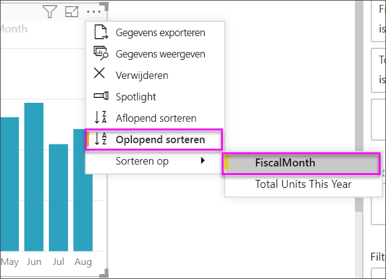

# KPI-visualisaties (Key Performance Indicator) maken

[!INCLUDE [power-bi-visuals-desktop-banner](../includes/power-bi-visuals-desktop-banner.md)]

Een Key Performance Indicator (KPI) is een visuele aanwijzing waarmee de voortgang naar een meetbaar doel wordt aangegeven. Zie [KPI's (Key Performance Indicators) in PowerPivot](/previous-versions/sql/sql-server-2012/hh272050(v=sql.110)) voor meer informatie over KPI's.

Kijk hoe Will op zichzelf staande metrische visualisaties maakt: meters, kaarten en KPI's.
   > [!NOTE]
   > Deze video maakt gebruik van een oudere versie van Power BI Desktop.
   > 
   > 
<iframe width="560" height="315" src="https://www.youtube.com/embed/xmja6EpqaO0?list=PL1N57mwBHtN0JFoKSR0n-tBkUJHeMP2cP" frameborder="0" allowfullscreen></iframe>

## Een KPI gebruiken

KPI's zijn een prima keuze:

* Voor het meten van voortgang. Om antwoord te geven op de vraag "Waar lig ik achter of voor op schema?"

* Voor het meten van de afstand tot een doel. Om antwoord te geven op de vraag "Hoe ver lig ik achter of voor op schema?"

## KPI-vereisten

Een ontwerper baseert een KPI-visualisatie op een specifieke meting. De bedoeling van de KPI is u te helpen de huidige waarde en de status van metrische gegevens te evalueren aan de hand van een gedefinieerd doel. Een KPI-visualisatie vereist een *basismeting*, waarmee een waarde en een *doelmeting* of doelwaarde worden bepaald, en een *drempelwaarde* of *doel*.

Een KPI-gegevensset moet doelwaarden voor een KPI bevatten. Als uw gegevensset geen doelwaarden bevat, kunt u deze maken door een Excel-werkblad met doelen aan uw gegevensmodel of PBIX-bestand toe te voegen.

## Vereisten

In deze zelfstudie wordt gebruikgemaakt van het [PBIX-bestand met het voorbeeld van een retailanalyse](https://download.microsoft.com/download/9/6/D/96DDC2FF-2568-491D-AAFA-AFDD6F763AE3/Retail%20Analysis%20Sample%20PBIX.pbix).

1. Selecteer linksboven in de menubalk **Bestand** > **Openen**

1. Ga naar uw kopie van het **PBIX-bestand met het voorbeeld van een retailanalyse**

1. Open het **PBIX-bestand Retail Analysis Sample** in rapportweergave. 

1. Selecteer **+** om een nieuwe pagina toe te voegen. 

## KPI's maken

In dit voorbeeld gaat u een KPI maken die de voortgang meet die u hebt gemaakt bij een verkoopdoel.

1. Selecteer in het deelvenster **Velden****Sales > Total Units This Year**.  Deze waarde wordt de indicator.

1. Voeg **Time > FiscalMonth** toe.  Deze waarde vertegenwoordigt de trend.

1. Selecteer het beletselteken in de rechterbovenhoek van de visualisatie en controleer of Power BI de kolommen in oplopende volgorde heeft gesorteerd op **FiscalMonth**.

    > [!IMPORTANT]
    > Nadat u de visualisatie hebt omgezet in een KPI, is het **niet** meer mogelijk om te sorteren. U moet dus nu de juiste sortering kiezen.

    

    Als de visualisatie goed is gesorteerd, ziet deze er zo uit:

    

1. Zet de visualisatie om in een KPI door het pictogram **KPI** te selecteren in het deelvenster **Visualisaties**.

    

1. U kunt een doel toevoegen door **Total Units Last Year** naar het veld **Doelstellingen** te slepen.

    

1. U kunt eventueel de KPI opmaken door het verfrollerpictogram te selecteren om het deelvenster Opmaak te openen.

    * **Indicator**: hiermee worden de weergave-eenheden en het aantal decimalen bepaald.

    * **Trendas**: als deze optie is ingeschakeld (**Aan**), wordt de trendas weergegeven als de achtergrond van de KPI-visualisatie.  

    * **Doelstellingen**: als deze optie is ingesteld op **Aan**, worden de doelen en de afstand tot het doel als een percentage weergegeven in de visualisatie.

    * **Kleurcodering > Richting**: sommige KPI's worden bij *hogere* waarden als beter beschouwd en sommige worden bij *lagere* waarden als beter beschouwd. Bijvoorbeeld omzet versus wachttijd. Meestal is een hogere waarde voor omzet beter versus een hogere waarde voor wachttijd. Selecteer **Hoog is goed** en wijzig desgewenst de kleurinstellingen.

KPI's zijn ook beschikbaar in de Power BI-service en op mobiele apparaten. Hierdoor bent u in de gelegenheid om altijd en overal uw bedrijf goed in de gaten te houden.

## Aandachtspunten en probleemoplossing

Als uw KPI niet lijkt op de hierboven afgebeelde KPI, kan dat komen omdat u niet op **FiscalMonth** hebt gesorteerd. Zoals eerder gezegd, is het niet mogelijk om in KPI's te sorteren. Als u de sortering wilt aanpassen, moet u opnieuw beginnen en sorteren op **FiscalMonth** *voordat* u de visualisatie omzet in een KPI.

## Volgende stappen

* [Tips en trucs voor kaartvisualisaties in Power BI](power-bi-map-tips-and-tricks.md)

* [Visualization types in Power BI](power-bi-visualization-types-for-reports-and-q-and-a.md) (Typen visualisaties in Power BI)

Hebt u nog vragen? [Misschien dat de Power BI-community het antwoord weet](https://community.powerbi.com/)
