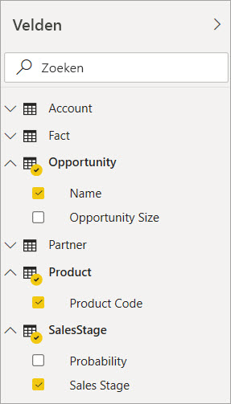
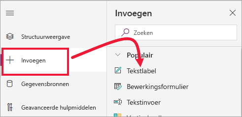

# Zelfstudie: Een Power Apps-visual insluiten in een Power BI-rapport

In deze zelfstudie gebruikt u de Power Apps-visual om een nieuwe app te maken die wordt ingesloten in een Power BI-voorbeeldrapport. Deze app communiceert met andere visuals in dit rapport.

Als u geen Power Apps-abonnement hebt, [maakt u een gratis account](https://web.powerapps.com/signup?redirect=marketing&email=) voordat u begint.

In deze zelfstudie leert u het volgende:
> [!div class="checklist"]
> * Een Power Apps-visual toevoegen aan een Power BI-rapport
> * Werk in Power Apps om een nieuwe app te maken die gebruikmaakt van gegevens uit het Power BI-rapport
> * De Power Apps-visual in het rapport weergeven en ermee werken

## Vereisten

* [Google Chrome](https://www.google.com/chrome/browser/)- of [Microsoft Edge](https://www.microsoft.com/windows/microsoft-edge)-browser
* Een [Power BI-abonnement](https://docs.microsoft.com/power-bi/service-self-service-signup-for-power-bi) waarin het [voorbeeld van een verkoopkansanalyse](https://docs.microsoft.com/power-bi/sample-opportunity-analysis#get-the-content-pack-for-this-sample) is geïnstalleerd
* Begrip van hoe u [apps maakt in Power Apps](https://docs.microsoft.com/powerapps/maker/canvas-apps/data-platform-create-app-scratch) en hoe u [Power BI-rapporten bewerkt](https://docs.microsoft.com/power-bi/service-the-report-editor-take-a-tour)

## Een nieuwe app maken
Wanneer u de Power Apps-visual toevoegt aan uw rapport, wordt Power Apps Studio gestart met een livegegevensverbinding tussen Power Apps en Power BI.

1. Open het voorbeeldrapport van een verkoopkansanalyse en selecteer de pagina *Toekomstige verkoopkansen*. 

2. Verplaats en wijzig het formaat van enkele van de rapporttegels om ruimte te maken voor de nieuwe visual.

    

2. Selecteer in het deelvenster Visualisaties het Power Apps-pictogram, en wijzig de grootte van de visual zodat deze past in de ruimte die u hebt gemaakt.

    

3. In het deelvenster **Velden** selecteert u **Naam**, **Productcode** en vervolgens **Verkoopfase**. 

    

4. Selecteer in de Power Apps-visual de Power Apps-omgeving waarin u de app wilt maken. Selecteer vervolgens **Nieuwe maken**.

    

    In Power Apps Studio ziet u dat er een basis-app wordt gemaakt met een *galerie* waarin één van de velden wordt weergegeven die u hebt geselecteerd in Power BI.

    

5.  Wijzig de grootte van de galerie zodat deze slechts de helft van het scherm in beslag neemt. 

6. Selecteer in het linkerdeelvenster de optie **Screen1** en stel de eigenschap **Vullen** van het scherm in op LightBlue (voor een betere zichtbaarheid in het rapport).

    

6. Maak wat ruimte voor een labelbesturingselement. 

    

8. Voeg onder **galerie** een tekstlabelbesturingselement in.

   

7. Sleep het label naar de onderkant van de visual. Stel de eigenschap **Tekst** in op `"Opportunity Count: " & CountRows(Gallery1.AllItems)`. Nu wordt het totale aantal verkoopkansen weergegeven in de gegevensset.

    

    

7. Sla de app op met de naam ‘Verkoopkansen-app’. 

    

## De app in het rapport weergeven
De app is nu beschikbaar in het Power BI-rapport. De app communiceert met andere visuals omdat dezelfde gegevensbron wordt gebruikt.

In het Power BI-rapport selecteert u **Jan** in de slicer. Hiermee wordt het volledige rapport gefilterd, inclusief de gegevens uit de app.

Het aantal verkoopkansen uit de app komt overeen met het aantal in de linkerbovenhoek van het rapport. U kunt andere items in het rapport en gegevens uit de app-updates selecteren.

## Resources opschonen
Als u het voorbeeld van een verkoopanalyse niet meer wilt gebruiken, kunt u het dashboard, het rapport en de gegevensset verwijderen.

## Volgende stappen
[Q&A-visual](power-bi-visualization-types-for-reports-and-q-and-a.md)    
[Zelfstudie: Een Power Apps-visual insluiten in een Power BI-rapport](https://docs.microsoft.com/powerapps/maker/canvas-apps/powerapps-custom-visual)    
