# Kennismaking met de Q&A-visual in Power BI

[!INCLUDE [power-bi-service-new-look-include](../includes/power-bi-service-new-look-include.md)]

## What is de Q&A-visual?

Met de Q&A-visual kunnen gebruikers vragen in een natuurlijke taal stellen en antwoorden krijgen in de vorm van een visual. 

[!INCLUDE [power-bi-visuals-desktop-banner](../includes/power-bi-visuals-desktop-banner.md)]

De Q&A-visual kan door *gebruikers* worden gebruikt als een hulpprogramma om snel antwoorden op hun gegevens te krijgen, maar ook door *ontwerpers* om visuals in rapporten te maken, door simpelweg te dubbelklikken op een willekeurige locatie in een rapport en natuurlijke taal te gebruiken om aan de slag te gaan. Omdat de Q&A-visual net zo werkt als andere visuals, kan deze ook kruislings worden gefilterd/gemarkeerd. Ook worden bladwijzers ondersteund. De Q&A-visual biedt ook ondersteuning voor thema's en andere standaardindelingsopties die in Power BI beschikbaar zijn.

De Q&A-visual bestaat uit vier kernonderdelen;

- Het vragenvak. Hier voeren gebruikers hun vraag in en zien ze suggesties om hun vraag aan te vullen.
- Een vooraf ingevulde lijst met voorgestelde vragen.
- Pictogram voor het omzetten van de Q&A-visual in een standaardvisual. 
- Pictogram voor het openen van het Q&A-hulpprogramma, waarmee ontwerpers de onderliggende engine voor natuurlijke taal kunnen configureren.

## Vereisten

1. In deze zelfstudie wordt het [PBIX-bestand met een voorbeeld van verkoop en marketing](https://download.microsoft.com/download/9/7/6/9767913A-29DB-40CF-8944-9AC2BC940C53/Sales%20and%20Marketing%20Sample%20PBIX.pbix) gebruikt. 

1. Selecteer linksboven in de Power BI Desktop-menubalk **Bestand** > **Openen**
   
2. Zoek uw kopie van het **PBIX-bestand met een voorbeeld van verkoop en marketing**

1. Open het bestand in de rapportweergave .

1. Selecteren  om een nieuwe pagina toe te voegen.

Als u een fout ziet wanneer u een Q&A-visual maakt, controleert u de sectie [Beperkingen](../natural-language/q-and-a-limitations.md) om te zien of de configuratie van de gegevensbron wordt ondersteund.

## Een Q&A-visual maken met behulp van een voorgestelde vraag
In deze oefening selecteren we een van de voorgestelde vragen om onze Q&A-visual te maken. 

1. Begin op een lege rapportpagina en selecteer het pictogram van de Q&A-visual in het deelvenster Visualisaties.

    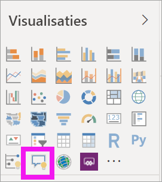

2. Sleep de rand om de grootte van de visual te wijzigen.

    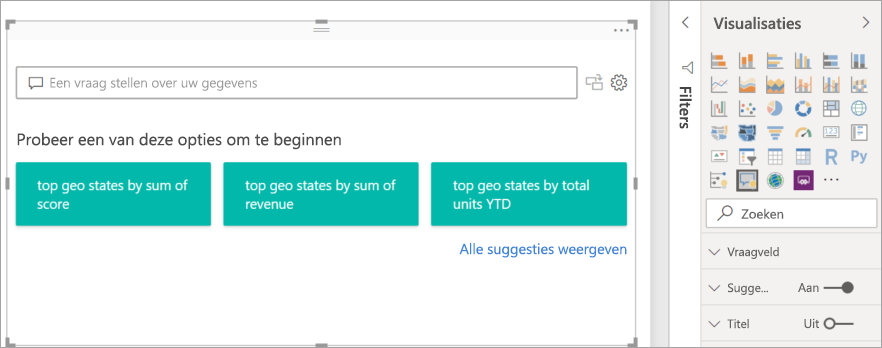

3. Voor het maken van de visual selecteert u een van de voorgestelde vragen of begint u met typen in het vraagvak. In dit voorbeeld hebben we **de belangrijkste geografische staten op totale omzet** geselecteerd. Power BI kiest zelf het beste type visualtype dat moet worden gebruikt. In dit geval is het een kaart.

    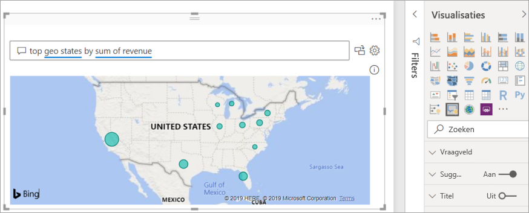

    Maar u kunt Power BI vertellen welk visualtype moet worden gebruikt door deze toe te voegen aan uw query in natuurlijke taal. Onthoud dat niet alle visualtypen goed werken of logisch zijn met betrekking tot uw gegevens. Deze gegevens leveren bijvoorbeeld geen nuttig spreidingsdiagram op. Maar het werkt wel als een choropletenkaart.

    

## Een Q&A-visual maken met behulp van een query in natuurlijke taal
In het bovenstaande voorbeeld hebben we een van de voorgestelde vragen geselecteerd om onze Q&A-visual te maken.  In deze oefening typen we onze eigen vraag. Wanneer we onze vraag invoeren, helpt Power BI ons met automatisch aanvullen, suggesties en feedback.

Als u niet zeker weet welk type vragen u wilt stellen of welke terminologie moet worden gebruikt, vouwt u **Alle suggesties weergeven** open of kijkt u in het deelvenster Velden, rechts naast het canvas. Hiermee kunt u bekend raken met de termen en de inhoud van de gegevensset Verkoop en marketing.

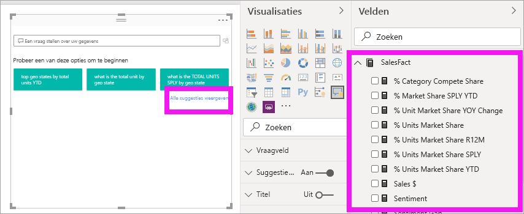

1. Typ een vraag in het Q&A-veld. Power BI voegt een rode onderstreping toe aan woorden die niet worden herkend. Waar mogelijk helpt Power BI u niet-herkende woorden te definiëren.  In het onderstaande eerste voorbeeld werkt het voor ons prima door een van de suggesties te selecteren.  

    

2. Naarmate we meer van de vraag typen, laat Power BI ons weten dat het de vraag niet begrijpt en probeert het programma ons te helpen. In het onderstaande voorbeeld vraagt Power BI ons: "Bedoelt u..." en krijgen we een suggestie om onze vraag anders te stellen, met behulp van terminologie uit onze gegevensset. 

    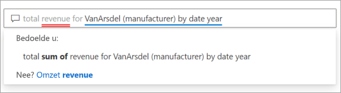

5. Met de hulp van Power BI kunnen we een vraag stellen met alle herkenbare termen. In Power BI worden de resultaten als een lijndiagram weergegeven. 

    

6. Laten we de visual nu wijzigen in een kolomdiagram. 

    

## De Q&A-visual opmaken en aanpassen
De Q&A-visual kan worden aangepast met behulp van het deelvenster Opmaak en door een thema toe te passen. 

### Een thema toepassen
Wanneer u een thema selecteert, wordt dat thema toegepast op de gehele rapportpagina. U kunt uit talloze thema's kiezen, dus probeer ze gerust tot u de gewenste vormgeving hebt. 

1. Selecteer het tabblad **Start** op de menubalk en kies **Thema wisselen**. 

    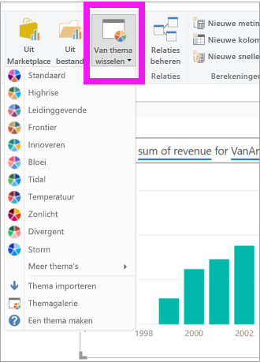

    
    
2. In dit voorbeeld hebben we **Meer thema's** > **Geschikt voor kleurenblinden** geselecteerd.

    

### De Q&A-visual opmaken
Configureer de opmaak van de Q&A-visual, het vraagveld en de manier waarop suggesties worden weergegeven. U kunt alles wijzigen, van de achtergrond van een titel tot de kleur van de cursor waarmee over niet-herkende woorden wordt bewogen. Hier hebben we een grijze achtergrond aan het vraagvak toegevoegd en de onderstreping gewijzigd in geel en groen. De titel is gecentreerd en heeft een gele achtergrond. 

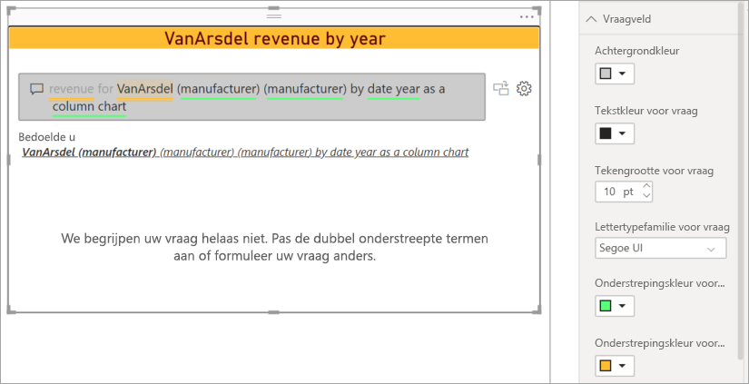

## Uw Q&A-visual omzetten naar een standaardvisual
We hebben de opmaak van onze visual met kolomdiagram en de optie Geschikt voor kleurenblinden enigszins aangepast, we hebben een titel en een rand toegevoegd. We kunnen de visual nu omzetten naar een standaardvisual in ons rapport en de visual bovendien vastmaken aan een dashboard.

Selecteer het  om de optie **Dit Q&A-resultaat omzetten in een standaardvisual** uit te voeren.

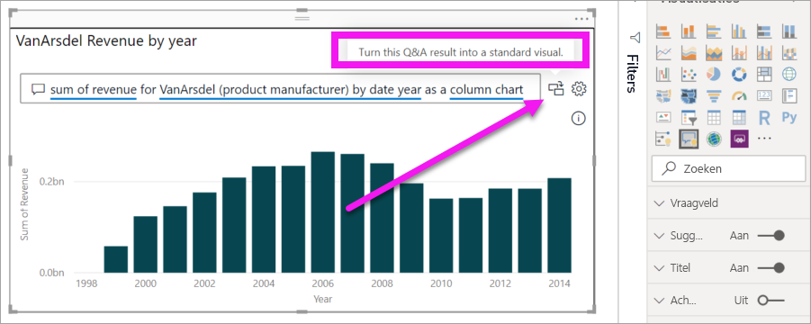

Deze visual is niet langer een Q&A-visual maar een standaardkolomdiagram. Deze visual kan worden vastgemaakt aan een dashboard. In het rapport gedraagt deze visual zich op dezelfde manier als andere standaardvisuals. U ziet dat in het deelvenster Visualisaties een kolomdiagrampictogram is geselecteerd in plaats van het Q&A-visualpictogram.

Als u de ***Power BI-service*** gebruikt, kunt u de visual nu vastmaken aan een dashboard door het pictogram Vastmaken te selecteren. 

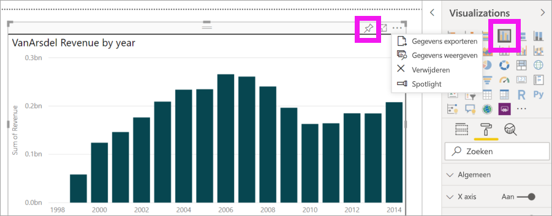

## Geavanceerde functies van de Q&A-visual
Door het tandwielpictogram te selecteren, opent u het deelvenster Hulpprogramma's van de Q&A-visual. 

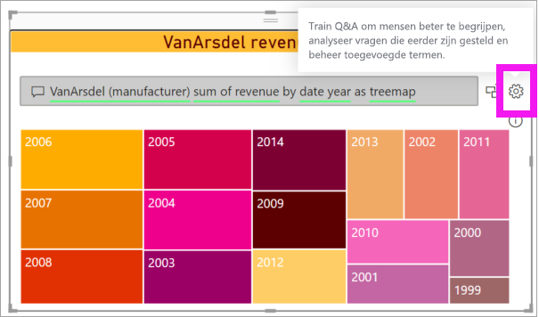

Gebruik het deelvenster Hulpprogramma's om Q&A-termen te trainen die niet worden herkend, die termen te beheren en de voorgestelde vragen voor deze gegevensset en dit rapport te beheren. In het deelvenster Hulpprogramma's kunt u ook vragen controleren die met behulp van deze Q&A-visual zijn gesteld en vragen zien die door gebruikers zijn gemarkeerd. Zie [Inleiding in Q&A-hulpprogramma's](../natural-language/q-and-a-tooling-intro.md) voor meer informatie.

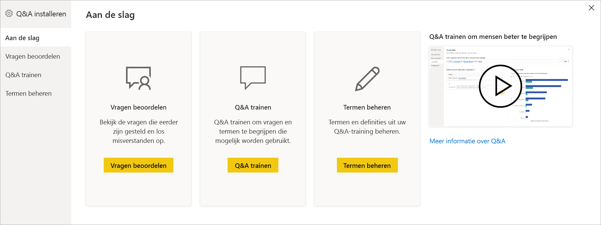

## Aandachtspunten en probleemoplossing
De Q&A-visual kan worden geïntegreerd met Office en Bing om niet-herkende gangbare woorden te vergelijken met velden in uw gegevensset.  

## Volgende stappen

U kunt natuurlijke taal op diverse manieren integreren. Raadpleeg voor meer informatie de volgende artikelen:

* [Q&A-hulpprogramma's](../natural-language/q-and-a-tooling-intro.md)
* [Best practices voor Q&A](../natural-language/q-and-a-best-practices.md)
