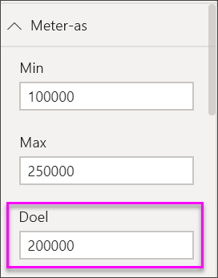

# Radiale-meterdiagrammen in Power BI

[!INCLUDE[consumer-appliesto-nyyn](../includes/consumer-appliesto-nyyn.md)]

[!INCLUDE [power-bi-visuals-desktop-banner](../includes/power-bi-visuals-desktop-banner.md)]

Een radiale-meterdiagram heeft een cirkelvormige boog en toont één waarde die de voortgang naar een doel of KPI (Key Performance Indicator) meet. De regel (of *naald*) vertegenwoordigt het doel of de doelwaarde. De arcering vertegenwoordigt de voortgang naar dit doel. De waarde in de boog vertegenwoordigt de voortgangswaarde. In Power BI worden alle mogelijke waarden gelijkmatig verdeeld langs de boog, van minimum (meest linkse waarde) tot maximum (meest rechtse waarde).

In dit voorbeeld bent u een autohandelaar die de gemiddelde verkoop van het verkoopteam per maand bijhoudt. De naald vertegenwoordigt een verkoopdoel van 140 auto’s. De minimale mogelijke gemiddelde verkoop is ingesteld op 0 en het maximum is 200.  De blauwe arcering geeft aan dat het team deze maand gemiddeld ongeveer 120 verkopen heeft. Gelukkig is er nog één week om het doel te bereiken.

> [!NOTE]
> Voor het delen van uw rapport met een Power BI-collega moeten u beiden beschikken over een afzonderlijke Power BI Pro-licentie of moet het rapport zijn opgeslagen in Premium-capaciteit.

## Wanneer gebruikt u een radiale meter

Radiale meters zijn een uitstekende keuze om:

* De voortgang van een doel weer te geven.

* Een percentielmeting weer te geven, zoals een KPI.

* De status van één meting weer te geven.

* Informatie weer te geven die u snel kunt scannen en begrijpen.

## Vereisten

In deze zelfstudie wordt gebruikgemaakt van het [Excel-bestand met het financiële voorbeeld](https://download.microsoft.com/download/9/6/D/96DDC2FF-2568-491D-AAFA-AFDD6F763AE3/Retail%20Analysis%20Sample%20PBIX.pbix).

1. Selecteer linksboven in de menubalk **Gegevens ophalen** > **Excel**
   
2. Zoek uw kopie van het **Excel-bestand met het financiële voorbeeld**

1. Open het **Excel-bestand met het financiële voorbeeld** in de rapportweergave .

1. Selecteer **financiën** en **Blad1**

1. Klik op **Laden**

1. Selecteren  om een nieuwe pagina toe te voegen.

## Een eenvoudige radiale meter maken

### Stap 1: Een meter maken om de brutoverkoop bij te houden

1. Begin op een nieuwe, lege rapportpagina

1. Selecteer in het deelvenster **Velden** de optie **Brutoverkoop**.

   

1. Wijzig de aggregatie in **Gemiddelde**.

   

1. Selecteer het meterpictogram  om de kolomdiagram te converteren naar een meterdiagram.

    

    Afhankelijk van wanneer u het bestand **Financial Sample** downloadt, ziet u mogelijk getallen die niet overeenkomen met deze getallen.

    > [!TIP]
    > Standaard wordt in Power BI een meterdiagram gemaakt, waarbij wordt aangenomen dat de huidige waarde (in dit geval **Gemiddelde van brutoverkoop**) op het middenpunt van de meter staat. Aangezien de waarde van **Gemiddelde brutoverkoop** $182.760 is, is de beginwaarde (Minimum) ingesteld op 0 en de eindwaarde (Maximum) op het dubbele van de huidige waarde.

### Stap 3: Een doelwaarde instellen

1. Sleep **KVG** uit het deelvenster **Velden** naar de bron **Doelwaarde**.

1. Wijzig de aggregatie in **Gemiddelde**.

   Power BI voegt een naald toe die de doelwaarde van **$ 145.480** vertegenwoordigt.

   

    Zoals u ziet, hebben we ons doel overschreden.

   > [!NOTE]
   > U kunt ook handmatig een doelwaarde invoeren. Zie de sectie [Handmatige opmaakopties gebruiken om de waarden Minimum, Maximum en Doel in te stellen](#use-manual-format-options-to-set-minimum-maximum-and-target-values).

### Stap 4: Een maximumwaarde instellen

In stap 2 werd in Power BI het veld **Waarde** gebruikt om automatisch een minimum- en maximumwaarde in te stellen. Wat als u uw eigen maximumwaarde wilt instellen? Stel dat u, in plaats van de huidige waarde te verdubbelen als de maximaal mogelijke waarde, het maximum wilt instellen op de hoogste waarde voor Brutoverkoop in uw gegevensset.

1. Sleep **Brutoverkoop** uit het deelvenster **Velden** naar de bron **Maximumwaarde**.

1. Wijzig de aggregatie in **Maximum**.

   

   De meter wordt opnieuw getekend met een nieuwe eindwaarde, 1,21 miljoen, voor brutoverkoop.

   

### Stap 5: Uw rapport opslaan

1. [Sla het rapport op](../create-reports/service-report-save.md).

## Handmatige opmaakopties gebruiken om de waarden Minimum, Maximum en Doel in te stellen

1. Verwijder **Gross Sales** uit het vak **Maximumwaarde**.

1. Selecteer het pictogram met de verfroller om het deelvenster **Opmaak** te openen.

   

1. Vouw de **Meter-as** uit en voer waarden in voor **Min** en **Max**.

    

1. Wis de optie **KVG** in het deelvenster **Velden** om de doelwaarde te verwijderen.

    

1. Wanneer het veld **Doel** wordt weergegeven onder **Meter-as**, voert u een waarde in.

     

1. Pas de opmaak van het meterdiagram desgewenst verder aan.

Als u deze stappen hebt uitgevoerd, beschikt u over een meterdiagram die er ongeveer als volgt uitziet:

## Volgende stap

* [KPI-visualisaties (Key Performance Indicator)](power-bi-visualization-kpi.md)

* [Visualization types in Power BI](power-bi-visualization-types-for-reports-and-q-and-a.md) (Typen visualisaties in Power BI)

Hebt u nog vragen? [Misschien dat de Power BI-community het antwoord weet](https://community.powerbi.com/)

