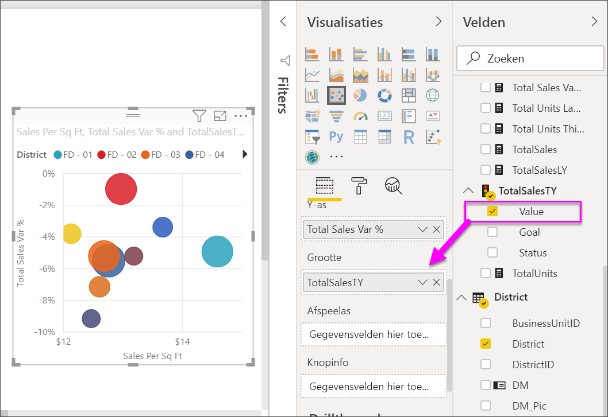
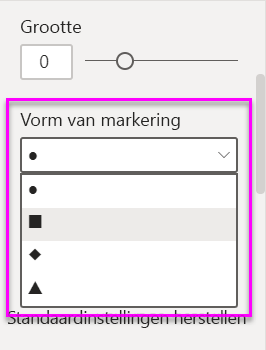

# Spreidingsdiagrammen, bellendiagrammen en eendimensionale puntdiagrammen in Power BI

[!INCLUDE[consumer-appliesto-nyyn](../includes/consumer-appliesto-nyyn.md)]

[!INCLUDE [power-bi-visuals-desktop-banner](../includes/power-bi-visuals-desktop-banner.md)]

Een spreidingsdiagram heeft altijd twee waardeassen, waarbij een reeks numerieke gegevens op een horizontale as en een andere reeks numerieke waarden op de verticale as wordt weergegeven. In het diagram worden punten weergegeven op het snijpunt van een numerieke x- en y-waarde, waarbij deze waarden in één gegevenspunt worden gecombineerd. Power BI kan deze gegevenspunten gelijkmatig of ongelijkmatig over de horizontale as verdelen. Dat hangt ervan af welke gegevens het diagram vertegenwoordigt.

U kunt het aantal gegevenspunten instellen tot maximaal 10.000.  

## Wanneer een spreidingsdiagram, bellendiagram of eendimensionaal puntdiagram gebruiken

### Spreidings- en bellendiagrammen

Een spreidingsdiagram toont de relatie tussen twee numerieke waarden. Bij een bellendiagram worden de gegevenspunten vervangen door bellen. Hierbij vertegenwoordigt de *grootte* van de bellen een derde, extra dimensie voor de gegevens.

In de volgende gevallen komen spreidingsdiagrammen goed van pas:

* Om relaties tussen twee numerieke waarden weer te geven.

* Om twee groepen getallen als één reeks X- en Y-coördinaten uit te zetten.

* Om te gebruiken in plaats van een lijndiagram wanneer u de schaal van de horizontale as wilt wijzigen.

* Om de horizontale as om te zetten in een logaritmische schaal.

* Om werkbladgegevens weer te geven met die paren of gegroepeerde sets waarden bevatten.

    > [!TIP]
    > In een spreidingsdiagram kunt u de onafhankelijke schalen van de assen aanpassen voor meer informatie over de gegroepeerde waarden.

* Om patronen weer te geven in grote gegevenssets, bijvoorbeeld door lineaire of niet-lineaire trends, clusters en uitbijters weer te geven.

* Om grote aantallen gegevenspunten te vergelijken zonder rekening te houden met tijd.  Hoe meer gegevens u opneemt in een spreidingsdiagram, des te beter zijn de vergelijkingen die u kunt maken.

Naast wat spreidingsdiagrammen voor u kunnen doen, zijn bellendiagrammen in de volgende gevallen een goede keuze:

* Als uw gegevens drie gegevensreeksen bevatten met elk een set waarden.

* Om financiële gegevens weer te geven.  Verschillende belgrootten zijn handig om specifieke waarden visueel te benadrukken.

* Om te gebruiken met kwadranten.

### Eendimensionale puntdiagrammen

Een eendimensionaal puntdiagram lijkt erg op een bellendiagram en spreidingsdiagram, maar wordt daarentegen gebruikt om categorische gegevens langs de X-as uit te zetten.

Dit type diagram is een prima keuze als u categorische gegevens wilt uitzetten langs de X-as.

## Vereisten

In deze zelfstudie wordt gebruikgemaakt van het [PBIX-bestand met het voorbeeld van een retailanalyse](https://download.microsoft.com/download/9/6/D/96DDC2FF-2568-491D-AAFA-AFDD6F763AE3/Retail%20Analysis%20Sample%20PBIX.pbix).

1. Selecteer linksboven in de menubalk **Bestand** > **Openen**
   
2. Ga naar uw kopie van het **PBIX-bestand met het voorbeeld van een retailanalyse**

1. Open het **PBIX-bestand met het voorbeeld van een retailanalyse** in de rapportweergave 

1. Selecteren  om een nieuwe pagina toe te voegen.

> [!NOTE]
> Voor het delen van uw rapport met een Power BI-collega moeten u beiden beschikken over een afzonderlijke Power BI Pro-licentie of moet het rapport zijn opgeslagen in Premium-capaciteit.    

## Een spreidingsdiagram maken

1. Start op een lege rapportpagina en selecteer in het deelvenster **Velden** de volgende velden:

    * **Verkoop** > **Verkoop per vierkante meter**

    * **Verkoop** > **Afwijkingspercentage totale verkoop**

    * **District** > **District**

    

1. Selecteer  in het deelvenster **Visualisaties** om het gegroepeerde kolomdiagram om te zetten in een spreidingsdiagram.

   

1. Sleep **District** van **Details** naar **Legenda**.

    Power BI genereert een spreidingsdiagram waarin **Total Sales Variance %** wordt uitgezet langs de Y-as en **Sales Per Square Feet** langs de X-as. De kleuren van de gegevenspunten vertegenwoordigen de districten:

    

Nu gaan we een derde dimensie toevoegen.

## Een bellendiagram maken

1. Sleep **Sales** > **This Year Sales** > **Value** vanuit het deelvenster **Velden** naar het vak **Grootte**. De gegevenspunten worden uitgevouwen naar volumes die evenredig zijn met de verkoopwaarde.

   

1. Beweeg de muisaanwijzer over een bel. De grootte van de bel geeft de waarde van **Omzet van dit jaar** weer.

    

1. Wanneer u het aantal gegevenspunten wilt instellen dat wordt weergegeven in uw bellendiagram, vouwt u in de sectie **Indeling** van het deelvenster **Visualisaties** de kaart **Algemeen** uit en past u de waarde voor **Gegevensvolume** aan.

    

    U kunt het maximale gegevensvolume instellen op een willekeurige waarde tot 10.000. Naarmate u hogere getallen tegenkomt, raden we u aan eerst de prestaties te testen.

    > [!NOTE]
    > Meer gegevenspunten kunnen leiden tot een langere laadtijd. Als u toch besluit om rapporten te publiceren met beperkingen voor de bovengrens van de schaal, zorg er dan voor dat u de rapporten test op internet en op mobiele apparaten. Het is immers belangrijk dat de prestaties van de grafiek overeenkomen met de verwachtingen van uw gebruikers.

1. Ga door met het opmaken van de visualisatiekleuren, labels, titels, achtergrond en meer. Voor een [betere toegankelijkheid](../create-reports/desktop-accessibility-overview.md) kunt u markeringsvormen aan elke regel toevoegen. Als u de markeringsvorm wilt selecteren, vouwt u **Vormen** uit, selecteert u **Vorm van markering** en selecteert u een vorm.

    

    U kunt de markeringsvorm wijzigen in een ruit, driehoek of vierkant. Als u voor elke lijn een andere markeringsvorm gebruikt, is het makkelijker voor rapportgebruikers om verschillende lijnen (of vlakken) van elkaar te onderscheiden.

1. Het deelvenster Analyse openen  Voeg extra informatie aan uw visualisatie toe.  
    - Voeg een lijn voor de mediaan toe. Selecteer **Lijn voor mediaan** > **Toevoegen**. Power BI voegt standaard een lijn voor de mediaan toe voor *Verkoop per vierkante meter*. Dit is niet heel handig, omdat we zien dat er tien gegevenspunten zijn en we weten dat de mediaan wordt gemaakt met aan elke zijde vijf gegevenspunten. Stel de **meting** in plaats daarvan in op *Totaal afw.perc. verkoop*.  

        

    - Voeg symmetrie-arcering toe om aan te geven welke punten een hogere waarde hebben van de x-asmeting vergeleken met de y-asmeting en vice versa. Wanneer u symmetrie-arcering inschakelt in het deelvenster Analyse, wordt in Power BI de achtergrond van uw spreidingsdiagram symmetrisch weergegeven op basis van de huidige boven- en ondergrenzen van de as. Dit is een snelle manier om te identificeren welke as-meting de voorkeur heeft voor een gegevenspunt, met name wanneer u een ander asbereik voor uw x- en y-as hebt.

        a. Wijzig het veld **Totaal afw.perc. verkoop** in **Brutomarge van vorig jaar%**

        

        b. Voeg **symmetrie-arcering** toe vanuit het deelvenster Analyse. We zien aan de arcering dat Kousen (de groene bel in het roze gearceerde gebied) de enige categorie is waarin de brutomarge de voorkeur heeft boven de verkoop per vierkante meter. 

        

    - Ga verder met het verkennen van het deelvenster Analyse om interessante inzichten uit uw gegevens te krijgen. 

        

## Een eendimensionaal puntdiagram maken

Als u een eendimensionaal puntdiagram wilt maken, vervangt u het veld voor de numerieke **X-as** door een categorisch veld.

Ga naar het deelvenster **X-as**, verwijder **Sales per sq ft** en vervang dit door **District** > **District Manager**.

## Aandachtspunten en probleemoplossing

### Uw spreidingsdiagram heeft slechts één gegevenspunt

Hebt u een spreidingsdiagram gemaakt en wordt daarin slechts één gegevenspunt weergegeven waarin alle waarden van de X- en Y-as worden samengevoegd?  Of worden in het diagram alle waarden langs een horizontale of verticale lijn weergegeven?

Voeg een veld toe aan het vak **Details** om aan Power BI aan te geven hoe de waarden moeten worden gegroepeerd. Het veld moet uniek zijn voor elk punt dat moet worden weergegeven. Denk hierbij aan een rijnummer of id-veld.

Als uw gegevens dit niet bevatten, maakt u een veld waarin uw X- en Y-waarden worden samengevoegd in iets unieks per punt:

[Gebruik van de Query Editor van Power BI Desktop om een indexkolom toe te voegen](../create-reports/desktop-add-custom-column.md) aan uw gegevensset om een nieuw veld te maken. Voeg vervolgens deze kolom toe aan het vak **Details** van uw visualisatie.

## Volgende stappen

Wellicht bent u ook geïnteresseerd in de volgende artikelen:

* [High-densitysampling in Power BI-spreidingsdiagrammen](../create-reports/desktop-high-density-scatter-charts.md)
* [Visualization types in Power BI](power-bi-visualization-types-for-reports-and-q-and-a.md) (Typen visualisaties in Power BI)
* [Tips voor het sorteren en distribueren van gegevensgrafieken in Power BI-rapporten](../guidance/report-tips-sort-distribute-data-plots.md)

Hebt u nog vragen? [Misschien dat de Power BI-community het antwoord weet](https://community.powerbi.com/)
