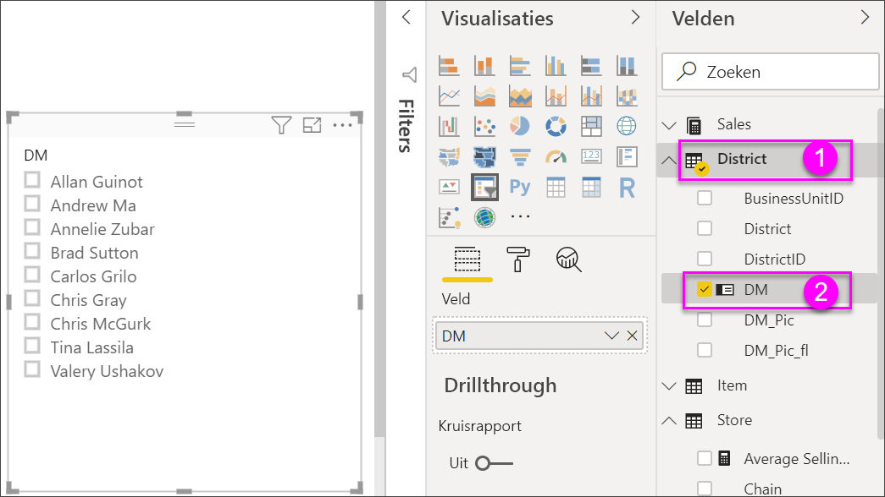
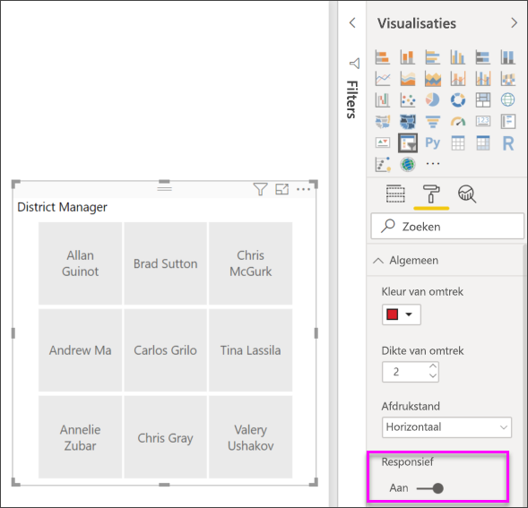

# Slicers in Power BI

[!INCLUDE [applies-to](../includes/applies-to.md)] [!INCLUDE [yes-desktop](../includes/yes-desktop.md)] [!INCLUDE [yes-service](../includes/yes-service.md)]

Stel dat u wilt dat de lezers van uw rapport de algemene metrische gegevens voor de verkoop kunnen bekijken, maar dat ze ook prestaties voor afzonderlijke districtmanagers en verschillende perioden kunnen markeren. U kunt aparte rapporten of vergelijkende grafieken maken. Of u kunt gebruikmaken van *slicers*. Een slicer is een alternatieve manier om te filteren. U beperkt hiermee het gedeelte van de gegevensset dat wordt weergegeven in de andere visualisaties in een rapport. 

In dit artikel wordt uitgelegd hoe u een eenvoudige slicer maakt en opmaakt met behulp van het gratis [voorbeeld van een retailanalyse](../create-reports/sample-retail-analysis.md). Hierin krijgt u ook te zien hoe u kunt bepalen welke visuals worden beïnvloed door een slicer en hoe u deze synchroniseert met slicers op andere pagina's. Hier volgen enkele andere artikelen waarin wordt uitgelegd hoe u specifieke typen slicers kunt maken:

- [Slicers voor numeriek bereik](../create-reports/desktop-slicer-numeric-range.md).
- [Relatieve datumslicers](desktop-slicer-filter-date-range.md).
- Responsieve, [verstelbare slicers](../create-reports/power-bi-slicer-filter-responsive.md).
- [Hiërarchieslicers](../create-reports/power-bi-slicer-hierarchy-multiple-fields.md) met meerdere velden.

## Een slicer gebruiken
Slicers zijn een goede keuze als u:

* veelgebruikte of belangrijke filters op het rapportcanvas wilt weergeven voor een eenvoudigere toegang;
* de huidige gefilterde status gemakkelijker wilt bekijken zonder dat u een vervolgkeuzelijst hoeft te openen; 
* wilt filteren op kolommen die niet nodig zijn en verborgen zitten in de gegevenstabellen;
* meer gerichte rapporten wilt maken door slicers naast belangrijke visuele elementen te zetten.

De volgende elementen worden niet door Power BI-slicers ondersteund:

- Invoervelden
- Inzoomen

## Een slicer maken

Deze slicer filtert gegevens per districtmanager. Als u deze procedure wilt volgen, moet u het [PBIX-bestand van het retailanalysevoorbeeld](https://download.microsoft.com/download/9/6/D/96DDC2FF-2568-491D-AAFA-AFDD6F763AE3/Retail%20Analysis%20Sample%20PBIX.pbix) downloaden.

1. Open Power BI Desktop en selecteer in de menubalk **Bestand** > **Openen**.
   
1. Blader naar het PBIX-bestand **Voorbeeld van een retailanalyse.pbix** en selecteer vervolgens **Openen**.

1. Selecteer in het linkerdeelvenster het pictogram **Rapport** om het bestand in de rapportweergave te openen.

1. Zorg ervoor dat er niets op het rapportcanvas is geselecteerd en selecteer op de pagina **Overzicht** het pictogram **Slicer** in het deelvenster **Visualisaties** om een nieuwe slicer te maken. 

1. Selecteer terwijl de nieuwe slicer is geselecteerd, in het deelvenster **Velden**, de optie **District** > **DM** om de slicer te vullen. 

    De nieuwe slicer wordt nu ingevuld met een lijst met namen van districtmanagers en de bijbehorende selectievakjes.
    
    
    
1. Vergroot of verklein de elementen op het canvas en versleep deze om ruimte voor de slicer te maken. Houd er rekening mee dat de items van de slicer worden afgekapt als u de slicer te klein maakt. 

1. Selecteer namen op de slicer en bekijk wat de gevolgen voor de andere visualisaties op de pagina zijn. Selecteer namen opnieuw om de selectie van de namen ongedaan te maken of houd de **Ctrl**-toets ingedrukt om meer dan één naam te selecteren. Als u alle namen selecteert, heeft dit hetzelfde effect als wanneer u geen naam selecteert. 

1. U kunt ook **Opmaak** (verfrollerpictogram) in het deelvenster **Visualisaties** selecteren om uw slicer op te maken. 

   Er zijn te veel opties om hier allemaal te beschrijven. Experimenteer dus met het maken van een slicer die voor u werkt. In de volgende afbeelding gebruikt de eerste slicer een horizontale stand en gekleurde achtergronden voor de items. Voor de tweede slicer worden een verticale stand en gekleurde tekst gebruikt, voor een meer standaardvormgeving.

   

   >[!TIP]
   >Sliceritems in een lijst worden standaard in oplopende volgorde gesorteerd. Als u de sorteervolgorde wilt wijzigen in aflopend, selecteert u het beletselteken ( **...** ) in de rechterbovenhoek van de slicer en kiest u **Aflopend sorteren**.

## Regelen welke visuals op de pagina worden beïnvloed door slicers
Slicers op rapportpagina's beïnvloeden standaard alle andere visualisaties op die pagina, met inbegrip van elkaar. Bekijk bij het kiezen van waarden in de lijst en datumschuifregelaars die u zojuist hebt gemaakt, de gevolgen voor de andere visualisaties. De gefilterde gegevens zijn een snijpunt van de waarden die in beide slicers zijn geselecteerd. 

Gebruik visuele interacties om te voorkomen dat bepaalde visualisaties op de pagina worden beïnvloed door andere. Op de pagina **Overzicht** ziet u in de grafiek **Totale verkoopvariantie op FiscalMonth en District Manager** de totale vergelijkende gegevens voor districtmanagers op maand. Deze grafiek kunt u het beste altijd zichtbaar houden. Gebruik visuele interacties om te voorkomen dat slicerselecties deze grafiek filteren. 

1. Ga naar de pagina **Overzicht** van het rapport en selecteer de slicer **DM** die u zojuist hebt gemaakt.

1. Selecteer in het Power BI Desktop-menu het menu **Opmaak** onder **Visual Tools** en selecteer vervolgens **Interacties bewerken**.
   
   Filterbesturingselementen , elk met de optie **Filter** en de optie **Geen**, worden boven alle visuals op de pagina weergegeven. In eerste instantie wordt de optie **Filter** vooraf geselecteerd op alle besturingselementen.
   
1. Selecteer de optie **Geen** in het filterbesturingselement boven de grafiek **Totale verkoopvariantie op FiscalMonth en District Manager** om te voorkomen dat deze door de slicer **DM** wordt gefilterd. 

1. Selecteer de slicer **OpenDate** en selecteer vervolgens de optie **Geen** boven de grafiek **Totale verkoopvariantie op FiscalMonth en District Manager** om te voorkomen dat deze grafiek door deze slicer wordt gefilterd. 

   Als u nu namen en datumbereiken in de slicers selecteert, wordt de grafiek **Totaal afwijkingspercentage verkoop per FiscalMonth en District Manager** niet gewijzigd.

Zie [De interactie tussen visuals in een Power BI-rapport wijzigen](../create-reports/service-reports-visual-interactions.md) voor meer informatie over het bewerken van interacties.

## Slicers synchroniseren en op andere pagina's gebruiken
Met ingang van de Power BI-update van februari 2018 kunt u een slicer synchroniseren en deze op een of alle pagina's in een rapport gebruiken. 

In het huidige rapport heeft de pagina **Maandelijkse verkoop district** een slicer **Districtmanager**, maar wat als u deze slicer ook wilt weergeven op de pagina **Nieuwe winkels**? De pagina **Nieuwe winkels** heeft een slicer, maar het biedt alleen informatie over de **naam van de winkel**. In het deelvenster **Slicers synchroniseren** kunt u de slicer **Districtmanager** naar deze pagina's synchroniseren, zodat slicerselecties op elke pagina invloed hebben op visualisaties op alle drie de pagina's.

1. Selecteer in het Power BI Desktop-menu **Weergave** de optie **Slicers synchroniseren**.

    

    Het deelvenster **Slicers synchroniseren** wordt weergegeven tussen de deelvensters **Filters** en **Visualisaties**.

    

1. Selecteer op de rapportpagina **Maandelijkse verkoop district** de slicer **Districtmanager**. 

    Omdat u de slicer **Districtmanager** (**DM**) al hebt gemaakt op de pagina **Overzicht**, wordt het deelvenster **Slicers synchroniseren** als volgt weergegeven:
    
    
    
1. Selecteer in de kolom **Synchronisatie** van het deelvenster **Slicers synchroniseren** de pagina's **Overzicht**, **Maandelijkse verkoop district** en **Nieuwe winkels**. 

    Door deze selectie wordt de slicer **Maandelijkse verkoop district** gesynchroniseerd op deze drie pagina's. 
    
1. In de kolom **Zichtbaar** van het deelvenster **Slicers synchroniseren** selecteert u de pagina **Nieuwe winkels**. 

    Door deze selectie wordt de slicer **Maandelijkse verkoop district** zichtbaar gemaakt op deze drie pagina's. Het deelvenster **Slicers synchroniseren** wordt nu als volgt weergegeven:

    

1. Bekijk de gevolgen van het synchroniseren van de slicer en van het zichtbaar maken op de andere pagina's. Op de pagina **Maandelijkse verkoop district** laat de slicer **Districtmanager** nu dezelfde selecties zien als de slicer op de pagina **Overzicht**. Op de pagina **Nieuwe winkels** is nu de slicer **Districtmanager** zichtbaar; de selecties beïnvloeden de selecties die zichtbaar zijn in de slicer **Winkelnaam**. 
    
    >[!TIP]
    >Hoewel de slicer in eerste instantie op de gesynchroniseerde pagina's wordt weergegeven met dezelfde grootte en positie als op de oorspronkelijke pagina, kunt u gesynchroniseerde slicers verplaatsen, groter of kleiner maken en opmaken op alle pagina's afzonderlijk. 

    >[!NOTE]
    >Als u een slicer naar een pagina synchroniseert, maar deze niet zichtbaar maakt op die pagina, filteren de slicerselecties op de andere pagina's nog steeds de gegevens op de pagina.
 
## Slicers filteren
U kunt filters op visualniveau toepassen op slicers om de lijst met waarden die worden weergegeven in de slicer terug te brengen. U kunt bijvoorbeeld lege waarden uit een slicer van een lijst filteren of bepaalde datums uit een slicer voor een bereik filteren. Wanneer u dit doet, is dit alleen van invloed op *de waarden die worden weergegeven in de slicer* en niet op *het filter dat de slicer op andere visuals toepast* wanneer u een selectie maakt. Stel bijvoorbeeld dat u een filter toepast op een slicer voor een bereik om alleen bepaalde datums weer te geven. In de selectie op de slicer worden alleen de eerste en laatste datums van dat bereik weergegeven, maar u kunt nog steeds andere datums zien in uw andere visuals. Zodra u het geselecteerde bereik in de slicer hebt gewijzigd, ziet u dat de andere visuals zijn bijgewerkt. Als u de slicer wist, worden alle datums weer weergegeven.

Zie [Filtertypen](../create-reports/power-bi-report-filter-types.md) voor meer informatie over filters op het visualniveau.

## Slicers opmaken
Er zijn verschillende opmaakopties beschikbaar, afhankelijk van het type slicer. Door de stand **Horizontaal**, de lay-out **Responsief** en kleuren voor **items** te gebruiken, kunt u knoppen of tegels produceren in plaats van standaardlijstitems en kunt u de grootte van slicer-items aanpassen voor verschillende schermgrootten en lay-outs.  

1. Selecteer, terwijl de slicer **Districtmanager** is geselecteerd op een pagina, in het deelvenster **Visualisaties** het pictogram **Opmaak** om de opmaakbesturingselementen weer te geven. 
    
    
    
1. Selecteer de vervolgkeuzelijstpijlen naast elke categorie om de opties weer te geven en te bewerken. 

### Algemene opties
1. Onder **Opmaak** selecteert u **Algemeen**. Selecteer een rode kleur onder **Kleur van omtrek** en wijzig **Dikte van omtrek** vervolgens in *2*. 

    Door deze instelling worden de kleur en de dikte van de contouren of onderstrepingen van kopteksten en items gewijzigd.

1. Voor **Stand** is standaard **Verticaal** geselecteerd. Selecteer **Horizontaal** om een slicer te produceren met horizontaal gerangschikte tegels of knoppen en schuifpijlen voor toegang tot items die niet in de slicer passen.
    
    
    
1. Schakel de lay-out **Responsief** **in** om de grootte en rangschikking van slicer-items overeenkomstig het weergavescherm en de slicergrootte te wijzigen. 

    Voor lijstslicers wordt met de responsieve lay-out voorkomen dat items op kleine schermen worden afgekapt. Dit is alleen beschikbaar in horizontale standen. Bij slicers met een bereikschuifregelaar wordt met de responsieve opmaak de stijl van de schuifregelaar gewijzigd en wordt er meer flexibiliteit voor vergroten of verkleinen geboden. Beide typen slicers worden filterpictogrammen bij kleine grootten.
    
    
    
    >[!NOTE]
    >Wijzigingen in de responsieve lay-out kunnen specifieke, door u ingestelde opmaak van kopteksten en items opmaak overschrijven. 
    
1. Onder **X-positie**, **Y-positie**, **Breedte** en **Hoogte** stelt u de slicerpositie en de grootte in met numerieke precisie, of verplaats en wijzig de grootte van de slicer rechtstreeks op het canvas. 

    Experimenteer met verschillende itemgrootten en rangschikkingen en bekijk hoe de responsieve opmaak dienovereenkomstig wordt gewijzigd. Deze opties zijn alleen beschikbaar wanneer u horizontale standen selecteert. 

    

Zie [Een responsieve slicer maken waarvan u de grootte kunt wijzigen in Power BI](../create-reports/power-bi-slicer-filter-responsive.md) voor meer informatie over horizontale standen en responsieve indelingen.

### Opties voor selectiebesturingselementen (alleen lijstslicers)
1. Onder **Selectiebesturingselementen** stelt u **De optie Alles selecteren weergeven** in op **Aan** om het item **Alles selecteren** aan de slicer toe te voegen. 

    **De optie Alles selecteren weergeven** is standaard **uitgeschakeld**. Als deze optie is ingeschakeld en u tussen de opties wisselt, worden alle items geselecteerd of gedeselecteerd. Als u alle items selecteert en vervolgens een item selecteert, wordt dit item gedeselecteerd, zodat u het filtertype *is-niet* kunt gebruiken.
    
    
    
1. Stel **Eén selecteren** in op **Uit** zodat u meerdere items kunt selecteren zonder de **Ctrl**-toets ingedrukt te hoeven houden. 

    **Eén selecteren** is standaard **ingeschakeld**. Als u een item selecteert, wordt alleen dit item geselecteerd. Als u de **Ctrl**-toets ingedrukt houdt, worden meerdere items geselecteerd. Als u een item opnieuw selecteert, wordt dit item gedeselecteerd.

### Titelopties
**Titel** is standaard **Ingeschakeld**. Met deze selectie wordt de naam van het gegevensveld boven aan de slicer weergegeven. 
- Voor dit artikel maakt u de titeltekst als volgt op: 
   - **Tekstkleur**: rood
   - **Tekengrootte**: **14 pt**
   - **Uitlijning**: **Centreren**
   - **Lettertypefamilie**: **Arial Black**

### Itemopties (alleen lijstslicers)
1. Voor dit artikel maakt u de opties **Items** als volgt op:
    - **Tekstkleur**: zwart
    - **Achtergrond**: lichtrood
    - **Tekengrootte**: **10 pt**
    - **Lettertypefamilie**: **Arial**
 
1. Kies voor **Contour** de optie **Kader** om een rand om elk item te tekenen met de grootte en de kleur die u bij de **algemene opties** hebt ingesteld. 
    
    
    
    >[!TIP]
    >- Gedeselecteerde items tonen bij **Algemeen** > **Stand** > **Horizontaal** de gekozen tekst- en achtergrondkleuren, terwijl de geselecteerde items gebruikmaken van de systeemstandaard, doorgaans een zwarte achtergrond met witte tekst.
    >- Bij **Algemeen** > **Stand > Verticaal** tonen items altijd de geselecteerde kleuren en zijn selectievakjes altijd zwart wanneer deze zijn geselecteerd. 

### Datuminvoer en numerieke invoer en schuifregelaarsopties (alleen slicers met een bereikschuifregelaar)
- Voor lijstslicers zijn de opties voor datuminvoer/numerieke invoer hetzelfde als **Itemopties**, met de uitzondering dat er geen contour- of onderstrepingsopties zijn.
- Met opties voor de **schuifregelaar** kunt u de kleur van de bereikschuifregelaar instellen of de schuifregelaar instellen op **Uit**, zodat alleen de numerieke invoer wordt gehandhaafd.

### Overige opmaakopties
De overige opmaakopties zijn standaard **uitgeschakeld**. Schakel deze opties **in** om deze te beheren: 
- **Achtergrond**: Veen achtergrondkleur toevoegen aan de slicer en stel de transparantie instellen.
- **Hoogte-breedteverhouding vergrendelen**: de vorm van de slicer behouden als de grootte ervan wordt gewijzigd.
- **Rand**: een rand rondom de slicer toevoegen en stel de kleur instellen. Deze slicerrand is gescheiden van en wordt niet beïnvloed door de **algemene** instellingen. 

## Volgende stappen
Raadpleeg voor meer informatie de volgende artikelen:

- [Visualization types in Power BI](power-bi-visualization-types-for-reports-and-q-and-a.md) (Typen visualisaties in Power BI)

- [Tabellen in Power BI](power-bi-visualization-tables.md)
