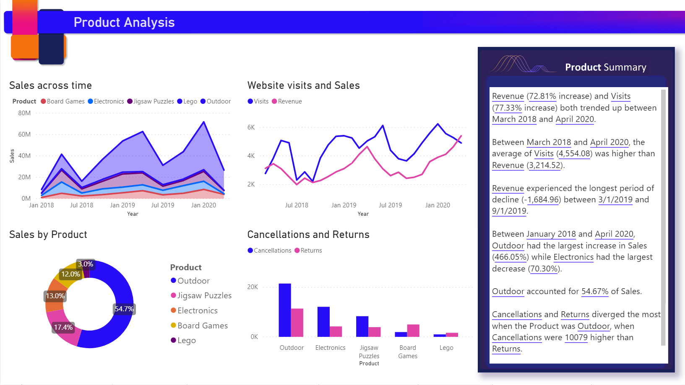

# Slimme verhalen maken (preview)

[!INCLUDE[consumer-appliesto-nyyn](../includes/consumer-appliesto-nyyn.md)]    

[!INCLUDE [power-bi-visuals-desktop-banner](../includes/power-bi-visuals-desktop-banner.md)]

Met de visualisatie Slim verhaal kunt u snel visuals en rapporten samenvatten. De visualisatie biedt relevante innovatieve inzichten die u kunt aanpassen.

Gebruik slimme verhalen in uw rapporten om de aandacht te vestigen op belangrijke gegevens, trends aan te geven, en de taal en indeling aan te passen voor een specifieke doelgroep. In plaats van een schermopname van een rapport in PowerPoint te plakken met de belangrijkste punten, kunt u verhalen toevoegen die bij elke vernieuwing worden bijgewerkt. Uw publiek kan de verhalen gebruiken om de gegevens beter te begrijpen, sneller tot de belangrijkste punten te komen en de gegevens aan anderen uit te leggen.

>[!NOTE]
> Omdat de functie Visual van Slim verhaal in preview is, moet u de functie eerst inschakelen als u deze wilt gebruiken. Selecteer in Power BI **Bestand** > **Opties en instellingen** > **Opties** > **Preview-functies**. Selecteer vervolgens **Visual van Slim verhaal**.
>
>

Als u deze zelfstudie wilt volgen, downloadt u het [voorbeeldbestand](https://github.com/microsoft/powerbi-desktop-samples/blob/master/Monthly%20Desktop%20Blog%20Samples/2020/2020SU09%20Blog%20Demo%20-%20September.pbix) van een scenario met online verkopen.

## Aan de slag 

Selecteer in het deelvenster **Visualisaties** het pictogram **Slim verhaal** om automatisch een samenvatting te genereren.

U ziet een verhaal dat is gebaseerd op alle visuals op de pagina. In het voorbeeldbestand kunt u via Slim verhaal bijvoorbeeld automatisch een samenvatting genereren van de visuals van het rapport die betrekking hebben op de inkomsten, het aantal bezoeken aan de website en de omzet. Power BI analyseert automatisch trends om aan te tonen dat de inkomsten en bezoeken beide zijn toegenomen. Zelfs de groei wordt berekend, in dit geval 72 procent.
 

 
Als u een slim verhaal wilt genereren van een visualisatie, klikt u met de rechtermuisknop op de visualisatie en selecteert u **Samenvatten**. Probeer in het voorbeeldbestand maar eens een samenvatting te maken van een spreidingsdiagram waarin verschillende transacties zijn opgenomen. Power BI analyseert de gegevens en geeft aan welke plaats of regio de hoogste inkomsten per transactie heeft en het grootste aantal transacties. Het slimme verhaal toont ook het verwachte bereik van waarden voor deze metrische gegevens. U ziet dat de meeste steden minder dan $45 per transactie produceren en minder dan 10 transacties hebben.
 
  

 
## De samenvatting bewerken
 
Het slimme verhaal of de samenvatting kan naar eigen goeddunken worden aangepast. U kunt de bestaande tekst bewerken of tekst toevoegen met behulp van de opdrachten in het tekstvak. Zo kunt u de tekst vet maken of de tekstkleur wijzigen.
 

  
U kunt de samenvatting aanpassen of uw eigen inzichten toevoegen door *dynamische waarden* te gebruiken. U kunt tekst toewijzen aan bestaande velden en metingen, of natuurlijke taal gebruiken om een nieuwe meting te definiëren die aan tekst moet worden toegewezen. Als u bijvoorbeeld informatie wilt toevoegen over het aantal geretourneerde items in het voorbeeldbestand, voegt u een waarde toe. 

Terwijl u de naam van een waarde typt, kunt u kiezen uit een lijst met suggesties zoals in een visual van het type Q&A. Dus naast het stellen van vragen over uw gegevens in een Q&A-visual, kunt u nu uw eigen berekeningen maken zonder dat u DAX (Data Analysis Expressions) hoeft te gebruiken. 
  

  
U kunt dynamische waarden ook opmaken. In het voorbeeldbestand kunt u waarden bijvoorbeeld weergeven als valuta, het aantal decimalen opgeven en een scheidingsteken voor duizendtallen kiezen. 
   

   
Als u een dynamische waarde wilt opmaken, selecteert u de waarde in de samenvatting om de bewerkingsopties weer te geven op het tabblad **Beoordelen**. U kunt ook de knop Bewerken selecteren in het tekstvak naast de waarde die u wilt bewerken. 
   

   
U kunt het tabblad **Beoordelen** ook gebruiken om eerder gedefinieerde waarden te controleren, verwijderen of hergebruiken. Selecteer het plusteken (+) om de waarde in de samenvatting in te voegen. U kunt ook automatisch gegenereerde waarden weergeven door de optie onderaan het tabblad **Beoordelen** in te schakelen.

Soms bevat het slimme verhaal een symbool voor een verborgen samenvatting. Dit geeft aan dat de huidige gegevens en filters geen resultaat opleveren voor de waarde. Een samenvatting is leeg wanneer er geen inzichten beschikbaar zijn. Zo kan in het lijndiagram van het voorbeeldbestand een samenvatting met hoge en lage waarden leeg zijn wanneer de lijn van de grafiek vlak is. De samenvatting kan echter onder andere omstandigheden worden weergegeven. Symbolen voor een verborgen samenvatting worden alleen weergegeven wanneer u probeert een samenvatting te bewerken.

   
## Visualinteracties
Een samenvatting is dynamisch en de gegenereerde tekst en dynamische waarden worden automatisch bijgewerkt wanneer u kruislings filtert. Als u bijvoorbeeld elektronicaproducten selecteert in het ringdiagram in het voorbeeldbestand, wordt de rest van het rapport kruislings gefilterd en wordt de samenvatting ook kruislings gefilterd zodat u zich op de elektronicaproducten kunt richten.  

In dit geval geven de bezoeken en inkomsten verschillende trends te zien, en dus wordt de tekst bijgewerkt om dit aan te geven. De waarde van het aantal retouren die we hebben toegevoegd, wordt bijgewerkt naar €4196. Lege samenvattingen kunnen worden bijgewerkt wanneer u kruislings filtert.
   

   
U kunt ook geavanceerdere filters toepassen. Kijk in het voorbeeldbestand eens naar de visual met trends voor meerdere producten. Als u alleen geïnteresseerd bent in een trend voor een bepaald kwartaal, selecteert u de relevante gegevenspunten om de samenvatting voor die trend bij te werken.
   

   
## Beperkingen

De functie Slim verhaal biedt geen ondersteuning voor de volgende functionaliteit:
- Vastmaken aan een dashboard 
- Het gebruik van dynamische waarden en voorwaardelijke opmaak (bijvoorbeeld een titel die aan gegevens is gebonden)
- Azure Analysis Services, on-premises AS
- KPI's, kaarten, kaarten met meerdere rijen, plattegronden, tabellen, matrices, R-visuals of Python-visuals, aangepaste visuals 
- Samenvattingen van visuals met kolommen die zijn gegroepeerd op andere kolommen en van visuals die zijn samengesteld op basis van een gegevensgroepsveld 
- Kruislings filteren buiten een visual
- Het wijzigen van de naam van dynamische waarden of het bewerken van automatisch gegenereerde dynamische waarden
- Samenvattingen van visuals met directe berekeningen, zoals rekenkundige QnA en percentage van het eindtotaal 
   

