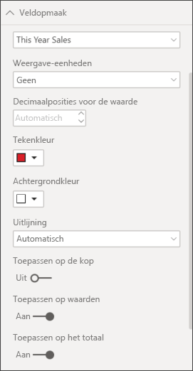
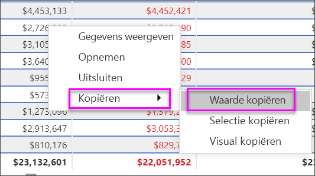

# Tabellen in Power BI-rapporten en -dashboards

[!INCLUDE[consumer-appliesto-nyyn](../includes/consumer-appliesto-nyyn.md)]

[!INCLUDE [power-bi-visuals-desktop-banner](../includes/power-bi-visuals-desktop-banner.md)]

Een tabel is een raster met gerelateerde gegevens in een logische reeks rijen en kolommen. Het kan ook koppen en een rij voor totalen bevatten. Tabellen werken goed met kwantitatieve vergelijkingen waarbij u veel waarden voor één categorie bekijkt. Deze tabel geeft bijvoorbeeld vijf verschillende eenheden voor **Categorie** weer.

U kunt tabellen in rapporten maken en meerdere elementen in de tabel kruislings markeren met andere visuals op dezelfde rapportpagina. U kunt rijen en kolommen, en zelfs afzonderlijke cellen selecteren en deze kruislings markeren. Bovendien kunt u afzonderlijke cellen en selecties van meerdere cellen kopiëren en in andere toepassingen plakken.

## Wanneer u een tabel gebruikt

Tabellen zijn een prima keuze:

* om gedetailleerde gegevens en exacte waarden (in plaats van visuele weergaven) te bekijken en vergelijken;

* om gegevens in tabelvorm weer te geven;

* om numerieke gegevens per categorie weer te geven.

## Vereiste

In deze zelfstudie wordt gebruikgemaakt van het [PBIX-bestand met het voorbeeld van een retailanalyse](https://download.microsoft.com/download/9/6/D/96DDC2FF-2568-491D-AAFA-AFDD6F763AE3/Retail%20Analysis%20Sample%20PBIX.pbix).

1. Selecteer linksboven in de menubalk **Bestand** > **Openen**
   
2. Ga naar uw kopie van het **PBIX-bestand met het voorbeeld van een retailanalyse**

1. Open het **PBIX-bestand met het voorbeeld van een retailanalyse** in de rapportweergave 

1. Selecteren  om een nieuwe pagina toe te voegen.

> [!NOTE]
> Voor het delen van uw rapport met een Power BI-collega moeten u beiden beschikken over een afzonderlijke Power BI Pro-licentie of moet het rapport zijn opgeslagen in Premium-capaciteit.

## Een tabel maken

U gaat de tabel aan het begin van dit artikel namaken om de omzet per artikelcategorie weer te geven.

1. In het deelvenster **Velden** selecteert u **Artikel** > **Categorie**.

    Power BI maakt automatisch een tabel waarin alle categorieën worden weergegeven.

    

1. Selecteer **Verkoop > Gemiddelde eenheidsprijs** en **Verkoop > Omzet van afgelopen jaar**

1. Selecteer vervolgens **Verkoop > Omzet van dit jaar** en selecteer alle drie de opties: **Waarde**, **Doel** en **Status**.

1. Zoek in het deelvenster **Visualisaties** het venster **Waarden** en selecteer de waarden totdat de volgorde van de grafiekkolommen overeenkomt met de eerste afbeelding op deze pagina. Versleep zo nodig de waarden in het venster. Het venster **Waarden** komt er zo uit te zien:

    

## De tabel opmaken

Er zijn veel verschillende manieren om een tabel op te maken. Slechts een paar van die manieren komen hier aan bod. Een uitstekende manier om de andere opmaakopties te ontdekken, is door het deelvenster **Opmaak** te openen (het pictogram met de verfroller ) en verschillende opties uit te proberen.

* Probeer het tabelraster op te maken. Hier gaat u een blauw verticaal raster toevoegen, ruimte aan de rijen toevoegen, de contouren dikker maken en de tekst groter maken.

    

    

* Voor de kolomkoppen wijzigt u de achtergrondkleur, voegt u contouren toe en maakt u het lettertype groter.

    

    

* U kunt zelfs opmaak toepassen op afzonderlijke kolommen en kolomkoppen. Eerst breidt u **Veldopmaak** uit en vervolgens selecteert u de op te maken kolom in de vervolgkeuzelijst. Afhankelijk van de kolomwaarden kunt u met **Veldopmaak** dingen instellen zoals weergave-eenheden, tekstkleur, aantal decimalen, achtergrond, uitlijning en meer. Nadat u de instellingen hebt aangepast, bepaalt u of u die instellingen zowel op de veldnamenrij als op de totalenrij toepast.

    

    

* Na een paar extra opmaakstappen is dit het resultaat.

    

### Voorwaardelijke opmaak

*Voorwaardelijke opmaak* is een bepaald type opmaak. Power BI kan voorwaardelijke opmaak toepassen op alle velden die u hebt toegevoegd aan het gedeelte **Waarden** van het deelvenster **Visualisaties**.

Met voorwaardelijke opmaak voor tabellen kunt u pictogrammen, URL's, celachtergrondkleuren en lettertypekleuren opgeven, inclusief het gebruik van kleurovergangen.

1. Open in het deelvenster **Opmaak** de kaart **Voorwaardelijke opmaak**.

    

1. Selecteer een veld dat u wilt opmaken en stel de schuifregelaar voor de **Achtergrondkleur** in op Aan. Power BI past een kleurovergang toe op basis van de waarden in de kolom. Als u de standaardkleuren wilt wijzigen, selecteert u **Geavanceerde besturingselementen**.

    Als u de optie **Afwijken** selecteert, kunt u desgewenst ook een waarde configureren voor **Centreren**.

    

    Laten we wat aangepaste opmaak toepassen op de waarden voor Gemiddelde eenheidsprijs. Selecteer **Afwijken**, voeg wat kleuren toe en selecteer **OK**.

    
1. Voeg een nieuw veld toe aan de tabel met positieve en negatieve waarden. Selecteer **Verkoop > Afwijking van totale verkoop**.

    

1. Voeg de gegevensbalk voor voorwaardelijke opmaakgegevens toe door de schuifregelaar **Gegevensbalken** in te stellen op Aan.  

    

1. Als u de gegevensbalken wilt aanpassen, selecteert u **Geavanceerde besturingselementen**. In het dialoogvenster dat wordt weergegeven stelt u kleuren in voor **Positieve balk** en **Negatieve balk**, selecteert u de optie **Alleen balk weergeven** en brengt u eventueel nog andere wijzigingen aan.

    

1. Selecteer **OK**.

    Gegevensbalken vervangen de numerieke waarden in de tabel, waardoor deze eenvoudiger te lezen is.

    

1. Voeg visuele aanwijzingen toe aan uw tabel met *voorwaardelijke pictogrammen*.  Selecteer in de kaart **Voorwaardelijke opmaak** **Verkopen van dit jaar** in de vervolgkeuzelijst. Stel de schuifregelaar **Pictogrammen** in op **Aan**.  Als u de pictogrammen wilt aanpassen, selecteert u **Geavanceerde besturingselementen**.

    

## Waarden kopiëren uit Power BI-tabellen voor gebruik in andere toepassingen

Uw tabel of matrix bevat mogelijk inhoud die u wilt gebruiken in andere toepassingen, bijvoorbeeld Dynamics CRM, Excel of zelfs andere Power BI-rapporten. Als u in Power BI met de rechtermuisknop in een cel klikt, kopieert u de gegevens in één cel of in een selectie cellen naar uw klembord en plakt u deze in de andere toepassingen.

Als u de waarde in één cel wilt kopiëren, gaat u als volgt te werk:

1. Selecteer de cel die u wilt kopiëren.

1. Klik met de rechtermuisknop in de cel.

1. Selecteer **Kopiëren** > **Waarde kopiëren**.

    

    Als u de onopgemaakte celwaarde naar uw klembord hebt gekopieerd, kunt u deze in een andere toepassing plakken.

Als u meer dan één cel wilt kopiëren, gaat u als volgt te werk:

1. Selecteer een reeks cellen of gebruik **Ctrl** om één of meer cellen te selecteren.

1. Klik met de rechtermuisknop in een van de cellen die u hebt geselecteerd.

1. Selecteer **Kopiëren** > **Selectie kopiëren**.

    

## De kolombreedte van een tabel aanpassen

In Power BI wordt soms een kolomkop in een rapport en in een dashboard afgekapt. Beweeg de muisaanwijzer over de ruimte aan de rechterkant van de kop om de dubbele pijlen zichtbaar te maken. Selecteer deze en versleep ze om de volledige kolomnaam weer te geven.

## Aandachtspunten en probleemoplossing

* Wanneer u kolomopmaak toepast, kunt u slechts één uitlijningsoptie per kolom kiezen: **Automatisch**, **Links**, **Centreren**, **Rechts**. Doorgaans bevat een kolom alleen tekst of alleen getallen, en geen combinatie daarvan. In het geval dat een kolom zowel getallen als tekst bevat, worden met de optie **Automatisch** teksten links en getallen rechts uitgelijnd. Dit gedrag ondersteunt talen die van links naar rechts worden gelezen.

* Als de tekstgegevens in de cellen of kopteksten in uw tabel nieuwe regeltekens bevatten, worden deze tekens genegeerd, tenzij u de optie Tekstterugloop inschakelt in de gekoppelde kaart Opmaakvenster. 

* Power BI berekent de maximale celgrootte op basis van de eerste twintig kolommen en de eerste vijftig rijen. Cellen buiten dit bereik, hebben mogelijk niet de juiste grootte.

## Volgende stappen

* [Treemaps in Power BI](power-bi-visualization-treemaps.md)

* [Visualization types in Power BI](power-bi-visualization-types-for-reports-and-q-and-a.md) (Typen visualisaties in Power BI)
