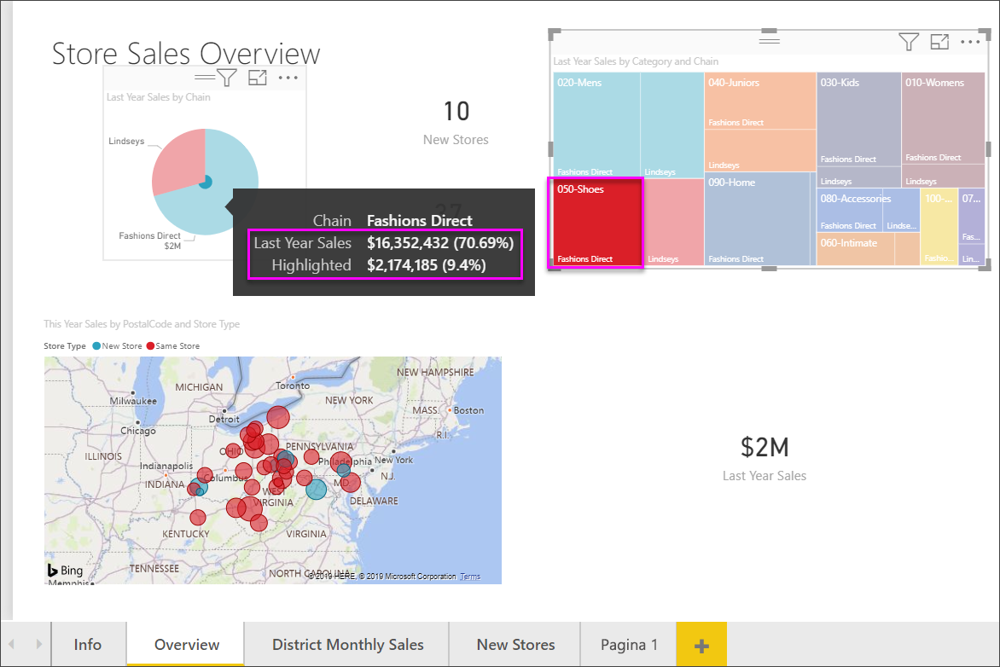

# Treemaps in Power BI

In treemaps worden hiërarchische gegevens weergegeven als een set van geneste rechthoeken. Elk niveau van de hiërarchie wordt weergegeven als een gekleurde rechthoek (een vertakking) die kleinere rechthoeken (bladeren) bevat. Power BI baseert de grootte van de ruimte in elke rechthoek op de gemeten waarde. De rechthoeken worden op grootte gerangschikt van linksboven (grootste) naar rechtsonder (kleinste).

Als u bijvoorbeeld uw verkopen gaat analyseren, kunt u vertakkingen op het hoogste niveau maken voor de volgende kledingcategorieën: **Urban**, **Landelijk**, **Jeugd** en **Mix**. Power BI splitst de categorierechthoeken dan op in bladeren, voor de kledingfabrikanten binnen die categorie. En deze kleinere rechthoeken worden in grootte aangepast en gearceerd op basis van het aantal verkochte items.

In de vertakking **Urban** hierboven is er veel kleding van **VanArsdel** verkocht, en minder van **Natura** en **Fama**. Van het merk **Leo** zijn slechts een paar stuks verkocht. De vertakking **Urban** van uw treemap bevat:

* de grootste rechthoek voor **VanArsdel** in de linkerbovenhoek

* iets kleinere rechthoeken voor **Natura** en **Fama**

* een groot aantal andere rechthoeken voor alle andere verkochte kleding

* een heel klein rechthoekje voor **Leo**

U kunt het aantal verkochte items vergelijken met andere kledingcategorieën door de grootte en inkleuring van elk bladknooppunt met elkaar te vergelijken. Hoe groter de rechthoek en hoe donkerder de kleur, hoe hoger de waarde.

Wilt u eerst kijken hoe iemand anders een treemap maakt? Ga naar 2:10 in deze video om te kijken hoe Amanda een treemap maakt.

<iframe width="560" height="315" src="https://www.youtube.com/embed/IkJda4O7oGs" frameborder="0" allowfullscreen></iframe>

## Wanneer u een treemap gebruikt

In de volgende gevallen komen treemaps goed van pas:

* wanneer u grote hoeveelheden hiërarchische gegevens wilt weergeven

* wanneer een staafdiagram niet geschikt is om het grote aantal waarden effectief te verwerken

* wanneer u de verhoudingen tussen de samenstellende delen en het geheel wilt weergeven

* wanneer u het patroon van de distributie van de meting tussen de verschillende niveaus van categorieën in de hiërarchie wilt weergeven

* wanneer u kenmerken wilt weergeven met grootte- en kleurcoderingen

* wanneer u patronen, uitbijters, de belangrijkste bijdragers en uitzonderingen wilt identificeren

## Vereisten

* De Power BI-service of Power BI Desktop

* Het rapport Voorbeeld van een retailanalyse

## Het rapport Voorbeeld van een retailanalyse downloaden

In deze instructies wordt het voorbeeld van een retailanalyse gebruikt. Voor het maken van een visualisatie hebt u bewerkmachtigingen voor de gegevensset en het rapport nodig. De voorbeelden van Power Bi zijn allemaal bewerkbaar. Als iemand een rapport met u deelt, kunt u geen visualisaties maken in het rapport. Als u mee wilt doen, downloadt u het rapport [Voorbeeld van een retailanalyse](../sample-datasets.md).

Nadat u de gegevensset **Voorbeeld van een retailanalyse** hebt opgehaald, kunt u aan de slag.

## Een eenvoudige treemap maken

U gaat een rapport maken en vervolgens een eenvoudige treemap toevoegen.

1. Ga naar **Mijn werkruimte** en selecteer **Gegevenssets** > **Een rapport maken**.

    

1. Selecteer in het deelvenster **Velden** de meting **Sales** > **Last Year Sales**.

   

1. Selecteer het pictogram Treemap  om de grafiek te converteren naar een treemap.

   

1. Sleep **Item** > **Categorie** naar de bron **Groep**.

    Er wordt een treemap in Power BI gemaakt waarbij de grootte van de rechthoeken is gebaseerd op de totale omzet en de kleur een categorie vertegenwoordigt. In wezen hebt u een hiërarchie gemaakt die op visuele wijze de relatieve grootte van het totale aantal verkopen per categorie beschrijft. De categorie **Heren** is de categorie met de meeste verkopen en de categorie **Kousen** is de categorie met de minste verkopen.

    

1. Sleep **Winkel** > **Keten** naar de bron **Details** om uw treemap te voltooien. U kunt nu de omzet van het afgelopen jaar vergelijken op basis van de categorie en de keten.

   

   > [!NOTE]
   > Kleurverzadiging en Details kunnen niet tegelijkertijd worden gebruikt.

1. Beweeg de cursor over het gebied **Keten** om de knopinfo voor dat gedeelte van de **Categorie** weer te geven.

    Als u bijvoorbeeld de muisaanwijzer boven **Fashions Direct** in de rechthoek **090-startpagina** houdt, ziet u in de knopinfo het aandeel van Fashions Direct in de categorie Home.

   

1. Voeg de treemap toe als een [dashboardtegel (maak de visualisatie vast)](../service-dashboard-tiles.md).

1. Sla [het rapport](../service-report-save.md) op.

## Markeren en kruislings filteren

Zie [Een filter aan een rapport toevoegen](../power-bi-report-add-filter.md) voor informatie over het gebruik van het deelvenster **Filters**.

Wanneer u een **categorie** of **detail** in een treemap markeert, worden de andere visualisaties op de rapportpagina kruislings gemarkeerd en gefilterd en omgekeerd. Als u wilt meedoen, voegt u enkele visualisaties toe aan deze rapportpagina of kopieert u de treemap naar een van de andere pagina’s in dit rapport.

1. Selecteer in de treemap een **categorie** of een **keten** binnen een **categorie**. Hiermee worden de andere visualisaties op de pagina kruislings gemarkeerd. Als ik bijvoorbeeld **050-Shoes** selecteer, kan ik zien dat er het afgelopen een omzet van **$ 3.640.471** is gehaald, waarvan **$ 2.174.185** afkomstig was van **Fashions Direct**.

   

1. Als u in het cirkeldiagram **Omzet afgelopen jaar per keten** het segment **Fashions Direct** selecteert, wordt de treemap kruislings gefilterd.
   

1. Zie [De interactie tussen visuals in een Power BI-rapport wijzigen](../service-reports-visual-interactions.md) om te beheren hoe grafieken elkaar kruislings markeren en filteren.

## Volgende stappen

* [Watervalgrafieken in Power BI](power-bi-visualization-waterfall-charts.md)

* [Visualization types in Power BI](power-bi-visualization-types-for-reports-and-q-and-a.md) (Typen visualisaties in Power BI)
