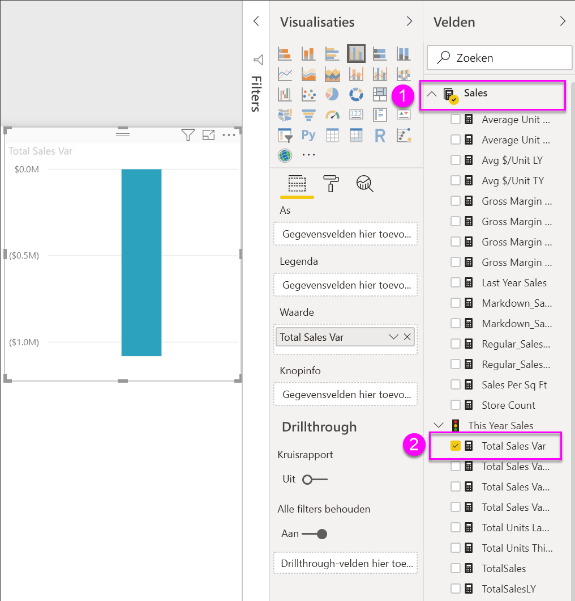
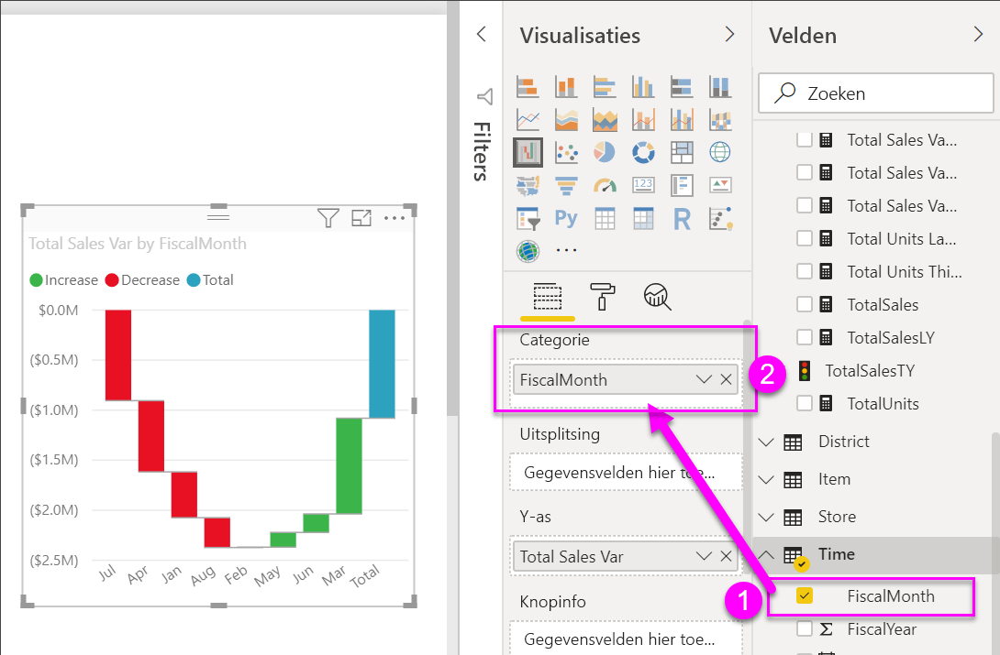
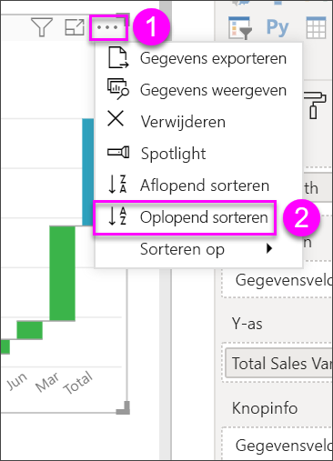
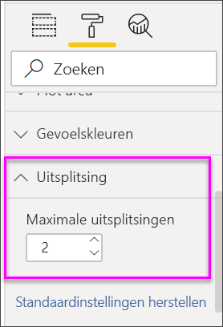

# Watervalgrafieken in Power BI

Watervalgrafieken tonen een voorlopig totaal terwijl Power BI nog bezig is met het optellen en aftrekken van waarden. Ze zijn handig om te begrijpen hoe een beginwaarde (bijvoorbeeld netto inkomsten) wordt beïnvloed door een reeks positieve en negatieve wijzigingen.

De kolommen worden met een kleur gecodeerd, zodat u toenames en afnames snel kunt overzien. De kolommen met de eerste en de uiteindelijke waarde beginnen vaak [op de horizontale as](https://support.office.com/article/Create-a-waterfall-chart-in-Office-2016-for-Windows-8de1ece4-ff21-4d37-acd7-546f5527f185#BKMK_Float "op de horizontale as"), terwijl de tussenliggende waarden zwevende kolommen zijn. Vanwege deze speciale opmaak worden watervalgrafieken ook wel bruggrafieken genoemd.

<iframe width="560" height="315" src="https://www.youtube.com/embed/qKRZPBnaUXM" frameborder="0" allow="autoplay; encrypted-media" allowfullscreen></iframe>

## Toepassingen voor een watervalgrafiek

In de volgende gevallen komen watervalgrafieken goed van pas:

* Wanneer er wijzigingen in de metingen zijn binnen een periode, reeks of verschillende categorieën.

* Om de belangrijkste wijzigingen te controleren die bijdragen aan de totaalwaarde.

* Om de jaarlijkse winst van uw bedrijf weer te geven door verschillende omzetbronnen te tonen en uiteindelijk bij de totale winst (of verlies) uit te komen.

* Om het aantal personeelsleden aan het begin en het einde van een jaar in beeld te brengen.

* Om te visualiseren hoeveel geld u elke maand verdient en uitgeeft, en het huidige saldo voor uw rekening.

## Vereisten

* De Power BI-service of Power BI Desktop

* Het rapport Voorbeeld van een retailanalyse

## Het rapport Voorbeeld van een retailanalyse downloaden

In deze instructies wordt het voorbeeld van een retailanalyse gebruikt. Voor het maken van een visualisatie hebt u bewerkmachtigingen voor de gegevensset en het rapport nodig. De voorbeelden van Power Bi zijn allemaal bewerkbaar. Als iemand een rapport met u deelt, kunt u geen visualisaties maken in het rapport. Als u mee wilt doen, downloadt u het rapport [Voorbeeld van een retailanalyse](../sample-datasets.md).

Nadat u de gegevensset **Voorbeeld van een retailanalyse** hebt opgehaald, kunt u aan de slag.

## Een watervalgrafiek maken

U gaat een watervalgrafiek maken waarin de verkoopvariantie (geschatte omzet ten opzichte van werkelijke omzet) per maand wordt aangegeven.

1. Ga naar **Mijn werkruimte** en selecteer **Gegevenssets** > **Een rapport maken**.

    

1. In het deelvenster **Velden** selecteert u **Verkoop** > **Totale verkoopvariantie**.

   

1. Selecteer het watervalpictogram  om de grafiek te converteren naar een treemap.

    Als **Totale verkoopvariantie** zich niet in het gebied van de **Y-as** bevindt, sleept u het daarnaartoe.

    

1. Selecteer **Tijd** > **Boekmaand** om het ook toe te voegen aan de groep **Categorie**.

    

1. Zorg ervoor dat Power BI de watervalgrafiek chronologisch heeft gesorteerd. Selecteer het beletselteken (...) in de rechterbovenhoek van de grafiek.

    Controleer of er een gele indicator links naast de opties  **Oplopend sorteren** en **Boekmaand** staat.

    

    U kunt ook de X-aswaarden bekijken en zien dat ze in de volgorde van **Jan** tot en met **Aug** staan.

    Breid de grafiek iets uit om te zien welke staten per maand het meeste bijdragen aan de omzet.

1. Sleep **Store** > **Territory** naar de groep **Uitsplitsing**.

    

    Standaard voegt Power BI de vijf inzenders toe die het meest bijdragen aan de toename of afname per maand.

    

    Nu bent u echter alleen geïnteresseerd in de twee belangrijkste inzenders.

1. Selecteer daarom **Uitsplitsing** in het deelvenster **Indeling** en zet **Maximumaantal uitsplitsingen** op **2**.

    

    We zien meteen dat de staten Ohio en Pennsylvania op dit moment de grootste bijdrage leveren aan de verkoopvariantie (zowel negatief als positief) in uw watervalgrafiek.

    

    Dat is een interessant gegeven. Hebben Ohio en Pennsylvania zo'n grote invloed omdat de verkopen in deze twee staten veel hoger zijn dan in de andere staten? Dat kunt u uiteraard controleren.

1. Maak een kaart waarop de verkoop per territorium voor dit jaar en vorig jaar worden weergegeven.

    

    De kaart bevestigt onze theorie. Duidelijk wordt dat deze twee staten zowel vorig jaar (belgrootte) als dit jaar (belarcering) het hoogste omzetcijfer hadden.

## Markeren en kruislings filteren

Zie **Filter aan een rapport toevoegen** voor meer informatie over het gebruik van het deelvenster [Filters](../power-bi-report-add-filter.md).

Wanneer u een kolom in een watervalgrafiek markeert, worden de andere visualisaties op de rapportpagina kruislings gefilterd en vice versa. De kolom **Totaal** kan hiervoor overigens niet worden gebruikt.

## Volgende stappen

* [De interactie tussen visuele elementen in een Power BI-rapport wijzigen](../service-reports-visual-interactions.md)

* [Visualization types in Power BI](power-bi-visualization-types-for-reports-and-q-and-a.md) (Typen visualisaties in Power BI)
