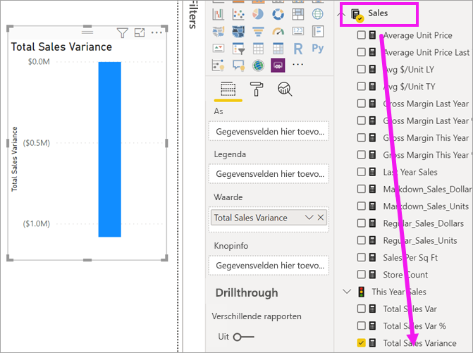
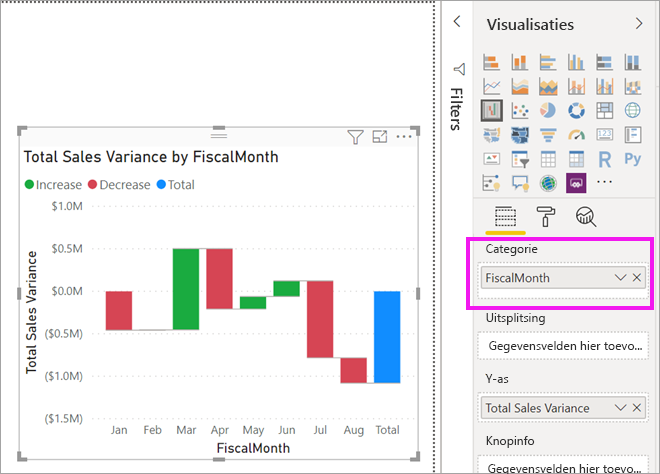
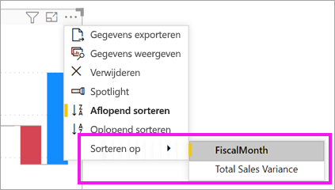
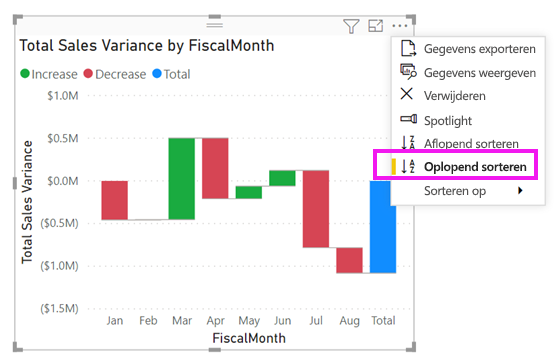
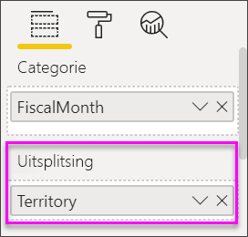
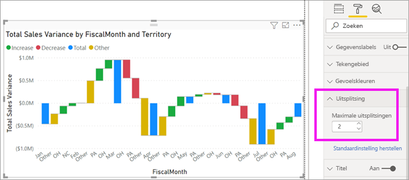

# Watervalgrafieken in Power BI

[!INCLUDE [power-bi-visuals-desktop-banner](../includes/power-bi-visuals-desktop-banner.md)]

Watervalgrafieken tonen een voorlopig totaal terwijl Power BI nog bezig is met het optellen en aftrekken van waarden. Ze zijn handig om te begrijpen hoe een beginwaarde (bijvoorbeeld netto inkomsten) wordt beïnvloed door een reeks positieve en negatieve wijzigingen.

De kolommen worden met een kleur gecodeerd, zodat u toenames en afnames snel kunt overzien. De kolommen met de eerste en de uiteindelijke waarde [beginnen vaak op de horizontale as](https://support.office.com/article/Create-a-waterfall-chart-in-Office-2016-for-Windows-8de1ece4-ff21-4d37-acd7-546f5527f185#BKMK_Float "beginnen op de horizontale as"), terwijl de tussenliggende waarden zwevende kolommen zijn. Vanwege deze speciale opmaak worden watervalgrafieken ook wel bruggrafieken genoemd.

   > [!NOTE]
   > Deze video maakt gebruik van een oudere versie van Power BI Desktop.
   > 
   > 

<iframe width="560" height="315" src="https://www.youtube.com/embed/qKRZPBnaUXM" frameborder="0" allow="autoplay; encrypted-media" allowfullscreen></iframe>

## Toepassingen voor een watervalgrafiek

In de volgende gevallen komen watervalgrafieken goed van pas:

* Wanneer er wijzigingen in de metingen zijn binnen een periode, reeks of verschillende categorieën.

* Om de belangrijkste wijzigingen te controleren die bijdragen aan de totaalwaarde.

* Om de jaarlijkse winst van uw bedrijf weer te geven door verschillende omzetbronnen te tonen en uiteindelijk bij de totale winst (of verlies) uit te komen.

* Om het aantal personeelsleden aan het begin en het einde van een jaar in beeld te brengen.

* Om te visualiseren hoeveel geld u elke maand verdient en uitgeeft, en het huidige saldo voor uw rekening.

## Vereiste

In deze zelfstudie wordt gebruikgemaakt van het [PBIX-bestand met het voorbeeld van een retailanalyse](https://download.microsoft.com/download/9/6/D/96DDC2FF-2568-491D-AAFA-AFDD6F763AE3/Retail%20Analysis%20Sample%20PBIX.pbix).

1. Selecteer linksboven in de menubalk **Bestand** > **Openen**
   
2. Ga naar uw kopie van het **PBIX-bestand met het voorbeeld van een retailanalyse**

1. Open het **PBIX-bestand met het voorbeeld van een retailanalyse** in de rapportweergave 

1. Selecteren  om een nieuwe pagina toe te voegen.

## Een watervalgrafiek maken

U gaat een watervalgrafiek maken waarin de verkoopvariantie (geschatte omzet ten opzichte van werkelijke omzet) per maand wordt aangegeven.

### De watervalgrafiek maken

1. In het deelvenster **Velden** selecteert u **Verkoop** > **Totale verkoopvariantie**.

   

1. Selecteer het watervalpictogram 

    

1. Selecteer **Tijd** > **Boekmaand** om het ook toe te voegen aan de groep **Categorie**.

    

### De watervalgrafiek sorteren

1. Zorg ervoor dat Power BI de watervalgrafiek chronologisch op maand sorteert. Selecteer **Meer opties** (...) in de rechterbovenhoek van de grafiek.

    Voor dit voorbeeld selecteert u **Sorteren op** en kiest u **Boekmaand**. Een gele indicator naast uw selectie geeft aan wanneer de selectieoptie wordt toegepast.

    
    
    Als u de maanden in chronologische volgorde wilt weergeven, selecteert u **Oplopend sorteren**. Controleer net als bij de vorige stap of er links naast **Oplopend sorteren** een gele indicator wordt weergegeven. Dit geeft aan dat de geselecteerde optie wordt toegepast.

    

    

    U ziet dat uw grafiek van januari tot augustus is gesorteerd op Boekmaand.  

### De watervalgrafiek verkennen

Breid de grafiek iets uit om te zien welke staten per maand het meeste bijdragen aan de omzet.

1.  Selecteer **Winkel** > **Gebied**. Hierdoor wordt **Gebied** toegevoegd aan de bucket **Uitsplitsing**.

    

    Power BI gebruikt de waarde in **Uitsplitsing** om extra gegevens aan de visualisatie toe te voegen. Hiermee worden de vijf inzenders toegevoegd die het meest bijdragen aan de toename of afname per boekmaand. Dit betekent bijvoorbeeld dat februari nu zes gegevenspunten bevat in plaats van slechts één.  

    

    Stel dat u alleen geïnteresseerd bent in de twee belangrijkste inzenders.

1. Selecteer daarom **Uitsplitsing** in het deelvenster **Indeling** en zet **Maximumaantal uitsplitsingen** op **2**.

    

    We zien meteen dat de staten Ohio en Pennsylvania op dit moment de grootste bijdrage leveren aan de verkoopvariantie (zowel negatief als positief) in uw watervalgrafiek.

    

## Volgende stappen

* [De interactie tussen visuele elementen in een Power BI-rapport wijzigen](../service-reports-visual-interactions.md)

* [Visualization types in Power BI](power-bi-visualization-types-for-reports-and-q-and-a.md) (Typen visualisaties in Power BI)
