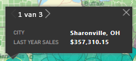

# Interactie met ArcGIS-kaarten in Power BI

[!INCLUDE[consumer-appliesto-yyyn](../includes/consumer-appliesto-yyyn.md)]    

Dit onderwerp is geschreven vanuit het oogpunt van een persoon die een ArcGIS-kaart gebruikt in de Power BI-service, in de desktopversie of op een mobiel apparaat. Zodra een ontwerper een ArcGIS Maps for Power BI-visual met u deelt, kunt u deze visual op veel manieren gebruiken.  Zie [ArcGIS maps by Esri tutorial](../visuals/power-bi-visualization-arcgis.md) (ArcGIS-kaarten van Esri - een zelfstudie) voor meer informatie over het maken van een ArcGIS-kaart.

> [!NOTE]
> Voor het delen van uw rapport met een Power BI-collega moet u beiden beschikken over een afzonderlijke Power BI Pro-licentie of moet het rapport zijn opgeslagen in Premium-capaciteit. Zie [Rapporten delen](../collaborate-share/service-share-reports.md) voor meer informatie.

De combinatie van ArcGIS-kaarten en Power BI tilt kaarten naar een volledig nieuw niveau, verder dan de presentatie van punten op een kaart. Rapportontwerpers kunnen beginnen met een kaart en er lagen met demografische gegevens aan toevoegen. De combinatie van gegevenslagen op basis van locatie (zoals censusgegevens) op een kaart met ruimtelijke analyse geeft een beter inzicht in uw visualisatiegegevens.

> [!TIP]
> GIS staat voor Geographic Information System (geografische informatiesysteem).
> 

Deze ArcGIS Maps for Power BI-visual toont de omzet per stad van vorig jaar en maakt gebruikt van een kaart op basis van straten en een referentielaag voor het gemiddelde inkomen per huishouden. De kaart bevat twee spelden (rood en geel) en één radius voor de rijtijd (in paars).

> [!TIP]
> Ga naar [Esri's page on Power BI](https://www.esri.com/powerbi) (Esri-pagina in Power BI) om veel voorbeelden en aanbevelingen te bekijken. Ga vervolgens naar [Pagina Aan de slag voor ArcGIS Maps for Power BI](https://doc.arcgis.com/en/maps-for-powerbi/get-started/about-maps-for-power-bi.htm) van Esri.
> 
> 

## Toestemming van de gebruiker

De eerste keer dat een collega een ArcGIS-kaart met u deelt, wordt in Power BI een instemmingsprompt weergegeven. ArcGIS MAPS for Power BI wordt geleverd door Esri (https://www.esri.com) en uw gebruik van ArcGIS Maps for Power BI is onderhevig aan de voorwaarden en het privacybeleid van Esri. Power BI-gebruikers die de visuals van ArcGIS Maps for Power BI willen gebruiken, moeten hiermee akkoord gaan in het toestemmingsdialoogvenster.

## Inzicht in de lagen

Een ArcGIS Maps for Power BI-visual kan verschillende soorten lagen met demografische locatiegegevens bevatten.

### Basiskaarten

Elke ArcGIS Maps for Power BI-visual begint met een basiskaart. Basiskaarten kunt u zien als het canvas voor de gegevens. Een basiskaart kan een standaard donker of licht canvas zijn,

 

of een canvas met details over straten en vervoer. 

  

De basiskaart wordt in zijn geheel op het canvas toegepast. Als u pant en zoomt, wordt de kaart bijgewerkt. Zoom in om een steeds gedetailleerde gegevens over straten en vervoer te bekijken. Wanneer u van het ene continent naar het andere pant, blijft het detailniveau gelijk. Hier hebben we van Porto naar Beijing gepant.

  

### Referentielagen

Een *rapportontwerper* kan één referentielaag toevoegen. Referentielagen worden gehost door Esri en bieden een extra laag met demografische gegevens over een locatie. Het onderstaande voorbeeld bevat een referentielaag voor bevolkingsdichtheid. Donkere kleuren geven een hogere dichtheid aan.

  

### Infographics

Een *rapportontwerper* kan veel infographics-lagen toevoegen. Infographics zijn snelle visuele indicatoren die aan de rechterkant van het visuele canvas worden weergegeven. Infographics worden gehost door Esri en bieden een extra laag met demografische gegevens over een locatie. Op het onderstaande voorbeeld zijn drie infographics toegepast. Ze worden niet op de kaart zelf weergegeven, maar op kaarten. De infographics-kaarten worden bijgewerkt wanneer u zoomt, pant en gebieden op de kaart selecteert.

  

### Spelden

Spelden geven nauwkeurige locaties, zoals een stad of adres weer. Soms gebruiken *rapportontwerpers* spelden in combinatie met de radius voor de rijtijd. In dit voorbeeld worden winkels weergegeven binnen een radius van 80 kilometer van Charlotte (North Carolina).

 

## Interactie met een visual van ArcGIS Maps for Power BI
De functies die u kunt gebruiken zijn afhankelijk van de manier waarop het rapport met u is gedeeld en van uw Power BI-accounttype. Neem voor vragen contact op met uw systeembeheerder. ArcGIS Maps for Power BI-visuals gedragen zich veelal op dezelfde manier als andere visuals in een rapport. U kunt [de gegevens weergeven die zijn gebruikt om de visualisatie te maken](../consumer/end-user-show-data.md), de kaart bekijken in [de focusmodus en in volledig scherm](../consumer/end-user-focus.md), [opmerkingen toevoegen](../consumer/end-user-comment.md), [de filters gebruiken](../consumer/end-user-report-filter.md) die door de *rapportontwerper* zijn ingesteld, en nog veel meer. ArcGIS-visuals kunnen overige visuals op de rapportpagina kruislings filteren en vice versa.

Beweeg de muisaanwijzer over locaties op de basiskaart (bijvoorbeeld een bel) om tooltips weer te geven. U kunt ook de selectiehulpprogramma’s voor ArcGIS-visuals gebruiken om extra tooltips weer te geven en om specifieke selecties te maken op de basiskaart of referentielaag.  

### Selectiehulpprogramma’s

ArcGIS Maps for Power BI biedt vijf selectiemodi. Er kunnen maximaal 250 gegevenspunten tegelijk worden geselecteerd.

#### Het hulpmiddel voor één selectie

 

Selecteer een gegevenspunt, bel, speld of een afzonderlijk gegevenspunt vanaf de referentielaag. In Power BI wordt een tooltip weergegeven met details over de selectie. Met het hulpprogramma voor één selectie worden de overige visuals op de rapportpagina kruislings gefilterd op basis van uw selectie en worden de infographics-kaarten voor het geselecteerde gebied bijgewerkt. 

Hier hebben we een gegevenspunt in de vorm van een bruine bel geselecteerd vanaf onze basiskaart. Power BI:
- markeert onze selectie,
- geeft een tooltip weer voor dat gegevenspunt, 
- werkt de infographics-kaart bij, zodat alleen voor onze selectie gegevens worden weergegeven, en
- markeert het kolomdiagram kruislings.

Als de kaart een referentielaag bevat, worden details in een tooltip weergegeven wanneer u locaties selecteert. Hier hebben we Seneca County geselecteerd en zien we gegevens vanaf de referentielaag (bevolkingsdichtheid) die de *rapportontwerper* heeft toegevoegd aan de kaart. In dit voorbeeld bevat ons gegevenspunt twee verschillende counties. Dit betekent dat onze tooltip dus twee pagina’s heeft. Elke pagina bevat een diagram. Selecteer de balk in het diagram voor aanvullende informatie. 

> [!TIP]
  > Soms kunt u het aantal tooltippagina’s verminderen door in te zoomen op een specifieke locatie.  Anders worden er mogelijk meerdere tooltips tegelijkertijd weergegeven in Power BI wanneer er overlappende locaties zijn. Selecteer de pijlen om te schakelen tussen de tooltips
  > 
  > 

#### Het hulpmiddel voor meervoudige selectie

 

Hiermee wordt een rechthoek op de kaart getekend en worden de opgenomen gegevenspunten geselecteerd. CTRL gebruiken om meer dan één rechthoekig gebied te selecteren. Met het hulpprogramma voor meervoudige selectie worden infographics-kaarten voor het geselecteerde gebied bijgewerkt en worden de overige visuals op de rapportpagina kruislings gefilterd op basis van uw selectie.

 

#### Het hulpmiddel voor referentielagen

 

Hiermee wordt toegestaan dat grenzen of polygonen binnen referentielagen worden gebruikt voor het selecteren van opgenomen gegevenspunten. Het is lastig te zien, maar de referentielaag heeft een gele contour. In tegenstelling tot het hulpmiddel voor één selectie, wordt hiervoor geen tooltip weergegeven. In plaats daarvan krijgen we gegevens te zien over gegevenspunten binnen de grenzen van die contour. In dit voorbeeld bevat onze selectie een gegevenspunt voor een Lindseys-winkel in Winston Salem.

 

#### Het hulpmiddel voor buffers

 

Hiermee kunt u gegevenspunten selecteren met behulp van een bufferlaag. U kunt dit hulpmiddel bijvoorbeeld gebruiken om een radius voor de rijtijd te selecteren en daarna doorgaan met de rest van het rapport. De radius voor de rijtijd blijft actief en op de infographics-kaarten wordt de radius voor de rijtijd weergegeven, maar als u andere gegevenspunten op de kaart selecteert, worden de overige visuals op de rapportpagina kruislings gefilterd.

 

#### Het hulpmiddel Overeenkomsten zoeken

 

Hiermee kunt u locaties met vergelijkbare kenmerken zoeken. U begint door een of meer nuttige plaatsen of referentielocaties te selecteren, waarbij u maximaal vijf dimensies kunt opgegeven die u in de analyse wilt gebruiken. Met Overeenkomsten zoeken worden vervolgens de 10 locaties op uw kaart berekent die het meest overeenkomen met de referentielocaties die u hebt opgegeven. U kunt vervolgens de infographics-kaarten gebruiken voor meer informatie over de demografische gegevens met betrekking tot uw resultaten of om gebieden met rijtijden te maken voor een beter overzicht van alles wat zich binnen rijafstand van deze locaties bevindt. U kunt zelfs het hulpmiddel Overeenkomsten zoeken gebruiken om uw rapport te filteren en nog meer inzichten te krijgen. Alle berekeningen worden uitgevoerd op uw eigen computer. Zo weet u zeker dat uw vertrouwelijke gegevens veilig blijven.

## Overwegingen en beperkingen
ArcGIS Maps for Power BI is beschikbaar in de volgende services en toepassingen:

|Service/app  |Beschikbaarheid  |
|---------|---------|
|Power BI Desktop     |     Ja    |
|Power BI-service (app.powerbi.com)     |    Ja     |
|Mobiele Power BI-toepassingen     |  Ja      |
|Power BI publiceren op internet     |  Nee       |
|Power BI Embedded     |     Nee    |
|Power BI-service insluiten (PowerBI.com)  | Nee |

## Hoe werken ArcGIS Maps for Power BI samen?
ArcGIS Maps for Power BI wordt geleverd door Esri (https://www.esri.com). Uw gebruik van ArcGIS Maps for Power BI is onderhevig aan de [voorwaarden](https://go.microsoft.com/fwlink/?LinkID=8263222) en het [privacybeleid](https://go.microsoft.com/fwlink/?LinkID=826323) van Esri. Power BI-gebruikers die de visuals van ArcGIS Maps for Power BI willen gebruiken, moeten hiermee akkoord gaan in het toestemmingsdialoogvenster (raadpleeg Toestemming van gebruiker voor meer informatie).  Het gebruik van ArcGIS Maps for Power BI van Esri is onderhevig aan de voorwaarden en het privacybeleid van Esri. Een koppeling naar de voorwaarden en het privacybeleid vindt u in het toestemmingsdialoogvenster. Elke gebruiker moet toestemming geven voor het eerste gebruik van ArcGIS Maps for Power BI. Zodra de gebruiker toestemming heeft gegeven, worden de aan de visual gekoppelde gegevens naar de services van Esri verzonden voor (ten minste) geocodering, wat betekent dat de locatiegegevens worden getransformeerd in breedtegraad- en lengtegraadgegevens die in een kaart kunnen worden weergegeven. U moet ervan uitgaan dat alle gegevens die aan de gegevensvisualisatie zijn gekoppeld, naar de services van Esri kunnen worden verzonden. Esri biedt services zoals basiskaarten, analyses van ruimtelijke gegevens, geocodering, enzovoort. Voor de samenwerking tussen de visuals van ArcGIS Maps for Power BI en deze services wordt gebruikgemaakt van een SSL-verbinding. Deze verbinding wordt beveiligd met een certificaat dat door Esri wordt verstrekt en onderhouden. Meer informatie over ArcGIS Maps for Power BI vindt u op de [productpagina voor ArcGIS Maps for Power BI](https://www.esri.com/powerbi) van Esri.

### Power BI Plus

Wanneer een gebruiker zich via ArcGIS Maps for Power BI voor een Plus-abonnement van Esri registreert, gaat de gebruiker een directe relatie met Esri aan. Power BI verzendt geen persoonlijke gegevens over de gebruiker naar Esri. De gebruiker meldt zich aan bij en vertrouwt een door Esri verstrekte AAD-toepassing waarbij gebruik wordt gemaakt van de eigen AAD-identiteit van de gebruiker. Op deze manier deelt de gebruiker zijn of haar persoonlijke gegevens rechtstreeks met Esri. Zodra de gebruiker Plus-inhoud aan een ArcGIS Maps for Power BI-visual toevoegt, hebben collega's die die visual willen bekijken of bewerken ook een Plus-abonnement van Esri nodig. 

Voor gedetailleerde technische vragen over de werking van ArcGIS Maps for Power BI van Esri kunt u contact opnemen met Esri via hun ondersteuningssite.

## Aandachtspunten en probleemoplossing

**De ArcGIS-kaart wordt niet weergegeven**    
In services of toepassingen waarin ArcGIS Maps for Power BI niet beschikbaar is, wordt de visualisatie weergegeven als een lege visual met het logo van Power BI.

**Ik zie niet al mijn informatie op de kaart**    
Wanneer u op de kaart de breedtegraad/lengtegraad geocodeert, worden er tot 30.000 gegevenspunten weergegeven. Wanneer u gegevenspunten zoals postcodes of adressen geocodeert, worden alleen de eerste 15.000 gegevenspunten gegeocodeerd. Het geocoderen van plaatsnamen en landen is niet onderhevig aan de adreslimiet van 1500.

**Zijn er kosten verbonden aan het gebruik van ArcGIS Maps for Power BI?**

ArcGIS Maps for Power BI is beschikbaar voor alle Power BI-gebruikers zonder extra kosten. Het is een onderdeel dat wordt geleverd door **Esri**, en uw gebruik is onderhevig aan de voorwaarden en het privacybeleid van **Esri**, zoals eerder in dit artikel is aangegeven. Als u zich abonneert op ArcGIS **Plus**, worden er kosten in rekening gebracht.

**Ik krijg een foutbericht dat mijn cache vol is**

Dit gedrag is een bekende bug. Er wordt aan een oplossing gewerkt.  Selecteer in de tussentijd de koppeling die wordt weergegeven in het foutbericht, voor instructies over het wissen van de Power BI-cache.

**Kan ik mijn ArcGIS-kaarten offline bekijken?**

Nee, Power BI moet zijn verbonden met het netwerk om kaarten weer te geven.

## Volgende stappen
Hulp krijgen: **Esri** biedt [uitgebreide documentatie](https://go.microsoft.com/fwlink/?LinkID=828772) voor de functies van **ArcGIS Maps for Power BI**.

U kunt vragen stellen, de meest recente informatie vinden, problemen melden en antwoorden vinden in de Power BI-[communitythread met betrekking tot **ArcGIS Maps for Power BI**](https://go.microsoft.com/fwlink/?LinkID=828771).

[Productpagina van ArcGIS Maps for Power BI](https://www.esri.com/powerbi)
