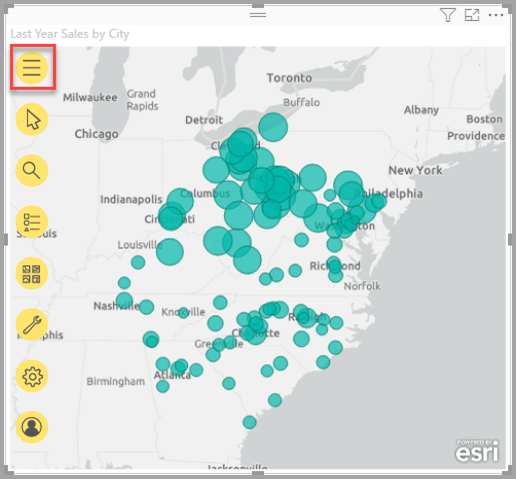
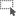

# ArcGIS-kaarten maken in Power BI

[!INCLUDE[consumer-appliesto-yyyn](../includes/consumer-appliesto-yyyn.md)]    

> [!NOTE]
> Deze visuals kunnen zowel in Power BI Desktop als in de Power BI-service worden gemaakt en bekeken. De stappen en afbeeldingen uit dit artikel zijn gebaseerd op Power BI Desktop.

Dit overzicht is geschreven vanuit het oogpunt van iemand die een ArcGIS-kaart voor Power BI maakt. Zodra een _ontwerper_ een ArcGIS-kaart voor Power BI met een collega deelt, kan deze collega de kaart bekijken en acties uitvoeren voor de kaart, maar geen wijzigingen opslaan. Zie [Kennismaken met ArcGIS Maps for Power BI](https://doc.arcgis.com/en/maps-for-powerbi/use/explore-maps.htm) voor meer informatie over het weergeven van een ArcGIS-kaart.

De combinatie van ArcGIS-kaarten en Power BI tilt kaarten naar een volledig nieuw niveau, verder dan de presentatie van punten op een kaart. Kies uit basiskaarten, locatietypen, thema's, symboolstijlen en referentielagen om informatieve kaartvisualisaties te maken. De combinatie van bindende gegevenslagen op een kaart met ruimtelijke analyse geeft een beter inzicht in de gegevens in uw visualisatie. Op een mobiel apparaat kunt u geen ArcGIS Maps for Power BI-kaart maken, maar u kunt deze wel weergeven en ermee werken.

> [!NOTE]
> ArcGIS Maps for Power BI is momenteel niet beschikbaar voor Power BI Report Server.

> [!TIP]
> GIS staat voor Geographic Information System (geografisch informatiesysteem).

In het volgende voorbeeld wordt een donkergrijs canvas gebruikt om regionale verkopen als een heatmap weer te geven tegen een demografische laag van de mediaan voor besteedbaar inkomen in 2016. Zoals verderop duidelijk wordt, biedt ArcGIS Maps for Power BI mogelijkheden voor verbeterde toewijzing, demografische gegevens en nog indrukwekkendere kaartvisualisaties, zodat u uw verhaal op de beste manier kunt vertellen.

> [!TIP]
> Ga naar de pagina van [**Esri over ArcGIS Maps for Power BI**](https://www.esri.com/powerbi) (Engelstalig) om talloze voorbeelden en aanbevelingen te bekijken. Bekijk ook de **[online-Help van ESRI ArcGIS Maps for Power BI](https://doc.arcgis.com/en/maps-for-powerbi/get-started/about-maps-for-power-bi.htm)** .

## Gebruikerstoestemming

ArcGIS Maps for Power BI wordt geleverd door Esri ([https://www.esri.com](https://www.esri.com/)). Het gebruik van ArcGIS Maps for Power BI is onderhevig aan de [voorwaarden](https://go.microsoft.com/fwlink/?LinkID=826322) en het [privacybeleid](https://go.microsoft.com/fwlink/?LinkID=826323) van Esri. Power BI-gebruikers die de visuals van ArcGIS Maps for Power BI willen gebruiken, moeten hiermee akkoord gaan via het toestemmingsdialoogvenster. Dit dialoogvenster wordt alleen weergegeven wanneer u ArcGIS Maps for Power BI voor het eerst gebruikt.

## Vereisten

In deze zelfstudie wordt gebruikgemaakt van Power BI Desktop en het PBIX-voorbeeldbestand [Retailanalyse](https://download.microsoft.com/download/9/6/D/96DDC2FF-2568-491D-AAFA-AFDD6F763AE3/Retail%20Analysis%20Sample%20PBIX.pbix). ArcGIS-kaarten for Power BI kunnen ook worden gemaakt met behulp van de Power BI-service.

1. Selecteer linksboven in de menubalk **Bestand** > **Rapport openen**.
2. Zoek het **PBIX-bestand met het voorbeeld van een retailanalyse** dat op de lokale computer is opgeslagen.
3. Open het bestand **Voorbeeld van een retailanalyse** in de rapportweergave .
4. Selecteer  om een nieuwe pagina aan het rapport toe te voegen.

## Een visualisatie van een kaart in ArcGIS Maps for Power BI maken

Voer de volgende stappen uit om een kaart aan een rapport toe te voegen:

1. Selecteer in het deelvenster Visualisaties het pictogram voor ArcGIS Maps for Power BI.

    

2. Power BI voegt een lege sjabloon toe aan het rapportcanvas. In dit overzicht wordt gebruikgemaakt van de **Standard**-versie die in Power BI is opgenomen. Als u zich met de juiste licentie aanmeldt bij een geldig ArGIS-account, hebt u toegang tot meer functies. Zie de [online-Help van ArcGIS Maps for Power BI ](https://doc.arcgis.com/en/maps-for-powerbi/get-started/account-types.htm) voor meer informatie.

    

3. Sleep vanuit het deelvenster **Velden** een gegevensveld naar het veld **Locatie** of sleep de coördinaten naar de bijbehorende buckets **Breedtegraad** of **Lengtegraad**. In dit voorbeeld gebruiken we **Winkel > Plaats**.

    > [!NOTE]
    > ArcGIS Maps for Power BI detecteert automatisch of de velden die u hebt geselecteerd het beste als vorm of punt op de kaart kunnen worden weergegeven. U kunt de standaardinstelling aanpassen in de instellingen (zie [De ArcGIS Maps for Power BI-visualisatie indelen](#format-the-arcgis-maps-for-power-bi-visualization)).

    

4. Sleep vanuit het deelvenster **Velden** een meting naar de bucket **Grootte** om aan te passen hoe de gegevens worden weergegeven. In dit voorbeeld gebruiken we **Verkoop > Omzet van afgelopen jaar**.

    

U hebt uw eerste ArcGIS Maps for Power BI-kaart gemaakt. Nu gaan we onze kaart verfijnen en opmaken met basiskaarten, locatietypen, thema's en nog veel meer.

## Een ArcGIS Maps for Power BI-visualisatie indelen

Opmaakfuncties van **ArcGIS Maps for Power BI** openen:

1. Klik in het deelvenster Visualisaties op het tabblad **Indelen** om de opmaakopties weer te geven.

    

    Deze opmaakopties in ArcGIS Maps zijn onder meer:

    * **Lagen:** Wijzig de titel van de lijst Lagen (ToC), schakel de lijst Lagen in of uit, veranker de lijst over de kaart en definieer de positie van de verankerde lijst. De lijst Lagen is standaard ingeschakeld en is beschikbaar in het uitgevouwen  voor kaarthulpprogramma's.
    * **Kaarthulpprogramma's:** schakel de navigatiehulpprogramma's in of uit, vergrendel het kaartgebied op de huidige positie en definieer de positie van infographics op de kaart. De knoppen Inzoomen en Uitzoomen zijn standaard uitgeschakeld.
    * **Locatietype:** Als u het land of de regio opgeeft waarin uw gegevens zich bevinden, kunt u de nauwkeurigheid van locaties op de kaart verbeteren. Als uw gegevens zich in één land of regio bevinden, kiest u het land of de regio in de vervolgkeuzelijst. Als uw gegevens globaal aanwezig zijn, kiest u Wereld.
    * **Zoeken:** Schakel de zoekfunctie in of uit, wijzig de standaardkleur van de speld. De zoekfunctie is standaard ingeschakeld en is beschikbaar in het uitgevouwen  voor kaarthulpprogramma's.

### ArcGIS Maps for Power BI-kaart bewerken

Nadat u gegevens aan de kaartvisualisatie hebt toegevoegd, worden de kaarthulpprogramma's beschikbaar.

> [!NOTE]
> In deze zelfstudie ziet u alleen de functies en opties die beschikbaar zijn in de **Standard**-versie van ArcGIS Maps for Power BI. Als u met de juiste licentie bent aangemeld bij een geldig [ArcGIS-account](https://doc.arcgis.com/en/maps-for-powerbi/get-started/account-types.htm), hebt u toegang tot meer functies.

Ga als volgt te werk om de kaarthulpprogramma's uit te vouwen:

1. Klik op de knop Kaarthulpprogramma's om de hulpprogramma's uit te vouwen.

    

De kaarthulpprogramma's worden uitgevouwen om de beschikbare functies weer te geven. Wanneer u een functie selecteert, wordt er een taakvenster weergegeven met gedetailleerde opties.

> [!TIP]
> Esri biedt [uitgebreide documentatie](https://go.microsoft.com/fwlink/?LinkID=828772) voor het gebruik van ArcGIS Maps for Power BI.

#### De basiskaart wijzigen

Een basiskaart biedt een achtergrond, of visuele context, voor de gegevens in een kaart. Een basiskaart met straten kan bijvoorbeeld context bieden voor uw adresgegevens. Met het **Standard**-account beschikt u over vier basiskaarten: Dark Gray Canvas (Donkergrijs canvas), Light Gray Canvas (Lichtgrijs canvas), OpenStreetMap en Streets (Straten).

Voer de volgende stappen uit om de basiskaart te wijzigen:

1. Klik op de knop **Basiskaart**  om de galerie weer te geven.
2. Selecteer de basiskaart **Donkergrijs canvas**.

    

    De kaart wordt bijgewerkt met de nieuwe basiskaart.

Zie [Change the basemap](https://doc.arcgis.com/en/maps-for-powerbi/design/change-the-basemap.htm) (Basiskaart wijzigen) in de online-Help van ArcGIS Maps for Power BI voor meer informatie.

#### Kaartlagen weergeven

In ArcGIS Maps for Power BI werkt u met geografische gegevens via lagen. Lagen zijn logische verzamelingen met geografische gegevens die worden gebruikt om kaarten te maken. Ze vormen tevens de basis voor geografische analyse.

Als u de lijst Lagen wilt weergeven, klikt u op het de knop **Lagen**  in de kaarthulpprogramma's.

In de lijst Lagen wordt elke laag weergegeven waaruit de kaart bestaat. Elke laag heeft een eigen set opties waarmee u met de kaart kunt werken en deze kunt aanpassen. In het menu worden verschillende opties weergegeven, afhankelijk van het geselecteerde type laag. U kunt bijvoorbeeld de symbolen en het locatietype wijzigen voor een laag die op basis van Power BI-gegevens is gemaakt, zoals de laag **Plaats**, die u voor dit voorbeeld hebt gemaakt. Deze opties zijn echter niet beschikbaar voor referentielagen of lagen voor rijtijd.

Zie [Work with layers](https://doc.arcgis.com/en/maps-for-powerbi/design/work-with-layers.htm) (Werken met lagen) in de online-Help van ArcGIS Maps for Power BI voor meer informatie.

#### Het locatietype opgeven

ArcGIS Maps for Power BI maakt gebruik van een krachtige geo-technologie, waarmee locatiegegevens nauwkeurig op de kaart worden geplaatst en items automatisch standaard als punten of grenzen worden weergeven op basis van het soort gegevens. Een coördinaat (breedtegraad, lengtegraad) wordt bijvoorbeeld als een punt op de kaart weergegeven, terwijl een landveld als een grens of veelhoek wordt weergegeven. U kunt de manier waarop locaties worden weergegeven, wijzigen door het locatietype op te geven.

Gebruik de functie Locatietype om de nauwkeurigheid van de locaties op de kaart te verbeteren. U kunt dit snel doen door een land/regio in het deelvenster Indelen van de visualisatie te kiezen (vouw de categorie Locatietype uit en kies het bijbehorende land of de bijbehorende regio). U kunt meer opties kiezen met behulp van de volledige functie Locatietype in het deelvenster met laagopties.

De volledige functie **Locatietype** is toegankelijk via het menu met laagopties. Hier kunt u kiezen of u uw gegevens wilt weergeven als punten of grenzen (veelhoeken). U kunt ook het land of de regio opgeven waarin de gegevens zich bevinden. Grenzen worden doorgaans gedefinieerd als geografische standaardgebieden, zoals landen, provincies, postcodes, enzovoort. Als u grenzen en een bepaald land of een bepaalde regio voor uw gegevenslocaties kiest, hebt u de keuze uit diverse standaardgrenzen, zoals districten, gemeenten of wijken. Er zijn verschillende locatietypen beschikbaar voor elk land of elke regio.

Voer de volgende stappen uit om het locatietype van uw gegevens te wijzigen:

1. Selecteer in de lijst Lagen de gegevenslaag waarmee u wilt werken.
2. Klik op de knop **Laagopties** en kies **Locatietype**.

    

    Accepteer de standaardwaarden om de locaties als punten op de kaart weer te geven en geef **Eén land op > Verenigde Staten** op.

    

Zie [Specify the location type](https://doc.arcgis.com/en/maps-for-powerbi/design/specify-location-type.htm) (Locatietype opgeven) in de online-Help van ArcGIS Maps for Power BI voor meer informatie.

#### De symbolen op de kaart aanpassen

ArcGIS Maps for Power BI maakt gebruik van waarden in het deelvenster Velden om op intelligente wijze te bepalen hoe de locaties op de kaart moeten worden weergegeven. Met de functie **Symbolen** kunt u de standaardstijl aanpassen om duidelijker te maken wat u wilt laten zien. U kunt een ander kaartthema kiezen en de symbolen en kleuren aanpassen die worden gebruikt om locaties op de kaart weer te geven. Er zijn verschillende kaartthema's en stijlopties beschikbaar, afhankelijk van de waarden die u aan het deelvenster Velden van de kaart hebt toegevoegd.

Voer de volgende stappen uit als u de symbolen van een laag wilt wijzigen:

1. Selecteer in de lijst Lagen de gegevenslaag waarmee u wilt werken.

2. Klik op de knop **Laagopties** en kies **Symbolen**.

Het deelvenster Symbolen wordt weergegeven, waarbij de categorie Kaartthema is uitgevouwen.

##### Kaartthema wijzigen

Omdat we in dit voorbeeld waarden hebben toegevoegd aan de velden **Locatie** en **Grootte**, wordt standaard gebruikgemaakt van het thema **Grootte**.

Voer de volgende stappen uit als u het kaartthema wilt wijzigen:

1. Kies een paar andere kaartthema's om te zien hoe de kaart wordt gewijzigd.

    

2. Kies het thema **Grootte**.

Zie [Change the map theme](https://doc.arcgis.com/en/maps-for-powerbi/design/change-the-map-theme.htm) (Kaartthema wijzigen) in de online-Help van ArcGIS Maps for Power BI voor meer informatie.

##### Transparantie van lagen

Als de kaart meerdere lagen bevat, kan het handig zijn om lagen meer of minder transparant weer te geven, zodat items op andere lagen nog steeds zichtbaar zijn.

Voer de volgende stappen uit om de transparantiewaarde voor de laag in te stellen:

1. Vouw in het deelvenster **Symbolen** de categorie **Transparantie** uit.

2. Typ een percentage in het tekstvak of verplaats de schuifregelaar naar links (minder transparant) of naar rechts (meer transparant).

##### Symboolstijl

Met symboolstijlen kunt u nauwkeurig bepalen hoe gegevens op de kaart worden weergegeven. Standaardsymboolstijlen zijn gebaseerd op het geselecteerde locatietype en kaartthema, en de beschikbare stijlopties verschillen afhankelijk van welke veldbron waarden bevatten en van de aard van die waarden.

Voer de volgende stappen uit als u de symboolstijl wilt wijzigen:

1. Vouw in het deelvenster **Symbolen** de categorie **Symboolstijl** uit.

2. Wijzig de symboolinstellingen naar wens. Kies een vorm, kleur en transparantieniveau voor het symbool en een kleur, dikte en transparantieniveau voor de contourlijn. Vouw de categorie Symboolgrootte uit om deze opties te wijzigen. Er worden verschillende opties weergegeven, afhankelijk van de aard van uw gegevens en het geselecteerde kaartthema.

    In het onderstaande voorbeeld is het kaartthema ingesteld op **Grootte** en zijn er verschillende aanpassingen aan de symboolstijl met betrekking tot transparantie, stijl en grootte gemaakt.

    

3. Wanneer u klaar bent met het instellen van stijlopties, sluit u het deelvenster Symbolen.

### Uw gegevens analyseren

ArcGIS Maps for Power BI biedt verschillende hulpmiddelen waarmee u patronen in uw gegevens kunt ontdekken en een overtuigend verhaal bij een kaart kunt vertellen.

De analysefuncties zijn onder andere:

- Locaties op de kaart selecteren
- Zoeken naar een specifiek adres, een specifieke plaats of een interessante locatie
- Een referentielaag toevoegen om meer context te bieden
- Locaties zoeken binnen een gebied met een bepaalde straal of rijtijd
- Kaarten toevoegen die demografische gegevens tonen over het gebied dat op de kaart wordt weergegeven

#### Locaties selecteren

ArcGIS Maps for Power BI biedt verschillende selectiehulpmiddelen waarmee u locaties op de kaart kunt selecteren. De geboden hulpprogramma's kunnen verschillen, afhankelijk van het type laag dat momenteel is geselecteerd in de lijst Lagen.

Voer de volgende stappen uit om de selectiehulpmiddelen weer te geven:

1. Klik in de kaarthulpprogramma's op de knop **Selectiehulpmiddelen**  om de set hulpmiddelen uit te vouwen.

    Er zijn vier selectiehulpmiddelen beschikbaar. De hulpmiddelen die worden weergegeven in het menu **Selectiehulpmiddelen** kunnen verschillen, afhankelijk van welke laag op dat moment actief is. Omdat de kaart in dit voorbeeld slechts een gegevenslaag bevat, worden alleen de hulpmiddelen **Eén selecteren** en **Rechthoek selecteren** weergegeven.
    
    | **Hulpprogramma** | **Beschrijving** |
    | --- | --- |
    |  | **Eén selecteren**: dit is een hulpmiddel voor één selectie. Dit kan worden gebruikt om op afzonderlijke locaties te klikken. Het is het standaardselectiehulpmiddel. Druk op Ctrl en klik om meerdere locaties te selecteren. Als u op gegevenslocaties op de kaart klikt, worden deze geselecteerd en wordt interactie met andere visualisaties geactiveerd. Als u op een speld of een locatie op een referentielaag klikt, wordt de knopinfo weergegeven. |
    |   | **Rechthoek selecteren**: sleep een rechthoekkiezer om meerdere locaties te selecteren. Selecteer afzonderlijke locaties door erop te klikken. Net als met het selectiehulpmiddel kunt u op een speld of een locatie op een referentielaag klikken om knopinfo weer te gegeven. Wanneer het hulpmiddel Rechthoek selecteren actief is, kunt u de kaart niet pannen. |
    |   | **Referentielaag selecteren**: als u een [referentielaag](https://doc.arcgis.com/en/maps-for-powerbi/design/add-a-reference-layer.htm) aan de kaart hebt toegevoegd, gebruikt u dit hulpmiddel om locaties te selecteren door op gebieden op de referentielaag te klikken. Locaties die zich binnen een begrensd gebied op een referentielaag bevinden, zijn gemarkeerd. Locaties in andere gebieden van de kaart zijn niet beschikbaar. Dit hulpmiddel wordt alleen weergegeven als de kaart een of meer referentielagen bevat en er op dat moment een referentielaag actief is. |
    |   | **Rijtijd selecteren**: als u een [rijtijdzone](https://doc.arcgis.com/en/maps-for-powerbi/design/find-nearby-locations.htm) aan uw kaart hebt toegevoegd, gebruikt u het selectiehulpmiddel voor rijtijdzoen om gegevenslocaties binnen het gedefinieerde gebied te selecteren. |
    
2. Selecteer een of meer locaties op de kaart. U kunt maximaal 250 gegevenspunten tegelijk selecteren.

Zie [Select locations on a map](https://doc.arcgis.com/en/maps-for-powerbi/design/select-features-on-the-map.htm) (Locaties op een kaart selecteren) in de online-Help van ArcGIS Maps for Power BI voor meer informatie.

#### Een locatie vastmaken

Maak een specifiek adres, een specifieke plaats of een interessante locatie op de kaart vast. In dit voorbeeld zoekt u Pittsburgh International Airport.

Voer de volgende stappen uit als u een locatie wilt vastmaken:

1. Klik in de kaarthulpprogramma's op de knop **Zoeken**  om het deelvenster Zoeken te openen.
2. Typ de trefwoorden **Pittsburgh international** in het zoekvak.

    Trefwoorden kunnen bijvoorbeeld een adres, een plaats of een interessante locatie zijn. Terwijl u typt, worden recente zoekopdrachten of suggesties op basis van vergelijkbare trefwoorden weergegeven.

3. Kies **Pittsburgh International Airport** in de lijst met resultaten en klik op **Sluiten**.

    Er wordt een symbool op de kaart weergegeven en de kaart zoomt automatisch in op de locatie. Spelden blijven alleen tijdens de huidige sessie op de kaart vastzitten. U kunt een vastgemaakte locatie niet met de kaart opslaan. De vastgemaakte locatie wordt ook als een laag in de lijst Lagen weergegeven. U kunt de naam van de laag wijzigen, deze weergeven of verbergen, of van de kaart verwijderen, net zoals u dat kunt doen met andere lagen.

4. Als u de kleur van de speld wilt wijzigen, vouwt u de categorie **Zoeken** uit in het deelvenster **Indelen** van de visual op de kaart en kiest u een nieuwe kleur.

> [!NOTE]
> De functie **Zoeken** vervangt de functie Vastmaken die eerder beschikbaar was in ArcGIS Maps for Power BI.

Zie [Pin a location](https://doc.arcgis.com/en/maps-for-powerbi/design/pin-locations.htm) (Een locatie vastmaken) in de online-Help van ArcGIS Maps for Power BI voor meer informatie.

#### Een referentielaag toevoegen

Referentielagen geven context aan de Power BI-gegevens die al op een kaart worden weergegeven. Referentielagen kunnen demografische gegevens zijn, zoals inkomen per huishouden, leeftijd of opleiding. Het kunnen ook openbaar gedeelde functielagen zijn, die beschikbaar zijn op ArcGIS Online. Deze bevatten meer informatie over gebieden rond de locaties op de kaart.

##### Een demografische laag toevoegen

Het standaardaccount voor ArcGIS Maps for Power BI bevat een gecureerde selectie van Amerikaanse demografische lagen waarmee gegevens van Power BI in een context kunnen worden geplaatst.

Voer de volgende stappen uit als u een demografische laag wilt toevoegen:

1. Klik in de kaarthulpprogramma's op de knop **Analysehulpmiddelen**  om de set hulpmiddelen uit te vouwen.
2. Klik op de knop **Referentielaag** .

    Het deelvenster **Referentielaag** wordt weergegeven, met het tabblad **Demografische gegevens** en de bijbehorende selectie van lagen.

3. Blader door de galerie en klik op de miniatuur van de laag die u aan de kaart wilt toevoegen, op **Toevoegen**.

    Voor dit voorbeeld zoekt u de laag **2016 USA Average Household Income** (gemiddeld inkomen per huishouden in de V.S. in 2016) en klikt u op **Toevoegen**.
    
    De kaart wordt bijgewerkt met de nieuwe laag.
    
    
    
Demografische referentielagen zijn interactief. Klik op een gebied om knopinfo met meer informatie weer te geven. U kunt ook het hulpmiddel **Referentie selecteren** gebruiken om [gebieden op de kaart te selecteren](https://doc.arcgis.com/en/maps-for-powerbi/design/select-features-on-the-map.htm) die binnen een gebied op de referentielaag vallen.

##### Een referentielaag toevoegen vanuit ArcGIS

Met ArcGIS Maps for Power BI kunt u zoeken naar openbaar gedeelde functielagen in ArcGIS. Hiermee hebt u toegang tot duizenden referentielagen met informatie over de gebieden rond de locaties op uw gegevenslaag. Wanneer u zich met een geldig ArcGIS-account aanmeldt bij ArcGIS Maps for Power BI, kunt u zoeken naar inhoud in uw organisatie, in groepen binnen uw organisatie of in openbare inhoud. Omdat u in dit voorbeeld het Standard-account gebruikt, wordt alleen openbaar gedeelde inhoud in de zoekresultaten weergegeven.

Volg deze stappen als u een ArcGIS-referentielaag wilt toevoegen:

1. Klik in het deelvenster Referentie op het tabblad **ArcGIS**.

2. Typ **USA Congressional districts** in het zoekveld en druk op **Enter**.

    De galerie wordt gevuld met een aantal mogelijke resultaten.

3. Zoek de laag USA 116th Congressional Districts en klik op Toevoegen.

    De kaart wordt bijgewerkt met de nieuwe laag.
    
    
    
ArcGIS-referentielagen zijn interactief. Klik op een gebied om knopinfo met meer informatie weer te geven. U kunt ook het hulpmiddel **Referentie selecteren** gebruiken om [gebieden op de kaart te selecteren](https://doc.arcgis.com/en/maps-for-powerbi/design/select-features-on-the-map.htm) die binnen een gebied op de referentielaag vallen.

#### Locaties in de buurt zoeken

U kunt locaties op de kaart, inclusief een vastgemaakte locatie, als uitgangspunt gebruiken voor het zoeken en selecteren van nabijgelegen locaties op de kaart. Als u bijvoorbeeld een bepaalde interessante locatie zoekt, kunt u locaties op de kaart selecteren binnen een bepaalde rijtijd of rijafstand van die locatie.

In dit voorbeeld gebruikt u het trefwoord Pittsburgh International Airport, dat u eerder hebt vastgemaakt, als uitgangspunt om locaties binnen 100 mijl (160 km) van de luchthaven te vinden. Gebruik vergelijkbare stappen om locaties binnen een bepaalde rijtijd te vinden.

Voer de volgende stappen uit als u locaties wilt vinden binnen een bepaalde afstand vanaf het uitgangspunt:

1. Klik in de kaarthulpprogramma's op de knop **Analysehulpmiddelen**  om de set hulpmiddelen uit te vouwen.

2. Klik op de knop **Rijtijd** .

    Het deelvenster **Rijtijd** wordt weergegeven.

3. Klik op het hulpmiddel voor één selectie en selecteer op de kaart de locatie **Pittsburgh International Airport** die u eerder hebt vastgemaakt.
4. Kies in de vervolgkeuzelijst **Zoekgebied** de optie **Straal** en geef een afstand op van **100** mijl (160 km).
5. Klik op **OK**.

    De kaart toont een cirkel rond de locatie van de vastgemaakte luchthaven. Het deelvenster Rijtijd wordt uitgevouwen om stijlopties weer te geven voor het gebied waarvoor de rijafstand geldt.
    
    
    
    De gebied voor de rijafstand wordt ook als een laag in de lijst Lagen weergegeven. U kunt de naam van de laag wijzigen, deze weergeven of verbergen, of van de kaart verwijderen, net zoals u dat kunt doen met andere lagen.

6. Als de laag voor rijafstand actief is in de lijst Lagen, gebruikt u het hulpmiddel Rijafstand selecteren om op het gebied voor de rijafstand te klikken.

    Locaties die binnen het zoekgebied vallen, worden geselecteerd. Niet-geselecteerde locaties op de kaart worden kleiner weergegeven of worden transparanter. Andere visualisaties worden bijgewerkt op basis van de geselecteerde locaties.

Zie [Find nearby locations](https://doc.arcgis.com/en/maps-for-powerbi/design/find-nearby-locations.htm) (Locatie in de buurt zoeken) in de online-Help van ArcGIS Maps for Power BI voor meer informatie.

#### Infographics-kaarten toevoegen

Net als referentielagen geven infographics-kaarten extra informatie over gebieden op de kaart. Infographics-kaarten worden over de kaart heen geplaatst. Deze geven specifieke demografische gegevens weer over het gebied direct rond een geselecteerde locatie of over het algemene gebied dat in de huidige kaartuitbreiding wordt weergegeven. Zie [Add infographics cards](https://doc.arcgis.com/en/maps-for-powerbi/design/add-infographics.htm) (Infographics-kaarten toevoegen) in de online-Help van ArcGIS Maps for Power BI voor meer informatie.

### Hulp vragen

Esri biedt uitgebreide onlinedocumentatie over ArcGIS Maps for Power BI.

Voer de volgende stappen uit als u vanuit de visualisatie toegang wilt krijgen tot de online-Help van ArcGIS Maps for Power BI:

1. Klik in de kaarthulpprogramma's op de knop **Instellingen** .

2. Klik in het deelvenster **Instellingen** op de knop **Help**.
3. Klik op **OK** in het bevestigingsvenster dat wordt weergegeven.

    De online-Help van ArcGIS Maps for Power BI wordt in een browservenster geopend.
    
    - Vind antwoorden op [veelgestelde vragen](https://doc.arcgis.com/en/maps-for-powerbi/get-started/pbi-faq.htm#anchor5) in de online-Help van ArcGIS Maps for Power BI.
    - U kunt vragen stellen, de meest recente informatie vinden, problemen melden en antwoorden vinden in de Power BI-[communitythread met betrekking tot **ArcGIS Maps for Power BI**](https://go.microsoft.com/fwlink/?LinkID=828771).
    - Als u een suggestie voor een verbetering hebt, kunt u deze indienen bij [de ideeënlijst van Power BI](https://ideas.powerbi.com/).
    
### Het gebruik van ArcGIS Maps for Power BI binnen uw organisatie beheren

Met Power BI kunnen ontwerpers, Power BI-beheerders en gebruikersbeheerders het gebruik van ArcGIS Maps for Power BI beheren. In de volgende secties vindt u een overzicht van de acties die elke rol kan uitvoeren.

#### Opties voor ontwerpers

In Power BI Desktop kunnen ontwerpers ArcGIS Maps for Power BI uitschakelen op het tabblad Beveiliging. Selecteer **Bestand**  >  **Opties en instellingen** en selecteer vervolgens **Opties**  >  **Beveiliging**. Wanneer ArcGIS Maps is uitgeschakeld, wordt het niet standaard geladen.

#### Opties voor beheerders

In de Power BI-service kunnen beheerders ArcGIS Maps for Power BI uitschakelen voor alle gebruikers. Selecteer **Instellingen** > **Beheerportal** > **Tenantinstellingen**. Indien uitgeschakeld, wordt in Power BI het pictogram van ArcGIS Maps for Power BI niet meer weergegeven in het deelvenster Visualisaties.

#### Opties voor gebruikersbeheerders

Power BI Desktop ondersteunt het gebruik van **groepsbeleid** om ArcGIS Maps for Power BI uit te schakelen op alle computers van een organisatie.

| **Kenmerk** | **Waarde** |
| --- | --- |
| Sleutel | Software\Policies\Microsoft\Power BI Desktop |
| valueName | EnableArcGISMaps |

Een waarde van 1 (decimaal) schakelt ArcGIS Maps for Power BI in.

Een waarde van 0 (decimaal) schakelt ArcGIS Maps for Power BI uit.

## Overwegingen en beperkingen

ArcGIS Maps for Power BI is beschikbaar in de volgende services en toepassingen:

| Service/toepassing | Beschikbaarheid |
| --- | --- |
| Power BI Desktop | Ja |
| Power BI-service (powerbi.com) | Ja |
| Mobiele Power BI-toepassingen\* | Ja |
| Power BI publiceren op internet | Nee |
| Power BI Embedded | Nee |
| Power BI-service insluiten (powerbi.com) | Nee |
| Power BI Report Server | Nee |

\*In mobiele omgevingen kunt u kaarten weergeven die zijn gemaakt met behulp van de ArcGIS Maps for Power BI-visualisatie die is opgenomen in Power BI ([Standard-account](https://doc.arcgis.com/en/maps-for-powerbi/get-started/account-types.htm)). Kaarten die Premium-inhoud van ArcGIS bevatten, worden niet ondersteund in mobiele omgevingen.

In services of apps waarin ArcGIS Maps for Power BI niet beschikbaar is, wordt de visualisatie weergegeven als een lege visual met het logo van Power BI.

In de volgende tabel worden de standaardfuncties die voor alle Power BI-gebruikers beschikbaar zijn, vergeleken met de functies die beschikbaar zijn voor aangemelde ArcGIS-gebruikers:

|  Standard (inbegrepen bij Power BI) |   Met uw ArcGIS-account |
| --- | --- | --- |
| Basiskaarten |
| 4 eenvoudige basiskaarten | Alle ESRI-basiskaarten, plus toegang tot de basiskaarten van uw organisatie, inclusief aangepaste basiskaarten |
| Geocodering |
| 3500 locaties per kaart | 10.000 locaties per kaart |
 | 10.000 locaties per maand | Geen maandlimiet |
| Referentielagen |
| 10 referentielagen die demografische gegevens van de Verenigde Staten bevatten | Toegang tot alle webkaarten en lagen van uw ArcGIS-organisatie |
 | Openbaar gedeelde functielagen in ArcGIS | Openbaar gedeelde functielagen in ArcGIS |
 | Toegang tot de kaarten en lagen van Living Atlas of the World van ArcGIS (functieservices) |
| Infographics |
| Gecureerde galerie met demografische variabelen over de Verenigde Staten (7 categorieën) | Volledige toegang tot de ArcGIS GeoEnrichment-gegevensbrowser, inclusief variabelen (Verenigde Staten en wereld) |
|

## Volgende stappen

- [Interactie met een ArcGIS-kaart die met u is gedeeld](https://doc.arcgis.com/en/maps-for-powerbi/use/explore-maps.htm)
- [Blog posts announcing ArcGIS maps for Power BI-updates](https://www.esri.com/arcgis-blog/?s=#ArcGIS%20Maps%20for%20Power%20BI) (Blogposts met mededelingen over updates voor ArcGIS maps for Power BI)
- Hebt u nog vragen? [Misschien dat de Power BI-community het antwoord weet](https://community.powerbi.com/)