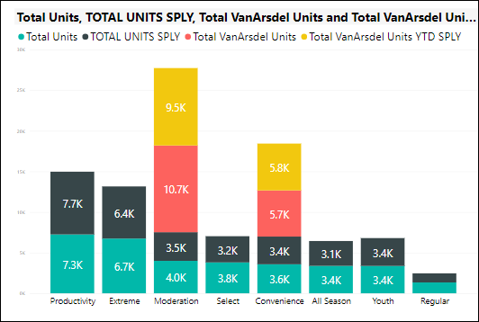
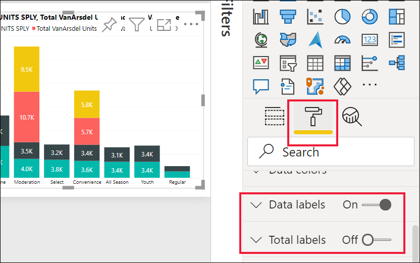
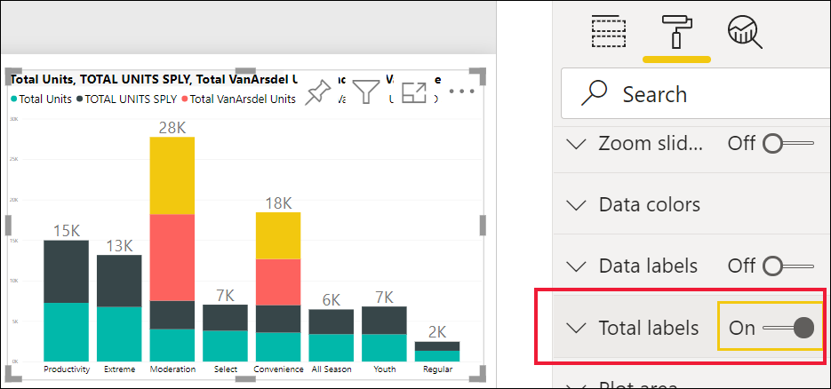

# Aan de slag met het opmaakvenster

[!INCLUDE[consumer-appliesto-nyyn](../includes/consumer-appliesto-nyyn.md)]    

Als u bewerkingsmachtigingen voor een rapport hebt, zijn er talrijke opmaakopties beschikbaar. U kunt in Power BI-rapporten de kleur wijzigen van gegevensreeksen, gegevenspunten en zelfs van de achtergrond van visualisaties. U kunt wijzigen hoe de x-as en y-as worden weergegeven. U kunt zelfs de lettertype-eigenschappen van visualisaties, vormen en titels opmaken. Power BI biedt u volledige controle over hoe uw rapporten worden weergegeven.

Open om te beginnen een rapport in de Power BI Desktop- of de Power BI-service. Beide services bieden vrijwel dezelfde opmaakopties. Als u een rapport in de Power BI-service opent, moet u **Bewerken** selecteren in de menubalk. 

Wanneer u een rapport hebt geopend voor bewerken en u een visualisatie selecteert, ziet u aan de rechterkant het deelvenster **Visualisaties**. In dit deelvenster kunt u visualisaties wijzigen. Direct onder het deelvenster **Visualisaties** bevinden zich drie pictogrammen: het pictogram **Velden** (een stapel balken), het pictogram **Opmaak** (een verfroller) en het pictogram **Analyse** (een vergrootglas). In de onderstaande afbeelding is het pictogram **Velden** geselecteerd, wat u kunt zien aan een gele balk onder het pictogram.

Wanneer u **Opmaak** selecteert, worden onder het pictogram de opties weergegeven die beschikbaar zijn om de momenteel geselecteerde visualisatie te wijzigen.  

U kunt voor elke visualisatie allerlei elementen aanpassen. Welke opties er beschikbaar zijn, is afhankelijk van de visual die is geselecteerd. Enkele van deze opties zijn:

* Legenda
* X-as
* Y-as
* Gegevenskleuren
* Gegevenslabels
* Totaal aantal labels
* Vormen
* Tekengebied
* Titel
* Achtergrond
* Hoogte-breedteverhouding vergrendelen
* Rand
* Knopinfo
* Visualheaders
* Vormen
* Positie    
en meer.

> [!NOTE]
>  
> Deze elementen zijn niet voor elk type visualisatie beschikbaar. De visualisatie die u selecteert, is van invloed op de aanpassingen die beschikbaar zijn. Zo ziet u bijvoorbeeld niet de aanpassing X-as als u een cirkeldiagram hebt geselecteerd, omdat een cirkeldiagram helemaal geen x-as heeft.

Als u geen enkele visualisatie hebt geselecteerd, wordt **Filters** weergegeven in plaats van de pictogrammen en kunt u filters toepassen op alle visualisaties op de pagina.

De beste manier om te leren hoe u de opmaakopties kunt gebruiken, is door ze uit te proberen. U kunt de wijzigingen altijd ongedaan maken of de standaardinstelling herstellen. Er bestaat al een groot aantal opties en er worden steeds nieuwe toegevoegd. Het is onmogelijk om alle opmaakopties in één artikel te beschrijven. Laten we om te beginnen een paar ervan samen bekijken. 

1. Kleuren wijzigen die in de visual worden gebruikt   
2. Een stijl toepassen    
3. Eigenschappen van as wijzigen    
4. Gegevenslabels toevoegen    
1. Totaal aantal labels toevoegen

## Werken met kleuren

We gaan stapsgewijs de stappen volgen voor het aanpassen van kleuren in een visualisatie.

1. Selecteer een visualisatie om deze actief te maken.

2. Selecteer het pictogram met de verfroller om het tabblad Opmaak te openen. Op het tabblad Opmaak worden alle opmaakelementen weergegeven die beschikbaar zijn voor de geselecteerde visual.

    

3. Selecteer **Gegevenskleuren** om de aanpassingen die ervoor beschikbaar zijn, uit te vouwen.  

    

4. Wijzig **Alle weergeven** in Aan en selecteer verschillende kleuren voor kolommen.

    

Hier volgen enkele handige tips voor het werken met kleuren. De nummers in de volgende lijst vindt u terug in het onderstaande scherm, zodat u snel kunt zien waar u deze nuttig elementen kunt vinden of wijzigen.

1. Niet tevreden over de kleur? Geen probleem. Selecteer **Standaardinstelling herstellen** om alle standaardkleuren te herstellen. 

2. U vindt geen enkele kleurwijziging geslaagd? Selecteer **Standaardinstelling herstellen** aan de onderkant van het gedeelte **Kleur van de gegevens** en de standaardkleuren worden hersteld. 

3. Zoekt u een kleur die niet in het palet staat? Selecteer **Aangepaste kleur** en u kunt kiezen uit het hele kleurenspectrum.  

   

Valt het toch tegen? Ook hier kunt u op **Ctrl+Z** drukken om de bewerking ongedaan te maken.

## Een stijl toepassen op een tabel
Sommige Power BI-visualisaties hebben een optie **Stijl**. Met één klik kunt u een volledige reeks opmaakopties in één keer op uw visualisatie toepassen. 

1. Selecteer een tabel of matrix om deze actief te maken.   
1. Open het tabblad Opmaak en selecteer **Stijl**.

   

1. Selecteer een stijl in de vervolgkeuzelijst. 

   

Zelfs nadat u een stijl hebt toegepast, kunt u de opmaakeigenschappen, inclusief de kleur, voor die visualisatie blijven gebruiken.

## Aseigenschappen wijzigen

Vaak is het handig om de x-as of de y-as te wijzigen. Net als bij het werken met kleuren, kunt u een as wijzigen door de pijl-omlaag links van de as te selecteren die u wijzigen, zoals wordt weergegeven in de volgende afbeelding.  

In het onderstaande voorbeeld hebben we de Y-as opgemaakt door:
- de labels naar de rechterkant van de visualisatie te verplaatsen

- de beginwaarde in nul te wijzigen

- de tekenkleur van het label in zwart te wijzigen

- de tekengrootte van het label te vergroten tot 12

- een titel voor de Y-as toe te voegen

    

U kunt de labels voor de as helemaal verwijderen door het keuzerondje naast **X-as** of **X-as** op Uit te zetten. U kunt de weergave van assen ook in- of uitschakelen met het keuzerondje naast **Titel**.  

## Gegevenslabels toevoegen    

We gaan gegevenslabels toevoegen aan een vlakdiagram. 

Dit is een afbeelding van *vóór* die toevoeging. 

En dit is een afbeelding van *na* de toevoeging.

We hebben de visualisatie geselecteerd om deze actief te maken, en we hebben het tabblad Opmaak geopend.  We hebben **Gegevenslabels** geselecteerd en ingeschakeld. Vervolgens hebben we de tekengrootte ingesteld op 12, de lettertypefamilie gewijzigd in Arial Black, de optie **Achtergrond weergeven** ingeschakeld en de achtergrondkleur op wit ingesteld met een transparantie van 5%.

Dit zijn slechts enkele van de opmaakmogelijkheden. Open een rapport in de bewerkingsmodus en maak spelenderwijs kennis met het venster Opmaak om prachtige en informatieve visualisaties te maken.

## Totaal aantal labels toevoegen    

Nog een laatste voorbeeld van opmaak voordat u zelf aan de slag gaat.  Laten we het totaal aantal labels toevoegen aan een gestapeld kolomdiagram. Het totaal aantal labels is beschikbaar voor gestapelde grafieken, combinatiegrafieken en vlakdiagrammen.

Wanneer u totaal aantal labels inschakelt, geeft Power BI de aggregatie of het totaal van de gegevens weer. We kijken naar een voorbeeld. 

Hier ziet u een gestapeld kolomdiagram met gegevenslabels waarin de waarde van elk gedeelte van elke volledige stack wordt weergegeven.  Dit is de standaardweergave. 

Als u de visual in de bewerkingsweergave opent, kunt u de weergave van gegevenslabels en totaal aantal labels wijzigen. Selecteer het visuele element om het te activeren en open het opmaakvenster. Schuif omlaag naar **Gegevenslabels** en **Totaal aantal labels**. **Gegevenslabels** is ingeschakeld en **Totaal aantal labels** is uitgeschakeld. 

Schakel **Gegevenslabels** uit en schakel **Totaal aantal labels** in. In Power BI wordt nu de aggregatie van elke kolom weergegeven.    

Dit zijn slechts enkele van de opmaakmogelijkheden. Open een rapport in de bewerkingsmodus en maak spelenderwijs kennis met het venster Opmaak om prachtige en informatieve visualisaties te maken.

## Volgende stappen
Raadpleeg voor meer informatie hete volgende artikel: 

* [Rapporten delen](../collaborate-share/service-share-reports.md)

* [Tips en trucs voor het gebruik van opmaak in Power BI](service-tips-and-tricks-for-color-formatting.md)  
* [Voorwaardelijke opmaak in tabellen](../create-reports/desktop-conditional-table-formatting.md)

