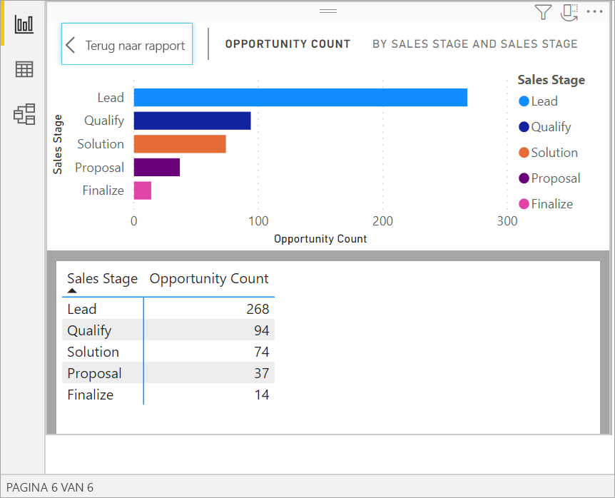

# Onderliggende gegevens van een visualisatie weergeven

[!INCLUDE[consumer-appliesto-yyyn](../includes/consumer-appliesto-nyyn.md)]    

## Gegevens weergeven
Een visualisatie in Power BI is opgebouwd met gegevens uit uw gegevenssets. Als u een kijkje achter de schermen wilt nemen, kunt u de gegevens die zijn gebruikt voor het maken van het visuele element *weergegeven* in Power BI. Wanneer u **Gegevens weergeven** selecteert, geeft Power BI de gegevens onder (of naast) de visualisatie weer.

U kunt de gegevens die zijn gebruikt voor het maken van de visualisatie ook exporteren als .xlsx- of .csv-bestand en weergeven in Excel. Zie [Gegevens exporteren uit Power BI-visualisaties](power-bi-visualization-export-data.md) voor meer informatie.

> [!NOTE]
> *Gegevens weergeven* en *Gegevens exporteren* zijn beide beschikbaar in de Power BI-service en Power BI Desktop. Power BI Desktop biedt echter een extra detaillaag; [*Records weergeven* geeft de daadwerkelijke rijen uit de gegevensset weer](../create-reports/desktop-see-data-see-records.md).
> 
> 

## *Gegevens weergeven* gebruiken 
1. Selecteer in Power BI Desktop een visualisatie om deze actief te maken.

2. Selecteer **Meer acties** (...) en kies **Gegevens weergeven**. 
    

3. Standaard worden de gegevens weergegeven onder het visuele element.
   
   

4. Als u de afdrukstand wilt wijzigen, selecteert u verticale indeling  in de rechterbovenhoek van de visualisatie.
   
   
5. Als u de gegevens wilt exporteren naar een .csv-bestand, selecteert u het beletselteken en kiest u **Gegevens exporteren**.
   
    
   
    Zie [Gegevens exporteren uit Power BI-visualisaties](power-bi-visualization-export-data.md) voor meer informatie over het exporteren van de gegevens naar Excel.
6. Als u de gegevens wilt verbergen, schakelt u **Verkennen** > **Gegevens weergeven** uit.

## Records weergeven gebruiken
U kunt zich ook focussen op één gegevensrecord in een visualisatie en inzoomen op de achterliggende gegevens. 

1. Als u **Records weergeven** wilt gebruiken, selecteert u een visualisatie om deze actief te maken. 

2. Selecteer op het lint Bureaublad het tabblad voor **Hulpprogramma's voor visuals** > **Gegevens/zoomen** > **Records weergeven**. 

    

3. Selecteer een gegevenspunt of rij in de visualisatie. In dit voorbeeld hebben we de vierde kolom van links geselecteerd. Power BI toont het gegevenssetrecord voor dit gegevenspunt.

    

4. Selecteer **Terug naar rapport** om terug te gaan naar het rapportcanvas van het Bureaublad. 

## Aandachtspunten en probleemoplossing

- Als de knop **Records weergeven** in het lint is uitgeschakeld en niet beschikbaar is, betekent dit dat de geselecteerde visualisatie geen ondersteuning biedt voor Records weergeven.
- U kunt de gegevens in de weergave Records weergeven niet wijzigen en in het rapport opslaan.
- U kunt Records weergeven niet gebruiken als voor de visual een berekende meting wordt gebruikt in een multidimensionaal model.
- U kunt Records weergeven niet gebruiken als u bent verbonden met een live, multidimensionaal model (MD).  

## Volgende stappen
[Gegevens uit Power BI-visualisaties exporteren](power-bi-visualization-export-data.md)    

Hebt u nog vragen? [Misschien dat de Power BI-community het antwoord weet](https://community.powerbi.com/)

