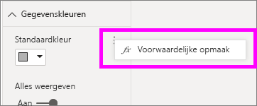

# Tips en trucs voor het gebruik van kleuren in Power BI
Power BI biedt veel verschillende manieren voor het aanpassen van uw dashboards en rapporten. In dit artikel vindt u een verzameling tips die ervoor kunnen zorgen dat uw Power BI-visualisaties boeiend, interessant en afgestemd op uw behoeften zijn.

De volgende tips worden gegeven. Hebt u nog een goede tip? Mooi! Stuur de tip naar ons en we zullen kijken of deze aan de lijst kan worden toegevoegd.

* De kleur van één gegevenspunt wijzigen
* De kleuren van een grafiek baseren op een numerieke waarde
* De kleur van gegevenspunten baseren op een veldwaarde
* Kleuren in de kleurenschaal aanpassen
* Uiteenlopende kleurenschalen gebruiken
* Hoe kunt u iets ongedaan maken in Power BI?

Als u eventuele wijzigingen wilt aanbrengen, moet u een rapport bewerken. Open het rapport en selecteer **Rapport bewerken** in het bovenste menu, zoals wordt weergegeven in de volgende afbeelding.

Wanneer de deelvensters **Filters** en **Visualisaties** worden weergegeven aan de rechterkant van het rapportcanvas, kunt u beginnen met aanpassen. Als het deelvenster niet wordt weergegeven, selecteert u de pijl in de rechterbovenhoek om het te openen.

## De kleur van één gegevenspunt wijzigen
Soms wilt u een bepaald gegevenspunt markeren. Misschien zijn het verkoopcijfers voor de lancering van een nieuw product, of hogere kwaliteitsscores na de lancering van een nieuw programma. Met Power BI kunt u een gegevenspunt markeren door de kleur ervan te wijzigen.

In de volgende visualisatie worden per productsegment verkochte eenheden gerangschikt. 

Stel u voor dat u het segment **Gemak** wilt aanroepen om op basis van kleur te zien hoe goed dit splinternieuw segment presteert. Dit zijn de stappen:

Vouw de sectie **Gegevenskleuren** uit en schakel de schuifregelaar Aan in op **Alles weergeven**. Hiermee worden de kleuren voor elk gegevenselement in de visualisatie weergegeven. Wanneer u met de muisaanwijzer over de gegevenspunten beweegt, is schuiven ingeschakeld zodat u alle gegevenspunten kunt wijzigen.

Stel **Gemak** in op oranje. 

Wanneer dit is geselecteerd, heeft het gegevenspunt **Gemak** een mooie oranje kleur die zeker opvalt.

Zelf als u visualisatietypen wijzigt en vervolgens terugkeert, onthoudt Power BI uw selectie en blijft **Gemak** oranje.

U kunt de kleur van een gegevenspunt voor één, meerdere of alle gegevenselementen in de visualisatie wijzigen. Wellicht wilt u dat uw visual uw bedrijfskleuren bevat. 

Er zijn veel verschillende dingen die u met kleuren kunt doen. In de volgende sectie gaan we in op kleurovergangen.

## De kleuren van een grafiek baseren op een numerieke waarde
Grafieken profiteren vaak van dynamisch ingestelde kleuren op basis van de numerieke waarde van een veld. Hiermee kunt u een andere waarde laten zien dan wat u gewend bent voor de grootte van een balk en twee waarden in één grafiek weergeven. Of u kunt dit gebruiken om gegevenspunten boven (of onder) een bepaalde waarde te markeren - misschien om gebieden met een lage winstgevendheid te accentueren.

In de volgende secties worden verschillende manieren beschreven om kleur te baseren op een numerieke waarde.

## De kleur van gegevenspunten baseren op een waarde
Als u de kleur wilt wijzigen op basis van een waarde, opent u het opmaakvenster en selecteert u de optie **Voorwaardelijke opmaak**.  

Gebruik de vervolgkeuzelijsten in het deelvenster Standaardkleuren om de velden te identificeren die u voor voorwaardelijke opmaak wilt gebruiken. In dit voorbeeld hebben we het veld **Verkoopfeit** > **Totale eenheden** geselecteerd en lichtblauw voor de **Laagste waarde** en donkerblauw voor de **Hoogste waarde** gekozen. 

U kunt de kleur van de visual ook opmaken met behulp van een veld dat geen deel uitmaakt van de visual. In de volgende afbeelding wordt **Marktaandeelpercentage SPLY YTD** gebruikt. 

U ziet dat, hoewel er meer eenheden van zowel **Productiviteit** als **Extreem** zijn verkocht (die kolommen zijn hoger), **Toezicht** een groter **Marktaandeelpercentage SPLY YTD** heeft (die kolom heeft meer kleurverzadiging).

## De kleuren in de kleurenschaal aanpassen
U kunt ook de manier wijzigen waarop de waarden aan deze kleuren worden toegewezen. In de volgende afbeelding zijn de kleuren voor **Minimum** en **Maximum** ingesteld op respectievelijk oranje en groen.

In deze eerste afbeelding ziet u hoe de balken in de grafiek het kleurverloop in de balk weergeven; de hoogste waarde is groen, de laagste is oranje en elke balk ertussen is gekleurd met een tint uit het spectrum tussen groen en oranje.

Laten we eens kijken wat er gebeurt als we numerieke waarden opgeven in de waardevakken **Minimum** en **Maximum**. Stel **Minimum** in op 3.500 en **Maximum** op 6.000.

Door het instellen van deze waarden wordt het verloop niet langer toegepast op de waarden in de grafiek die onder **Minimum** of boven **Maximum** liggen; een balk met een waarde boven **Maximum** is groen en een balk met een waarde onder **Minimum** is rood.

## Uiteenlopende kleurenschalen gebruiken
Soms kunnen uw gegevens van nature verschillen. Een temperatuurbereik heeft bijvoorbeeld een natuurlijk midden op het vriespunt en een rentabiliteitsscore heeft een natuurlijk middelpunt (nul).

Selecteer de optie voor **Afwijken** als u uiteenlopende kleurenschalen wilt gebruiken. Wanneer **Afwijken** is ingeschakeld, verschijnt een extra kleurenkiezer, **Midden** genoemd (zie de volgende afbeelding).

Wanneer de schuifregelaar **Afwijken** is ingeschakeld, kunt u de kleuren afzonderlijk instellen voor **Minimum**, **Maximum** en **Midden**. In de volgende afbeelding is **Midden** ingesteld op 0,2 voor **marktaandeelpercentage SPLY YTD**, dus balken met waarden boven één hebben een groene kleurtint en balken onder één hebben een rode kleurtint.

## Hoe kunt u iets ongedaan maken in Power BI?
Net als in veel andere services en software van Microsoft, biedt Power BI een eenvoudige manier om de laatst uitgevoerde opdracht ongedaan te maken. Laten we bijvoorbeeld zeggen dat u de kleur van een gegevenspunt of een reeks gegevenspunten wijzigt en dat de weergegeven kleur in de visualisatie u niet bevalt. U weet niet precies welke kleur het eerder was, maar u weet wel dat u die kleur terug wilt!

Als u uw laatste actie of acties **ongedaan wilt maken** , doet u het volgende:

- Typ CTRL+Z

## Feedback
Hebt u een tip die u wilt delen? Stuur de tip naar ons en we zullen kijken of we deze kunnen toevoegen.

>[!NOTE]
>Deze aanpassingen van kleur, assen en overige aanpassingen die beschikbaar zijn wanneer het pictogram **Opmaak** is geselecteerd, zijn ook beschikbaar in Power BI Desktop.

## Volgende stappen
[Aan de slag met de kleuropmaak en de eigenschappen van assen](service-getting-started-with-color-formatting-and-axis-properties.md)

