# Power BI inhoud distribueren naar externe gast gebruikers met behulp van Azure Active Directory B2B

**Samenvatting:** Dit is een technisch document waarin wordt uitgelegd hoe u inhoud distribueert naar gebruikers buiten de organisatie met de integratie van Azure Active Directory Business-to-Business (Azure AD B2B).

**Schrijven** Lukasz Pawlowski, Kasper de jonge

**Technische controleurs:** Adam Wilson, Sheng Liu, Qian Liang, Sergei Gundorov, Dick Grimm, Adam Saxton, Maya Shenhav, Nimrod Shalit, Elisabeth Olson

> [!NOTE]
> U kunt dit technische document opslaan of afdrukken door in uw browser **Afdrukken** en vervolgens **Opslaan als PDF-bestand** te selecteren.

## Inleiding

Power BI geeft organisaties een weer gave van hun bedrijf van 360 graden en biedt iedereen in deze organisaties de mogelijkheid om intelligente beslissingen te nemen met behulp van gegevens. Veel van deze organisaties hebben sterke en vertrouwde relaties met externe partners, clients en contract ANTEN. Deze organisaties moeten veilige toegang bieden tot Power BI Dash boards en rapporten voor gebruikers in deze externe partners.

Power BI integreert met [Azure Active Directory Business-to-Business (Azure AD B2B)](https://docs.microsoft.com/azure/active-directory/b2b/what-is-b2b) voor een veilige distributie van Power bi-inhoud naar gast gebruikers buiten de organisatie, terwijl de controle blijft behouden en de toegang tot interne gegevens wordt geregeld.

In dit technisch document worden alle details besproken die u nodig hebt om de integratie van Power BI met Azure Active Directory B2B te begrijpen. We hebben de meest voorkomende gebruiks situatie, het instellen, het licentie niveau en de beveiliging op rijniveau.

> [!NOTE]
> In deze White Paper verwijzen we naar Azure Active Directory als Azure AD en Azure Active Directory Business to Business als Azure AD B2B.

## Scenario's

Contoso is een automobiel fabrikant en werkt samen met een groot aantal leveranciers met alle onderdelen, materialen en services die nodig zijn voor het uitvoeren van de productie werkzaamheden. Contoso wil de logistiek van de toeleverings keten en abonnementen stroom lijnen om Power BI te gebruiken om de metrische prestatie gegevens van de toeleverings keten te bewaken. Contoso wil delen met de analyse van de externe supply chain-partners op een veilige en beheersbare manier.

Contoso kan de volgende ervaringen inschakelen voor externe gebruikers die gebruikmaken van Power BI en Azure AD B2B.

### Ad-hoc per item delen

Contoso werkt met een leverancier die radiatoren bouwt voor de auto's van contoso. Vaak moeten ze de betrouw baarheid van de radiatoren optimaliseren door gebruik te maken van gegevens uit alle auto's van contoso. Een analist bij Contoso maakt gebruik van Power BI om een betrouw baarheids rapport van een radiator te delen met een technicus bij de leverancier. De engineer ontvangt een e-mail met een koppeling om het rapport weer te geven.

Zoals hierboven beschreven, wordt dit ad-hoc delen door zakelijke gebruikers uitgevoerd op basis van de behoeften. De koppeling die door Power BI naar de externe gebruiker wordt verzonden, is een Azure AD B2B-uitnodiging. Wanneer de externe gebruiker de koppeling opent, wordt u gevraagd om lid te worden van de Azure AD-organisatie van Contoso als gast gebruiker. Nadat de uitnodiging is geaccepteerd, opent de koppeling het specifieke rapport of dash board. De Azure Active Directory-beheerder delegeert machtigingen om externe gebruikers aan de organisatie uit te nodigen en kiest wat gebruikers kunnen doen zodra ze de uitnodiging accepteren, zoals wordt beschreven in de sectie beheer van dit document. De contoso-analist kan de gast gebruiker alleen uitnodigen omdat de Azure AD-beheerder die actie heeft toegestaan en de beheerder van de Power BI toestemming heeft gegeven om gasten uit te nodigen om inhoud te bekijken in de Tenant instellingen van Power BI.

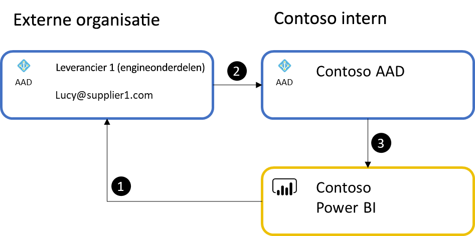

1. Het proces wordt gestart met een interne gebruiker van Contoso die een dash board of een rapport deelt met een externe gebruiker. Als de externe gebruiker nog geen gast is in de Azure AD van contoso, worden ze uitgenodigd. Er wordt een e-mail bericht verzonden naar het e-mail adres dat een uitnodiging voor de Azure AD van Contoso bevat
2. De ontvanger accepteert de uitnodiging voor de Azure AD van Contoso en wordt toegevoegd als gast gebruiker in de Azure AD van contoso.
3. De ontvanger wordt vervolgens omgeleid naar het Power BI dash board, rapport of app, die alleen-lezen is voor de gebruiker.

Het proces wordt beschouwd als ad-hoc omdat zakelijke gebruikers in contoso de actie voor uitnodigen uitvoeren als nodig is voor hun bedrijfs doeleinden. Elk item dat wordt gedeeld, is een enkele koppeling die de externe gebruiker kan openen om de inhoud weer te geven.

Zodra de externe gebruiker is uitgenodigd om toegang te krijgen tot contoso-bronnen, kan er een schaduw account worden gemaakt voor de resources in contoso Azure AD en hoeven ze niet opnieuw te worden uitgenodigd.  De eerste keer dat ze toegang proberen te krijgen tot een contoso-resource, zoals een Power BI dash board, gaan ze via een toestemmings proces, dat de uitnodiging inwisselt.  Als ze de toestemming niet volt ooien, hebben ze geen toegang tot de inhoud van contoso.  Als er problemen zijn bij het inwisselen van de uitnodiging via de oorspronkelijke koppeling, kan een Azure AD-beheerder een specifieke uitnodigings koppeling opnieuw verzenden.

### Gepland per item delen

Contoso werkt met een toeleverancier om betrouw baarheid van radiatoren uit te voeren. De onderaannemer heeft een team van 10 personen die toegang nodig hebben tot gegevens in de Power BI omgeving van contoso. De contoso Azure AD-beheerder is betrokken bij het uitnodigen van alle gebruikers en het afhandelen van toevoegingen/wijzigingen als personeel bij de toeleveranciers wijziging. De Azure AD-beheerder maakt een beveiligings groep voor alle werk nemers bij de onderaannemer. Met behulp van de beveiligings groep kunnen mede werkers van Contoso eenvoudig toegang tot rapporten beheren en ervoor zorgen dat alle vereiste uitbestedings personeel toegang heeft tot alle vereiste rapporten, Dash boards en Power BI apps. De Azure AD-beheerder kan er ook voor zorgen dat er geen deel uitmaakt van het uitnodigings proces door de uitnodigingen van de uitnodiging te delegeren aan een betrouw bare werk nemer bij Contoso of bij de toeleverancier.

Sommige organisaties hebben meer controle over wanneer externe gebruikers worden toegevoegd, hebben veel gebruikers in een externe organisatie of veel externe organisaties nodig. In deze gevallen kan gepland delen worden gebruikt voor het beheren van de schaal van delen, het afdwingen van organisatie beleid en zelfs voor het delegeren van rechten aan vertrouwde personen om externe gebruikers uit te nodigen en te beheren. Azure AD B2B ondersteunt geplande uitnodigingen die rechtstreeks [vanuit het Azure portal door een IT-beheerder](https://docs.microsoft.com/azure/active-directory/b2b/add-users-administrator)kunnen worden verzonden of via [Power shell met behulp van de API](https://docs.microsoft.com/azure/active-directory/b2b/customize-invitation-api) voor uitnodigingen van de uitnodigings beheerder waarbij een set gebruikers in één actie kan worden uitgenodigd. Met behulp van de geplande methode voor uitnodigingen kan de organisatie bepalen wie gebruikers kan uitnodigen en goedkeurings processen kan implementeren. Dankzij geavanceerde mogelijkheden van Azure AD, zoals dynamische groepen, kunt u het lidmaatschap van de beveiligings groep eenvoudig automatisch onderhouden.

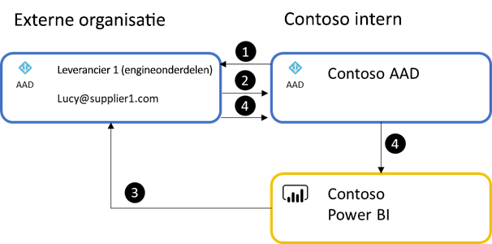

1. De proces sterren met een IT-beheerder die de gast gebruiker hand matig of via de API van Azure Active Directory uitnodigt
2. De gebruiker accepteert de uitnodiging voor de organisatie.
3. Zodra de gebruiker de uitnodiging heeft geaccepteerd, kan een gebruiker in Power BI een rapport of dash board delen met de externe gebruiker of een beveiligings groep waarin ze zich bevinden. Net als bij normaal delen in Power BI de externe gebruiker een e-mail ontvangen met de koppeling naar het item.
4. Wanneer de externe gebruiker de koppeling opent, wordt de verificatie in hun Directory door gegeven aan de Azure AD van Contoso en wordt gebruikt om toegang te krijgen tot de inhoud van de Power BI.

### Ad-hoc of gepland delen van Power BI-apps

Contoso heeft een set rapporten en dash boards die ze nodig hebben om te delen met een of meer leveranciers. Om ervoor te zorgen dat alle vereiste externe gebruikers toegang hebben tot deze inhoud, wordt het verpakt als een Power BI-app. De externe gebruikers worden direct toegevoegd aan de app-toegangs lijst of via beveiligings groepen. Iemand bij Contoso verzendt vervolgens de app-URL naar alle externe gebruikers, bijvoorbeeld in een e-mail bericht. Wanneer de externe gebruikers de koppeling openen, zien ze alle inhoud in één eenvoudig te navigeren ervaring.

Door een Power BI-app te gebruiken, kunt u eenvoudig een BI-portal voor de leveranciers van Contoso maken. Een enkele toegangs lijst beheert de toegang tot alle vereiste inhoud waarbij de verspilde tijd wordt gereduceerd en de machtigingen op item niveau worden ingesteld. Azure AD B2B houdt beveiligings toegang met de systeem eigen identiteit van de leverancier, zodat gebruikers geen aanvullende aanmeldings referenties nodig hebben. Als geplande uitnodigingen met beveiligings groepen worden gebruikt, is het beheer van toegang tot de app vereenvoudigd. Lidmaatschap van beveiligings groepen hand matig of met [dynamische groepen](https://docs.microsoft.com/azure/active-directory/b2b/use-dynamic-groups), zodat alle externe gebruikers van een leverancier automatisch worden toegevoegd aan de juiste beveiligings groep.

1. Het proces wordt gestart door de gebruiker die wordt uitgenodigd voor de Azure AD-organisatie van Contoso via de Azure Portal of Power shell
2. De gebruiker kan worden toegevoegd aan een gebruikers groep in azure AD. Een statische of dynamische gebruikers groep kan worden gebruikt, maar dynamische groepen helpen het hand matig werken te verminderen.
3. De externe gebruikers krijgen toegang tot de Power BI-app via de gebruikers groep. De URL van de app moet rechtstreeks naar de externe gebruiker worden verzonden of worden geplaatst op een site waartoe ze toegang hebben. Met Power BI kunt u een e-mail bericht met de app-koppeling naar externe gebruikers verzenden, maar wanneer u gebruikers groepen gebruikt waarvan het lidmaatschap kan wijzigen, kan Power BI niet verzenden naar alle externe gebruikers die worden beheerd via gebruikers groepen.
4. Wanneer de externe gebruiker toegang heeft tot de URL van de Power BI-app, worden deze geverifieerd door de Azure AD van contoso, wordt de app voor de gebruiker geïnstalleerd en kan de gebruiker alle opgenomen rapporten en dash boards in de app weer geven.

Apps hebben ook een unieke functie waarmee app-ontwerpers de toepassing automatisch kunnen installeren voor de gebruiker, zodat deze beschikbaar is wanneer de gebruiker zich aanmeldt. Deze functie wordt alleen automatisch geïnstalleerd voor externe gebruikers die al deel uitmaken van de organisatie van Contoso op het moment dat de toepassing wordt gepubliceerd of bijgewerkt. Daarom kunt u het het beste gebruiken met de methode gepland voor uitnodigingen, en is afhankelijk van de app die wordt gepubliceerd of bijgewerkt nadat de gebruikers zijn toegevoegd aan de Azure AD van contoso. Externe gebruikers kunnen de app altijd installeren met behulp van de app-koppeling.

### Opmerkingen en abonneren op inhoud voor alle organisaties

Omdat contoso blijft werken met de onderaannemers of leveranciers, moeten de externe engineers nauw samen werken met de analisten van contoso. Power BI biedt verschillende samenwerkings functies die gebruikers helpen te communiceren over inhoud die ze kunnen gebruiken. Met Dashboard opmerkingen (en binnenkort opmerkingen verzenden) kunnen gebruikers gegevens punten bespreken die ze zien en communiceren met ontwerpers van rapporten om vragen te stellen.

Op dit moment kunnen externe gast gebruikers deel nemen aan opmerkingen door opmerkingen te laten staan en de antwoorden te lezen. Maar in tegens telling tot interne gebruikers kunnen @mentioned gast gebruikers geen meldingen ontvangen dat ze een opmerking hebben ontvangen. Gast gebruikers kunnen de functie abonnementen niet gebruiken binnen Power BI op het moment van schrijven. In een aanstaande release worden deze beperkingen opgeheven en ontvangt de gast gebruiker een e-mail bericht wanneer ze een @mentions Opmerking ontvangen, of wanneer een abonnement wordt bezorgd in hun e-mail bericht dat een koppeling bevat naar de inhoud in Power bi.

### Toegang tot inhoud in de mobiele apps van Power BI

Wanneer de gebruikers van Contoso rapporten of Dash boards met hun externe gast-equivalenten delen Power BI, wordt in een aanstaande release een e-mail verzonden met de melding van de gast. Wanneer de gast gebruiker de koppeling naar het rapport of het dash board op hun mobiele apparaat opent, wordt de inhoud in de systeem eigen Power BI Mobile-apps op het apparaat geopend, als deze zijn geïnstalleerd. De gast gebruiker kan vervolgens navigeren tussen inhoud die met hen wordt gedeeld in de externe Tenant en terug naar hun eigen inhoud van hun thuis Tenant.

> [!NOTE]
> De gast gebruiker kan de mobiele app van Power BI niet openen en direct naar de externe Tenant navigeren, moeten ze beginnen met een koppeling naar een item in de externe Tenant. Veelvoorkomende tijdelijke oplossingen worden beschreven in de sectie over het [distribueren van koppelingen naar inhoud in het gedeelte Power bi van de bovenliggende organisatie](#distributing-links-to-content-in-the-parent-organizations-power-bi) verderop in dit document.

### Bewerking en beheer van Power BI inhoud in de hele organisatie

Contoso en haar leveranciers en onderaannemers werken steeds nauw keuriger samen. Een analist bij de toeleverancier moet er ook voor zorgen dat extra metrische gegevens of data visualisaties worden toegevoegd aan een rapport dat Contoso heeft gedeeld. De gegevens moeten zich in de Power BI-Tenant van Contoso bevinden, maar externe gebruikers moeten deze kunnen bewerken, nieuwe inhoud maken en deze zelfs distribueren naar de juiste personen.

Power BI biedt een optie waarmee **externe gast gebruikers inhoud in de organisatie kunnen bewerken en beheren** . Standaard hebben externe gebruikers een alleen-lezen ervaring. Met deze nieuwe instelling kan de Power BI-beheerder echter kiezen welke externe gebruikers inhoud in hun eigen organisatie kunnen bewerken en beheren. Eenmaal toegestaan, kan de externe gebruiker rapporten, Dash boards, publiceren of bijwerken apps bewerken, in werk ruimten werken en verbinding maken met gegevens die ze mogen gebruiken.

Dit scenario wordt gedetailleerd beschreven in de sectie externe gebruikers in staat stellen om inhoud te bewerken en te beheren in Power BI verderop in dit document.

## Organisatie relaties met Power BI en Azure AD B2B

Wanneer alle gebruikers van Power BI intern zijn voor de organisatie, is het niet nodig om Azure AD B2B te gebruiken. Als twee of meer organisaties echter willen samen werken aan gegevens en inzichten, is de ondersteuning van Power BI voor Azure AD B2B eenvoudig en voordelig.

Hieronder vindt u meestal organisatie structuren die goed zijn afgestemd op de samen werking tussen organisaties van Azure AD B2B in Power BI. Azure AD B2B werkt in de meeste gevallen goed, maar in sommige gevallen zijn de algemene alternatieve benaderingen die aan het einde van dit document worden behandeld, in overweging genomen.

### Voor beeld 1: Rechtstreekse samen werking tussen organisaties

De relatie van Contoso met de leverancier van de radiator is een voor beeld van een rechtstreekse samen werking tussen organisaties. Omdat er betrekkelijk weinig gebruikers bij Contoso en de leverancier zijn die toegang nodig hebben tot de betrouw baarheid van de radiator, is het gebruik van extern delen via Azure AD B2B ideaal. Het is eenvoudig te gebruiken en eenvoudig te beheren. Dit is ook een gemeen schappelijk patroon in Consulting Services, waar een consultant mogelijk inhoud voor een organisatie moet bouwen.

Normaal gesp roken wordt het delen van het eerst uitgevoerd via ad-hoc per item delen. Als teams groeien of versneld worden, wordt de geplande benadering voor het delen van items echter de voorkeurs methode om de beheer overhead te verminderen. Daarnaast kan de ad-hoc of het geplande delen van Power BI-apps, het afmelden en abonneren op inhoud tussen organisaties, de toegang tot inhoud in mobiele apps ook in het speel goed en het bewerken en beheren van Power BI inhoud in een andere organisatie. Belang rijk: als gebruikers van beide organisaties Power BI Pro licenties hebben in hun respectieve organisaties, kunnen ze deze Pro-licenties gebruiken in de Power BI omgevingen van elkaar. Dit biedt de voor delen van licenties, omdat de uitnodigende organisatie mogelijk niet moet betalen voor een Power BI Pro licentie voor de externe gebruikers. Dit wordt verderop in dit document uitgebreid beschreven in het gedeelte licentie verlening.

### Voor beeld 2: Moeder maatschappij en dochter ondernemingen of gelieerde ondernemingen

Sommige organisatie structuren zijn complexer, inclusief gedeeltelijk of geheel dochter ondernemingen, gelieerde ondernemingen of relaties van beheerde service providers. Deze organisaties hebben een bovenliggende organisatie, zoals een houdster maatschappij, maar de onderliggende organisaties doen semi-autonoom, soms onder verschillende regionale vereisten. Dit leidt ertoe dat elke organisatie een eigen Azure AD-omgeving heeft en afzonderlijke Power BI tenants.

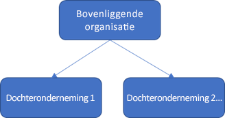

In deze structuur moet de bovenliggende organisatie doorgaans gestandaardiseerde inzichten distribueren naar de bijbehorende dochter ondernemingen. Normaal gesp roken treedt dit op met behulp van de ad-hoc of het gepland delen van Power BI-apps, zoals wordt geïllustreerd in de volgende afbeelding, omdat de distributie van genormaliseerde gezaghebbende inhoud kan worden gedistribueerd naar een breed publiek. In de praktijk wordt een combi natie van alle Scenario's gebruikt die eerder in dit document worden genoemd.

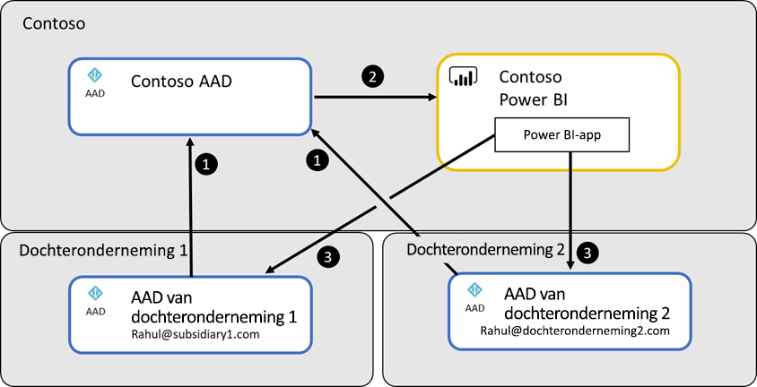

Dit volgt het volgende proces:

1. Gebruikers van elke dochter onderneming worden uitgenodigd voor Azure AD van contoso
2. Vervolgens wordt de app Power BI gepubliceerd om deze gebruikers toegang te geven tot de vereiste gegevens
3. Ten slotte openen de gebruikers de app via een koppeling die ze hebben ontvangen om de rapporten weer te geven

Er zijn verschillende belang rijke uitdagingen voor organisaties in deze structuur:

- Koppelingen naar inhoud in de Power BI van de bovenliggende organisatie distribueren
- Gebruikers van een dochter maatschappij toegang geven tot de gegevens bron die wordt gehost door de bovenliggende organisatie

#### Koppelingen naar inhoud in de Power BI van de bovenliggende organisatie distribueren

Drie benaderingen worden vaak gebruikt voor het distribueren van koppelingen naar de inhoud. De eerste en meest basis is het verzenden van de koppeling naar de app naar de vereiste gebruikers of om deze te plaatsen op een share point online-site waar deze kan worden geopend. Gebruikers kunnen vervolgens een blad wijzer toevoegen aan de koppeling in hun browsers voor snellere toegang tot de gegevens die ze nodig hebben.

De tweede aanpak is afhankelijk van de cross-organisatie bewerking en het beheer van de mogelijkheden van Power BI-inhoud. De bovenliggende organisatie staat gebruikers van de dochter ondernemingen toe om toegang te krijgen tot de Power BI en om te bepalen wat ze via toestemming kunnen openen. Hiermee krijgt u toegang tot Power BI thuis waar de gebruiker van de dochter onderneming een uitgebreide lijst met inhoud ziet die wordt gedeeld in de Tenant van de bovenliggende organisatie. De URL naar de Power BI omgeving van de bovenliggende organisaties wordt dan toegewezen aan de gebruikers van de dochter ondernemingen.

De laatste benadering maakt gebruik van een Power BI-app die in de Power BI Tenant is gemaakt voor elke dochter onderneming. De Power BI-app bevat een dash board met tegels die zijn [geconfigureerd met de optie externe koppeling](https://docs.microsoft.com/power-bi/service-dashboard-edit-tile#hyperlink). Wanneer de gebruiker op de tegel drukt, worden deze naar het juiste rapport, dash board of de relevante app in de Power BI van de bovenliggende organisatie geleid. Deze benadering heeft het toegevoegde voor deel dat de app automatisch kan worden geïnstalleerd voor alle gebruikers in de dochter maatschappij en is beschikbaar voor de apps wanneer ze zich aanmelden bij hun eigen Power BI-omgeving. Een extra voor deel van deze benadering is dat het goed werkt met de mobiele apps van Power BI die de koppeling zelf kunnen openen. U kunt dit ook combi neren met de tweede benadering om gemakkelijker te scha kelen tussen Power BI omgevingen.

#### Toegang van dochter gebruikers tot gegevens bronnen die worden gehost door de bovenliggende organisatie

Vaak moeten analisten van een dochter maatschappij hun eigen analyse maken met gegevens die door de bovenliggende organisatie worden verstrekt. In dit geval worden meestal gegevens bronnen in de Cloud gebruikt om de uitdaging te verhelpen.

De eerste benadering maakt gebruik van [Azure Analysis Services](https://docs.microsoft.com/azure/analysis-services/analysis-services-overview) om een Data Warehouse van een onderneming te bouwen dat de behoeften van analisten in de moeder maatschappij en haar dochter ondernemingen vormt, zoals wordt weer gegeven in de volgende afbeelding. Contoso kan de gegevens hosten en mogelijkheden zoals beveiliging op rijniveau gebruiken om ervoor te zorgen dat gebruikers in elke dochter maatschappij alleen toegang hebben tot hun gegevens. Analisten in elke organisatie hebben toegang tot het Data Warehouse via Power BI Desktop en kunnen resulterende analyses publiceren naar hun respectieve Power BI tenants.

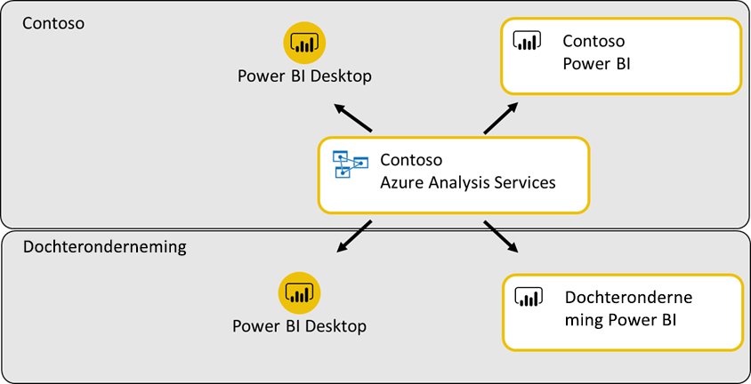

De tweede benadering maakt gebruik van [Azure SQL database](https://azure.microsoft.com/services/sql-database/) om een relationeel Data Warehouse te bouwen om toegang te bieden tot gegevens. Dit werkt op dezelfde manier als de Azure Analysis Services benadering, maar sommige mogelijkheden, zoals beveiliging op rijniveau, kunnen lastig zijn om te implementeren en onderhouden in dochter ondernemingen.

Meer geavanceerde benaderingen zijn ook mogelijk, maar dit is wel het meest gangbaar.

### Voor beeld 3: Gedeelde omgeving over partners

Contoso kan een partnerschap met een concurrent invoeren om gezamenlijk een auto te bouwen op een gedeelde assemblage lijn, maar om het Voer tuig onder verschillende merken of in verschillende regio's te distribueren. Hiervoor is uitgebreide samen werking en gezamenlijk eigendom van gegevens, intelligentie en analyses tussen organisaties vereist. Deze structuur is ook gebruikelijk in de consulting services-branche, waar een team van consultants op project gebaseerde analyses voor een client kan uitvoeren.

In de praktijk zijn deze structuren complex, zoals wordt weer gegeven in de volgende afbeelding en moet het personeel worden onderhouden. Voor een goede werking van deze structuur wordt gebruikgemaakt van de cross-organisatie bewerking en het beheer van de mogelijkheden van Power BI-inhoud, omdat organisaties Power BI Pro licenties die zijn aangeschaft voor hun respectieve Power BI-tenants opnieuw kunnen gebruiken.

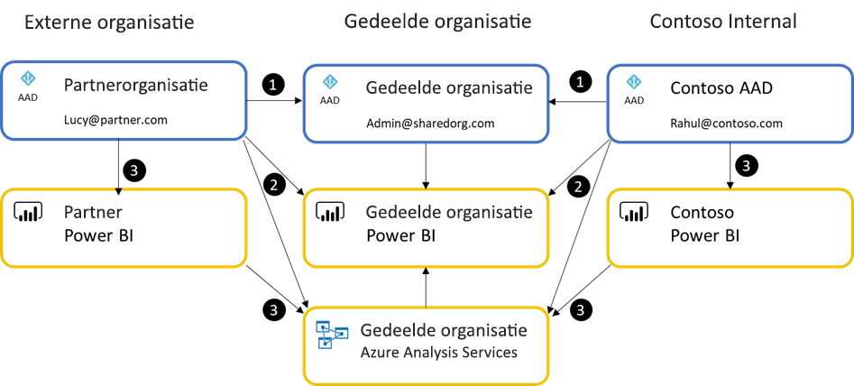

Als u een gedeelde Power BI Tenant wilt maken, moet er een Azure Active Directory worden gemaakt en moet ten minste één Power BI Pro gebruikers account worden aangeschaft voor een gebruiker in die Active Directory. Deze gebruiker nodigt de vereiste gebruikers uit voor de gedeelde organisatie. Belang rijk: in dit scenario worden de gebruikers van Contoso beschouwd als externe gebruikers wanneer ze binnen de Power BI van de gedeelde organisatie werken.

Het proces is als volgt:

1. De gedeelde organisatie wordt ingesteld als een nieuwe Azure Active Directory en er wordt ten minste één gebruikers account gemaakt in de nieuwe organisatie. Aan deze gebruiker moet een Power BI Pro-licentie zijn toegewezen.
2. Deze gebruiker brengt vervolgens een Power BI Tenant aan en nodigt de vereiste gebruikers uit bij Contoso en de partner organisatie. De gebruiker brengt ook gedeelde gegevensassets, zoals Azure Analysis Services, tot stand. Contoso en de gebruikers van de partner hebben toegang tot de Power BI van de gedeelde organisatie als gast gebruikers. Als het toegestaan is om inhoud te bewerken en te beheren in Power BI kunnen de externe gebruikers Power BI Home gebruiken, werk ruimten gebruiken, uploaden of inhoud bewerken en rapporten delen. Normaal gesp roken worden alle gedeelde assets opgeslagen en geopend vanuit de gedeelde organisatie.
3. Afhankelijk van de wijze waarop de partijen samen werken, is het mogelijk dat elke organisatie hun eigen eigen gegevens en analyses ontwikkelt met behulp van gedeelde data warehouse-assets. Ze kunnen deze distribueren naar hun respectieve interne gebruikers met hun interne Power BI-tenants.

### Voor beeld 4: Distributie naar honderden of duizenden externe partners

Contoso heeft een rapport voor de betrouw baarheid van de radiator gemaakt voor één leverancier. contoso wil nu een set gestandaardiseerde rapporten maken voor honderden leveranciers. Hierdoor kan contoso ervoor zorgen dat alle leveranciers over de analyse beschikken die ze nodig hebben om verbeteringen aan te brengen of om productie fouten op te lossen.

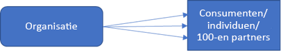

Wanneer een organisatie gestandaardiseerde gegevens en inzichten moet distribueren naar veel externe gebruikers/organisaties, kunnen ze het ad-hoc-of geplande delen van Power BI-apps-scenario gebruiken om snel en zonder uitgebreide ontwikkelings kosten een BI-portal te bouwen. Het proces voor het bouwen van een dergelijke Portal met behulp van een Power BI-app wordt behandeld in de casestudy: Een BI-portal bouwen met Power BI + Azure AD B2B – stapsgewijze instructies verderop in dit document.

Een gemeen schappelijke variant van dit geval is wanneer een organisatie probeert inzichten te delen met consumenten, met name wanneer u Azure B2C wilt gebruiken met Power BI. Power BI biedt geen systeem eigen ondersteuning voor Azure B2C. Als u de opties voor dit geval wilt evalueren, kunt u overwegen om alternatieve optie 2 te gebruiken in de algemene alternatieve benadering van de sectie verderop in dit document.

## Casestudy: Een BI-portal bouwen met Power BI + Azure AD B2B – stapsgewijze instructies

De integratie van Power BI met Azure AD B2B biedt contoso een naadloze, soepele manier om gast gebruikers beveiligde toegang te bieden tot hun BI-portal. Contoso kan dit in drie stappen instellen:

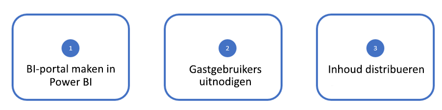

1. BI-portal maken in Power BI

    De eerste taak voor contoso is het maken van hun BI-portal in Power BI. De BI-portal van Contoso bestaat uit een verzameling doel ontwikkelde Dash boards en rapporten die beschikbaar worden gesteld aan veel interne en gast gebruikers. De aanbevolen manier om dit in Power BI te doen, is door een Power BI-app te bouwen. Meer informatie over [apps in Power bi](https://powerbi.microsoft.com/blog/distribute-to-large-audiences-with-power-bi-apps/).

- Het BI-team van Contoso maakt een app-werk ruimte in Power BI

    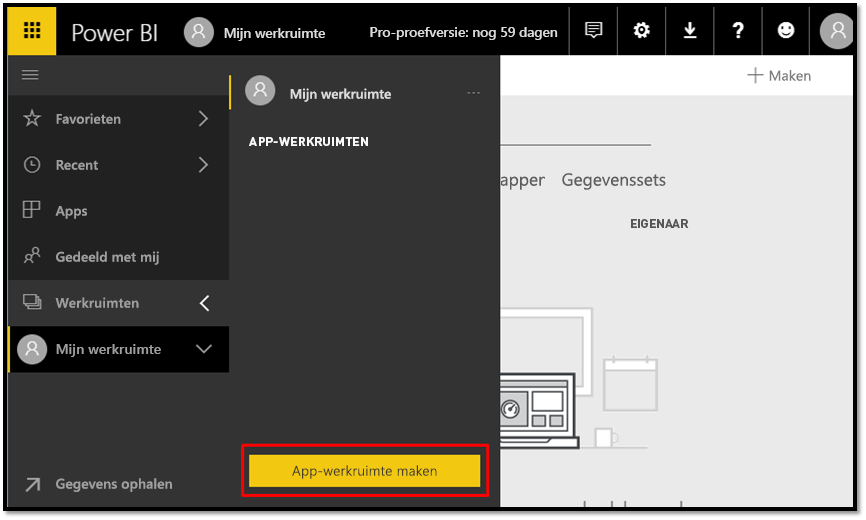
    

- Andere auteurs worden toegevoegd aan de werk ruimte

    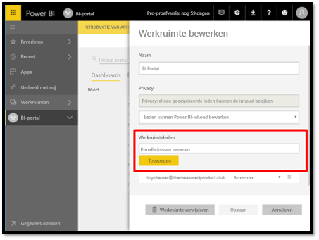

- Inhoud wordt gemaakt in de werk ruimte

    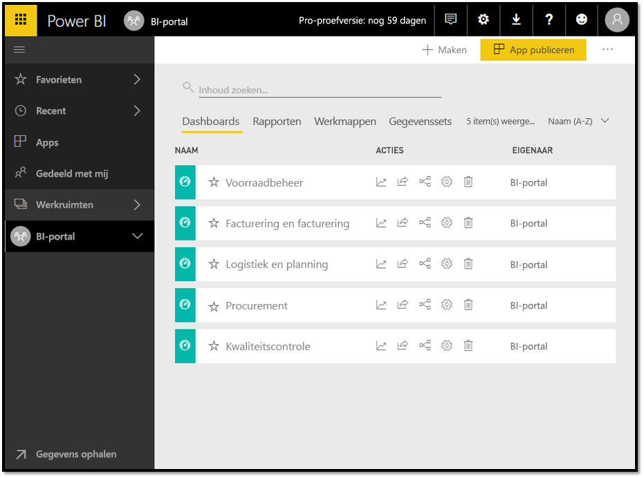

    Nu de inhoud is gemaakt in een app-werk ruimte, is contoso klaar om gast gebruikers in partner organisaties uit te nodigen om deze inhoud te gebruiken.

2. Gastgebruikers uitnodigen

    Er zijn twee manieren voor contoso om gast gebruikers uit te nodigen voor de BI-portal in Power BI:

    * Geplande uitnodigingen
    * Ad hoc-uitnodigingen

    **Geplande uitnodigingen**

    In deze benadering wordt Contoso de gast gebruikers van tevoren uitgenodigd voor Azure AD en vervolgens Power BI inhoud naar hen gedistribueerd. Contoso kan gast gebruikers uitnodigen vanuit het Azure Portal of met behulp van Power shell. Dit zijn de stappen om gast gebruikers uit te nodigen van de Azure Portal:

    - De Azure AD-beheerder van Contoso navigeert naar **Azure Portal > Azure Active Directory > gebruikers en groepen > alle gebruikers > nieuwe gast gebruiker**

    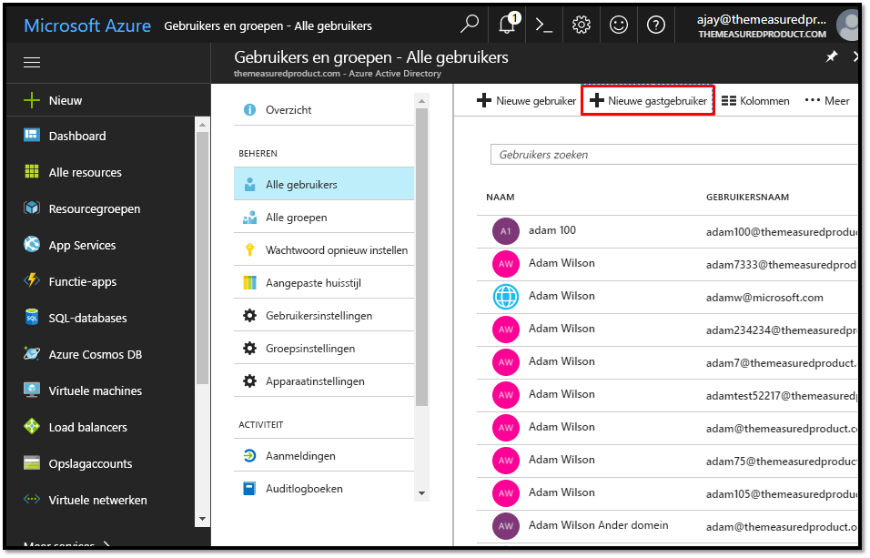

    - Voeg een uitnodigings bericht toe voor de gast gebruikers en klik op uitnodigen

    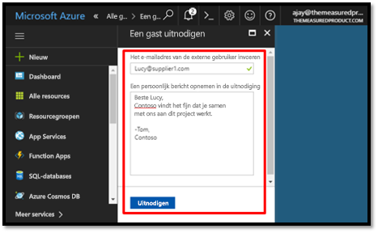

    > [!NOTE]
    > Als u gast gebruikers wilt uitnodigen vanuit de Azure Portal, moet u een beheerder zijn voor de Azure Active Directory van uw Tenant.

    Als contoso veel gast gebruikers wil uitnodigen, kunnen ze dit doen met behulp van Power shell. De Azure AD-beheerder van Contoso slaat de e-mail adressen van alle gast gebruikers op in een CSV-bestand. Hier vindt u [Azure Active Directory B2B-samenwerkings code en Power shell](https://docs.microsoft.com/azure/active-directory/b2b/code-samples) -voor beelden en instructies.

    Gast gebruikers ontvangen na de uitnodiging een e-mail met de uitnodiging.

    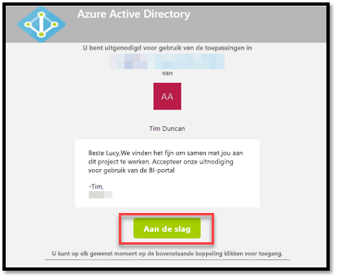

    Zodra de gast gebruikers op de koppeling klikken, hebben ze toegang tot inhoud in de contoso Azure AD-Tenant.

    > [!NOTE]
    > Het is mogelijk om de indeling van het e-mail bericht te wijzigen met behulp van de Azure AD-huismerk functie, zoals [hier](https://docs.microsoft.com/azure/active-directory/active-directory-b2b-invitation-email)wordt beschreven.

    **Ad hoc-uitnodigingen**

    Wat moet ik doen als contoso niet alle gast gebruikers kent die ze vooraf willen uitnodigen? Of wat als de analist in contoso die de BI-portal heeft gemaakt inhoud wil distribueren naar gast gebruikers? We ondersteunen dit scenario ook in Power BI met ad-hoc-uitnodigingen.

    De analist kan alleen de externe gebruikers toevoegen aan de toegangs lijst van de app wanneer deze worden gepubliceerd. De gast gebruikers krijgen een uitnodiging en zodra ze deze hebben geaccepteerd, worden ze automatisch omgeleid naar de Power BI-inhoud.

    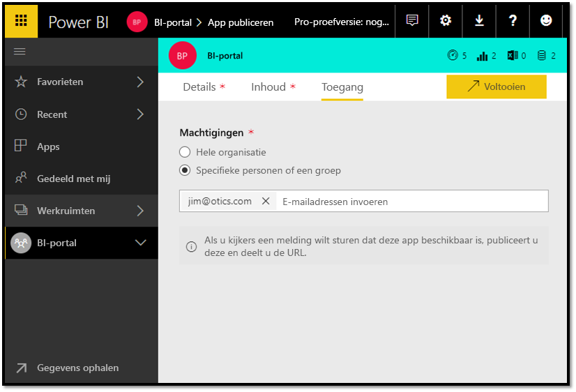

    > [!NOTE]
    > Uitnodigingen zijn alleen vereist voor de eerste keer dat een externe gebruiker wordt uitgenodigd voor uw organisatie.

3. Inhoud distribueren

    Nu het BI-team van Contoso de BI-portal heeft gemaakt en gast gebruikers heeft uitgenodigd, kunnen ze hun portal naar hun eind gebruikers distribueren door gast gebruikers toegang te geven tot de app en deze te publiceren. Power BI automatisch de namen van gast gebruikers die eerder zijn toegevoegd aan de contoso-Tenant. Ad hoc-uitnodigingen voor andere gast gebruikers kunnen op dit moment ook worden toegevoegd.

    > [!NOTE]
    > Als u beveiligings groepen gebruikt voor het beheren van de toegang tot de app voor externe gebruikers, gebruikt u de geplande methode voor uitnodigingen en deelt u de app-koppeling rechtstreeks met elke externe gebruiker die er toegang toe moet hebben. Anders is het mogelijk dat de externe gebruiker inhoud niet kan installeren of weer geven in de app. _

    Gast gebruikers krijgen een e-mail met een koppeling naar de app.

    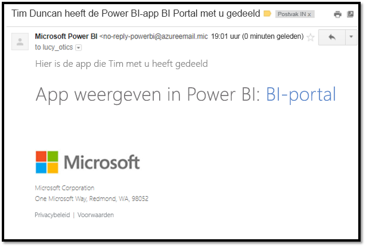

    Wanneer u op deze koppeling klikt, wordt gast gebruikers gevraagd zich te verifiëren met de identiteit van hun eigen organisatie.

    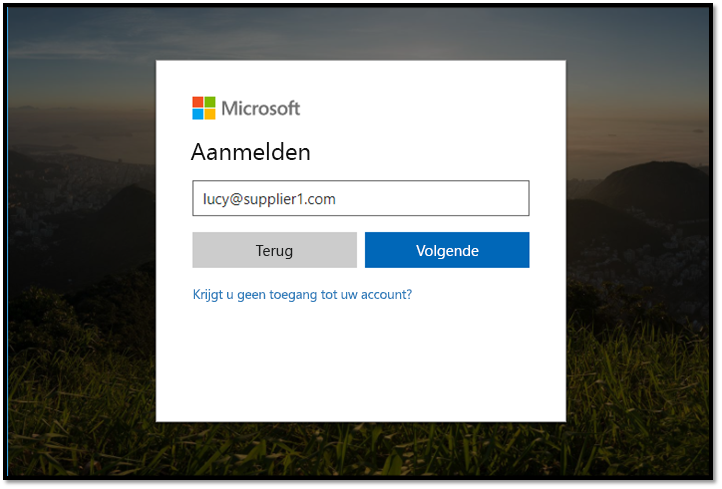

    Zodra ze zijn geverifieerd, worden ze omgeleid naar de BI-app van contoso.

    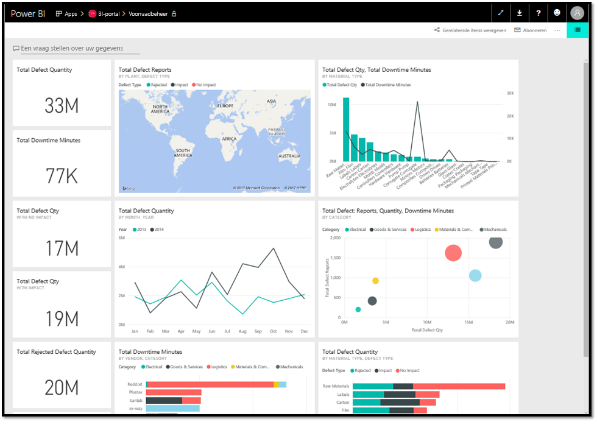

    Gast gebruikers kunnen vervolgens naar de app van Contoso gaan door te klikken op de koppeling in de e-mail of blad wijzers de koppeling. Contoso kan het ook eenvoudiger maken voor gast gebruikers door deze koppeling toe te voegen aan een bestaande extranet portal die al door de gast gebruikers wordt gebruikt.

4. Volgende stappen

    Met behulp van een Power BI-app en Azure AD B2B konden contoso snel een BI-portal voor haar leveranciers maken op een manier zonder code. Dit vereenvoudigt het distribueren van gestandaardiseerde analyses naar alle leveranciers die er behoefte aan hebben.

    In het voor beeld ziet u hoe een enkel algemeen rapport kan worden gedistribueerd tussen leveranciers, Power BI kunnen nog veel meer. Om ervoor te zorgen dat elke partner alleen gegevens ziet die relevant zijn voor zichzelf, kan beveiliging op rijniveau eenvoudig worden toegevoegd aan het rapport en het gegevens model. In het gedeelte gegevens beveiliging voor externe partners verderop in dit document wordt dit proces in details beschreven.

    Vaak moeten afzonderlijke rapporten en dash boards worden inge sloten in een bestaande portal. Dit kan ook worden gedaan door gebruik te maken van veel van de technieken die in het voor beeld worden weer gegeven. In dergelijke situaties is het echter gemakkelijker om rapporten of Dash boards rechtstreeks vanuit een werk ruimte in te sluiten. Het proces voor het uitnodigen en toewijzen van beveiligings machtigingen aan de gebruikers van het vereiste niveau blijven hetzelfde.

## Onder de motorkap: Hoe kan Lucy van Supplier1 toegang krijgen tot Power BI inhoud van de Tenant van contoso?

Nu we hebben gezien hoe contoso Power BI inhoud naadloos kan distribueren naar gast gebruikers in partner organisaties, gaan we kijken hoe dit werkt op de schermen.

Wanneer contoso is [lucy@supplier1.com](mailto:lucy@supplier1.com) uitgenodigd voor de Directory, maakt Azure AD een koppeling [Lucy@supplier1.com](mailto:Lucy@supplier1.com) tussen en de contoso Azure AD-Tenant. Met deze koppeling kan Azure AD weten Lucy@supplier1.com dat toegang kan krijgen tot inhoud in de contoso-Tenant.

Wanneer Lucy probeert toegang te krijgen tot de Power BI-app van contoso, controleert Azure AD of Lucy toegang heeft tot de contoso-Tenant en geeft Power BI een token op dat aangeeft dat Lucy is geverifieerd voor toegang tot inhoud in de contoso-Tenant. Power BI gebruikt dit token om toestemming te geven en ervoor te zorgen dat Lucy toegang heeft tot de Power BI-app van contoso.

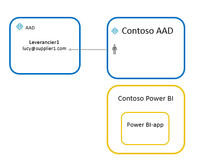

De integratie van Power BI met Azure AD B2B werkt met alle zakelijke e-mail adressen. Als de gebruiker geen Azure AD-identiteit heeft, kan deze worden gevraagd om er een te maken. De volgende afbeelding toont de gedetailleerde stroom:

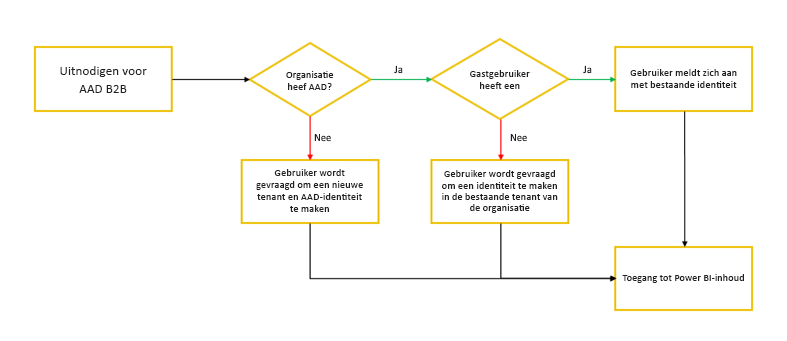

Het is belang rijk om te herkennen dat het Azure AD-account wordt gebruikt of wordt gemaakt in de Azure AD van de externe partij, waardoor het mogelijk is dat Lucy een eigen gebruikers naam en wacht woord gebruikt en dat de referenties automatisch worden gestopt in andere tenants wanneer Lucy verlaat het bedrijf wanneer hun organisatie ook gebruikmaakt van Azure AD.

## Licentieverlening

Contoso kan een van de drie benaderingen kiezen om gast gebruikers van haar leveranciers en partner organisaties toegang te geven tot Power BIe inhoud.

> [!NOTE]
> _De gratis laag van Azure AD B2B's is voldoende om Power BI te gebruiken met Azure AD B2B. Voor sommige geavanceerde functies van Azure AD B2B, zoals dynamische groepen, zijn extra licenties vereist. Raadpleeg de Azure AD B2B-documentatie voor aanvullende informatie:_ [ _https://docs.microsoft.com/azure/active-directory/b2b/licensing-guidance_ ](https://docs.microsoft.com/azure/active-directory/b2b/licensing-guidance)

### Benadering 1: Contoso maakt gebruik van Power BI Premium

Met deze methode koopt contoso Power BI Premium capaciteit en wijst hij de inhoud van de BI-portal toe aan deze capaciteit. Hierdoor kunnen gast gebruikers van partner organisaties toegang krijgen tot de Power BI-app van Contoso zonder enige Power BI licentie.

Externe gebruikers zijn ook onderhevig aan het verbruik dat alleen wordt aangeboden aan ' gratis ' gebruikers in Power BI bij het gebruiken van inhoud in Power BI Premium.

Contoso kan ook profiteren van andere Power BI Premium-mogelijkheden voor de apps zoals verhoogde vernieuwings frequenties, toegewezen capaciteit en grote model grootten.

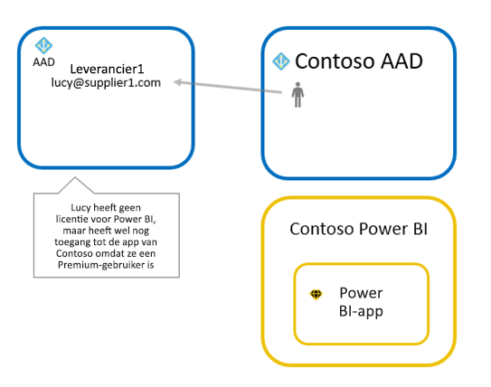

### Benadering 2: Contoso wijst Power BI Pro-licenties toe aan gast gebruikers

Met deze methode wijst contoso Pro-licenties toe aan gast gebruikers van partner organisaties. Dit kan worden gedaan vanuit het Microsoft 365-beheer centrum van contoso. Hierdoor kunnen gast gebruikers van partner organisaties toegang krijgen tot de Power BI-app van Contoso zonder een licentie zelf te hoeven kopen. Dit kan geschikt zijn voor delen met externe gebruikers waarvan de organisatie nog geen Power BI heeft aangenomen.

> [!NOTE]
> _De Pro-licentie van Contoso is alleen van toepassing op gast gebruikers wanneer ze toegang hebben tot inhoud in de contoso-Tenant. Pro-licenties bieden toegang tot inhoud die zich niet in een Power BI Premium capaciteit bevindt. Externe gebruikers met een Pro-licentie worden echter standaard beperkt tot een alleen-lezen ervaring. Dit kan worden gewijzigd met behulp van de methode die_ wordt beschreven in de sectie _externe gebruikers inschakelen om inhoud te bewerken en te beheren in Power bi_ _verderop in dit document._

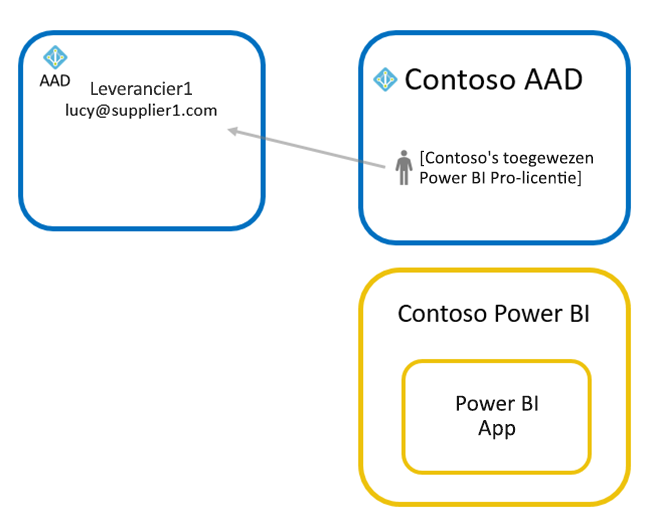

### Benadering 3: Gast gebruikers nemen hun eigen Power BI Pro licentie

Met deze methode wijst leverancier 1 een Power BI Pro licentie toe aan Lucy. Ze kunnen vervolgens toegang krijgen tot de app van Contoso Power BI met deze licentie. Omdat Lucy de Pro-licentie van hun eigen organisatie kan gebruiken bij het openen van een externe Power BI omgeving, wordt deze aanpak soms ook wel _uw eigen licentie_ (BYOL) genoemd. Als beide organisaties Power BI gebruiken, biedt dit voordelige licentie verlening voor de algemene analyse oplossing en minimaliseert de overhead van het toewijzen van licenties aan externe gebruikers.

> [!NOTE]
> _De Pro-licentie die is gegeven aan Lucy door leverancier 1 is van toepassing op elke Power BI Tenant waarbij Lucy een gast gebruiker is. Pro-licenties bieden toegang tot inhoud die zich niet in een Power BI Premium capaciteit bevindt. Externe gebruikers met een Pro-licentie worden echter standaard beperkt tot een alleen-lezen ervaring. Dit kan worden gewijzigd met behulp van de methode die_ wordt beschreven in de sectie _externe gebruikers inschakelen om inhoud te bewerken en te beheren in Power bi_ _verderop in dit document._

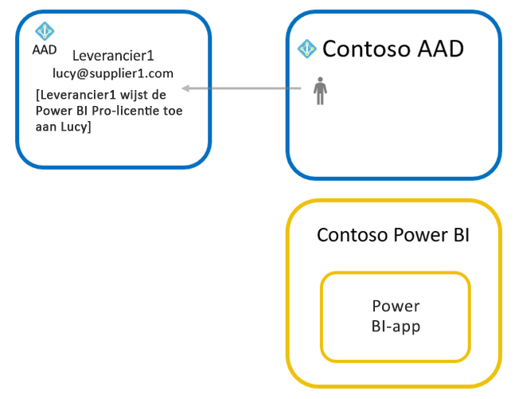

## Gegevens beveiliging voor externe partners

Bij het werken met meerdere externe leveranciers moet Contoso er zeker van zijn dat elke leverancier alleen gegevens over zijn eigen producten ziet. Beveiliging op basis van gebruikers en dynamische rijniveau maken dit eenvoudig met Power BI.

### Beveiliging op basis van gebruikers

Een van de krach tigste functies van Power BI is beveiliging op rijniveau. Met deze functie kan contoso één rapport en gegevensset maken, maar nog steeds verschillende beveiligings regels Toep assen voor elke gebruiker. Zie [beveiliging op rijniveau](https://powerbi.microsoft.com/documentation/powerbi-admin-rls/)voor een uitgebreidere uitleg.

Dankzij de integratie van Power BI met Azure AD B2B kan contoso beveiligings regels op rijniveau toewijzen aan gast gebruikers zodra ze worden uitgenodigd voor de contoso-Tenant. Zoals we eerder hebben gezien, kunnen contoso gast gebruikers toevoegen via geplande of ad-hoc uitnodigingen. Als contoso beveiliging op rijniveau wil afdwingen, wordt het ten zeerste aangeraden geplande uitnodigingen te gebruiken om de gast gebruikers vooraf toe te voegen en ze toe te wijzen aan de beveiligings rollen voordat ze de inhoud delen. Als contoso gebruikmaakt van ad hoc-uitnodigingen, is er mogelijk een korte periode waarin de gast gebruikers geen gegevens kunnen zien.

> [!NOTE]
> Deze vertraging bij het openen van gegevens die worden beveiligd door beveiliging op rijniveau bij gebruik van ad-hoc-uitnodigingen, kunnen leiden tot het ondersteunen van aanvragen voor uw IT-team omdat gebruikers lege of niet-werkende rapporten/Dash boards zien wanneer ze een koppeling voor delen openen in de e-mail die ze ontvangen. Daarom wordt het ten zeerste aanbevolen om geplande uitnodigingen in dit scenario te gebruiken. * *

Laten we dit eens door lopen met een voor beeld.

Zoals eerder vermeld, heeft Contoso leveranciers over de hele wereld en willen ze er zeker van zijn dat de gebruikers van hun leveranciers organisaties inzichten krijgen van gegevens van alleen hun grond gebied.  Maar gebruikers van Contoso hebben toegang tot alle gegevens. In plaats van verschillende verschillende rapporten te maken, maakt contoso een enkel rapport en worden de gegevens gefilterd op basis van de gebruiker die deze weergeeft.

Om ervoor te zorgen dat contoso gegevens kan filteren op basis van wie verbinding maakt, worden er twee rollen gemaakt in Power BI bureau blad. Een voor het filteren van alle gegevens van de SalesTerritory "Europa" en een andere voor "Noord-Amerika".

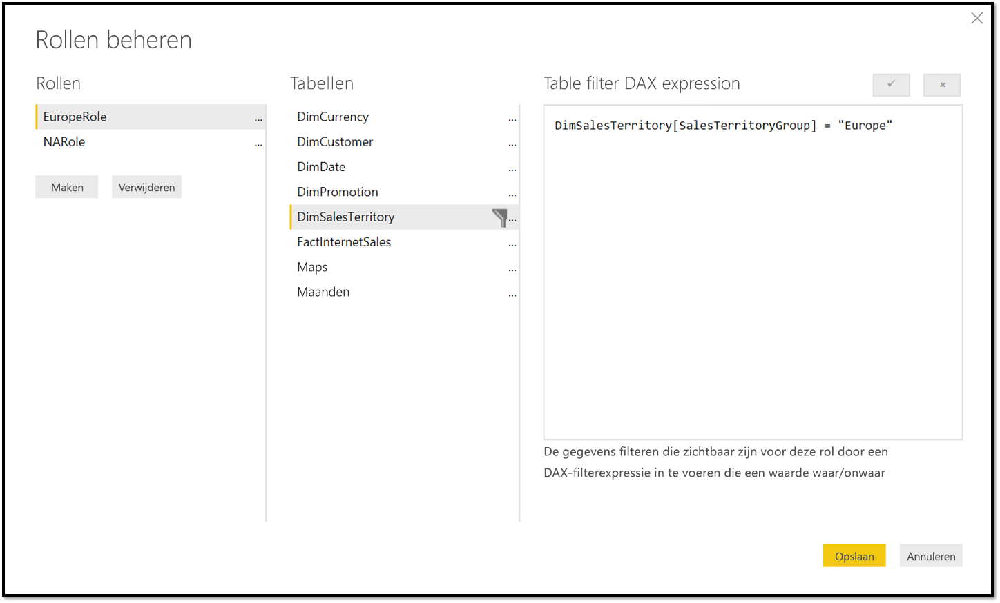

Wanneer rollen in het rapport worden gedefinieerd, moet een gebruiker aan een specifieke rol worden toegewezen om toegang te krijgen tot gegevens. De toewijzing van rollen gebeurt in de Power BI-service ( **gegevens sets > beveiliging** )

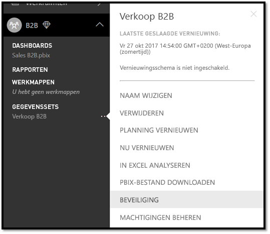

Hiermee opent u een pagina waar het BI-team van Contoso de twee rollen kan zien die ze hebben gemaakt.  Nu kan het BI-team van Contoso gebruikers aan de rollen toewijzen.

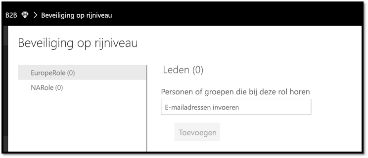

In het voor beeld voegt contoso een gebruiker toe aan een partner organisatie met het e[adam@themeasuredproduct.com](mailto:adam@themeasuredproduct.com)-mail adres "" aan de rol Europa:

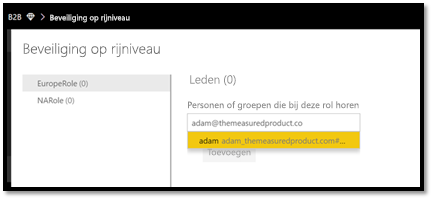

Als dit probleem wordt opgelost door Azure AD, kan Contoso de naam zien in het venster dat kan worden toegevoegd:

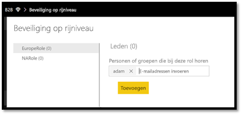

Wanneer deze gebruiker nu de app opent die ermee is gedeeld, wordt alleen een rapport met gegevens uit Europa weer gegeven:

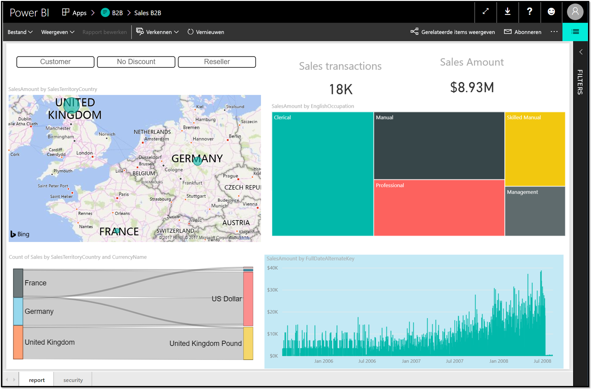

### Beveiliging op dynamische rijniveau

Een ander interessant onderwerp is om te zien hoe Dynamic beveiliging op RIJNIVEAU werkt met Azure AD B2B.

Kortom, dynamische beveiliging op rijniveau werkt door gegevens in het model te filteren op basis van de gebruikers naam van de persoon die verbinding maakt met Power BI. In plaats van meerdere rollen voor groepen gebruikers toe te voegen, definieert u de gebruikers in het model. Het patroon wordt hier niet uitvoerig beschreven. Kasper de Jong biedt een gedetailleerde schrijf bewerking voor alle soorten beveiliging op rijniveau in [Power bi Desktop blad Dynamic Security Cheat](https://www.kasperonbi.com/power-bi-desktop-dynamic-security-cheat-sheet/), en in [dit technisch](https://msdn.microsoft.com/library/jj127437.aspx) document.

Laten we eens kijken naar een klein voor beeld. contoso heeft een eenvoudig rapport over de verkoop per groep:

Dit rapport moet nu worden gedeeld met twee gast gebruikers en een interne gebruiker: de interne gebruiker kan alles zien, maar de gast gebruikers kunnen alleen de groepen bekijken waartoe ze toegang hebben. Dit betekent dat de gegevens alleen voor de gast gebruikers moeten worden gefilterd. Om de gegevens op de juiste wijze te filteren, gebruikt contoso het dynamische beveiliging op rijniveau zoals beschreven in het White Paper-en blog bericht. Dit betekent dat Contoso de gebruikers namen toevoegt aan de gegevens zelf:

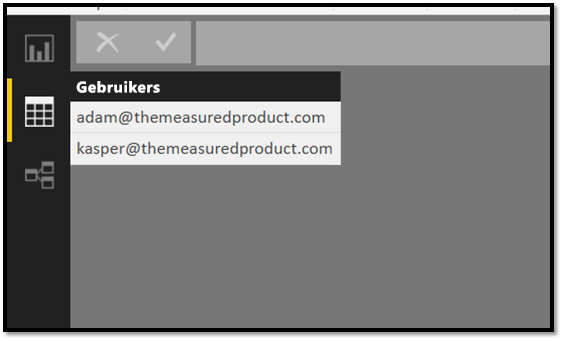

Contoso maakt vervolgens het juiste gegevens model waarmee de gegevens op de juiste wijze worden gefilterd met de juiste relaties:

Als u wilt dat de gegevens automatisch worden gefilterd op basis van wie is aangemeld, moet contoso een rol maken die wordt door gegeven aan de gebruiker die verbinding maakt. In dit geval maakt contoso twee rollen: de eerste is de ' securityrole ' waarmee de tabel gebruikers wordt gefilterd met de huidige gebruikers naam van de gebruiker die is aangemeld bij Power BI (dit werkt zelfs voor Azure AD B2B gast-gebruikers).

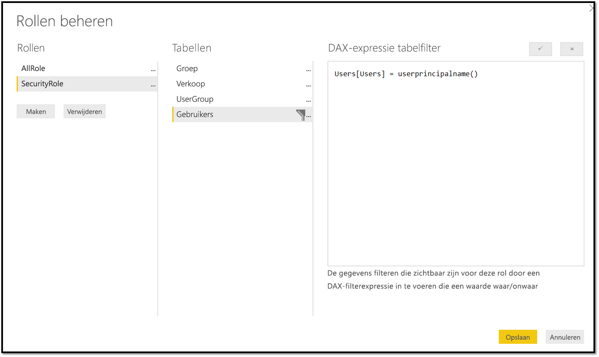

Contoso maakt ook een andere "AllRole" voor de interne gebruikers die alles kunnen zien: deze rol heeft geen beveiligings predicaat.

Nadat het Power BI bureau blad-bestand naar de service is geüpload, kan contoso gast gebruikers aan de "SecurityRole" en interne gebruikers toewijzen aan de "AllRole"

Wanneer de gast gebruikers het rapport openen, zien ze nu alleen de verkoop van groep A:

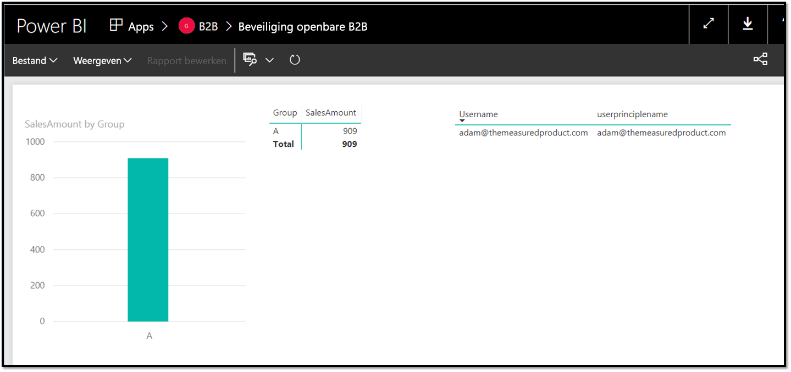

In de matrix aan de rechter kant ziet u het resultaat van de functie USERNAME () en USERPRINCIPALNAME () om het e-mail adres van de gast gebruikers te retour neren.

De interne gebruiker krijgt nu de volgende gegevens te zien:

Zoals u kunt zien, werkt dynamische beveiliging op rijniveau met zowel interne als gast gebruikers.

> [!NOTE]
> Dit scenario werkt ook wanneer u een model gebruikt in Azure Analysis Services. Normaal gesp roken is uw Azure Analysis-Service verbonden met dezelfde Azure AD als uw Power BI. in dat geval kent Azure Analysis Services ook de gast gebruikers die zijn uitgenodigd via Azure AD B2B.

## Verbinding maken met on-premises gegevens bronnen

Power BI biedt de mogelijkheid van Contoso om gebruik te maken van on-premises gegevens bronnen, zoals [SQL Server Analysis Services](https://powerbi.microsoft.com/documentation/powerbi-gateway-enterprise-manage-ssas/) of [SQL Server](https://powerbi.microsoft.com/documentation/powerbi-gateway-kerberos-for-sso-pbi-to-on-premises-data/) direct dankzij de [on-premises gegevens gateway](https://powerbi.microsoft.com/documentation/powerbi-gateway-onprem/). Het is zelfs mogelijk om u aan te melden bij deze gegevens bronnen met dezelfde referenties als voor Power BI.

> [!NOTE]
> Wanneer u een gateway installeert om verbinding te maken met uw Power BI-Tenant, moet u een gebruiker gebruiken die in uw Tenant is gemaakt. Externe gebruikers kunnen geen gateway installeren en verbinden met uw Tenant. _

Voor externe gebruikers kan dit ingewik kelder zijn omdat de externe gebruikers doorgaans niet bekend zijn bij de on-premises AD. Power BI biedt een tijdelijke oplossing waarmee contoso-beheerders de externe gebruikers namen kunnen toewijzen aan interne gebruikers namen, zoals wordt beschreven in [uw gegevens bron beheren-Analysis Services](https://powerbi.microsoft.com/documentation/powerbi-gateway-enterprise-manage-ssas/). [lucy@supplier1.com](mailto:lucy@supplier1.com) Kan bijvoorbeeld worden toegewezen aan [Lucy\_supplier1\_comEXT@contoso.com#](mailto:lucy_supplier1_com).

Deze methode is nauw keurig als contoso alleen een aantal gebruikers heeft of als contoso alle externe gebruikers aan één intern account kan toewijzen. Voor complexere scenario's waarbij elke gebruiker hun eigen referenties nodig heeft, is er een geavanceerdere benadering waarbij [aangepaste AD-kenmerken](https://technet.microsoft.com/library/cc961737.aspx) worden gebruikt om de toewijzing uit te voeren zoals beschreven in [uw gegevens bron beheren-Analysis Services](https://powerbi.microsoft.com/documentation/powerbi-gateway-enterprise-manage-ssas/). Hierdoor kan de Contoso-beheerder een toewijzing definiëren voor elke gebruiker in uw Azure AD (ook externe B2B-gebruikers).  Deze kenmerken kunnen worden ingesteld via het AD-object model met behulp van scripts of code, zodat Contoso de toewijzing van de uitnodiging of een geplande uitgebracht volledig kan automatiseren.

## Externe gebruikers in staat stellen om inhoud te bewerken en te beheren in Power BI

Contoso kan toestaan dat externe gebruikers inhoud in de organisatie bijdragen zoals eerder is beschreven in de cross-organisatie bewerking en het beheer van Power BI inhouds sectie.

> [!NOTE]
> Als u inhoud wilt bewerken en beheren binnen de Power BI van uw organisatie, moet de gebruiker een Power BI Pro licentie hebben in een andere werk ruimte dan mijn werk ruimte. Gebruikers kunnen Pro-licenties verkrijgen, zoals wordt beschreven in the_ _Licensing__section van dit document._

De Power BI-beheer Portal biedt de **mogelijkheid externe gast gebruikers toe te staan om inhoud te bewerken en te beheren in de organisatie-** instelling in Tenant instellingen. De instelling is standaard ingesteld op uitgeschakeld, wat betekent dat externe gebruikers standaard een beperkte alleen-lezen ervaring krijgen. De instelling is van toepassing op gebruikers met User type ingesteld op gast in azure AD. In de volgende tabel wordt beschreven hoe gebruikers zich kunnen aanmelden, afhankelijk van hun User type en hoe de instellingen worden geconfigureerd.

| **Gebruikers type in azure AD** | **Externe gast gebruikers toestaan om inhoud te bewerken en te beheren** | **Tabtoets** |
| --- | --- | --- |
| Gast | Uitgeschakeld voor de gebruiker (standaard) | Alleen weer gave per artikel verbruik. Hiermee staat u alleen-lezen toegang toe voor rapporten, Dash boards en apps wanneer deze worden bekeken via een URL die naar de gast gebruiker wordt verzonden. Power BI-Mobiel-apps bieden een alleen-lezen weer gave voor de gast gebruiker. |
| Gast | Ingeschakeld voor de gebruiker | De externe gebruiker krijgt toegang tot de volledige Power BI-ervaring, maar sommige functies zijn niet beschikbaar. De externe gebruiker moet zich aanmelden bij Power BI met behulp van de Power BI service-URL met de informatie over de Tenant. De gebruiker krijgt de Home-ervaring, een mijn werk ruimte en op basis van machtigingen kan inhoud bladeren, bekijken en maken.    Power BI-Mobiel-apps bieden een alleen-lezen weer gave voor de gast gebruiker. |

> [!NOTE]
> Externe gebruikers in azure AD kunnen ook worden ingesteld op User type-lid. Dit wordt momenteel niet ondersteund in Power BI.

In de Power BI-beheer portal wordt de instelling weer gegeven in de volgende afbeelding.

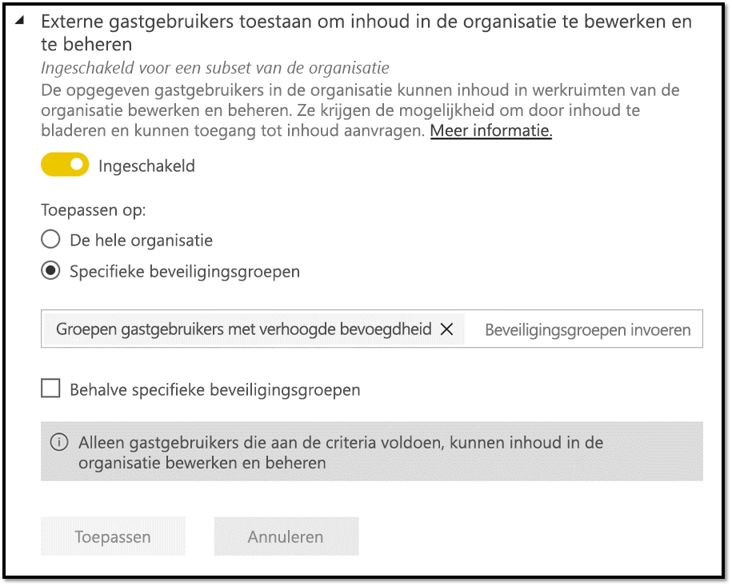

Gast gebruikers krijgen de alleen-lezen standaard ervaring en kunnen inhoud bewerken en beheren. De standaard instelling is uitgeschakeld, wat betekent dat alle gast gebruikers de alleen-lezen ervaring hebben. De Power BI-beheerder kunnen de instelling inschakelen voor alle gast gebruikers in de organisatie of voor specifieke beveiligings groepen die in azure AD zijn gedefinieerd. In de volgende afbeelding heeft Contoso Power BI-beheerder een beveiligings groep gemaakt in azure AD om te beheren welke externe gebruikers inhoud in de contoso-Tenant kunnen bewerken en beheren.

Als u deze gebruikers wilt helpen bij het aanmelden bij Power BI, geeft u de URL van de Tenant. Volg deze stap om de tenant-URL te zoeken.

1. Selecteer in de Power BI-service in het bovenste menu Help ( **?** ) vervolgens **over Power bi**.
2. Zoek naar de waarde naast **Tenant-URL**. Dit is de Tenant-URL die u met uw gast gebruikers kunt delen.

    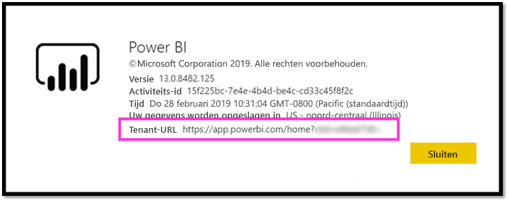

Wanneer u de externe gast gebruikers toestaan om inhoud in de organisatie te bewerken en te beheren, krijgen de opgegeven gast gebruikers toegang tot de Power BI van uw organisatie en kunnen ze alle inhoud zien waarvoor ze machtigingen hebben. Ze hebben toegang tot de start pagina, bladeren en bijdragen aan de-werk ruimten, apps installeren waar ze zich bevinden in de lijst met toegang en een mijn werk ruimte hebben. Ze kunnen een beheerder maken of zijn voor werkruimten waarvoor de nieuwe werkruimte-ervaring wordt gebruikt.

> [!NOTE]
> Wanneer u deze optie gebruikt, moet u ervoor zorgen dat u de sectie beheer van dit document bekijkt, omdat gast gebruikers met de standaard instellingen van Azure AD geen gebruik kunnen maken van bepaalde functies, zoals mensen kiezers, waarmee kan worden gereduceerd. * *

Voor gast gebruikers die zijn ingeschakeld via de instelling externe gast gebruikers toestaan om inhoud te bewerken en te beheren in de Tenant instellingen van de organisatie, zijn sommige functies niet beschikbaar. Als u rapporten wilt bijwerken of publiceren, moeten gast gebruikers gebruikmaken van de Power BI-service-webgebruikersinterface, met inbegrip van gegevens ophalen om Power BI Desktop bestanden te uploaden. De volgende ervaringen worden niet ondersteund:

- Rechtstreeks publiceren van Power BI Desktop naar de Power BI-service
- Gastgebruikers kunnen geen gebruikmaken van Power BI Desktop om verbinding te maken met servicegegevenssets in de Power BI-service
- Klassieke werkruimten die aan Office 365-groepen zijn gekoppeld: Gastgebruikers kunnen geen beheerders van deze werkruimten maken of zijn. Ze kunnen alleen leden zijn.
- Ad-hocuitnodigingen verzenden wordt niet ondersteund voor toegangslijsten van werkruimten
- Power BI Publisher voor Excel wordt niet ondersteund voor gastgebruikers
- Gastgebruikers kunnen geen Power BI Gateway installeren of deze aan uw organisatie koppelen
- Gastgebruikers kunnen geen apps installeren en naar de hele organisatie publiceren
- Gastgebruikers kunnen geen organisatie-inhoudspakketten gebruiken, maken, bijwerken of installeren
- Gastgebruikers kunnen niet analyseren in Excel
- Gast gebruikers kunnen zich @mentioned niet in opmerkingen begeven (deze functionaliteit wordt toegevoegd in een aanstaande versie)
- Gast gebruikers kunnen abonnementen niet gebruiken (deze functionaliteit wordt toegevoegd in een aanstaande versie)
- Gastgebruikers die deze mogelijkheid gebruiken, moeten over een werk- of schoolaccount beschikken. Gast gebruikers die persoonlijke accounts gebruiken, ondervinden meer beperkingen vanwege aanmeldings beperkingen.

## Governance

### Aanvullende Azure AD-instellingen die van invloed zijn op de ervaring in Power BI met betrekking tot Azure AD B2B

Wanneer u Azure AD B2B-delen gebruikt, beheert de Azure Active Directory-beheerder aspecten van de ervaring van de externe gebruiker. Deze worden beheerd op de pagina instellingen voor externe samen werking binnen de Azure Active Directory instellingen voor uw Tenant.

Meer informatie over de instellingen kunt u vinden op:

[https://docs.microsoft.com/azure/active-directory/b2b/delegate-invitations](https://docs.microsoft.com/azure/active-directory/b2b/delegate-invitations)

> [!NOTE]
> De machtigingen van de gast gebruikers zijn standaard ingesteld op Ja, dus gast gebruikers in Power BI hebben een beperkte ervaring met betrekking tot het delen van bestanden waarbij de keuze van personen kiezen UIs niet voor die gebruikers werken. Het is belang rijk dat u werkt met uw Azure AD-beheerder om deze in te stellen op Nee, zoals hieronder wordt weer gegeven om te zorgen voor een goede ervaring. * *

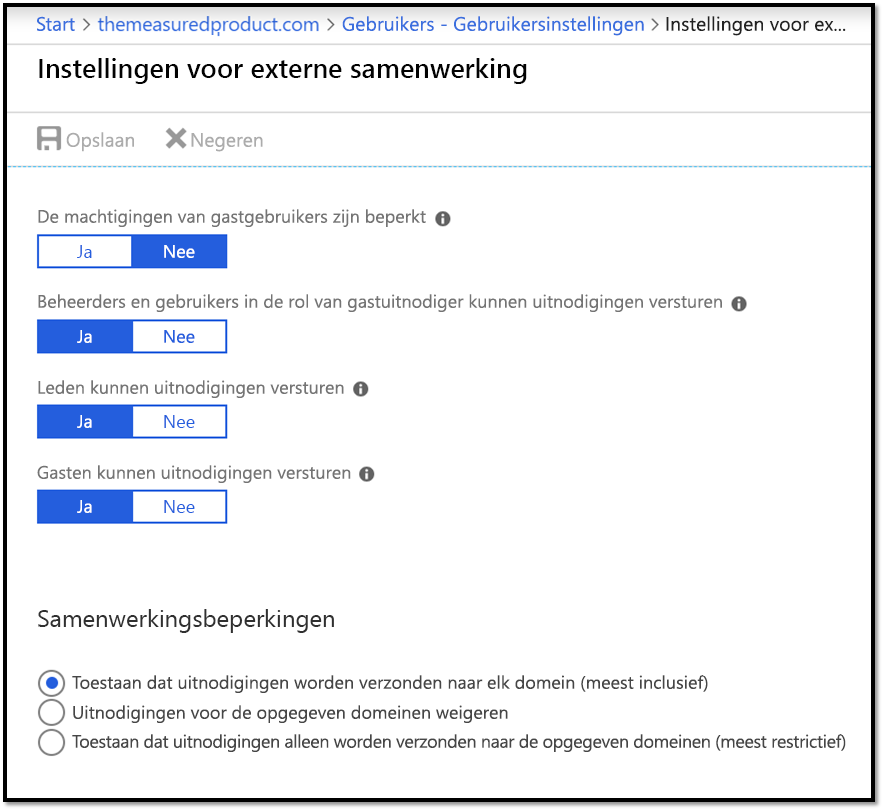

### Bezoekers verzoeken controleren

Power BI-beheerders kunnen extern delen voor Power BI beheren door de Power BI beheer portal te bezoeken. Tenant beheerders kunnen ook extern delen beheren met verschillende Azure AD-beleids regels.  Met deze beleids regels kunnen Tenant beheerders

- Uitnodigingen uitschakelen door eind gebruikers
- Alleen beheerders en gebruikers in de rol van de gast-uitnodiging kunnen uitnodigen
- Beheerders, de rol van de gast-uitnodiging en leden kunnen uitnodigen
- Alle gebruikers, inclusief gasten, kunnen uitnodigen

Meer informatie over deze beleids regels vindt u in [gemachtigde uitnodigingen voor Azure Active Directory B2B-samen werking](https://docs.microsoft.com/azure/active-directory/active-directory-b2b-delegate-invitations).

Alle Power BI acties door externe gebruikers worden ook [gecontroleerd in onze controle Portal](https://powerbi.microsoft.com/documentation/powerbi-admin-auditing/).

### Beleid voor voorwaardelijke toegang voor gast gebruikers

Contoso kan beleid voor voorwaardelijke toegang afdwingen voor gast gebruikers die toegang hebben tot inhoud van de contoso-Tenant. Gedetailleerde instructies vindt u in [voorwaardelijke toegang voor B2B-samenwerkings gebruikers](https://docs.microsoft.com/azure/active-directory/active-directory-b2b-mfa-instructions).

## Algemene alternatieve benaderingen

Azure AD B2B maakt het eenvoudig om gegevens en rapporten te delen tussen organisaties, maar er zijn verschillende andere benaderingen die vaak worden gebruikt en die in bepaalde gevallen kunnen worden toegepast.

### Alternatieve optie 1: Dubbele identiteiten maken voor partner gebruikers

Met deze optie moest contoso hand matig dubbele identiteiten maken voor elke partner gebruiker in de contoso-Tenant, zoals wordt weer gegeven in de volgende afbeelding. In Power BI kan contoso met de toegewezen identiteiten de juiste rapporten, Dash boards of apps delen.

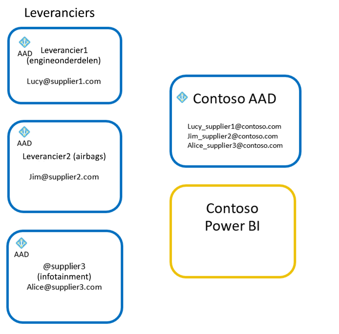

Redenen voor het kiezen van dit alternatief:

- Omdat de identiteit van de gebruiker wordt beheerd door uw organisatie, zijn alle gerelateerde services, zoals e-mail, share point, enzovoort, ook binnen het beheer van uw organisatie. Uw IT-beheerders kunnen wacht woorden opnieuw instellen, toegang tot accounts of controle activiteiten in deze services uitschakelen.
- Gebruikers die persoonlijke accounts voor hun bedrijf gebruiken, hebben vaak geen toegang tot bepaalde services, dus hiervoor hebt u mogelijk een organisatie-account nodig.
- Sommige services werken alleen voor de gebruikers van uw organisatie. Het gebruik van intune voor het beheren van inhoud op de persoonlijke/mobiele apparaten van externe gebruikers met Azure B2B is mogelijk niet mogelijk.

Redenen om dit alternatief niet te kiezen:

- Gebruikers van partner organisaties moeten twee sets met referenties onthouden: één om toegang te krijgen tot inhoud van hun eigen organisatie en de andere om toegang te krijgen tot inhoud van contoso. Dit is een gedoe voor deze gast gebruikers en veel gast gebruikers worden verward door deze ervaring.
- Contoso moet licenties voor gebruikers per gebruiker kopen en toewijzen aan deze gebruikers. Als een gebruiker e-mail berichten moet ontvangen of Office-toepassingen moet gebruiken, hebben ze de juiste licenties nodig, met inbegrip van Power BI Pro om inhoud te bewerken en te delen in Power BI.
- Contoso wil mogelijk strengere autorisatie-en beheer beleid afdwingen voor externe gebruikers in vergelijking met interne gebruikers. Om dit te doen, moet contoso een interne nomenclatuur maken voor externe gebruikers en moeten alle contoso-gebruikers worden getraind over deze nomenclatuur.
- Wanneer de gebruiker de organisatie verlaat, blijven ze toegang tot de resources van Contoso totdat de Contoso-beheerder hun account hand matig verwijdert.
- Contoso-beheerders moeten de identiteit van de gast beheren, met inbegrip van het maken, het opnieuw instellen van wacht woorden, enzovoort.

### Alternatieve optie 2: Een aangepaste Power BI Embedded-toepassing maken met aangepaste verificatie

Een andere optie voor contoso is het maken van een eigen aangepaste embedded Power BI toepassing met aangepaste verificatie ([' app is eigenaar van gegevens '](https://docs.microsoft.com/power-bi/developer/embed-sample-for-customers)). Veel organisaties hebben geen tijd of bronnen om een aangepaste toepassing te maken om Power BI inhoud naar hun externe partners te distribueren, maar dit is de beste benadering en verdient een ernstige overweging.

Organisaties hebben vaak bestaande partner portals die de toegang tot alle bronnen van de organisatie voor partners centraliseren, isolatie bieden van interne organisatie bronnen en gestroomlijnde ervaringen bieden zodat partners veel partners kunnen ondersteunen en hun individuele gebruikers.

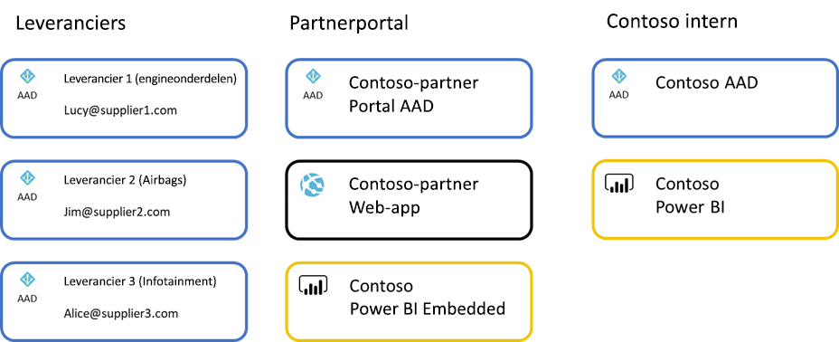

In het bovenstaande voor beeld melden gebruikers van elke leverancier zich aan bij de partner portal van Contoso die gebruikmaakt van AAD als een id-provider. Dit kan gebruikmaken van AAD B2B, Azure B2C, native Identities of met een wille keurig aantal andere id-providers. De gebruiker meldt zich aan en opent een partner portal die is gemaakt met behulp van de Azure-web-app of een vergelijk bare infra structuur.

In de web-app zijn Power BI rapporten Inge sloten vanuit een Power BI Embedded-implementatie. De web-app stroomlijnt de toegang tot de rapporten en alle gerelateerde services in een samenhangende ervaring, zodat leveranciers gemakkelijk met Contoso kunnen communiceren. Deze portal-omgeving wordt geïsoleerd van de interne AAD van Contoso en de interne Power BI omgeving van Contoso om ervoor te zorgen dat leveranciers geen toegang hebben tot deze bronnen. Normaal gesp roken worden gegevens opgeslagen in een afzonderlijk partner Data Warehouse om ervoor te zorgen dat gegevens ook worden geïsoleerd. Deze isolatie heeft voor delen omdat hiermee het aantal externe gebruikers met rechtstreekse toegang tot de gegevens van uw organisatie wordt beperkt, waardoor wordt beperkt welke gegevens mogelijk beschikbaar zijn voor de externe gebruiker en het beperken van onbedoelde delen met externe gebruikers.

Met behulp van Power BI Embedded kan de portal gebruikmaken van gebruiks certificaten, met behulp van app-token of met de Master gebruiker plus Premium-capaciteit die is gekocht in azure model. Dit vereenvoudigt de problemen met het toewijzen van licenties aan eind gebruikers en kan omhoog/omlaag worden geschaald op basis van de verwachte belasting. De portal kan een algehele hogere kwaliteit en een consistente ervaring bieden omdat partners toegang hebben tot één portal die is ontworpen met alle behoeften van een partner. Ten slotte, omdat Power BI Embedded oplossingen doorgaans zijn ontworpen als multi tenant, is het eenvoudiger om de isolatie tussen partner organisaties te garanderen.

Redenen voor het kiezen van dit alternatief:

- Eenvoudiger te beheren naarmate het aantal partner organisaties groeit. Omdat partners worden toegevoegd aan een afzonderlijke map die is geïsoleerd van de interne AAD-Directory van contoso, vereenvoudigt het de beheer taken en wordt voor komen dat interne gegevens onbedoeld worden gedeeld met externe gebruikers.
- Typische partner portals zijn zeer voorzien van ervaring met een consistente ervaring tussen partners en gestroomlijnd om te voldoen aan de behoeften van typische partners. Contoso kan daarom een betere algemene ervaring bieden met partners door alle vereiste services te integreren in één portal.
- Licentie kosten voor geavanceerde scenario's zoals het bewerken van inhoud in het Power BI Embedded worden gedekt door de aangeschafte Power BI Premium van Azure en er is geen Power BI Pro licenties aan deze gebruikers toegewezen.
- Biedt een betere isolatie van partners in het geval van een oplossing met meerdere tenants.
- De Partner Portal bevat vaak andere hulpprogram ma's voor partners dan Power BI rapporten, Dash boards en apps.

Redenen om dit alternatief niet te kiezen:

- Het is belang rijk om een dergelijke portal te bouwen, te bedienen en te onderhouden, waardoor het een aanzienlijke investering in resources en tijd kost.
- Tijd tot oplossing is veel langer dan het gebruik van B2B-delen, omdat een zorgvuldige planning en uitvoering tussen meerdere workstreams vereist is.
- Als er een kleiner aantal partners is, is de vereiste inspanning voor dit alternatief waarschijnlijk te hoog om te rechtvaardigen.
- Samen werking met ad-hoc delen is het belangrijkste scenario van uw organisatie.
- De rapporten en dash boards verschillen per partner. Dit alternatief introduceert de overhead buiten het beheer, maar alleen rechtstreeks met partners te delen.

## Veelgestelde vragen

**Kan contoso een uitnodiging verzenden die automatisch wordt ingewisseld, zodat de gebruiker alleen ' klaar voor de go ' is? Of hoeft de gebruiker altijd door te klikken met de aflosss-URL?**

De eind gebruiker moet altijd door de toestemmings ervaring klikken om toegang te krijgen tot inhoud.

Als u veel gast gebruikers uitnodigt, raden we u aan om dit te delegeren van uw basis-Azure AD-beheerders door [een gebruiker toe te voegen aan de rol van gast-uitnodiging in de resource organisatie](https://docs.microsoft.com/azure/active-directory/active-directory-b2b-add-guest-to-role). Deze gebruiker kan andere gebruikers in de partner organisatie uitnodigen door gebruik te maken van de aanmeldings GEBRUIKERSINTERFACE, Power shell-scripts of Api's. Dit vermindert de beheer last van uw Azure AD-beheerders om nodigingen uit te nodigen voor gebruikers bij de partner organisatie.

**Kan contoso multi-factor Authentication afdwingen voor gast gebruikers als de partners geen multi-factor Authentication hebben?**

Ja. Zie [voorwaardelijke toegang voor B2B-samenwerkings gebruikers](https://docs.microsoft.com/azure/active-directory/active-directory-b2b-mfa-instructions)voor meer informatie.

**Hoe werkt B2B-samen werking wanneer de genodigde partner Federatie gebruikt om hun eigen on-premises verificatie toe te voegen?**

Als de partner een Azure AD-Tenant heeft die federatief is voor de on-premises verificatie-infra structuur, wordt on-premises eenmalige aanmelding (SSO) automatisch behaald. Als de partner geen Azure AD-Tenant heeft, kan een Azure AD-account worden gemaakt voor nieuwe gebruikers.

**Kan ik gast gebruikers uitnodigen met e-mail accounts van consumenten?**

Het uitnodigen van gast gebruikers met e-mail accounts van consumenten wordt ondersteund in Power BI. Dit omvat domeinen zoals hotmail.com, outlook.com en gmail.com. Deze gebruikers kunnen echter beperkingen ondervinden behalve wat gebruikers met werk-of school accounts tegen komen.
